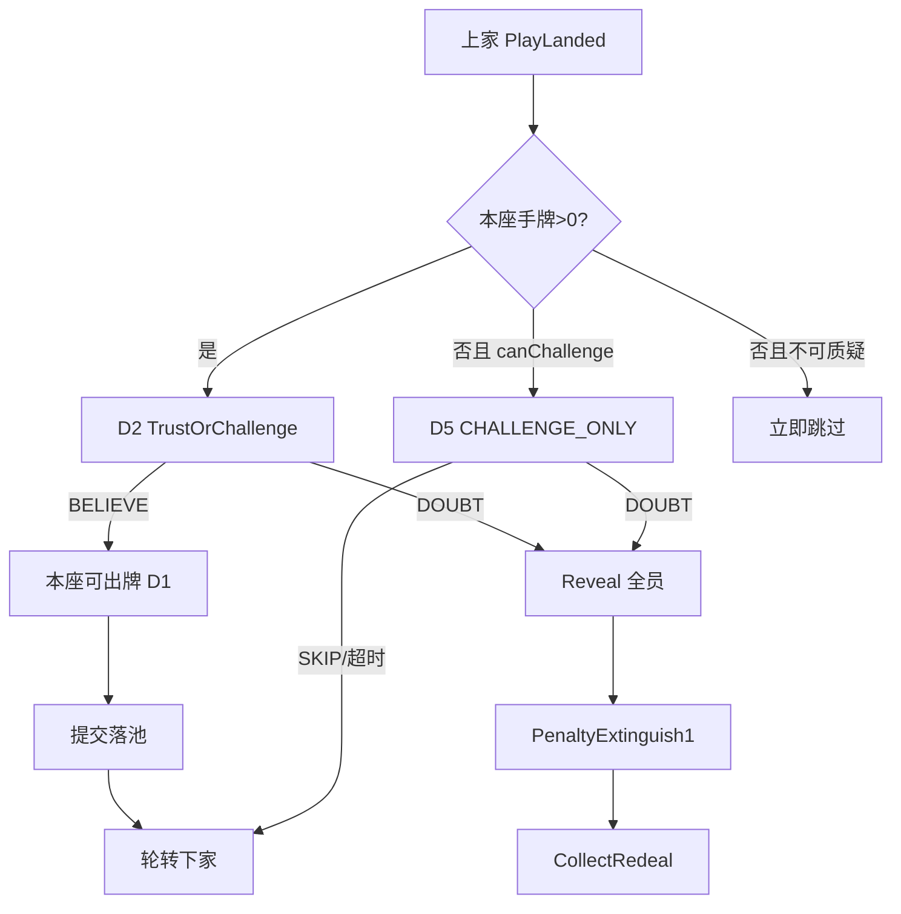

# 人机对局 AI（牌友决策）规格

| 项 | 内容 |
|----|------|
| 文档版本 | **v0.1.0**（会签稿） |
| 状态 | **制作人锁范围 · 待会签** · **合入 ≠ 终验** · 会签前零 ets（可改 `string.json` 失败短句键） |
| 主笔 | 策划（`feat/design`） |
| 路径 | `docs/02-游戏设计/人机对局AI.md` |
| 读者 | @LiarBar负责人 · @LiarBar鸿蒙开发 · @LiarBar测试 · @LiarBar UI |
| 对齐 | [对局-状态机](./对局-状态机.md) **v2.0.x（规则真源）** · [GDD §8](./GDD.md) · [数值与牌堆配置 §5](./数值与牌堆配置.md) · [质疑入口-状态机](./质疑入口-状态机.md)（入口 id） · [AI荷官与牌友规格](../03-鸿蒙与AI/AI荷官与牌友规格.md)（话术/表演层；**决策主读本文**） |
| 本 PR | **docs + 可选 `string.json` 失败短句**。零 ets / rawfile / media。 |
| 替换目标 | **废**假 AI：左座永远质疑、另两座永远相信。改为 **按座可调参 · 基于信息集的可解释决策**；**禁止偷看**隐藏牌。 |

> **制作人一句话**：AI 只能看见真人能看见的公开信息 + 自己的手牌；出牌 / 质疑|相信走 **输入→中间分→阈值**；随机只作打破平局与人类噪声；**不改** v0.2 胜负与质疑规则语义。

---

## 0. 边界与硬锁

### 0.1 写 / 不写

| 写 | 不写 |
|----|------|
| 信息集（允许 / 禁止） | 改揭牌真假公式、改熄烛数、改 `lives_default` |
| 决策点：出牌宣称、质疑\|相信、打光门、超时代出、表演偏置 | 发明新胜负条件（手牌多者胜等） |
| 每座可调参 + 三默认人格 JSON | 偷看他座扣牌真面 / 未揭本手内容 |
| 可解释决策流（分值→阈值） | 「主逻辑 = 50% 质疑」或纯掷骰定生死 |
| HarmonyOS `MatchEngine` / `AiSeatController` 接口草稿 | 联网对战、服务器权威洞牌发给客户端 AI |
| 失败短句 / debug 验收键 | 左轮 / 开枪 / RoundWin |

### 0.2 规则真源指针（本文不得重开）

| 锁 | 口径 |
|----|------|
| 入口 | 前台二键 = **质疑 \| 相信**（`doubt` \| `believe`）；真/假 **仅**揭牌裁定 |
| 命 | `lives_default=3` 烛；揭牌输家 **PenaltyExtinguish1**；熄尽出局；末存活胜 |
| 池 | 出牌落 `lb_cmp_pool`；`MAX_PLAY=3`（`max_play_cards=3`） |
| 左轮 | **无**；HUD/SFX 冻结，不得绑结算 |
| 可见性 F2 | 质疑进窗 / 揭牌舞台 / 真假·谁熄烛 → **全员广播** |
| 分支 | 只推 `feat/design` → PR → `develop` |
| R2 | 本轮第一手 PlayLanded 后下家 **仍须**过质疑\|相信（废「第一手不可质疑」） |
| 裁定 | ≥1 张非宣称且非 Joker ⇒ 假 ⇒ 上家熄1；否则真 ⇒ 质疑者熄1 |

### 0.3 与旧假 AI / 旧概率表关系

| 旧物 | 本文处置 |
|------|----------|
| 左座永远质疑、另两座永远相信 | **废**；验收见 §8 失败短句「AI假决策」 |
| 数值表 §5 `base_p_challenge` 作主掷骰 | **降级**为人格默认阈值偏置的参考；**主决策**改 §5 分值流 |
| [AI荷官与牌友规格](../03-鸿蒙与AI/AI荷官与牌友规格.md) §2 人格表演 | **仍有效**（emote / SLAM / 话术）；决策数字以本文 §4～§5 为准 |
| GDD §8.2 三人格名 | **保留** ID：`AI_KAREN` / `AI_TIMID` / `AI_SHARK` |

---

## 1. 目标与非目标

### 1.1 目标

1. **人机可玩**：1 真人 + 最多 3 AI，AI 行为像人（有时稳、有时诈、有时多疑），非脚本木偶。  
2. **公平**：AI **不得**读取他座扣牌真 rank、未揭本手内容、服务端权威洞牌。  
3. **可调**：每座独立 `AiPersonaParams`；试玩只改 JSON/表，不改引擎规则。  
4. **可测**：决策路径可 log（中间分、阈值、噪声）；失败短句可抄。  
5. **可解释**：任意一拍「为何质疑 / 为何出 2 张假」能用分值表复盘。

### 1.2 非目标

- 完美最优解 / 纳什均衡求解  
- LLM 判真假或改裁定句  
- 改变 TrustOrChallenge / Reveal / PenaltyExtinguish1 语义  
- 联网防作弊协议（MVP 本地）

---

## 2. 信息集（Info Set）

AI 决策函数 **只允许**吃下表「允许」列。实现时用类型/`readonly` 视图强约束；单测注入禁止字段必须编译失败或运行 assert。

### 2.1 允许（Allowed）

| 类别 | 字段（建议名） | 说明 |
|------|----------------|------|
| 己方私有 | `self.handRanks[]` | 本座手牌真实点数；**仅本座 AI** |
| 己方公开 | `self.seatId` · `self.lives` · `self.handCount` | 烛命、剩余张数（张数公开） |
| 宣称 | `claim.rank` ∈ {A,K,Q} | 本轮须跟的宣称 |
| 出牌公开 | `lastPlay.seatId` · `lastPlay.count` · `lastPlay.style` · `lastPlay.namedSeatId?` | 上家本手张数/方式/点名；**无**真面 |
| 池公开 | `pool.publicBackCount` · `pool.lastHandBackCount` | `lb_cmp_pool` 牌背张数；本手背数=`lastPlay.count` |
| 各座公开 | `seats[i].handCount` · `seats[i].lives` · `seats[i].alive` · `seats[i].order` | 剩余手牌数、烛、存活、座序 |
| 历史公开 | `history.reveals[]` · `history.challengeOutcomes[]` | 已揭牌本手真面序列、质疑成败与谁熄烛 |
| 计数记忆 | `memory.playedCountByRank`（仅**已揭**） · `memory.claimedPlayCounts` | 从揭牌与公开宣称手数重建的牌计数启发式 |
| 回合态 | `phase` · `canChallenge` · `isForceChallenge2` · `aliveCount` · `turnSecondsLeft` | 与状态机一致 |
| 人格 | `params: AiPersonaParams` | 本座可调参 |

### 2.2 禁止（Forbidden）— 偷看即失败

| 禁止读取 | 失败短句 | key |
|----------|----------|-----|
| 他座 `handRanks` / face-down 真面 | **AI偷看** | `lb_str_ai_peek` |
| 未揭 `lastPlay.trueRanks` / `lastPicked`（Reveal 前） | **AI偷看** | `lb_str_ai_peek` |
| 服务器权威洞牌、洗牌未发区、弃牌堆未公开面 | **AI偷看** | `lb_str_ai_peek` |
| 用调试 GodView / 旁观透视喂决策 | **AI偷看** | `lb_str_ai_peek` |
| 决策主路径写死「座0永远质疑 / 座1|2永远相信」或「50% challenge」当主逻辑 | **AI假决策** | `lb_str_ai_fake_decision` |

> **写死**：Reveal **之后**进入 `history.reveals` 的已翻本手，全员（含 AI）可读——这是规则公开信息，**不是**偷看。

### 2.3 信息集视图伪类型

```ts
/** AI 可见快照：禁止字段不得出现在类型上 */
interface AiInfoSet {
  self: { seatId: number; handRanks: Rank[]; handCount: number; lives: number };
  claim: { rank: 'A' | 'K' | 'Q' };
  lastPlay?: {
    seatId: number;
    count: 1 | 2 | 3;
    style: 'SOFT' | 'SLAM' | 'HESITATE';
    namedSeatId?: number;
    // 禁止: trueRanks
  };
  seats: Array<{ seatId: number; handCount: number; lives: number; alive: boolean }>;
  history: {
    reveals: Array<{ playSeatId: number; ranks: Rank[]; verdict: 'true' | 'false'; loserSeatId: number }>;
    challengeOutcomes: Array<{ challenger: number; target: number; success: boolean }>;
  };
  memory: {
    revealedRankCounts: Record<Rank, number>;
    publicPlayTotal: number;
  };
  phase: string;
  aliveCount: number;
  forceChallenge2: boolean; // 存活=2 且打光强制质疑
  params: AiPersonaParams;
}
```

---

## 3. 决策点（挂状态机，不改语义）

AI 只在下列闸门被 `MatchEngine` 询问；答案必须是合法动作枚举。

### 3.1 主决策点

| # | 闸门（状态机） | AI 输出 | 规则对齐 |
|---|----------------|---------|----------|
| D1 | `Play` / `PLAY_REVEAL_SELF`（本座有手牌且已过质疑门或本轮先手） | `PlayDecision`：选哪些手牌 + 张数(1..MAX_PLAY) + 隐含宣称跟随 + 可选 style/点名 | 不改出牌合法集；宣称不可改；Joker 不可作宣称 |
| D2 | `TrustOrChallenge` / AwaitChallenge（上家 PlayLanded，本座行动） | `ChallengeDecision`：`DOUBT` \| `BELIEVE` | 入口语义不变；真/假不在此输出 |
| D3 | `HandEmptyGate` · 存活≥3 · 下家对打光者 | `DOUBT` \| `BELIEVE`（BELIEVE=跳过续对上家） | §2.6 ≥3 口径 |
| D4 | `ForceChallenge2` · 存活=2 | **必须** `DOUBT`（强制质疑最后一手） | 人格不可覆盖；无 BELIEVE |
| D5 | `CHALLENGE_ONLY`（手牌0且可质疑） | `DOUBT` \| `SKIP`（超时=SKIP，不扣命） | `challenge_only_seconds=8` |
| D6 | 超时 `AUTO_PLAY` | 引擎代出：有真优先 1 张真，否则随机 1 张 | 数值表 §6；AI 思考超时落入此路径 |

### 3.2 次决策 / 表演（不改胜负）

| # | 时机 | 输出 | 约束 |
|---|------|------|------|
| P1 | 出牌确认前 | `style`: SOFT / SLAM / HESITATE | 受局内次数上限；由人格偏置抽样 |
| P2 | 出牌确认时 | `namedSeatId?` | 低概率；禁点幽灵座 |
| P3 | 旁观 / 非行动 | KNOCK / SIGN_NO / HECKLE 等 | 互动方案上限；**不**替代 D2 |
| P4 | 被质疑 / 熄烛 | hold / break emote | 纯表现 |

### 3.3 决策点时序（mermaid）



---

## 4. 每座可调参（AiPersonaParams）

### 4.1 参数表（至少覆盖制作人锁）

| 参数键 | 类型 | 默认域 | 含义 |
|--------|------|--------|------|
| `aggression` | 0..1 | 0.2～0.8 | 进攻性：抬高出牌张数与 SLAM、压低 BELIEVE 耐心 |
| `caution` | 0..1 | 0.2～0.8 | 谨慎：抬高保留真牌/Joker、压低无依据质疑 |
| `bluffTendency` | 0..1 | 0.1～0.7 | 虚张倾向：无足够真牌时仍出假的意愿 |
| `challengeSensitivity` | 0..1 | 0.1～0.7 | 质疑敏感：对可疑信号的放大系数 |
| `handPressureWeight` | 0..1 | 0.2～0.6 | 手牌压力权重：己方手牌少 / 烛少时更敢搏或更保守（与 caution 合成） |
| `memoryWeight` | 0..1 | 0.2～0.7 | 记牌权重：已揭计数与公开手数对「场上剩余真牌密度」估计的信任度 |
| `errorRate` | 0..1 | 0.02～0.12 | 人类噪声：以该概率在阈值邻域做错一侧（见 §5.5） |
| `thinkMsMin` / `thinkMsMax` | ms | 400～1200 | 思考表现延迟；上限 ≤ `turn_seconds - 2` |
| `preferPlayCount` | 1\|2\|3 或加权 | — | 出牌张数偏好 |
| `pSlam` / `pHesitateOnBluff` / `pNameCall` | 0..1 | — | 表演偏置（对齐旧数值表量级） |

> `aggression` 与 `caution` 允许同时偏高（老千：敢诈也惜命）；冲突时用 §5 分项加权，不取简单平均抹平。

### 4.2 三默认人格（表）

| 人格 | ID | 座建议（MVP 演示） | aggression | caution | bluffTendency | challengeSensitivity | handPressureWeight | memoryWeight | errorRate | 一句话 |
|------|-----|-------------------|------------|---------|---------------|----------------------|--------------------|--------------|-----------|--------|
| **杠精多疑** | `AI_KAREN` | 右/对家偏行动座 | 0.65 | 0.35 | 0.40 | **0.72** | 0.45 | 0.40 | 0.06 | 爱开、爱画✗、敏感拉满 |
| **怂货少疑** | `AI_TIMID` | 上家偏软 | 0.25 | **0.75** | 0.15 | **0.18** | 0.55 | 0.35 | 0.08 | 能真则真、轻易不质疑 |
| **老千均衡** | `AI_SHARK` | 对家/点名位 | 0.55 | 0.50 | **0.62** | 0.42 | 0.40 | **0.65** | 0.05 | 会掺假、记牌、中等质疑 |

### 4.3 三默认人格（JSON · 可直接喂引擎）

```json
{
  "personas": {
    "AI_KAREN": {
      "displayName": "杠精",
      "aggression": 0.65,
      "caution": 0.35,
      "bluffTendency": 0.40,
      "challengeSensitivity": 0.72,
      "handPressureWeight": 0.45,
      "memoryWeight": 0.40,
      "errorRate": 0.06,
      "preferPlayCountWeights": { "1": 0.35, "2": 0.45, "3": 0.20 },
      "pSlam": 0.25,
      "pHesitateOnBluff": 0.20,
      "pNameCall": 0.20,
      "thinkMsMin": 400,
      "thinkMsMax": 900
    },
    "AI_TIMID": {
      "displayName": "怂货",
      "aggression": 0.25,
      "caution": 0.75,
      "bluffTendency": 0.15,
      "challengeSensitivity": 0.18,
      "handPressureWeight": 0.55,
      "memoryWeight": 0.35,
      "errorRate": 0.08,
      "preferPlayCountWeights": { "1": 0.70, "2": 0.25, "3": 0.05 },
      "pSlam": 0.10,
      "pHesitateOnBluff": 0.15,
      "pNameCall": 0.05,
      "thinkMsMin": 700,
      "thinkMsMax": 1200
    },
    "AI_SHARK": {
      "displayName": "老千",
      "aggression": 0.55,
      "caution": 0.50,
      "bluffTendency": 0.62,
      "challengeSensitivity": 0.42,
      "handPressureWeight": 0.40,
      "memoryWeight": 0.65,
      "errorRate": 0.05,
      "preferPlayCountWeights": { "1": 0.20, "2": 0.55, "3": 0.25 },
      "pSlam": 0.35,
      "pHesitateOnBluff": 0.25,
      "pNameCall": 0.25,
      "thinkMsMin": 500,
      "thinkMsMax": 1000
    }
  },
  "mvpSeatBind": {
    "seat1": "AI_TIMID",
    "seat2": "AI_SHARK",
    "seat3": "AI_KAREN"
  }
}
```

> `seat0` = 真人（SELF）。绑座可配置；**禁止**用座号写死决策分支代替人格参数。

---

## 5. 决策流（输入 → 中间分 → 阈值）

**禁止**把「掷 0.5」当主逻辑。随机仅用于：① 阈值两侧的 `errorRate` 噪声；② 同分候选打破平局；③ 表演 style 抽样。

### 5.1 公共：估计「上家本手为假」的可疑分 `S_fake`

仅用允许信息。

| 符号 | 公式 / 规则 | 说明 |
|------|-------------|------|
| `legalSelf` | `count(self.handRanks where rank==claim \|\| JOKER)` | 己方合法张 |
| `estRemainLegal` | `max(0, deckLegalEstimate - revealedLegal - selfLegal)` | 记牌启发；`memoryWeight` 缩放信任 |
| `density` | `estRemainLegal / max(1, unseenCards)` | 场上未见牌中合法密度估计 |
| `sig_style` | SLAM→+0.18；HESITATE→+0.10；SOFT→0 | 公开方式信号 |
| `sig_count` | `lastPlay.count==3`→+0.12；`==2`→+0.05；`==1`→0 | 大摊更可疑 |
| `sig_pressure` | 上家 `handCount` 小且刚出多张→+0.08 | 手牌压力 |
| `sig_history` | 上家近 N 次被揭为假的比率 × 0.20 | 揭牌史 |
| `sig_named` | 被点名且点名对象是本座→+0.05 | 可选 |
| `S_raw` | `sig_style + sig_count + sig_pressure + sig_history + sig_named + (0.35 * (1 - density))` | |
| `S_fake` | `clamp(S_raw * (0.5 + challengeSensitivity), 0, 1)` | 敏感度放大 |

`deckLegalEstimate`：按当前宣称与牌堆构成（真源 20 张表：6+6+6+2）减已揭该宣称与 Joker；**不得**读取未发区真实内容，只读公开配置常量。

### 5.2 D2 / D3 / D5：质疑 \| 相信（或 SKIP）

#### 中间分

| 分 | 定义 |
|----|------|
| `S_challenge` | `S_fake` |
| `S_risk` | 错质疑成本：`caution * 0.4 + (self.lives==1 ? 0.25 : 0) + (aliveCount==2 ? 0.15 : 0)` |
| `S_need` | 进攻需求：`aggression * 0.3 + handPressureWeight * pressure(self)`；`pressure` = 手牌少/烛少归一 |
| `Score` | `S_challenge + S_need - S_risk` |

#### 阈值（人格相关，非 0.5 硬编码）

```
T_base = lerp(0.62, 0.28, challengeSensitivity)
         // 怂货敏感低 → 阈值高（更难质疑）
         // 杠精敏感高 → 阈值低（更容易质疑）
T = clamp(T_base + 0.10 * caution - 0.08 * aggression, 0.22, 0.75)
```

#### 判定

```
if forceChallenge2: return DOUBT          // D4 硬规则
if not canChallenge: return BELIEVE/SKIP  // 规则门
if Score >= T: intent = DOUBT
else:          intent = BELIEVE   // D5 则 SKIP 代替 BELIEVE

intent = applyHumanNoise(intent, errorRate)  // §5.5
return intent
```

#### U 风格决策表（质疑门）

| U | 条件 | 期望输出 | 失败看点 |
|---|------|----------|----------|
| U-AI-01 | `forceChallenge2==true` | 必 `DOUBT` | 人格改成相信 |
| U-AI-02 | `Score >= T` 且无噪声翻转 | `DOUBT` | 仍永远相信 |
| U-AI-03 | `Score < T` 且无噪声翻转 | `BELIEVE`/`SKIP` | 仍永远质疑 |
| U-AI-04 | 同输入换 `AI_KAREN` vs `AI_TIMID` | 杠精更常达阈值 | 两人格输出分布不可区分 |
| U-AI-05 | 决策日志无 `trueRanks` 字段 | 通过 | 出现未揭真面 = **AI偷看** |
| U-AI-06 | 主路径无 `Math.random()<0.5` 定质疑 | 通过 | **AI假决策** |

### 5.3 D1：出牌（选牌 + 张数）

#### 步骤

1. **枚举合法子集**：张数 `n ∈ [1, min(MAX_PLAY, handCount)]`；牌组合。  
2. **真手候选**：子集全为 claim 或 Joker。  
3. **假手候选**：子集含 ≥1 非合法。  
4. 打分每个候选 `c`：

| 项 | 真手 | 假手 |
|----|------|------|
| `base` | `+0.40 + 0.25*caution` | `+0.15 + 0.50*bluffTendency` |
| `countFit` | 与 `preferPlayCountWeights[n]` | 同左 |
| `keepJoker` | 保留 Joker 未出 → +0.08·caution | 假手甩非Joker垃圾 → +0.10 |
| `aggressionN` | `n` 大 → +0.05·aggression | 同左 |
| `threat` | — | 若 `S_fake_self_project` 高（估下家多疑）→ −0.12·caution |
| `Score_play(c)` | 求和后 clamp | |

5. 取 `Score_play` 最高；若并列，按权重随机打破平局。  
6. `errorRate`：小概率改选次优候选（人类误操作感）。  
7. style / 点名：在已定牌后按 `pSlam` 等抽样（假手才抬 `pHesitateOnBluff`）。

#### 出牌 U 表

| U | 条件 | 期望 |
|---|------|------|
| U-AI-10 | `legalSelf >= n` 且 `bluffTendency` 低（怂货） | 高概率真手 |
| U-AI-11 | `legalSelf == 0` | 必须假手（合法集只有假） |
| U-AI-12 | 老千 `bluffTendency` 高且有真 | 允许掺假；非「永远真」 |
| U-AI-13 | `n > MAX_PLAY` | 不可生成 |

### 5.4 其它闸门摘要

| 闸门 | 流 |
|------|----|
| D4 ForceChallenge2 | 直接 DOUBT；跳过阈值 |
| D5 CHALLENGE_ONLY | 同 §5.2，BELIEVE 映射为 SKIP；超时 SKIP |
| D6 AUTO_PLAY | 引擎规则：有合法出 1 合法；否则随机 1；**不**走虚张策略 |

### 5.5 人类噪声 `applyHumanNoise`

```
with probability errorRate:
  flip DOUBT ↔ BELIEVE   // 或出牌改次优
else:
  keep intent
```

约束：`forceChallenge2`、无 `canChallenge`、手牌耗尽强制路径 **禁止**噪声翻转。噪声 **不是**主概率源。

### 5.6 决策日志（debug · 建议）

每拍写一条（可关）：

```json
{
  "seatId": 3,
  "persona": "AI_KAREN",
  "gate": "TrustOrChallenge",
  "S_fake": 0.61,
  "S_need": 0.22,
  "S_risk": 0.18,
  "Score": 0.65,
  "T": 0.34,
  "intent": "DOUBT",
  "noiseFlipped": false
}
```

禁止日志含他座未揭 `handRanks`。

---

## 6. MatchEngine 接口草稿（HarmonyOS / ArkTS 友好）

> 草稿级：字段名可在会签后微调；**语义锁**为：引擎持有权威状态；AI 只收 `AiInfoSet`；AI 不得直接改烛命/牌堆。

### 6.1 职责切分

| 模块 | 职责 |
|------|------|
| `MatchEngine` | 状态机推进、合法性校验、Reveal 裁定、PenaltyExtinguish1、CollectRedeal |
| `AiSeatController` | 每座一人格；`decide*(info)->Action` |
| `AiInfoSetBuilder` | 从引擎权威态 **投影** 允许字段；剥除禁止字段 |
| `DealerAnnouncer` | 模板播报（既有）；不碰裁定 |

### 6.2 接口草稿

```ts
// 动作
type ChallengeAction = { type: 'DOUBT' } | { type: 'BELIEVE' } | { type: 'SKIP' };
type PlayAction = {
  type: 'PLAY';
  cardIds: string[];          // 必须属于 self.hand
  style?: 'SOFT' | 'SLAM' | 'HESITATE';
  namedSeatId?: number;
};

interface AiSeatController {
  readonly seatId: number;
  readonly personaId: string;
  updateParams(p: Partial<AiPersonaParams>): void;

  /** D2/D3/D5/D4 */
  decideChallenge(info: AiInfoSet): ChallengeAction;

  /** D1 */
  decidePlay(info: AiInfoSet): PlayAction;

  /** 表演可选 */
  decideEmote?(info: AiInfoSet, event: string): string | null;
}

interface MatchEngine {
  /** 权威推进；AI 经此提交，禁止私改状态 */
  submitAction(seatId: number, action: ChallengeAction | PlayAction): Result;

  /** 轮到 AI 座时调用 */
  requestAiAction(seatId: number): void;

  /** 投影：测试可 assert 无 forbidden keys */
  buildAiInfoSet(seatId: number): AiInfoSet;

  /** 可选：验收钩子 */
  setAiDebugHooks?(h: { onPeekAttempt?: () => void; onDecide?: (log: object) => void }): void;
}
```

### 6.3 调用时序

1. 引擎进入 `TrustOrChallenge` 且 `currentSeat` 为 AI。  
2. `info = buildAiInfoSet(seat)`（无洞牌）。  
3. 等待 `thinkMs ∈ [min,max]`（UI 思考气泡）。  
4. `action = controller.decideChallenge(info)`。  
5. `submitAction` → 合法性校验 → 广播（F2）。  
6. 出牌闸同理。

### 6.4 替换假 AI 的工程验收钩

| 旧行为 | 新要求 |
|--------|--------|
| `if (seat==left) always DOUBT` | 删除；改 `AiSeatController` |
| `else always BELIEVE` | 删除 |
| 单测 | 固定 `AiInfoSet` 夹具 → 断言 Score/T 路径；再测三人格分布差异 |

---

## 7. 与表现层 / 荷官话术边界

| 层 | 主读 | 本文件 |
|----|------|--------|
| 裁定真假 / 熄烛 | 对局-状态机 | **禁止改** |
| 质疑\|相信入口文案 | 质疑入口 / 对局 §1.1 | 复用 |
| 荷官播报模板 | AI荷官与牌友规格 §1 | 复用；AI 决策不改句子 |
| 人格 emote / SLAM 概率 | 旧数值表 §5.3 + 本文 §4 JSON | 表演抽样 |
| **出牌/质疑策略** | **本文 §5** | 主真源 |

LLM：**禁止**参与 D1/D2 决策与裁定。

---

## 8. 失败短句与 debug 验收键

### 8.1 新增（可合入 `string.json`）

| key | 中文（死句） | 触发 |
|-----|--------------|------|
| `lb_str_ai_peek` | **AI偷看** | AI 决策路径读到禁止信息；或 GodView 喂入 `decide*` |
| `lb_str_ai_fake_decision` | **AI假决策** | 仍用「左永远质疑/他永远相信」或主逻辑「50%质疑」；或无分值阈值的纯随机主路径 |

### 8.2 联测抄表（建议 S-AI）

| ID | 场景 | 期望 | 失败短句 |
|----|------|------|----------|
| S-AI-01 | 注入他座 handRanks 到 InfoSet | Builder 剥除或 assert | AI偷看 |
| S-AI-02 | Reveal 前 decideChallenge 读 lastPlay.trueRanks | 不可编译/运行失败 | AI偷看 |
| S-AI-03 | 三座均为假分支（永远疑/永远信） | 禁止合入 | AI假决策 |
| S-AI-04 | 同 InfoSet，杠精 vs 怂货 100 次 | 质疑率杠精显著高于怂货 | AI假决策 |
| S-AI-05 | forceChallenge2 | 100% DOUBT | （规则破坏另计） |
| S-AI-06 | F2：AI 点质疑 | 全员见进窗/气泡 | 质疑无表现（既有键） |
| S-AI-07 | 决策主代码含 `random()<0.5` 定 DOUBT | 静态检查失败 | AI假决策 |

---

## 9. 配置落点（实现建议）

| 资源 | 说明 |
|------|------|
| `rawfile/ai_personas.json`（会签后） | §4.3 JSON；本 PR **可不交 ets** |
| 每座覆写 | 调试面板改单座参数，不改规则 |
| seed | 与 `demo_seed_value` 共用 RNG 流时，噪声可复现；仍不得偷看 |

---

## 10. 版本记录

| 版本 | 日期 | 说明 |
|------|------|------|
| **v0.1.0** | 2026-09-21 | 会签稿：信息集、决策点、每座可调参、三人格、分值阈值流、MatchEngine 草稿、失败短句；废假 AI |

---

## 11. 会签清单（负责人可勾）

- [ ] 信息集允许/禁止与「AI偷看」一致  
- [ ] D1/D2 等闸门对齐对局-状态机，未改 doubt\|believe 与熄烛语义  
- [ ] 三人格 JSON 可落地；座绑可配  
- [ ] 决策流为输入→分→阈值；无「50%质疑」主逻辑  
- [ ] MatchEngine / AiSeatController 边界清楚  
- [ ] 失败短句键已挂或登记  

**合入 ≠ 终验。**