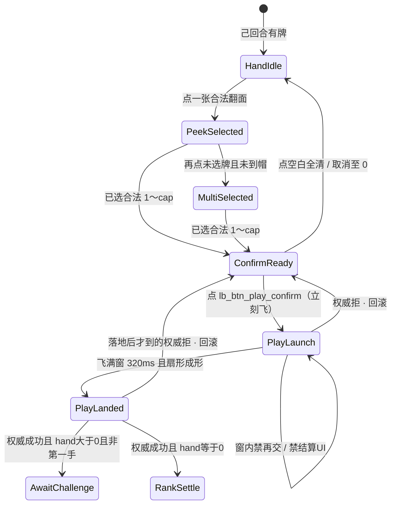

# 出牌扣牌 · 状态机（第1节锁 + AwaitChallenge 入口 + 打光名次）

| 项 | 内容 |
|----|------|
| 文档版本 | **v0.2.1** |
| 状态 | **制作人第1节已锁** · **Aron 打光名次已锁** · 第2节入口见 [质疑入口-状态机](./质疑入口-状态机.md) · 会签草案 · **合入 ≠ 终验** · 会签前零 ets |
| 主笔 | 策划（`feat/design-*`） |
| 范围 | 选牌确认之后：乐观飞出 → 身前扣牌成形 → **hand>0 且非第一手则 AwaitChallenge 入口**；**hand==0 则名次结算、禁进 AwaitChallenge**。第2节入口深潜（真·假同层二键 / ack 再翻 / 10s）认 [质疑入口-状态机](./质疑入口-状态机.md) |
| 读者 | @LiarBar负责人 · @LiarBar UI · @LiarBar测试 · @LiarBar鸿蒙开发 · @LiarBar美术 |
| 对照 | [质疑入口-状态机](./质疑入口-状态机.md)（第2节入口锁）· [16 飞出与身前扣牌](../04-设计/16-局内出牌飞出与身前扣牌规格.md)（**#134** 数字；跟票 **#137** 维护 16 正文）· [15 触摸出牌](../04-设计/15-局内手牌触摸出牌规格.md) · [手牌触摸出牌-交互方案](./手牌触摸出牌-交互方案.md) · [GDD §2.2 / §6.1 / §10.1](./GDD.md) · [05 T20](../05-技术/02-回合状态机草图.md) · [13 声场](../04-设计/13-局内声场与伴奏规格.md) · [02 命名](../04-设计/02-组件与资源命名约定.md) · [测试 C1](../06-质量/开桌加载-牌面-发牌验收勾选清单.md) |
| 本 PR | **只交 docs**。零 `ets` / `rawfile` / `media`。16 正文由 #137 维护，本文只 **参见 16** |

> **线框数字认 16 / #134，不另起一套。** 飞 **320ms**（窗 **280～400**）；2 张 **±8°**；3 张 **−12° / 0° / +12°**；露边 **≥10vp**；id **`lb_cmp_play_fly` / `lb_cmp_play_front_pile`**；**禁抬 `padB`**；**禁压手牌/烛**。16 跟票见 #137。  
> **质疑已解冻**；旧质疑双轨 **禁并存**。第2节入口（真·假同层二键 / ack 再翻 / 10s → 过）= [质疑入口-状态机](./质疑入口-状态机.md)。四拍深潜 / 坟场层仍后置。细分配分表 = **第4节详**。  
> **打光 = 入名次。** 先打光更好（第一个打光 = 第1）。命归零 = 垫底。PlayLanded 后 hand==0 **禁止**进 AwaitChallenge。  
> **合入 ≠ 终验。**

---

## 0. 边界

| 写 | 不写 |
|----|------|
| 桌上 UI 拍：HandIdle → Peek / MultiSelected → ConfirmReady → **PlayLaunch** → **PlayLanded** →（hand>0 且非第一手）**AwaitChallenge 入口** /（hand==0）**RankSettle** | 第2节入口深潜（认 [质疑入口-状态机](./质疑入口-状态机.md)）；四拍 / 押注窗 / 裁定演出后置 |
| 乐观飞 + 权威拒回滚；不可跳过飞窗 | 飞中抢结算 / 扇未成形就名次遮罩 |
| Aron 打光名次锁（§1 L7 / §6） | 细分配分数字表（**第4节详**） |
| 身前扣牌：牌背扇读张数；宣称条分立 | 身前挂数字、揭面、把宣称写进扣区 |
| 本轮身前一手；坟场层标明后置 | 跨轮无限叠扇；坟场几何 / 弃牌层 |
| SFX 双槽名；flip 禁冒充出牌 | 本票交 wav / 改 13 已冻八槽文件；改 16 线框正文 |
| 鸿蒙旧路径 **文档级**删除清单 | 本票改 `entry/**/*.ets` |

**仍锁（本线不得重开）：**

1. **3 命**（`lives_default=3`）。命归零 = 垫底淘汰，**不**改命数。  
2. **`MAX_PLAY=3`**（`max_play_cards=3`，`min_play_cards=1`）。  
3. **贴底硬修本轮搁置** — 不改 `padB` / `HAND_RING_GAP=24%` / flush / tip。  
4. **合入 ≠ 终验。** 会签前零 ets。合入本 PR ≠ 出牌飞出终验 ≠ 质疑终验 ≠ 名次终验。

---

## 1. 制作人锁（逐条写死）

### 1.1 第1节飞出锁（六条仍在）

与 16 线框冲突时：° / ms / vp / id **仍认 16**（#134；正文跟票 #137）。语义以本表为准。

| # | 锁 | 可执行含义 |
|---|----|------------|
| L1 | **Optimistic fly + rollback**：confirm → instant PlayLaunch；on authority reject → rollback pile+hand + phrase「出牌未生效 / 张数已纠正」 | 点 `lb_btn_play_confirm`（或 AUTO_PLAY 等同提交）**立刻**进 `PlayLaunch`，不等 T20 ack。引擎 / 权威拒：卸 pile 与在途飞层，手牌恢复提交前，**只准**「出牌未生效 / 张数已纠正」（`lb_str_play_rollback`） |
| L2 | **Non-skippable fly**：320ms window（align UI #134） | 飞窗推荐 **320ms**，容差 **280～400ms**。窗内 **不可跳过、不可再交、不可改选、不可出结算/名次 UI**。窗满且扇形成形 = `PlayLanded`。其后按 L7 分流 |
| L3 | **本轮身前一手** only：no infinite cross-round fan stack；graveyard layer deferred to §2/3 | 每个座位的 `lb_cmp_play_front_pile` **只展示该座本轮当前这一手**。跨轮叠扇、坟场层 = **§2/3** |
| L4 | SFX dual slots：`lb_sfx_play_launch` + `lb_sfx_play_land`；ban `lb_sfx_card_flip` impersonating play | 飞出只认 launch；成形 / 落桌只认 land。**禁止** flip 冒充出牌。13 方式材质 **不得顶替**双槽 |
| L5 | Challenge freeze **lifted**；ban old+new dual track | **质疑已解冻。** 仅当 PlayLanded **且 hand>0** 才进 AwaitChallenge 入口。旧冻轨与新轨 **禁并存** |
| L6 | Still locked：3 lives, MAX_PLAY=3, 贴底 hard-fix parked, 合入≠终验 | 见 §0。不改命数、不改单次张数帽、不抬 `padB` |

### 1.2 Aron 打光名次锁（写死 · 覆盖旧 GDD 胜负句）

**废止**下列旧句（GDD v0.2 曾写；本锁覆盖）：

- 「打光不判胜」  
- 「只剩 1 人有命才胜」  
- 「PlayLanded 不判胜」  
- 「禁止以手牌多寡直接判胜 / 禁止手牌多者胜」作为终局公式  

**现锁（五条）：**

| # | 锁 | 可执行含义 |
|---|----|------------|
| L7-1 | **先打光名次更好**；第一个打光 = **第1** | 权威接受且 PlayLanded 后 `hand.count==0` → 该座写入 `emptyOrder`（第 1 个空 = 1st，第 2 个空 = 2nd，……）并进 **RankSettle** |
| L7-2 | **命归零 = 垫底（淘汰）** | `lives==0` → 出局 / 幽灵；名次落在打光者之后（垫底）。3 命数字不改 |
| L7-3 | 打光后：**不再出牌**；**不再因「下一手」被质疑**（没有下一手）；下游玩家 **下一轮不对他们质疑** | 该座退出出牌循环。`lastPlay` 不得再作为「下一家要质疑的上一手」。下游 `canChallenge` 不得指向已打光座的已入名次那手 |
| L7-4 | 名次主序 = **打光先后**；若多人因质疑失败死掉，次序 = **成功质疑次数（多更好）**；并列可同名次、不强行拆名次 | 细分配分 / 面子分加减表 = **第4节详**。本线只锁主序 / 次序 / 可并列 |
| L7-5 | 仍：**3 命**、**MAX_PLAY=3** | 与 L6 同一条，不重开 |

**表现时序（写死，盖判定）：**

```
权威成功 → PlayLanded 扇形成形（飞窗必须播完）→ 然后才 RankSettle / 宣称名次
```

**禁止**在 PlayLaunch / 飞窗未满时出胜利遮罩、名次条、战报、`lb_sfx_result_win`。  
**禁止** PlayLanded 后 hand==0 仍进 AwaitChallenge。

---

## 2. 状态机

逻辑阶段仍报 GDD 十态名。下表是 **桌上 UI 拍**，不另造引擎 `phase`。

### 2.1 主链（写死）

```
HandIdle → PeekSelected / MultiSelected → ConfirmReady
        → PlayLaunch → PlayLanded
              ├─ hand > 0 ∧ 非第一手 → AwaitChallenge   ← 入口详 [质疑入口-状态机](./质疑入口-状态机.md)
              ├─ hand > 0 ∧ 第一手   → 下家 TURN（不进窗）
              └─ hand == 0           → RankSettle     ← 禁 AwaitChallenge
```



选牌三拍 **仍认 15**。本文件从 ConfirmReady 的提交瞬间写起。

| UI 拍 | GDD 阶段 | 画面 | 玩家能做什么 | 禁止 |
|-------|----------|------|--------------|------|
| **HandIdle** | `TURN` | 手牌默认牌背；确认条不在 | 己回合点一张进 PeekSelected | 非己回合选并能交 |
| **PeekSelected / MultiSelected** | `TURN` | 已选 1～`cap` 正面；`cap = min(MAX_PLAY, 手牌数)` | 再选 / 再点同牌取消 / 点空白全清 | 第 `cap+1` 张进组 |
| **ConfirmReady** | `TURN` | 条在，`lb_btn_play_confirm` `_enabled` | 点确认。取消仍认 15 | 0 张或超帽仍 `_enabled` |
| **PlayLaunch** | `PLAY_REVEAL_SELF` | 已选牌经 `lb_cmp_play_fly` 飞向该座身前；**飞出与 `lb_sfx_play_launch` 同一 onset** | **不可改选、不可再交、不可跳过飞窗、不可出结算 UI** | 瞬切；窗内再飞；飞中名次/战报 |
| **PlayLanded** | 本手展示刚成形 | `lb_cmp_play_front_pile` 牌背扇 **已成形**；HitTest None | 扇成形后立刻按 hand 分流 | 扇未成形就进 AwaitChallenge 或 RankSettle |
| **AwaitChallenge** | `TURN`（下家） | 身前扇保持；质疑入口按 `canChallenge` | **只验能否进窗。** 真·假同层二键 / ack 再翻 / 10s = [质疑入口-状态机](./质疑入口-状态机.md) | hand==0 还进来；第一手放开质疑；旧冻轨并存；飞中出钮 |
| **RankSettle** | 入名次 / 战报前展示 | 扇已成形后的名次 / 宣称名次 UI | 打光者入席次。细分配分 **第4节详** | 飞中抢切；进 AwaitChallenge；对打光者再开质疑 |

**写死：** `PlayLaunch` / `PlayLanded` / `AwaitChallenge` / `RankSettle` 是 UI 拍名。05 T20 仍是权威 `SUBMIT_PLAY`，**不**加成 `phase` 枚举。

### 2.2 转移表（可执行）

| # | 从 | 事件 | 条件 | 到 | 副作用 |
|---|----|------|------|----|--------|
| U01 | ConfirmReady | `TAP_CONFIRM` 或 AUTO_PLAY | 己回合、未出局、`min_play_cards ≤ n ≤ min(MAX_PLAY, hand)` | **PlayLaunch** | **立刻**起飞，不等 ack。手牌位抽走（不 flush）。播 `lb_sfx_play_launch`（非静默）。发 `SUBMIT_PLAY`。**不出**名次 UI |
| U02 | PlayLaunch | `FLY_WINDOW_DONE` | 位移满 **280～400ms**（推荐 320）且未拒 | **PlayLanded** | 扇成形；播 `lb_sfx_play_land`（非静默）；pile `HitTest None` |
| U03a | PlayLanded | `PILE_FORMED` | 权威已接受 **且** 提交后 `hand.count > 0` **且** 非本轮第一手 | **AwaitChallenge** | 质疑入口。真·假同层二键 / 10s / ack 再翻认 [质疑入口-状态机](./质疑入口-状态机.md) |
| U03c | PlayLanded | `PILE_FORMED` | 权威已接受 **且** 提交后 `hand.count > 0` **且** 本轮第一手 | 下家 `TURN` | **不进** AwaitChallenge（G-Q6）。解冻 ≠ 第一手能质疑 |
| U03b | PlayLanded | `PILE_FORMED` | 权威已接受 **且** 提交后 `hand.count == 0` | **RankSettle** | 写入 `emptyOrder`（先空更好）。该座 **不再出牌**。`lastPlay` **不得**再给下游当质疑靶。**禁止**进 AwaitChallenge |
| U04 | PlayLaunch 或 PlayLanded | `AUTHORITY_REJECT` | T20 不满足 / 竞态 / 张数非法 | ConfirmReady 或 HandIdle | 回滚 pile+hand。只出「出牌未生效 / 张数已纠正」。不进 AwaitChallenge、不进 RankSettle |
| U05 | PlayLaunch | 再交 / 再飞 / 结算 UI | 飞窗未满 | **PlayLaunch**（忽略） | 叠飞 = **动画未完又出一手**；飞中名次 = **飞中抢结算** |
| U06 | 任一拍 | 点空白 / 再点同牌 | **仅** HandIdle～ConfirmReady | 15 取消 | PlayLaunch 起取消无效 |

AUTO_PLAY 也走 U01→U02→U03a/b/c，不另开无飞出支路。打光的 AUTO_PLAY 同样必须扇成形后才 RankSettle。

### 2.3 与 05 T20 / 权威的关系

| 层 | 口径 |
|----|------|
| UI | 点确认 = U01，**立刻飞** |
| T20 | 权威 `SUBMIT_PLAY`。接受才写 `Play`。hand==0 时 **不**把该手留给下游质疑 |
| 拒 | U04 回滚 + `lb_str_play_rollback` |
| 等 ack 才飞 | **禁** |
| 分流 | 接受且 PlayLanded 后：hand>0 且非第一手 → AwaitChallenge；hand>0 且第一手 → 下家出牌（不进窗）；hand==0 → RankSettle（禁 AwaitChallenge）。入口深潜认 [质疑入口-状态机](./质疑入口-状态机.md) |

弱网：ack 晚于起飞则飞继续。ack 接受后再按落地时的 hand 分流。ack 拒绝则回滚，已出的名次 UI 必须撤。

---

## 3. 身前扣牌语义

数字 **参见 16**（#134 / #137），本文不重开 ° / vp / 落点。

### 3.1 张数只靠扇，不靠数字

个人身前扣牌区 = 该座 **本手牌背扇**。永远牌背。

| 张数 | 转角（认 16） | 露边 | 锚 |
|------|----------------|------|----|
| **1** | **不扇（0°）** | — | 该座身前正中 |
| **2** | **±8°** | 邻牌露边 **≥10vp** | 身前正中为轴 |
| **3** | **−12° / 0° / +12°** | 邻牌露边 **≥10vp** | 中张 0° 压轴 |

**禁止** pile 上挂 `Text` / Badge / 「1」「2」「3」。`lb_txt_play_count` 不迁到扣区。叠死 = **扣牌张数不可读**。

### 3.2 永远牌背；宣称条分立

| 层 | 谁 | 写什么 | 不写什么 |
|----|----|--------|----------|
| 身前扣区 | `lb_cmp_play_front_pile` | 牌背扇 | 点数、宣称字母、揭面 |
| 宣称条 | `lb_cmp_dealer_banner` | 「本轮出 {rank}」 | 宣称印在扣区 |
| 手牌 | `lb_cmp_hand` | 默认背 | 用扣区交差 C1 |

扣区写点数 / 「A×2」= **声明与张数打架 / 扣区写了点数**。

**测试 C1：** 只验 peek / 出牌包揭开后角标。扣区 **不是** C1 勾选项。

### 3.3 本轮身前一手；坟场后置

新手替换旧手。新宣称卸扇。打光入 RankSettle 后，该座扇可留到名次展示结束；**不得**再当下游质疑靶。坟场几何 = **§2/3**。

### 3.4 己座 vs 边座

落点 / 镜像 / Z / 禁抬 `padB` / 禁压手或烛：**参见 16 §2.3**。四座同一套 ° / 320ms / 双槽。AI 同机，只换座锚。

---

## 4. 乐观飞与弱网回滚

### 4.1 时序

```
t0     点确认 → 立刻 PlayLaunch + SUBMIT_PLAY + lb_sfx_play_launch
       （此段禁 RankSettle / 名次 / 战报 / result_win）
t0+320ms（280～400）
       → PlayLanded（扇成形）+ lb_sfx_play_land
       → 权威已接受？
            否 → U04 回滚
            是且 hand > 0 且非第一手 → AwaitChallenge（入口详质疑入口-状态机）
            是且 hand > 0 且第一手   → 下家 TURN（不进窗）
            是且 hand == 0           → RankSettle（禁 AwaitChallenge）
```

| ack | 时刻 | 桌面 |
|-----|------|------|
| 接受 | 飞窗内 | 飞继续；落地后再分流 |
| 接受 | 已落地 | 按 hand 进 AwaitChallenge 或 RankSettle |
| 拒绝 | 飞窗内 / 已落地 | 回滚；撤飞层 / pile / 任何已露的名次片 |
| 一直不来 | 人机 MVP | 飞必须播完；最终拒仍回滚 |

### 4.2 回滚必须同时做到

1. 卸 `lb_cmp_play_fly` 与 `lb_cmp_play_front_pile`。  
2. 手牌恢复到 t0 之前。  
3. 只出「出牌未生效 / 张数已纠正」。  
4. 不写或撤销 PLAY 日志。  
5. 不进 AwaitChallenge、不进 RankSettle；已进则退出。

### 4.3 回滚短句（写死）

| key | 中文 | 何时 |
|-----|------|------|
| `lb_str_play_rollback` | **出牌未生效 / 张数已纠正** | 权威拒后必须出 |

禁止拆成两个 key、禁止平行句。静默局字幕仍出。

---

## 5. SFX 与美术槽

| 槽 | 何时 | onset | 本票交件 | 静默局 |
|----|------|-------|----------|--------|
| **`lb_sfx_play_launch`** | PlayLaunch 起 | 贴飞出起势 | 否 | **关** |
| **`lb_sfx_play_land`** | PlayLanded 成形 | 贴成形 / 落桌 | 否 | **关** |
| `art_card_back` | 飞出 + 身前扇 | — | 否 | 画面在 |

**禁止** `lb_sfx_card_flip` 走飞出/落地（= **flip 冒充出牌**）。  
**禁止** 用 confirm / soft / slam / hesitate **顶替**双槽。  
RankSettle 的胜负听感槽 **不得**在 PlayLaunch 响起。细分配分听感 = **第4节详**。

---

## 6. AwaitChallenge 入口 · 打光 RankSettle

**质疑已解冻**，但打光走另一支。

### 6.1 AwaitChallenge 入口（只验进窗 · 第2节入口另文）

**进窗之后**（真·假同层二键、ack 后再翻、超时 **10s**、「质疑未生效」、S17）全文认 [质疑入口-状态机](./质疑入口-状态机.md)。本文件只锁 **能不能进**。

同时满足才进（与质疑入口 Q03 同一条）：

1. 本手已 **PlayLanded**（扇成形）。  
2. 权威 **已接受**。  
3. 提交后 **`hand.count > 0`**。  
4. **非**本轮第一手。  
5. 桌上可见该座身前一手扇。  
6. `canChallenge` 仍按：

```
canChallenge = current.ALIVE
               AND lastPlay != null
               AND playIndexInRound >= 1
               AND lastPlay.actor 未因本手打光入 emptyOrder
```

hand==0 还出现可点质疑 = **打光进了质疑等待**（S16-9；第2节短句 **打光者仍被质疑 / 仍能点质疑**）。  
飞窗未满就出质疑钮 = **飞中出质疑钮**（第2节 S17-5）。Launch busy **无**质疑钮。

### 6.2 第一手（未打光）

本轮第一手且 hand>0：走 U03c，**不进** AwaitChallenge。下家只出牌。  
**解冻 ≠ 第一手能质疑。** 第一手真/假仍 `_enabled` = **第一手仍可质疑**。

第一手就打光（极端：开局 1～3 张手牌全打出）：走 U03b **RankSettle**，不进 AwaitChallenge，也不适用「第一手可质疑」。

### 6.3 打光（写死 · 覆盖旧「打光不判胜」）

权威成功且 PlayLanded 后 `hand.count==0`：

1. **必须**先完成扇形（表现等 PlayLanded）。  
2. **然后**进 RankSettle / 宣称名次。打光 **算名次、算赢位**（先空 = 更好，第一个空 = 第1）。  
3. **禁止**进 AwaitChallenge。  
4. 该座 **不再出牌**。  
5. **不再因「下一手」被质疑**——没有下一手；本手也不得留给下游当质疑靶。  
6. 下游玩家 **下一轮不对已打光者质疑**。  
7. 命仍是 3 条上限；命归零的人走 L7-2 垫底，不走打光主序。  

**废止**「PlayLanded 不判胜」「只剩 1 人有命才胜」「打光不判胜」。  
旧 GDD §10.1「无牌仅质疑窗 / 禁止手牌多寡判胜」对 **刚刚打光的这一座** 不再适用；索引见 GDD 补钉。

### 6.4 名次主序 / 次序（细分配分第4节详）

| 键 | 锁 | 本线写到哪 |
|----|----|------------|
| 主序 `emptyOrder` | 先打光更好；第 1 个 `hand==0`（权威+PlayLanded）= 第1 | 写死 |
| 垫底 | `lives==0` 淘汰，排在所有打光者之后 | 写死 |
| 次序 | 多人因 **质疑失败** 同批死掉时：成功质疑次数 **多更好** | 写死比较键；次数怎么加 = **第4节详** |
| 并列 | 次序仍平 → **可同名次**，不强行拆 | 写死 |
| 面子分 / 加减表 / 展示文案数字 | — | **第4节详** |

本线不发明第4节未锁的加减公式。

### 6.5 第2节 / 第4节不写清单

| 本线不写 | 去哪 |
|----------|------|
| 真·假同层二键、ack 再翻、10s 过、enter/commit 槽、「质疑未生效」 | [质疑入口-状态机](./质疑入口-状态机.md) |
| 四拍演出、押注窗、翻验轴深潜 | 第2节后置（入口锁已另文） |
| 坟场层 | §2/3 |
| 细分配分表、面子分数字 | 第4节 |
| 打光者入名次后的旁观表情密度 | 第4节或互动方案后补 |

---

## 7. 边角（写死）

### 7.1 1 / 2 / 3 张

数字参见 16。1/2/3 都走同一飞窗。打光可以是打出最后 1 / 2 / 3 张——只要落地后 hand==0，一律 U03b。

### 7.2 己座 vs 边座

参见 16。边座打光同样：扇成形 → RankSettle，禁飞中名次、禁 AwaitChallenge。

### 7.3 静默局

飞出 / 扇形 / 回滚字幕 / 名次字幕 **画面在**。双槽关 = 过。  
**落桌无声 / 像静默提交（非静默局）** 只打非静默局。

### 7.4 弱网回滚

U04 必须实现。权威拒而 pile 还在、或已进 RankSettle 不撤 = 打回 **出牌未生效 / 张数已纠正**。

### 7.5 PlayLanded 之后的最后一手

见 §6.3。补三句：

- 打光 **算名次**。表现等扇成形，不等「再被质疑一次」。  
- 下游 **不能**对这手开质疑。  
- 打光者 **不能**再选牌、再确认。

---

## 8. 失败短句（测试 / 鸿蒙可抄 · 写死）

合入 ≠ 终验。16 的 F16-1～4 **仍有效**（#134；#137 跟票可加号，本线不抢 16 编号）。

| ID | 短句（写死） | 不过 |
|----|----------------|------|
| **S16-1** | **出牌无飞出 / 像点按钮** | 无 280～400ms 位移；只 submit 不播 PlayLaunch；等 ack 才决定飞 |
| **S16-2** | **扣牌张数不可读** | 1/2/3 看不出；Text 写张数；露边不足 10vp |
| **S16-3** | **落桌无声 / 像静默提交（非静默局）** | 非静默未真播 launch/land；beep 冒充；落到才第一次出声 |
| **S16-4** | **动画未完又出一手** | 飞窗未满再交 / 再飞；飞窗可跳过 |
| **S16-5** | **扣区挡手牌/烛** | 扇盖手牌主行或 `lb_cmp_life_*`；或抬 `padB` |
| **S16-6** | **出牌未生效 / 张数已纠正** | 权威拒后 pile/飞层还在；手牌未回 t0；不出这句；已进 AwaitChallenge 或 RankSettle 却不撤 |
| **S16-7** | **声明与张数打架 / 扣区写了点数** | 扣区挂宣称 / 点数 |
| **S16-8** | **flip 冒充出牌** | 飞出/落地播了 `lb_sfx_card_flip` |
| **S16-9** | **打光进了质疑等待** | 权威成功且 hand==0 仍进 AwaitChallenge；或下游仍能质疑该打光手 |
| **S16-10** | **飞中抢结算** | PlayLaunch / 扇未成形就出胜利遮罩、名次、战报、`lb_sfx_result_win` |

回滚提示与 S16-6 **同一句**（`lb_str_play_rollback`）。

---

## 9. 鸿蒙旧路径删除清单（文档级）

本票 **不改 ets**。会签后 `feat/client-*` 必须删。旧+新禁并存。

| # | 旧路径 | 禁令 | 新路径 |
|---|--------|------|--------|
| D1 | 点确认即 `submitPlay` + `pull()`，无飞窗 | 无飞出瞬间提交 | U01 立刻 PlayLaunch |
| D2 | 只 `PLAY_CONFIRM` 或 flip 顶出牌 | flip 冒充出牌 | launch + land |
| D3 | 等 T20 ack 才飞 | 弱网无飞出 | 确认即飞；拒则 U04 |
| D4 | 出牌后质疑入口常冻 | 旧冻轨 | hand>0 且非第一手才进 AwaitChallenge；第一手不进窗 |
| D5 | 旧冻轨与新 AwaitChallenge 同时挂 | 旧质疑双轨禁并存 | 只留新轨 |
| D6 | 确认后直接进四拍，或打光仍进 AwaitChallenge | 入口未成形 / S16-9 | hand>0 且非第一手：PlayLanded→入口（认质疑入口-状态机）；hand==0：PlayLanded→RankSettle |
| D7 | 本手飞进 `lb_cmp_pool` | 16 已禁 | 只落 `lb_cmp_play_front_pile` |
| D8 | 身前 Text 或扣区揭面交差 C1 | C1 ≠ 扣区 | 牌背扇 |
| D9 | 跨轮叠扇 | 只本轮身前一手 | 新手替换；新宣称卸扇 |
| D10 | 飞窗内再交或抬 `padB` | S16-4 / S16-5 | 窗内禁交；落点参见 16 |
| D11 | 飞中出胜利/名次；或打光仍走 §10.1 仅质疑窗 | S16-10 / 旧胜负句 | 扇成形后 RankSettle；打光者不再出牌、不再被质疑 |

**质疑已解冻；旧质疑双轨禁并存。**  
**打光禁 AwaitChallenge。**

---

## 10. 交叉引用

| 岗 | 文件 | 本线怎么用 |
|----|------|------------|
| UI | [16](../04-设计/16-局内出牌飞出与身前扣牌规格.md) **#134** / 跟票 **#137** | **只认**数字。16 正文 **#137 维护**，本 PR 不改 16 |
| UI | [15](../04-设计/15-局内手牌触摸出牌规格.md) | 选牌段。F15 不重开 |
| 美术 | `art_card_back` · launch/land 双槽 | 本票不交文件 |
| 测试 | [C1](../06-质量/开桌加载-牌面-发牌验收勾选清单.md) | 扣区不勾 C1。短句抄 §8 |
| 鸿蒙 | [05 T20](../05-技术/02-回合状态机草图.md) | 权威提交；打光分流认本文 |
| 规则 | [GDD](./GDD.md) | 3 命 / MAX_PLAY=3 不改。胜负句以本文 L7 覆盖；GDD 只留索引钉 |
| 策划 · 第2节入口 | [质疑入口-状态机](./质疑入口-状态机.md) | AwaitChallenge → ChallengeCommit / Pass。本文件不重开 |

---

## 11. 不做

- 不改 3 命、`MAX_PLAY`、出牌权、贴底硬修。  
- 不写第2节四拍深潜（入口认质疑入口-状态机）；不写第4节细分配分表。  
- 不改 16 线框正文（#137）。  
- 不进 `ets` / `rawfile` / `media`。  
- 不把 UI 拍写成新引擎 `phase`。  
- 不保留无飞出瞬间提交、旧质疑冻轨、打光进 AwaitChallenge。

---

## 12. 会签

- [ ] @LiarBar负责人 第1节六条 + Aron L7 打光名次 + 打光禁 AwaitChallenge  
- [ ] @LiarBar UI 数字仍认 16 / #134；本 PR 不改 16 正文  
- [ ] @LiarBar测试 S16-1～10 可抄；C1 不因扣区重开  
- [ ] @LiarBar鸿蒙开发 §2 分流 + §9 D1–D11；会签前零 ets  
- [ ] @LiarBar美术 双槽名；flip 不进飞出；飞中禁胜听  

**未会签禁止落 ets。** 合入本 PR ≠ 出牌飞出终验 ≠ 质疑终验 ≠ 名次终验。

---

## 13. 版本记录

| 版本 | 日期 | 说明 |
|------|------|------|
| v0.1.0 | 2026-09-13 | 第1节锁 + AwaitChallenge 入口。当时误写「打光不判胜」 |
| v0.2.0 | 2026-09-13 | **Aron 打光名次锁**：先打光更好（首空=第1）；命归零垫底；打光后不再出牌、不再被质疑下一手；名次主序=打光先后，质疑失败同批死掉看成功质疑次数（多更好），可并列。PlayLanded 后 hand==0 → RankSettle，**禁** AwaitChallenge。表现等扇成形，禁飞中抢结算。细分配分第4节详。废止「打光不判胜 / 只剩1人有命才胜 / PlayLanded 不判胜」。16 正文交 #137，本文只参见 16。S16-9 / S16-10。仍锁 3 命 / MAX_PLAY=3 / 贴底搁置 / 合入≠终验 |
| v0.2.1 | 2026-09-13 | 第2节入口另文：[质疑入口-状态机](./质疑入口-状态机.md)。本文件补 U03c：第一手 hand>0 **不进** AwaitChallenge。L7 / RankSettle / 16 数字 **不重开** |

### 审核记录

| 日期 | 意见 | 提议修改 | 提出人 | 状态 |
|------|------|----------|--------|------|
| 2026-09-13 | 第1节制作人锁 + AwaitChallenge 入口 | 新建 v0.1.0 | 策划 | 已被 v0.2.0 覆盖打光句 |
| 2026-09-13 | Aron：打光即名次；PlayLanded 后 hand==0 禁进 AwaitChallenge | 升 v0.2.0 | 制作人 / Aron | **待会签** |
| 2026-09-13 | 第2节入口锁另文；第一手不进窗 | 升 v0.2.1；交叉质疑入口-状态机 | 策划 | **待会签** |

---

*维护人：策划文档岗 · 2026-09-13 · docs only · v0.2.1 交叉第2节入口 · 会签前零 ets · 合入 ≠ 终验*
