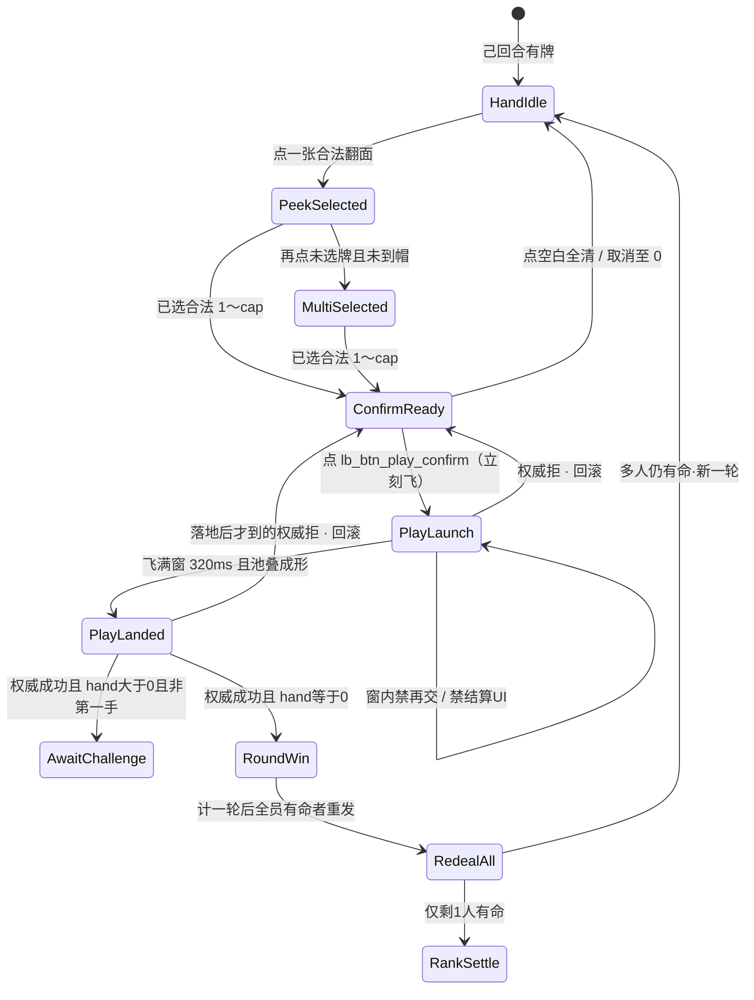

# 出牌扣牌 · 状态机（第1节锁 + AwaitChallenge 入口 + 轮胜重发）

| 项 | 内容 |
|----|------|
| 文档版本 | **v0.4.0** |
| 状态 | **制作人第1节已锁** · **2026-09-14 PM 轮胜重发重锁（覆盖旧 L7）** · **落池重锁（#148/#149）** · 第2节入口见 [质疑入口-状态机](./质疑入口-状态机.md) · 会签草案 · **合入 ≠ 终验** · 会签前零 ets |
| 主笔 | 策划（`feat/design-*`） |
| 范围 | 选牌确认之后：乐观飞出 → 池上扣牌成形 → **hand>0 且非第一手则 AwaitChallenge 入口**；**hand==0 则 RoundWin（计一轮）→ RedealAll（有命者含打光者再发）**，**禁进 AwaitChallenge**。整局名次只在「仅剩 1 人有命」时 RankSettle。第2节入口深潜认 [质疑入口-状态机](./质疑入口-状态机.md) |
| 读者 | @LiarBar负责人 · @LiarBar UI · @LiarBar测试 · @LiarBar鸿蒙开发 · @LiarBar美术 |
| 对照 | [质疑入口-状态机](./质疑入口-状态机.md)（第2节入口锁）· [16 出牌飞出与落池](../04-设计/16-局内出牌飞出与身前扣牌规格.md)（**#148 v0.2.0** 落池数字；废 front_pile 主读）· [18 开牌区](../04-设计/18-局内开牌区规格.md)（**#148 v0.1.0**）· [15 触摸出牌](../04-设计/15-局内手牌触摸出牌规格.md) · [手牌触摸出牌-交互方案](./手牌触摸出牌-交互方案.md) · [GDD §2.2 / §6.1 / §10.1](./GDD.md) · [05 T20](../05-技术/02-回合状态机草图.md) · [13 声场](../04-设计/13-局内声场与伴奏规格.md) · [02 命名](../04-设计/02-组件与资源命名约定.md) · [测试 C1](../06-质量/开桌加载-牌面-发牌验收勾选清单.md) |
| 本 PR | **只交 docs**。零 `ets` / `rawfile` / `media`。16/17/18 数字认 **#148**；本文只 **参见**，不另起 vp |

> **线框数字认 16 v0.2.0 / #148，不另起一套。** 飞 **320ms**（窗 **280～400**）；落点 **`lb_cmp_pool`**；池叠露边 **≥10vp**；id **`lb_cmp_play_fly` → `lb_cmp_pool`**；**废** `lb_cmp_play_front_pile` 主读；**禁抬 `padB`**；**禁压手牌/烛**；**禁发牌 flyOn/声**。  
> **质疑已解冻**；旧质疑双轨 **禁并存**。第2节入口（真·假同层二键 / ack 再翻 / 10s → 过）= [质疑入口-状态机](./质疑入口-状态机.md)。四拍深潜 / 坟场层仍后置。细分配分表 = **第4节详**。  
> **打光 = 本轮胜 → 全员重发。** PlayLanded ∧ hand==0 → **RoundWin**（计一轮）→ **RedealAll**（`lives>0` 者含打光者再发）。`lives==0` = 淘汰（不发/不质疑/不出牌）。仅剩 1 人有命 → 整局 **RankSettle**。PlayLanded 后 hand==0 **禁止**进 AwaitChallenge。  
> **废止旧 L7**：打光后坐穿整局不再出牌；打光直接进整局名次不重发。  
> **合入 ≠ 终验。**

---

## 0. 边界

| 写 | 不写 |
|----|------|
| 桌上 UI 拍：HandIdle → Peek / MultiSelected → ConfirmReady → **PlayLaunch** → **PlayLanded** →（hand>0 且非第一手）**AwaitChallenge 入口** /（hand==0）**RoundWin → RedealAll** | 第2节入口深潜（认 [质疑入口-状态机](./质疑入口-状态机.md)）；四拍 / 押注窗 / 裁定演出后置 |
| 乐观飞 + 权威拒回滚；不可跳过飞窗 | 飞中抢结算 / 扇未成形就轮胜遮罩 |
| 2026-09-14 PM 轮胜重发锁（§1 L7 / §6；覆盖旧打光名次） | 细分配分数字表（**第4节详**） |
| 池上该手：牌背堆露边读张数；宣称条分立 | 池上挂数字、揭面、把宣称写进池叠；front_pile 主读 |
| 本轮池上该手；坟场层标明后置 | 跨轮无限叠抢主读；坟场几何 / 弃牌层 |
| SFX 双槽名；flip 禁冒充出牌 | 本票交 wav / 改 13 已冻八槽文件；改 16 线框正文 |
| 鸿蒙旧路径 **文档级**删除清单 | 本票改 `entry/**/*.ets` |

**仍锁（本线不得重开）：**

1. **3 命**（`lives_default=3`）。命归零 = 垫底淘汰，**不**改命数。  
2. **`MAX_PLAY=3`**（`max_play_cards=3`，`min_play_cards=1`）。  
3. **贴底硬修本轮搁置** — 不改 `padB` / `HAND_RING_GAP=24%` / flush / tip。  
4. **合入 ≠ 终验。** 会签前零 ets。合入本 PR ≠ 出牌飞出终验 ≠ 质疑终验 ≠ 轮胜/重发终验 ≠ 整局名次终验。

---

## 1. 制作人锁（逐条写死）

### 1.1 第1节飞出锁（六条仍在）

与 16 线框冲突时：° / ms / vp / id **仍认 16**（#134；正文跟票 #137）。语义以本表为准。

| # | 锁 | 可执行含义 |
|---|----|------------|
| L1 | **Optimistic fly + rollback**：confirm → instant PlayLaunch；on authority reject → rollback pile+hand + phrase「出牌未生效 / 张数已纠正」 | 点 `lb_btn_play_confirm`（或 AUTO_PLAY 等同提交）**立刻**进 `PlayLaunch`，不等 T20 ack。引擎 / 权威拒：卸 pile 与在途飞层，手牌恢复提交前，**只准**「出牌未生效 / 张数已纠正」（`lb_str_play_rollback`） |
| L2 | **Non-skippable fly**：320ms window（align UI #134） | 飞窗推荐 **320ms**，容差 **280～400ms**。窗内 **不可跳过、不可再交、不可改选、不可出结算/轮胜/名次 UI**。窗满且扇形成形 = `PlayLanded`。其后按 L7 分流 |
| L3 | **本轮池上该手叠** only：no infinite cross-round stack；graveyard deferred to §2/3 | 中央 `lb_cmp_pool` **只主读本轮当前这一手**叠边。跨轮无限叠、坟场层 = **§2/3**。**废** front_pile 主呈现 |
| L4 | SFX dual slots：`lb_sfx_play_launch` + `lb_sfx_play_land`；ban `lb_sfx_card_flip` impersonating play | 飞出只认 launch；成形 / 落桌只认 land。**禁止** flip 冒充出牌。13 方式材质 **不得顶替**双槽 |
| L5 | Challenge freeze **lifted**；ban old+new dual track | **质疑已解冻。** 仅当 PlayLanded **且 hand>0** 才进 AwaitChallenge 入口。旧冻轨与新轨 **禁并存** |
| L6 | Still locked：3 lives, MAX_PLAY=3, 贴底 hard-fix parked, 合入≠终验 | 见 §0。不改命数、不改单次张数帽、不抬 `padB` |

### 1.2 轮胜重发锁（写死 · 2026-09-14 PM · **覆盖旧 L7 打光名次/坐穿**）

**废止**下列旧句（含 Aron 旧 L7 / GDD 旧胜负句；本锁覆盖）：

- 「打光 = 入整局名次」；「先打光更好 / 首空=第1」作为整局公式  
- 「打光后不再出牌 / 坐穿整局」  
- 「打光进了整局名次不重发」  
- 「PlayLanded ∧ hand==0 → RankSettle（整局）」  

**现锁（五条）：**

| # | 锁 | 可执行含义 |
|---|----|------------|
| L7-1 | **打光 = 本轮胜** → 计一轮 → **RedealAll** | 权威接受且 PlayLanded 后 `hand.count==0` → 进 **RoundWin**（桌上必须有轮胜提示）→ 立刻 **RedealAll**：对所有 `lives>0` 座位（**含刚打光者**）按 `hand_size_default` 从完整牌堆重建→洗牌→重发 → 新宣称 → 新一轮。**禁止**因打光直接进整局 RankSettle |
| L7-2 | **命归零 = 淘汰** | `lives==0` → 出局 / 幽灵：**不发牌、不质疑、不出牌**。3 命数字不改。淘汰只因扣命，**不**因打光 |
| L7-3 | **整局结束条件** | 场上 **仅剩 1 人** `lives>0` → 该人胜 → **RankSettle**（整局名次 / 战报）。打光本身 **不**结束整局 |
| L7-4 | **仍锁入口与帽** | **3 命**、**MAX_PLAY=3**；先验质疑（非第一手、PlayLanded 后）再出牌；本轮第一手 **不可质疑**。与 L5/L6 同一条，不重开 |
| L7-5 | **多人同时打光 / 质疑中途打光** | 同一落地瞬间多人 `hand==0`：都计本轮胜贡献，然后 **一次** RedealAll。质疑窗进行中出牌者因本手打光：本手 **禁** AwaitChallenge（仍 Q01/U03b）；被质疑方若因裁定 `lives==0` 则走 L7-2 淘汰，**不**走「打光→整局名次」。细分配分 / 轮胜面子 = **第4节详** |

**表现时序（写死，盖判定）：**

```
权威成功 → PlayLanded 池上该手堆成形（飞窗必须播完）
         → hand==0？ → RoundWin 提示（必须可见）→ RedealAll（有命者含打光者）
         → 仅剩 1 人有命？ → RankSettle（整局）
```

**禁止**在 PlayLaunch / 飞窗未满时出轮胜遮罩、整局名次条、战报、`lb_sfx_result_win`。  
**禁止** PlayLanded 后 hand==0 仍进 AwaitChallenge。  
**禁止**打光后坐穿（有命却不再发/不再出）。  
**禁止**打光直接进整局名次且不 RedealAll。

---

## 2. 状态机

逻辑阶段仍报 GDD 十态名。下表是 **桌上 UI 拍**，不另造引擎 `phase`。

### 2.1 主链（写死）

```
HandIdle → PeekSelected / MultiSelected → ConfirmReady
        → PlayLaunch → PlayLanded
              ├─ hand > 0 ∧ 非第一手 → AwaitChallenge   ← 入口详 [质疑入口-状态机](./质疑入口-状态机.md)
              ├─ hand > 0 ∧ 第一手   → 下家 TURN（不进窗）
              └─ hand == 0           → RoundWin → RedealAll  ← 禁 AwaitChallenge；有命者含打光者再发
                                         └─ 仅剩 1 人有命 → RankSettle（整局）
```



选牌三拍 **仍认 15**。本文件从 ConfirmReady 的提交瞬间写起。

| UI 拍 | GDD 阶段 | 画面 | 玩家能做什么 | 禁止 |
|-------|----------|------|--------------|------|
| **HandIdle** | `TURN` | 手牌默认牌背；确认条不在 | 己回合点一张进 PeekSelected | 非己回合选并能交 |
| **PeekSelected / MultiSelected** | `TURN` | 已选 1～`cap` 正面；`cap = min(MAX_PLAY, 手牌数)` | 再选 / 再点同牌取消 / 点空白全清 | 第 `cap+1` 张进组 |
| **ConfirmReady** | `TURN` | 条在，`lb_btn_play_confirm` `_enabled` | 点确认。取消仍认 15 | 0 张或超帽仍 `_enabled` |
| **PlayLaunch** | `PLAY_REVEAL_SELF` | 已选牌经 `lb_cmp_play_fly` **飞向中央 `lb_cmp_pool`**；**飞出与 `lb_sfx_play_launch` 同一 onset**；**禁**发牌 flyOn/声 | **不可改选、不可再交、不可跳过飞窗、不可出结算 UI** | 瞬切；窗内再飞；飞中名次/战报；**出牌像发牌** |
| **PlayLanded** | 本手展示刚成形 | 中央 `lb_cmp_pool` **本轮该手牌背堆已成形**（露边可读张）；HitTest None | 池叠成形后立刻按 hand 分流 | 堆未成形就进 AwaitChallenge 或 RoundWin；**落点不在牌堆**；**身前扣区仍主读** |
| **AwaitChallenge** | `TURN`（下家） | **池上该手堆保持**；质疑入口按 `canChallenge` | **只验能否进窗。** 真·假同层二键 / ack 再翻 / 10s = [质疑入口-状态机](./质疑入口-状态机.md) | hand==0 还进来；第一手放开质疑；旧冻轨并存；飞中出钮 |
| **RoundWin** | 本轮胜提示 | 池叠成形后的 **轮胜** UI（必须可见） | 计一轮；提示打光者本轮胜 | 飞中抢切；无提示直接重发；进 AwaitChallenge；直接整局名次 |
| **RedealAll** | `DEAL`/`CLAIM` | 有命者重发 + 新宣称 | 自动。`lives==0` **不发** | 命尽仍发牌；有命打光者漏发；打光后坐穿 |
| **RankSettle** | 整局名次 / 战报 | 仅当场上剩 1 人有命 | 整局胜负。细分配分 **第4节详** | 打光即进整局名次不重发；飞中抢切 |

**写死：** `PlayLaunch` / `PlayLanded` / `AwaitChallenge` / `RoundWin` / `RedealAll` / `RankSettle` 是 UI 拍名。05 T20 仍是权威 `SUBMIT_PLAY`，**不**加成 `phase` 枚举。

### 2.2 转移表（可执行）

| # | 从 | 事件 | 条件 | 到 | 副作用 |
|---|----|------|------|----|--------|
| U01 | ConfirmReady | `TAP_CONFIRM` 或 AUTO_PLAY | 己回合、未出局、`min_play_cards ≤ n ≤ min(MAX_PLAY, hand)` | **PlayLaunch** | **立刻**起飞，不等 ack。手牌位抽走（不 flush）。播 `lb_sfx_play_launch`（非静默）。发 `SUBMIT_PLAY`。**不出**轮胜/名次 UI |
| U02 | PlayLaunch | `FLY_WINDOW_DONE` | 位移满 **280～400ms**（推荐 320）且未拒 | **PlayLanded** | **池叠成形**；播 `lb_sfx_play_land`（非静默）；pile `HitTest None` |
| U03a | PlayLanded | `PILE_FORMED` | 权威已接受 **且** 提交后 `hand.count > 0` **且** 非本轮第一手 | **AwaitChallenge** | 质疑入口。真·假同层二键 / 10s / ack 再翻认 [质疑入口-状态机](./质疑入口-状态机.md) |
| U03c | PlayLanded | `PILE_FORMED` | 权威已接受 **且** 提交后 `hand.count > 0` **且** 本轮第一手 | 下家 `TURN` | **不进** AwaitChallenge（G-Q6）。解冻 ≠ 第一手能质疑 |
| U03b | PlayLanded | `PILE_FORMED` | 权威已接受 **且** 提交后 `hand.count == 0` | **RoundWin** → **RedealAll** | 计一轮；**必须**出轮胜提示。随后对所有 `lives>0`（**含打光者**）RedealAll + 新宣称。`lastPlay` 随本轮清空，**不得**再给下游当质疑靶。**禁止**进 AwaitChallenge。**禁止**直接整局 RankSettle（除非 RedealAll 后已仅剩 1 人有命） |
| U04 | PlayLaunch 或 PlayLanded | `AUTHORITY_REJECT` | T20 不满足 / 竞态 / 张数非法 | ConfirmReady 或 HandIdle | 回滚 pile+hand。只出「出牌未生效 / 张数已纠正」。不进 AwaitChallenge、不进 RoundWin/RedealAll/RankSettle |
| U05 | PlayLaunch | 再交 / 再飞 / 结算 UI | 飞窗未满 | **PlayLaunch**（忽略） | 叠飞 = **动画未完又出一手**；飞中名次 = **飞中抢结算** |
| U06 | 任一拍 | 点空白 / 再点同牌 | **仅** HandIdle～ConfirmReady | 15 取消 | PlayLaunch 起取消无效 |

AUTO_PLAY 也走 U01→U02→U03a/b/c，不另开无飞出支路。打光的 AUTO_PLAY 同样必须扇成形后才 RoundWin→RedealAll。

### 2.3 与 05 T20 / 权威的关系

| 层 | 口径 |
|----|------|
| UI | 点确认 = U01，**立刻飞** |
| T20 | 权威 `SUBMIT_PLAY`。接受才写 `Play`。hand==0 时 **不**把该手留给下游质疑；走 RoundWin→RedealAll |
| 拒 | U04 回滚 + `lb_str_play_rollback` |
| 等 ack 才飞 | **禁** |
| 分流 | 接受且 PlayLanded 后：hand>0 且非第一手 → AwaitChallenge；hand>0 且第一手 → 下家出牌（不进窗）；hand==0 → RoundWin→RedealAll（禁 AwaitChallenge）。仅剩 1 人有命 → RankSettle。入口深潜认 [质疑入口-状态机](./质疑入口-状态机.md) |

弱网：ack 晚于起飞则飞继续。ack 接受后再按落地时的 hand 分流。ack 拒绝则回滚，已出的名次 UI 必须撤。

---

## 3. 池上扣牌语义（落 `lb_cmp_pool`）

数字 **参见 16**（#134 / #137），本文不重开 ° / vp / 落点。

### 3.1 张数只靠扇，不靠数字

中央 `lb_cmp_pool` = **本轮该手牌背堆**（主读）。永远牌背。**废** `lb_cmp_play_front_pile` 作主呈现。

| 张数 | 转角（认 16） | 露边 | 锚 |
|------|----------------|------|----|
| **1** | **不扇（0°）** | — | 池心 |
| **2** | **±8°** | 邻牌露边 **≥10vp** | 池心为轴 |
| **3** | **−12° / 0° / +12°** | 邻牌露边 **≥10vp** | 中张 0° 压池心 |

**禁止** pile 上挂 `Text` / Badge / 「1」「2」「3」。`lb_txt_play_count` 不迁到扣区。叠死 = **池上张数不可读**。

### 3.2 永远牌背；宣称条分立

| 层 | 谁 | 写什么 | 不写什么 |
|----|----|--------|----------|
| 池上该手 | `lb_cmp_pool`（本轮该手叠） | 牌背堆 / 露边读张 | 点数、宣称字母、揭面；front_pile 主读 |
| 宣称条 | `lb_cmp_dealer_banner` | 「本轮出 {rank}」 | 宣称印在扣区 |
| 手牌 | `lb_cmp_hand` | 默认背 | 用扣区交差 C1 |

扣区写点数 / 「A×2」= **声明与张数打架 / 扣区写了点数**。

**测试 C1：** 只验 peek / 出牌包揭开后角标。扣区 **不是** C1 勾选项。

### 3.3 本轮池上该手；坟场后置

新手替换旧手叠。新宣称卸本轮堆主读。打光入 RoundWin 后，该手堆可留到轮胜提示结束即随 RedealAll 清空；**不得**再当下游质疑靶。坟场几何 = **§2/3**。

### 3.4 己座 vs 边座

落点 / 镜像 / Z / 禁抬 `padB` / 禁压手或烛：**参见 16 §2.3**。四座同一套 ° / 320ms / 双槽。AI 同机，只换座锚。

---

## 4. 乐观飞与弱网回滚

### 4.1 时序

```
t0     点确认 → 立刻 PlayLaunch + SUBMIT_PLAY + lb_sfx_play_launch
       （此段禁 RoundWin / RankSettle / 名次 / 战报 / result_win）
t0+320ms（280～400）
       → PlayLanded（池叠成形）+ lb_sfx_play_land
       → 权威已接受？
            否 → U04 回滚
            是且 hand > 0 且非第一手 → AwaitChallenge（入口详质疑入口-状态机）
            是且 hand > 0 且第一手   → 下家 TURN（不进窗）
            是且 hand == 0           → RoundWin → RedealAll（禁 AwaitChallenge）
                                         → 仅剩 1 人有命则 RankSettle
```

| ack | 时刻 | 桌面 |
|-----|------|------|
| 接受 | 飞窗内 | 飞继续；落地后再分流 |
| 接受 | 已落地 | 按 hand 进 AwaitChallenge 或 RoundWin→RedealAll |
| 拒绝 | 飞窗内 / 已落地 | 回滚；撤飞层 / pile / 任何已露的名次片 |
| 一直不来 | 人机 MVP | 飞必须播完；最终拒仍回滚 |

### 4.2 回滚必须同时做到

1. 卸 `lb_cmp_play_fly` 与池上本轮该手叠（回滚权威张数）。  
2. 手牌恢复到 t0 之前。  
3. 只出「出牌未生效 / 张数已纠正」。  
4. 不写或撤销 PLAY 日志。  
5. 不进 AwaitChallenge、不进 RoundWin/RedealAll/RankSettle；已进则退出。

### 4.3 回滚短句（写死）

| key | 中文 | 何时 |
|-----|------|------|
| `lb_str_play_rollback` | **出牌未生效 / 张数已纠正** | 权威拒后必须出 |

禁止拆成两个 key、禁止平行句。静默局字幕仍出。

---

## 5. SFX 与美术槽

| 槽 | 何时 | onset | 本票交件 | 静默局 |
|----|------|-------|----------|--------|
| **`lb_sfx_play_launch`** | PlayLaunch 起 | 贴飞出起势 | 否 | **关** |
| **`lb_sfx_play_land`** | PlayLanded 成形 | 贴成形 / 落桌 | 否 | **关** |
| `art_card_back` | 飞出 + 身前扇 | — | 否 | 画面在 |

**禁止** `lb_sfx_card_flip` 走飞出/落地（= **flip 冒充出牌**）。  
**禁止** 用 confirm / soft / slam / hesitate **顶替**双槽。  
RoundWin / RankSettle 的胜负听感槽 **不得**在 PlayLaunch 响起。细分配分听感 = **第4节详**。

---

## 6. AwaitChallenge 入口 · 打光 RoundWin→RedealAll

**质疑已解冻**，但打光走轮胜重发支，不进 AwaitChallenge。

### 6.1 AwaitChallenge 入口（只验进窗 · 第2节入口另文）

**进窗之后**（真·假同层二键、ack 后再翻、超时 **10s**、「质疑未生效」、S17）全文认 [质疑入口-状态机](./质疑入口-状态机.md)。本文件只锁 **能不能进**。

同时满足才进（与质疑入口 Q03 同一条）：

1. 本手已 **PlayLanded**（扇成形）。  
2. 权威 **已接受**。  
3. 提交后 **`hand.count > 0`**。  
4. **非**本轮第一手。  
5. 桌上可见池上该手牌背堆（质疑靶）。  
6. `canChallenge` 仍按：

```
canChallenge = current.ALIVE          // lives>0；命尽淘汰者不质疑
               AND lastPlay != null
               AND playIndexInRound >= 1
               AND lastPlay.actor 本手未打光（未进 RoundWin）
```

hand==0 还出现可点质疑 = **打光进了质疑等待**（S16-9；第2节短句 **打光者仍被质疑 / 仍能点质疑**）。  
飞窗未满就出质疑钮 = **飞中出质疑钮**（第2节 S17-5）。Launch busy **无**质疑钮。

### 6.2 第一手（未打光）

本轮第一手且 hand>0：走 U03c，**不进** AwaitChallenge。下家只出牌。  
**解冻 ≠ 第一手能质疑。** 第一手真/假仍 `_enabled` = **第一手仍可质疑**。

第一手就打光（极端：开局 1～3 张手牌全打出）：走 U03b **RoundWin→RedealAll**，不进 AwaitChallenge，也不适用「第一手可质疑」。

### 6.3 打光（写死 · 覆盖旧 L7「打光入整局名次 / 坐穿」）

权威成功且 PlayLanded 后 `hand.count==0`：

1. **必须**先完成扇形（表现等 PlayLanded）。  
2. **然后**进 **RoundWin**（计一轮；**必须**有轮胜提示）。  
3. **立刻 RedealAll**：所有 `lives>0` 座位（**含刚打光者**）重发 + 新宣称 + 新一轮。  
4. **禁止**进 AwaitChallenge。  
5. 本手 **不得**留给下游当质疑靶（随本轮清空）。  
6. 打光者若仍有命：**下一轮照常发牌、出牌、可质疑**（废「坐穿」）。  
7. 若 RedealAll 前/后场上仅剩 1 人 `lives>0` → **RankSettle**（整局）。  
8. `lives==0` 者走 L7-2 淘汰（不发/不质疑/不出牌），与打光无关。  

**废止**「打光后不再出牌」「打光进了整局名次不重发」「先打光=整局第1」。  
**恢复/写死**整局结束条件：**仅剩 1 人有命** 才整局胜。索引见 GDD 补钉。

### 6.4 整局名次 / 轮胜边界（细分配分第4节详）

| 键 | 锁 | 本线写到哪 |
|----|----|------------|
| 轮胜 | PlayLanded ∧ `hand==0` → RoundWin（计一轮）→ RedealAll | 写死 |
| 重发范围 | 所有 `lives>0`（含打光者）；`lives==0` 不发 | 写死 |
| 整局结束 | 仅剩 1 人 `lives>0` → RankSettle | 写死 |
| 淘汰 | 只认 `lives==0`（扣命），不认打光 | 写死 |
| 多人同瞬打光 | 都计轮胜贡献，**一次** RedealAll | 写死 |
| 质疑中途 | 打光禁 AwaitChallenge；命尽走淘汰，不走旧 emptyOrder 整局名次 | 写死 |
| 面子分 / 加减表 / 展示文案数字 | — | **第4节详** |

本线不发明第4节未锁的加减公式。

### 6.5 第2节 / 第4节不写清单

| 本线不写 | 去哪 |
|----------|------|
| 真·假同层二键、ack 再翻、10s 过、enter/commit 槽、「质疑未生效」 | [质疑入口-状态机](./质疑入口-状态机.md) |
| 四拍演出、押注窗、翻验轴深潜 | 第2节后置（入口锁已另文） |
| 坟场层 | §2/3 |
| 细分配分表、面子分数字 | 第4节 |
| 打光者轮胜后的旁观表情密度 | 第4节或互动方案后补 |

---

## 7. 边角（写死）

### 7.1 1 / 2 / 3 张

数字参见 16。1/2/3 都走同一飞窗。打光可以是打出最后 1 / 2 / 3 张——只要落地后 hand==0，一律 U03b（RoundWin→RedealAll）。

### 7.2 己座 vs 边座

参见 16。边座打光同样：扇成形 → RoundWin→RedealAll，禁飞中轮胜/名次、禁 AwaitChallenge。

### 7.3 静默局

飞出 / 扇形 / 回滚字幕 / 轮胜字幕 **画面在**。双槽关 = 过。  
**落桌无声 / 像静默提交（非静默局）** 只打非静默局。

### 7.4 弱网回滚

U04 必须实现。权威拒而 pile 还在、或已进 RoundWin/RedealAll/RankSettle 不撤 = 打回 **出牌未生效 / 张数已纠正**。

### 7.5 PlayLanded 之后的最后一手

见 §6.3。补四句：

- 打光 **算本轮胜**，不是整局名次。表现等扇成形，不等「再被质疑一次」。  
- 下游 **不能**对这手开质疑。  
- 打光者若仍有命：**RedealAll 后再出牌**（废坐穿）。  
- 无轮胜提示直接重发 = **轮胜无提示**。

---

## 8. 失败短句（测试 / 鸿蒙可抄 · 写死）

合入 ≠ 终验。16 的 F16-1～4 **仍有效**（#134；#137 跟票可加号，本线不抢 16 编号）。

| ID | 短句（写死） | 不过 |
|----|----------------|------|
| **S16-1** | **出牌无飞出 / 像点按钮** | 无 280～400ms 位移；只 submit 不播 PlayLaunch；等 ack 才决定飞 |
| **S16-2** | **池上张数不可读** | 1/2/3 看不出；Text 写张数；露边不足 10vp；叠死 |
| **S16-3** | **落桌无声 / 像静默提交（非静默局）** | 非静默未真播 launch/land；beep 冒充；落到才第一次出声 |
| **S16-4** | **动画未完又出一手** | 飞窗未满再交 / 再飞；飞窗可跳过 |
| **S16-5** | **扣区挡手牌/烛** | 扇盖手牌主行或 `lb_cmp_life_*`；或抬 `padB` |
| **S16-6** | **出牌未生效 / 张数已纠正** | 权威拒后 pile/飞层还在；手牌未回 t0；不出这句；已进 AwaitChallenge / RoundWin / RedealAll / RankSettle 却不撤 |
| **S16-7** | **声明与张数打架 / 扣区写了点数** | 扣区挂宣称 / 点数 |
| **S16-8** | **flip 冒充出牌** | 飞出/落地播了 `lb_sfx_card_flip` |
| **S16-8b** | **出牌像发牌** | 飞路径/声槽绑 deal flyOn 或发牌声 |
| **S16-8c** | **落点不在牌堆** | 仍落身前扇/桌空白，不进 `lb_cmp_pool` |
| **S16-8d** | **身前扣区仍主读** | front_pile 仍当主呈现或与池双轨 |
| **S16-9** | **打光进了质疑等待** | 权威成功且 hand==0 仍进 AwaitChallenge；或下游仍能质疑该打光手 |
| **S16-10** | **飞中抢结算** | PlayLaunch / 扇未成形就出轮胜遮罩、整局名次、战报、`lb_sfx_result_win` |
| **S16-11** | **打光后坐穿** | 打光者 `lives>0` 却本局不再发牌/不再出牌/不再质疑（旧 L7 坐穿） |
| **S16-12** | **命尽仍发牌** | `lives==0` 淘汰座仍进入 RedealAll 发牌，或仍能出牌/质疑 |
| **S16-13** | **打光进了整局名次不重发** | hand==0 直接整局 RankSettle，跳过 RoundWin→RedealAll（场上仍 ≥2 人有命） |
| **S16-14** | **轮胜无提示** | RoundWin 无可见提示/字幕，直接重发或静默切轮 |

回滚提示与 S16-6 **同一句**（`lb_str_play_rollback`）。

---

## 9. 鸿蒙旧路径删除清单（文档级）

本票 **不改 ets**。会签后 `feat/client-*` 必须删。旧+新禁并存。

| # | 旧路径 | 禁令 | 新路径 |
|---|--------|------|--------|
| D1 | 点确认即 `submitPlay` + `pull()`，无飞窗 | 无飞出瞬间提交 | U01 立刻 PlayLaunch |
| D2 | 只 `PLAY_CONFIRM` 或 flip 顶出牌 | flip 冒充出牌 | launch + land |
| D3 | 等 T20 ack 才飞 | 弱网无飞出 | 确认即飞；拒则 U04 |
| D4 | 出牌后质疑入口常冻 | 旧冻轨 | hand>0 且非第一手才进 AwaitChallenge；第一手不进窗 |
| D5 | 旧冻轨与新 AwaitChallenge 同时挂 | 旧质疑双轨禁并存 | 只留新轨 |
| D6 | 确认后直接进四拍，或打光仍进 AwaitChallenge | 入口未成形 / S16-9 | hand>0 且非第一手：PlayLanded→入口（认质疑入口-状态机）；hand==0：PlayLanded→RoundWin→RedealAll |
| D7 | 本手仍落 `lb_cmp_play_front_pile` 或双轨主读 | **落点不在牌堆** / **身前扣区仍主读** | **只落** `lb_cmp_pool`；废 front_pile 主读 |
| D8 | 池上 Text 或揭面交差 C1 | C1 ≠ 池叠张数 | 牌背堆露边 |
| D9 | 跨轮无限叠抢主读 | 只本轮池上该手 | 新手替换；新宣称卸本轮主读 |
| D10 | 飞窗内再交或抬 `padB` | S16-4 / S16-5 | 窗内禁交；落点参见 16 |
| D11 | 飞中出轮胜/整局名次；或打光坐穿/直接整局名次不重发 | S16-10 / S16-11 / S16-13 | 池叠成形后 RoundWin→RedealAll；有命者含打光者再发；仅剩 1 人有命才 RankSettle |

**质疑已解冻；旧质疑双轨禁并存。**  
**打光禁 AwaitChallenge；打光禁坐穿；打光禁直接整局名次不重发。**

---

## 10. 交叉引用

| 岗 | 文件 | 本线怎么用 |
|----|------|------------|
| UI | [16](../04-设计/16-局内出牌飞出与身前扣牌规格.md) **#134** / 跟票 **#137** | **只认**数字。16 正文 **#137 维护**，本 PR 不改 16 |
| UI | [15](../04-设计/15-局内手牌触摸出牌规格.md) | 选牌段。F15 不重开 |
| 美术 | `art_card_back` · launch/land 双槽 · reveal_draw/flip（#150） | 本票不交 wav；开牌槽见 18 |
| 测试 | [C1](../06-质量/开桌加载-牌面-发牌验收勾选清单.md) | 扣区不勾 C1。短句抄 §8 |
| 鸿蒙 | [05 T20](../05-技术/02-回合状态机草图.md) | 权威提交；打光分流认本文 |
| 规则 | [GDD](./GDD.md) | 3 命 / MAX_PLAY=3 不改。轮胜重发以本文 L7 覆盖旧打光名次；GDD 只留索引钉 |
| 策划 · 第2节入口 | [质疑入口-状态机](./质疑入口-状态机.md) | AwaitChallenge → ChallengeCommit / Pass。本文件不重开 |

---

## 11. 不做

- 不改 3 命、`MAX_PLAY`、出牌权、贴底硬修。  
- 不写第2节四拍深潜（入口认质疑入口-状态机）；不写第4节细分配分表。  
- 不改 16 线框正文（#137）。  
- 不进 `ets` / `rawfile` / `media`。  
- 不把 UI 拍写成新引擎 `phase`。  
- 不保留无飞出瞬间提交、旧质疑冻轨、打光进 AwaitChallenge、打光坐穿、打光直接整局名次不重发。

---

## 12. 会签

- [ ] @LiarBar负责人 第1节六条 + 2026-09-14 PM 轮胜重发（覆盖旧 L7）+ 打光禁 AwaitChallenge  
- [ ] @LiarBar UI 数字仍认 16 / #134；本 PR 不改 16 正文  
- [ ] @LiarBar测试 S16-1～14 可抄；C1 不因扣区重开  
- [ ] @LiarBar鸿蒙开发 §2 分流 + §9 D1–D11；**会签后再改引擎**；会签前零 ets  
- [ ] @LiarBar美术 双槽名；flip 不进飞出；飞中禁胜听  

**未会签禁止落 ets。** 合入本 PR ≠ 出牌飞出终验 ≠ 质疑终验 ≠ 轮胜/重发终验 ≠ 整局名次终验。

---

## 13. 版本记录

| 版本 | 日期 | 说明 |
|------|------|------|
| v0.1.0 | 2026-09-13 | 第1节锁 + AwaitChallenge 入口。当时误写「打光不判胜」 |
| v0.2.0 | 2026-09-13 | **Aron 打光名次锁**：先打光更好（首空=第1）；命归零垫底；打光后不再出牌、不再被质疑下一手；名次主序=打光先后，质疑失败同批死掉看成功质疑次数（多更好），可并列。PlayLanded 后 hand==0 → RankSettle，**禁** AwaitChallenge。表现等扇成形，禁飞中抢结算。细分配分第4节详。废止「打光不判胜 / 只剩1人有命才胜 / PlayLanded 不判胜」。16 正文交 #137，本文只参见 16。S16-9 / S16-10。仍锁 3 命 / MAX_PLAY=3 / 贴底搁置 / 合入≠终验 |
| v0.2.1 | 2026-09-13 | 第2节入口另文：[质疑入口-状态机](./质疑入口-状态机.md)。本文件补 U03c：第一手 hand>0 **不进** AwaitChallenge。L7 / RankSettle / 16 数字 **不重开** |
| v0.3.0 | 2026-09-14 | 落池重锁初稿（压缩过猛，打回） |
| v0.3.1 | 2026-09-14 | **补回** U01–U06 / mermaid / 弱网回滚时序 / L7-1～5；**落点改** `lb_cmp_pool`；废 front_pile 主读；禁发牌；短句加出牌像发牌/落点不在牌堆/池上张数不可读/身前扣区仍主读；数字认 #148 |
| **v0.4.0** | 2026-09-14 | **Win re-lock（覆盖旧 L7）**：PlayLanded∧hand==0 → **RoundWin→RedealAll**（有命者含打光者再发）；`lives==0` 淘汰不发/不质疑/不出牌；仅剩 1 人有命 → 整局 RankSettle。**废**打光坐穿 / 打光进整局名次不重发。保 U01–U06 / mermaid；短句加 **打光后坐穿** / **命尽仍发牌** / **打光进了整局名次不重发** / **轮胜无提示**。仍锁 3 命 / MAX_PLAY=3 / 第一手不可质疑 |

### 审核记录

| 日期 | 意见 | 提议修改 | 提出人 | 状态 |
|------|------|----------|--------|------|
| 2026-09-13 | 第1节制作人锁 + AwaitChallenge 入口 | 新建 v0.1.0 | 策划 | 已被 v0.2.0 覆盖打光句 |
| 2026-09-13 | Aron：打光即名次；PlayLanded 后 hand==0 禁进 AwaitChallenge | 升 v0.2.0 | 制作人 / Aron | 已被 v0.4.0 覆盖 |
| 2026-09-13 | 第2节入口锁另文；第一手不进窗 | 升 v0.2.1；交叉质疑入口-状态机 | 策划 | **待会签** |
| 2026-09-14 | PM：打光本轮胜→全员重发；废旧 L7 坐穿 | 升 v0.4.0 | 制作人 / Aron | **待会签** |

---

*维护人：策划文档岗 · 2026-09-14 · docs only · v0.4.0 轮胜重发 · 会签前零 ets · 合入 ≠ 终验*
