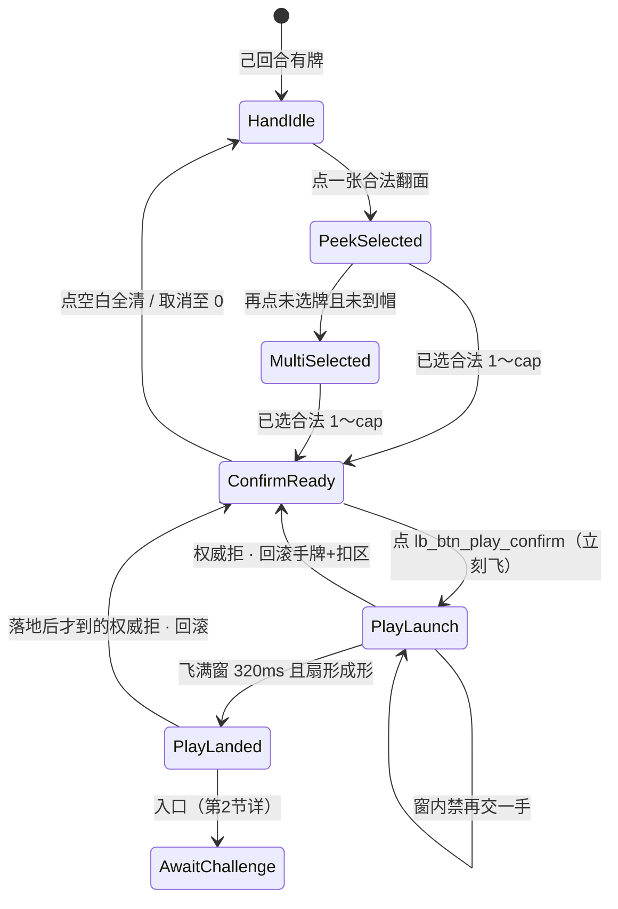

# 出牌扣牌 · 状态机（第1节锁 + AwaitChallenge 入口）

| 项 | 内容 |
|----|------|
| 文档版本 | **v0.1.0** |
| 状态 | **制作人第1节已锁** · 会签草案 · **合入 ≠ 终验** · 会签前零 ets |
| 主笔 | 策划（`feat/design-*`） |
| 范围 | 选牌确认之后：乐观飞出 → 身前扣牌成形 → **AwaitChallenge 入口**。不写第2节质疑深潜 |
| 读者 | @LiarBar负责人 · @LiarBar UI · @LiarBar测试 · @LiarBar鸿蒙开发 · @LiarBar美术 |
| 对照 | [16 飞出与身前扣牌](../04-设计/16-局内出牌飞出与身前扣牌规格.md)（**#134** · 线框数字只认 16）· [15 触摸出牌](../04-设计/15-局内手牌触摸出牌规格.md) · [手牌触摸出牌-交互方案](./手牌触摸出牌-交互方案.md) · [GDD §6.1 / §6.2 / §10.1](./GDD.md) · [05 T20](../05-技术/02-回合状态机草图.md) · [13 声场](../04-设计/13-局内声场与伴奏规格.md) · [02 命名](../04-设计/02-组件与资源命名约定.md) · [测试 C1](../06-质量/开桌加载-牌面-发牌验收勾选清单.md) |
| 本 PR | **只交 docs**。零 `ets` / `rawfile` / `media`。不发明胜负公式 |

> **线框数字认 16 / #134，不另起一套。** 飞 **320ms**（窗 **280～400**）；2 张 **±8°**；3 张 **−12° / 0° / +12°**；露边 **≥10vp**；id **`lb_cmp_play_fly` / `lb_cmp_play_front_pile`**；**禁抬 `padB`**；**禁压手牌/烛**。  
> **质疑已解冻**；旧质疑双轨 **禁并存**。四拍 / 裁定公式 / 坟场层 = **第2节详**。  
> **合入 ≠ 终验。**

---

## 0. 边界

| 写 | 不写 |
|----|------|
| 桌上 UI 拍：HandIdle → Peek / MultiSelected → ConfirmReady → **PlayLaunch** → **PlayLanded** → **AwaitChallenge（只入口）** | 第2节质疑四拍、押注窗、翻验动画、裁定演出 |
| 乐观飞 + 权威拒回滚；不可跳过飞窗 | 发明「打光即胜」「手牌多者胜」或任何未锁胜负式 |
| 身前扣牌：牌背扇读张数；宣称条分立 | 身前挂数字、揭面、把宣称写进扣区 |
| 本轮身前一手；坟场层标明后置 | 跨轮无限叠扇；坟场几何 / 弃牌层 |
| SFX 双槽名；flip 禁冒充出牌 | 本票交 wav / 改 13 已冻八槽文件 |
| 鸿蒙旧路径 **文档级**删除清单 | 本票改 `entry/**/*.ets` |

**仍锁（本线不得重开）：**

1. **3 命**（`lives_default=3`）。出局 / 胜负仍只认 GDD §2.2 / §10.1。  
2. **`MAX_PLAY=3`**（`max_play_cards=3`，`min_play_cards=1`）。  
3. **贴底硬修本轮搁置** — 不改 `padB` / `HAND_RING_GAP=24%` / flush / tip。  
4. **合入 ≠ 终验。** 会签前零 ets。合入本 PR ≠ 出牌飞出终验 ≠ 质疑终验。

---

## 1. 制作人第1节锁（逐条写死）

下列六条是本文件权威。与 16 v0.1.0「乐观未决 / 质疑仍冻」冲突时，**语义以本表为准**；° / ms / vp / id **仍认 16**。

| # | 锁 | 可执行含义 |
|---|----|------------|
| L1 | **Optimistic fly + rollback**：confirm → instant PlayLaunch；on authority reject → rollback pile+hand + phrase「出牌未生效 / 张数已纠正」 | 点 `lb_btn_play_confirm`（或 AUTO_PLAY 等同提交）**立刻**进 `PlayLaunch`，不等 T20 ack。引擎 / 权威拒：卸 `lb_cmp_play_front_pile`（及在途 `lb_cmp_play_fly`），手牌张数与座位恢复提交前，**只准**桌上短句「出牌未生效 / 张数已纠正」（`lb_str_play_rollback`） |
| L2 | **Non-skippable fly**：320ms window, then AwaitChallenge（align UI #134） | 飞窗推荐 **320ms**，实现容差 **280～400ms**（16 §2.1）。窗内 **不可跳过、不可再交、不可改选**。窗满且扇形成形 = `PlayLanded`，**然后**进 `AwaitChallenge` 入口 |
| L3 | **本轮身前一手** only：no infinite cross-round fan stack；graveyard layer deferred to §2/3 | 每个座位的 `lb_cmp_play_front_pile` **只展示该座本轮当前这一手**。新手替换旧手；新宣称 / 本轮池清空后卸扇。跨轮叠扇、坟场层 = **§2/3**，本线不画 |
| L4 | SFX dual slots：`lb_sfx_play_launch` + `lb_sfx_play_land`；ban `lb_sfx_card_flip` impersonating play | 飞出起势只认 `lb_sfx_play_launch`；扇形成形 / 落桌只认 `lb_sfx_play_land`。**禁止**用 `lb_sfx_card_flip` 冒充出牌飞出或落地。13 方式材质 `lb_sfx_play_soft` / `_slam` / `_hesitate` **不得顶替**双槽 |
| L5 | Challenge freeze **lifted**；ban old+new dual track | **质疑已解冻。** PlayLanded 之后必须进 AwaitChallenge 入口。禁止「桌上仍冻着质疑」与「新 AwaitChallenge 轨」同时挂。旧瞬间提交 / 旧冻质疑路径见 §9，必须删 |
| L6 | Still locked：3 lives, MAX_PLAY=3, 贴底 hard-fix parked, 合入≠终验 | 见 §0。不改命数、不改单次张数帽、不抬 `padB`、本 PR 不当终验 |

---

## 2. 状态机

逻辑阶段仍是 GDD：`TURN` → `PLAY_REVEAL_SELF` → `TURN`（下家）。  
下表是 **桌上 UI 拍**，不另造引擎 `phase`。日志 / 实况窗仍报 GDD 阶段名。

### 2.1 主链（写死）

```
HandIdle → PeekSelected / MultiSelected → ConfirmReady
        → PlayLaunch → PlayLanded → AwaitChallenge
```



选牌三拍（HandIdle / Peek / Multi / ConfirmReady）**仍认 15**。本文件从 ConfirmReady 的提交瞬间写起。

| UI 拍 | GDD 阶段 | 画面 | 玩家能做什么 | 禁止 |
|-------|----------|------|--------------|------|
| **HandIdle** | `TURN` | 手牌默认牌背；确认条不在 | 己回合点一张进 PeekSelected。长按 peek 仍认 GDD §3.4 | 非己回合选并能交（F15-5） |
| **PeekSelected / MultiSelected** | `TURN` | 已选 1～`cap` 正面；`cap = min(MAX_PLAY, 手牌数)` | 再选 / 再点同牌取消该张 / 点空白全清 | 第 `cap+1` 张进组 |
| **ConfirmReady** | `TURN` | 条在，`lb_btn_play_confirm` `_enabled` | 点确认。取消仍认 15 | 0 张或超帽仍 `_enabled` |
| **PlayLaunch** | `PLAY_REVEAL_SELF` | 已选牌从手牌位经 `lb_cmp_play_fly` 飞向该座身前锚；**飞出与 `lb_sfx_play_launch` 同一 onset** | **不可改选、不可再交、不可跳过飞窗**。条 `_disabled` 或收起 | 瞬切 / 无位移；窗内再飞一手 |
| **PlayLanded** | 回 `TURN`（下家）或本手展示刚成形 | `lb_cmp_play_front_pile` 牌背扇 **已成形**；HitTest None | 本手第1节完成。不得此时再交下一手 | 扇未成形就进 AwaitChallenge；揭面；挂数字 |
| **AwaitChallenge** | `TURN`（下家决策） | 身前扇保持；质疑入口按已锁 `canChallenge` 开放或禁用 | **只验入口已出现。** 点质疑 / 四拍 / 裁定 = **第2节详** | 第一手放开质疑；跳过 PlayLanded 直接质疑；旧冻轨与新轨并存 |

**写死：** `PlayLaunch` / `PlayLanded` / `AwaitChallenge` 是 UI 拍名。引擎枚举仍只有 GDD §4.1 十态。05 T20 `SUBMIT_PLAY` 仍是权威提交事件，**不**改成新 `phase`。

### 2.2 转移表（可执行）

| # | 从 | 事件 | 条件 | 到 | 副作用 |
|---|----|------|------|----|--------|
| U01 | ConfirmReady | `TAP_CONFIRM`（`lb_btn_play_confirm`）或 AUTO_PLAY 提交 | 己回合、未出局、`min_play_cards ≤ n ≤ min(MAX_PLAY, hand)` | **PlayLaunch** | **立刻**起飞，不等 ack。手牌位该张抽走（空位不 flush）。播 `lb_sfx_play_launch`（非静默）。条禁用。向引擎发 `SUBMIT_PLAY` |
| U02 | PlayLaunch | `FLY_WINDOW_DONE` | 位移满 **280～400ms**（推荐 320）且未收到拒 | **PlayLanded** | 卸飞层或切到 pile；扇按 §3 成形；播 `lb_sfx_play_land`（非静默）；pile `HitTestMode.None` |
| U03 | PlayLanded | `PILE_FORMED` | 扇已成形（1 张居中不扇；2/3 张 ° 与露边过闸） | **AwaitChallenge** | 进入质疑等待入口。第一手：钮 `_disabled`。其后：按 GDD `canChallenge` 开放。**不**在本拍改命、不切 `RECAP` |
| U04 | PlayLaunch 或 PlayLanded | `AUTHORITY_REJECT` | T20 条件不满足、非己回合竞态、张数非法、权威丢包/拒 | **ConfirmReady**（手牌恢复后；若已无合法选中则 HandIdle） | **回滚 pile + hand**。桌上只出「出牌未生效 / 张数已纠正」。不进 AwaitChallenge |
| U05 | PlayLaunch | `TAP_CONFIRM` / 再选 / 再飞 | 飞窗未满 | **PlayLaunch**（忽略） | 不得第二手叠飞 = **动画未完又出一手** |
| U06 | 任一拍 | 点空白 / 再点同牌 | **仅** HandIdle～ConfirmReady | 15 取消规则 | PlayLaunch 起取消无效，牌已在飞 |

超时 AUTO_PLAY（GDD §10）：自动 1 张也走 **同一条** U01→U03，不另开「无飞出瞬间提交」支路。

### 2.3 与 05 T20 / 权威的关系

| 层 | 谁先 | 口径 |
|----|------|------|
| UI | 点确认 = U01 | **乐观**：先飞 |
| 引擎 | T20 `SUBMIT_PLAY` | 张数合法才接受；记 `Play`、`lastPlay`、`playIndexInRound++`、轮转下家；日志 PLAY **不写牌面** |
| 弱网 | ack 晚于起飞 | 飞继续。ack 接受：落到 AwaitChallenge。ack 拒绝：U04 回滚 |
| 等 ack 才飞 | **禁** | 弱网会变成 **出牌无飞出 / 像点按钮** |

T20 接受后的规则副作用（轮转、`lastPlay`、第一手标记）**仍认 05 / GDD**。本文件只锁「这些副作用对玩家可见的时刻不得早于 PlayLanded，也不得因打光手牌提前判胜」。

---

## 3. 身前扣牌语义

### 3.1 张数只靠扇，不靠数字

个人身前扣牌区 = 该座 **本手牌背扇**。他人与自己看到的都是牌背。

| 张数 | 转角（认 16） | 露边 | 锚 |
|------|----------------|------|----|
| **1** | **不扇（0°）** | — | 该座身前正中 |
| **2** | **±8°** | 邻牌露边 **≥10vp** | 身前正中为轴，左右对称 |
| **3** | **−12° / 0° / +12°** | 邻牌露边 **≥10vp** | 中张 0° 压轴；左右对称 |

**禁止**在 `lb_cmp_play_front_pile` 上挂 `Text` / Badge / 「1」「2」「3」。  
15 的 `lb_txt_play_count`（「已选 n/3」）只活在确认条 / 次路径包内，**不**迁到身前扣区。

重叠到只剩一条缝、或 2/3 张平行叠死 = **扣牌张数不可读**。

### 3.2 永远牌背；宣称条分立

| 层 | 谁 | 写什么 | 不写什么 |
|----|----|--------|----------|
| 身前扣区 | `lb_cmp_play_front_pile` | 牌背扇；张数靠扇 | 点数、宣称字母、Joker 角标、揭面 |
| 宣称条 | `lb_cmp_dealer_banner` / `lb_str_claim_fmt` | 「本轮出 {rank}」 | 把宣称印在扣区牌背上 |
| 手牌 | `lb_cmp_hand` | 默认背；peek / 选中才揭 | 用扣区交差测试 C1 |

扣区出现「A×2」「出的都是 K」或任何点数 = **声明与张数打架 / 扣区写了点数**。  
宣称与本手张数在规则上本就可以「口上一个数、扇上另一个形」——那是谎言桌，**靠扇读张、靠条读宣称**，两套信息不得焊在同一控件上。

**测试 C1 交叉（写死）：** C1 **只验** peek / 出牌包揭开后四身份角标（56×78 / 80×112）。身前扣牌 **不是** C1 勾选项。用扣区揭面或落座明牌冒充 C1 = 不过（认 [开桌加载-牌面-发牌验收勾选清单](../06-质量/开桌加载-牌面-发牌验收勾选清单.md)）。本线不改 C1 正文。

### 3.3 本轮身前一手；坟场后置

| 事件 | 该座 `lb_cmp_play_front_pile` |
|------|-------------------------------|
| 本座新的一手 PlayLanded | **替换**上一手扇（卸旧、成形新）。桌上只留这一手 |
| 他座出牌 | 他座自己的身前锚成形；**不**把牌飞进本座扇里 |
| 新宣称 / GDD 清空本轮池 | **卸光**所有座的身前扇 |
| 本手被质疑并结算 | 卸扇时机 = **第2节详**（本线只保证质疑前扇仍是「刚刚那一手」） |
| 上一轮的扇 | **不得**留在锚上与新手叠成无限扇 |

坟场 / 弃牌层 / 跨轮历史扇 = **§2/3**，本线不锁几何、不交控件。

### 3.4 己座 vs 边座（数字认 16 §2.3）

| 座 | 锁名 | 身前锚 |
|----|------|--------|
| 自己 | `lb_cmp_seat_self` | 底带身前、手牌主行之上、桌心之下；1 张居中 |
| 右 · 怂货 | `lb_cmp_seat_p1` | 右侧座内侧 / 身前（朝桌心） |
| 对家 · 老千 | `lb_cmp_seat_p2` | 上沿座身前（靠桌心一侧） |
| 左 · 杠精 | `lb_cmp_seat_p3` | 左侧座内侧 / 身前（朝桌心） |

四座 **同一套** ° / 露边 / 320ms / 双槽。左右座与对家 **镜像朝心**，不是共用一个桌心落点。  
**不得**飞进 `lb_cmp_pool` / 荷官 bust。**不得**抬 `padB`。**不得**盖 `lb_cmp_hand` 主行或 `lb_cmp_life_*`。  
AI 出牌走同一状态机，只换该座锚。

Z：飞层 / 落后扇 **高于桌心、低于确认条**。PlayLanded 之后 pile **HitTest None**，不得吞手牌点按。确认条仍是 BottomEnd overlay，**禁止**进 `handPin`。

---

## 4. 乐观飞与弱网回滚

### 4.1 时序（点确认起）

```
t0    点 lb_btn_play_confirm
      → 立刻 PlayLaunch（牌离手、飞层在途）
      → 立刻发 SUBMIT_PLAY
      → 立刻 lb_sfx_play_launch（非静默；与飞出视觉起势同 onset）
t0+320ms（280～400）
      → PlayLanded（扇成形）
      → lb_sfx_play_land（非静默；与成形同 onset）
      → AwaitChallenge 入口
ack 可在 t0 之后任意时刻到达
```

| ack | 时刻 | 桌面 |
|-----|------|------|
| 接受 | 飞窗内或落地后 | 继续 / 保持 pile；进或留在 AwaitChallenge |
| 拒绝 | 飞窗内 | 中断飞层；牌回手；无 pile；出回滚短句；回 ConfirmReady 或 HandIdle |
| 拒绝 | 已落地 | 卸 pile；牌回手；**撤掉** AwaitChallenge 入口；出同一回滚短句 |
| 一直不来 | 人机 MVP | 飞仍要播完。权威最终拒仍走回滚。不得把「没 ack」做成无飞出瞬交 |

### 4.2 必须回滚的拒因

权威侧已锁的拒绝（不扩新公式）：

- 张数 ∉ `[min_play_cards, min(MAX_PLAY, 提交前手牌数)]`  
- 非当前座位 / 已出局 / 阶段不是可 PLAY  
- 与 15 已拦截的非法提交在引擎侧二次拒（UI 漏拦）

回滚必须 **同时**做到：

1. `lb_cmp_play_fly` 卸光；`lb_cmp_play_front_pile` 卸光。  
2. 手牌张数、顺序、选中态恢复到 **t0 之前**（空位不 flush 的口径：回滚后该张回到原下标）。  
3. 桌上短句 **只准**「出牌未生效 / 张数已纠正」。  
4. 不写 PLAY 日志（或已写则撤销，与 05 非法忽略一致）。  
5. 不进入 AwaitChallenge；若已进则退出。

缺 1～3 任一条 = 回滚失败，打回同一短句。

### 4.3 回滚短句（玩家可见 · 写死）

| key | 中文 | 何时 |
|-----|------|------|
| `lb_str_play_rollback` | **出牌未生效 / 张数已纠正** | 权威拒后必须出 |

禁止改写成「网络错误请重试」「提交失败」「出牌无效」等平行句。静默局 **仍出这句字幕**（声关、字在）。

---

## 5. SFX 与美术槽

本票 **不交** 真源。槽名先锁，供美术 / 鸿蒙后票挂。

| 槽 | 何时 | onset | 本票交件 | 静默局 |
|----|------|-------|----------|--------|
| **`lb_sfx_play_launch`** | PlayLaunch 起 | 贴飞出视觉起势，**不是**落到再响 | 否 | **关** |
| **`lb_sfx_play_land`** | PlayLanded 扇形成形 | 贴成形 / 落桌，**不是**只在点确认响一次 | 否 | **关** |
| `art_card_back` | 飞出途中 + 身前扇 | — | 否（已有） | 画面仍在 |

**禁止：**

- `lb_sfx_card_flip` 在 PlayLaunch / PlayLanded 路径播放（= **flip 冒充出牌**）。flip **只属** S15-4 手牌翻面。  
- 用 `lb_sfx_play_confirm` / `lb_sfx_play_soft` / `_slam` / `_hesitate` **顶替** launch/land 双槽。方式材质可与 launch **另层**同 onset（13 已有），缺席不抵「双槽未真播」。  
- 系统按键音 / beep / 只 log 冒充双槽。  
- 本 PR 往 `rawfile/audio/` 丢文件。

非静默局：launch 未真播、或 land 未真播、或两槽都用 flip / confirm 顶 = **落桌无声 / 像静默提交（非静默局）**。  
落地才第一次出声、半秒后才响 = 同一听感不过（并入该短句，不另起公式）。

缺真源：可静音占位，但 **不得**用 flip 填槽交差；正式听验未挂真源不得勾终验。

---

## 6. AwaitChallenge 入口（只入口 · 第2节详）

**质疑已解冻。** 本文件只锁「怎么走进质疑等待」，不锁四拍、押注、翻验、扣命演出。

### 6.1 入口条件（写死）

同时满足才算进了入口：

1. 本手已 **PlayLanded**（扇成形，飞窗已满）。  
2. 权威 **已接受** 该手（未走 U04）。  
3. 桌上可见该座 `lb_cmp_play_front_pile`（本轮身前一手）。  
4. 下家（`currentSeatId`）进入 `TURN` 决策；`canChallenge` 仍按 05 公式算：

```
canChallenge = current.ALIVE
               AND lastPlay != null
               AND playIndexInRound >= 1
```

未满足 1～2 就出现可点质疑 = 跳过飞窗，打回 **动画未完又出一手** 或入口未成形。

### 6.2 第一手

本轮第一手飞完 **仍进** AwaitChallenge 入口（状态机不另开支路）。  
`canChallenge==false`（G-Q6）。`lb_btn_challenge` **必须** `_disabled`，文案仍认已锁 `lb_str_challenge_disabled_first`（第一手还没人出过牌）。

**解冻 ≠ 第一手能质疑。** 禁止借 L5 在尚无上家本手时放开钮。

### 6.3 打光最后一手（不发明胜负）

打出后手牌变为 0：

1. 仍走 PlayLaunch → PlayLanded → AwaitChallenge。  
2. **不得**在 PlayLanded / 入口瞬间切 `RECAP` / 战报 / 宣布胜利。  
3. 胜负 **只认** GDD §2.2 / §10.1：命归零出局，场上仅 1 人有命者胜。**禁止**手牌耗尽当场赢、禁止手牌多寡判胜。  
4. 下家按已锁规则决定质疑或出牌；质疑裁定、掉命、新宣称 = **第2节详**。  
5. 之后若轮到打光者且仍无牌：GDD §10.1 仅质疑窗或自动跳过——本线不重写该条。

「last-hand win after PlayLanded」在本线的可执行读法：**PlayLanded 之后没有赢。** 赢只发生在已锁的扣命链把场上活口收到 1 人之后。

### 6.4 第2节不写清单（防抢跑）

| 本线不写 | 去哪 |
|----------|------|
| `lb_challenge_windup` / `standoff` / `reveal` / `result` 拍内演出 | 第2节 |
| 质疑成功/失败谁掉命的演示轴 | GDD §6.2 已锁公式；演出第2节 |
| 旁观押面子窗 | GDD §7.3；第2节 |
| 坟场层、跨轮扇、弃牌几何 | §2/3 |
| 翻开扣区验牌的揭面时序 | 第2节；揭面前扣区必须仍是牌背 |

---

## 7. 边角（写死）

### 7.1 1 / 2 / 3 张

| n | 飞 | 落 | 不过 |
|---|----|----|------|
| 1 | 单张 320ms 飞到身前正中 | 不扇 | 闪现切图；飞进桌心 |
| 2 | 两张同窗飞（可微错开，整窗仍 280～400） | ±8°，露边 ≥10vp | 平行死叠；只飞一张 |
| 3 | 三张同窗飞 | −12/0/+12，露边 ≥10vp | 中间一张看不见；用「3」字交差 |

`n>3` 进不了 ConfirmReady（15 / `MAX_PLAY`）。引擎若仍收到，走 U04 + 回滚短句。

### 7.2 己座 vs 边座

| 座 | 必须 | 不过 |
|----|------|------|
| self | 扇在手牌主行之上、烛与手牌都不被盖；不抬 `padB` | **扣区挡手牌/烛** |
| p1 / p3 | 锚在座内侧朝心；边竖直中仍认 11 | 贴顶 / 飞到对家锚 / 四座共用桌心 |
| p2 | 上沿座身前朝心 | 落到 bust 上 |

四座听感同一双槽。边座不得因为「远」而改成瞬间提交。

### 7.3 静默局

| 项 | 口径 |
|----|------|
| 画面 | 飞出、扇形、回滚字幕 **全在** |
| `lb_sfx_play_launch` / `lb_sfx_play_land` | **关** |
| `lb_sfx_card_flip` | 仍只属于选牌翻面；静默同样关 |
| 过关 | 画面在、双槽关 = **过** |
| 不过 | 静默局仍用双槽或系统音；或非静默局无声却拿静默当借口 |

**落桌无声 / 像静默提交（非静默局）** 这条 **只打非静默局**。

### 7.4 弱网回滚

人机 MVP 无真网，仍必须实现同一套 U04（引擎拒 / 非法二次拦 / 调试注入拒）。  
禁止用「本地不用回滚」砍 L1。弱网或权威拒而 pile 还在、手牌少了、短句不出 = 打回 **出牌未生效 / 张数已纠正**。

### 7.5 PlayLanded 之后的「最后一手」

见 §6.3。补两句：

- 打光者的扇 **留在身前**，直到第2节结算或新宣称清空。  
- 下家看的是「上家本手」扇，不是空桌。空桌却能质疑 = 入口未成形。

---

## 8. 失败短句（测试 / 鸿蒙可抄 · 写死）

合入 ≠ 终验。未会签勿按短句改 ets。  
15 的 F15-1～12、16 的 F16-1～4 **仍有效**。本表是策划线可抄句；与 16 重叠的打同一现象，不另起第二套像素。

| ID | 短句（写死） | 不过 |
|----|----------------|------|
| **S16-1** | **出牌无飞出 / 像点按钮** | 点确认后牌瞬切 / 消失 / 无 280～400ms 位移；或只 `submitPlay` 不播 `PlayLaunch`；或等 ack 才决定「要不要飞」导致弱网无飞出 |
| **S16-2** | **扣牌张数不可读** | 1/2/3 看不出；用 Text / Badge 写张数；2/3 张无扇或露边不足 **10vp** 叠死 |
| **S16-3** | **落桌无声 / 像静默提交（非静默局）** | 非静默局飞出或落地未真播 `lb_sfx_play_launch` / `lb_sfx_play_land`；只 log；beep / 系统键音冒充；落到才第一次出声 / 半秒后才响 |
| **S16-4** | **动画未完又出一手** | PlayLaunch 未到 PlayLanded 又能再交 / 再选再飞；两手叠飞；飞窗可跳过 |
| **S16-5** | **扣区挡手牌/烛** | 落后扇盖住 `lb_cmp_hand` 主行或 `lb_cmp_life_*`；或为此抬 `padB` / 改 `HAND_RING_GAP` |
| **S16-6** | **出牌未生效 / 张数已纠正** | 权威拒后：pile 或飞层还在；手牌张数未回到 t0；不出这句或改写成平行句；已进 AwaitChallenge 却不撤 |
| **S16-7** | **声明与张数打架 / 扣区写了点数** | 扣区挂宣称字母 / 点数 / 「A×2」；宣称条与扇焊成同一控件；用扣区揭面冒充张数 |
| **S16-8** | **flip 冒充出牌** | PlayLaunch / PlayLanded 路径播了 `lb_sfx_card_flip`；或用 flip 文件填 launch/land 槽 |

桌内回滚提示与 S16-6 **同一句中文**，不准两套文案。

---

## 9. 鸿蒙旧路径删除清单（文档级）

本票 **不改 ets**。会签后的 `feat/client-*` 必须删下列旧路径，禁止旧+新并存。

现工程对照（`Table.ets` 确认瞬间 `submitPlay` + `pull()`，无 `lb_cmp_play_fly` 出牌位移；出牌声走 `PLAY_CONFIRM`；`challengeEnabled` 仍按旧冻口径收）：

| # | 旧路径 | 禁令 | 新路径 |
|---|--------|------|--------|
| D1 | `confirmTablePlay` / `confirmPlay` 点确认即 `submitPlay` + `pull()`，无身前飞出窗 | **无飞出瞬间提交** | U01：确认立刻 `PlayLaunch`；飞满窗才 `PlayLanded` |
| D2 | 出牌只 `noteSfx(PLAY_CONFIRM)`，或拿 `lb_sfx_card_flip` 顶出牌 | **flip 冒充出牌**；confirm 不得顶双槽 | `lb_sfx_play_launch` + `lb_sfx_play_land` |
| D3 | 等 T20 ack 才决定飞不飞 | 弱网 **出牌无飞出 / 像点按钮** | 确认即飞；拒则 U04 回滚 |
| D4 | 出牌后质疑入口保持冻结（常关 / 仅 caption） | 旧冻轨 | PlayLanded 后进 AwaitChallenge 入口；第一手仍 `_disabled`（G-Q6） |
| D5 | 旧冻轨代码路径 **与** 新 AwaitChallenge 同时挂（双开关、双按钮、双跳转） | **旧质疑双轨禁并存** | 只留新轨。旧冻旗 / 旧「challenge not unfrozen」运行时闸删除 |
| D6 | 跳过 AwaitChallenge，确认后直接进 `lb_scr_challenge` / 四拍 | 入口未成形 | 必须先 PlayLanded → 入口；四拍第2节 |
| D7 | 本手飞进或画进 `lb_cmp_pool` 当完成 | 16 已禁 | 只落 `lb_cmp_play_front_pile` |
| D8 | 身前挂张数 Text，或扣区揭面交差 C1 | C1 ≠ 扣区 | 牌背扇；C1 仍只验 peek / 出牌包揭开 |
| D9 | 跨轮 / 跨手把扇叠在同一锚 | 只本轮身前一手 | 新手替换旧手；新宣称卸扇 |
| D10 | PlayLaunch 窗内再交；或抬 `padB` 给扇腾空 | S16-4 / S16-5 | 窗内禁交；落点认 16，不改 `padB` / GAP |

**质疑已解冻；旧质疑双轨禁并存。**  
删旧路径时不得留下「桌上仍冻 + 新窗已开」的中间态。

---

## 10. 交叉引用

| 岗 | 文件 | 本线怎么用 |
|----|------|------------|
| UI | [16](../04-设计/16-局内出牌飞出与身前扣牌规格.md) **#134** | **只认** 320ms / 280～400；±8°；−12/0/+12；露边 10vp；`lb_cmp_play_fly` / `lb_cmp_play_front_pile`；禁抬 `padB`；禁压手/烛。不另起像素 |
| UI | [15](../04-设计/15-局内手牌触摸出牌规格.md) | HandIdle～ConfirmReady、确认条、`lb_btn_play_confirm`。F15-1～12 不重开 |
| 美术 | `art_card_back` | 飞出 + 身前扇唯一牌面。不交新 PNG |
| 美术 / 音频 | `lb_sfx_play_launch` · `lb_sfx_play_land` | 双槽先挂名。13 `sfx_play_soft/slam/hesitate` 是方式材质，**不**顶双槽。`lb_sfx_card_flip` 只属翻面 |
| 测试 | [C1 牌面清单](../06-质量/开桌加载-牌面-发牌验收勾选清单.md) | C1 只验 peek / 出牌包揭开后角标。扣区牌背 **不**勾 C1。本线短句抄 §8 |
| 测试 | [手牌触摸清单](../06-质量/局内手牌触摸出牌验收勾选清单.md) | 选牌线仍抄 F15。出牌飞出另抄 S16-1～8 |
| 鸿蒙 | [05 T20](../05-技术/02-回合状态机草图.md) | `SUBMIT_PLAY` 仍是权威。UI 乐观飞在 ack 前。旧路径按 §9 删 |
| 规则 | [GDD §6.1 / §6.2 / §10.1](./GDD.md) | 不改 1～3 张、第一手不可质疑、本手语义、手牌耗尽、3 命 |

---

## 11. 不做

- 不改 3 命、`MAX_PLAY`、出牌权、§10.1、质疑裁定公式。  
- 不写第2节四拍深潜、不画押注窗、不锁坟场层。  
- 不重开贴底硬修 / flush / `HAND_RING_GAP` / tip。  
- 不进 `ets` / `rawfile` / `media`。  
- 不用扣区交差 C1。  
- 不把 `PlayLaunch` / `PlayLanded` / `AwaitChallenge` 写成新的引擎 `phase`。  
- 不保留无飞出瞬间提交，不保留旧质疑冻轨。

---

## 12. 会签

- [ ] @LiarBar负责人 第1节六条锁 + AwaitChallenge 只入口 + 不发明胜负  
- [ ] @LiarBar UI 数字仍认 16 / #134；乐观飞已决；禁抬 `padB`  
- [ ] @LiarBar测试 S16-1～8 可抄；C1 不因扣区重开；合入 ≠ 终验  
- [ ] @LiarBar鸿蒙开发 §2 转移 + §9 旧路径删除清单；会签前零 ets  
- [ ] @LiarBar美术 双槽名 + `art_card_back`；flip 不进飞出；本票不交真源  

**未会签禁止落 ets。** 合入本 PR ≠ 出牌飞出终验 ≠ 质疑终验。

---

## 13. 版本记录

| 版本 | 日期 | 说明 |
|------|------|------|
| v0.1.0 | 2026-09-13 | 第1节锁：乐观飞+回滚句「出牌未生效 / 张数已纠正」；不可跳过 320ms 飞窗后进 AwaitChallenge；本轮身前一手（坟场 §2/3）；SFX `lb_sfx_play_launch` + `lb_sfx_play_land`，禁 flip 冒充出牌；**质疑已解冻**，旧+新双轨禁并存；仍锁 3 命 / MAX_PLAY=3 / 贴底搁置 / 合入≠终验。状态机 HandIdle→Peek/Multi→ConfirmReady→PlayLaunch→PlayLanded→AwaitChallenge（入口）。失败短句 S16-1～8。鸿蒙旧路径 D1–D10。交叉 16 / 美术槽 / 测试 C1 |

### 审核记录

| 日期 | 意见 | 提议修改 | 提出人 | 状态 |
|------|------|----------|--------|------|
| 2026-09-13 | 第1节制作人锁 + AwaitChallenge 入口；不写第2节深潜 | 新建本文 | 策划 | **待会签** |

---

*维护人：策划文档岗 · 2026-09-13 · docs only · 第1节锁 + AwaitChallenge 入口 · 会签前零 ets · 合入 ≠ 终验*
