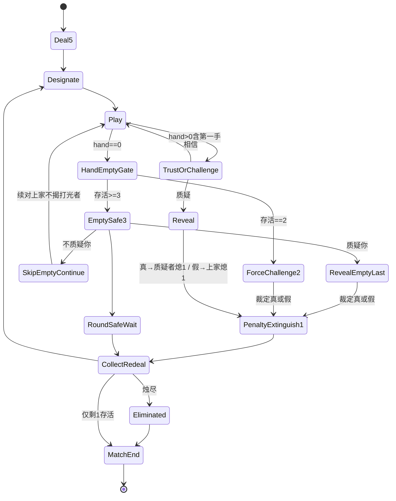

# 对局 · 状态机（规则真源 · 废左轮 · 3烛揭牌直接-1）

| 项 | 内容 |
|----|------|
| 文档版本 | **v2.0.5** |
| 状态 | **废左轮 · 3烛 · F2 · R1/R2/R1′** · **R4开牌时长 1000/5000 · R5质疑窗本手张数可见 · R6法官句全左上/中顶只timer（2026-09-15）** · 会签草案 · **合入 ≠ 终验** · 会签前零 ets |
| 范围 | 整局主链 + **打光/hand-empty ≥3/=2** + **TrustOrChallenge 入口文案** + **命数3烛 / PenaltyExtinguish1** + **F2 全员可见** + **R1 开牌=上家真实打出牌（禁宣言假面）** + **R2 首出落地后下家须过质疑\|相信**。**废** RevolverGun / 膛位 HUD / 真弹·空膛轮盘 / 开枪结算。**废**「本轮第一手不可质疑」。旧 [左轮对局-状态机](./左轮对局-状态机.md) 已 SUPERSEDED |

> **真源在本文。** Joker除外。旧出牌扣牌/质疑入口 SUPERSEDED。合入≠终验。  
> **入口 UI（仍锁）**：前台二键 = **质疑** \| **相信**（非「真/假」）。真/假 **只**作揭牌裁定结果（谁熄烛），不作入口按钮文案。  
> **F2 全员可见（2026-09-14 PM Rebuild 锁）**：点 **质疑** 后，NPC 气泡 / 荷官进窗句 / `lb_cmp_reveal_stage` 揭牌舞台 / 真·假裁定与谁熄烛 —— **桌上全员层可读**（见 [17](../04-设计/17-局内质疑入口规格.md) / [18](../04-设计/18-局内开牌区规格.md)；**不**发明 vp）。**禁**仅行动座本地闪一下。非第一手仍必须先过 **质疑\|相信**（不变）。  
> **R1 / R1′ 开牌真牌面（2026-09-15 Rebuild / 再打回）**：`lb_cmp_reveal_stage` faceUp **=** 上家真实 `lastPlayRanks`/`lastPicked`；**禁** claim 假面（例：宣称 A、实出 Q → 必须翻出 Q，**禁**翻出全 A）。空 ranks **禁**瞎演/claim 填充。真/假裁定仍对照宣称。  
> **R2 第二人可质疑第一手（2026-09-15 Rebuild）**：本轮 **第一手 PlayLanded** 后，下家 **必须**进 `TrustOrChallenge`。**废** `isFirstOfRound` 挡门。  
> **R3→R4 开牌时长（2026-09-15）**：抽→翻 **`DRAW_TO_FLIP=1000ms`**（窗 **800～1200ms**）；翻后持面 **`REVEAL_HOLD=5000ms`**（窗 **4～6s**）；持面满窗才 reset/pull。**SUPERSEDE** R3 500/2000 与旧 160ms 主闸。交叉 [18](../04-设计/18-局内开牌区规格.md)。  
> **R5 质疑窗本手张数（2026-09-15）**：`AwaitChallenge` 时 `lb_cmp_pool` 上本手牌背须可见；张数=`lastPlay.count`。交叉 [17](../04-设计/17-局内质疑入口规格.md)。  
> **R6 法官句左上（2026-09-15）**：全部法官/荷官句 → 顶栏左上；中顶 **仅** `lb_txt_timer`。交叉 [11](../04-设计/11-局内横屏与自适应布局.md)/[17](../04-设计/17-局内质疑入口规格.md)。  
> **命数（2026-09-14 PM/Aron 废左轮）**：每人开局 **3 烛**（`lives_default=3`）；揭牌后 **骗子** 或 **错质疑者** **直接熄 1 烛**（-1 命）；**无**气缸、**无**真弹/空膛随机、**无**开枪轮盘。烛全灭→出局；**末存活胜**。结算后仍走 **CollectRedeal**（名称可保留；**不**绑枪/左轮）。生命主读：**烛 + 熄灭**（14a）。  
> **冻结**：`RevolverGun`、膛位 HUD、`sfx_revolver_*`、你/上家键上的左轮咔哒叙事。EmptySafe **你/上家** 二键本身可留（hand-empty ≥3）。

## 0. 边界
写：主链、U表、mermaid、≥3/=2、RoundSafeWait、TrustOrChallenge 入口文案、命数3烛 / PenaltyExtinguish1、**F2 全员可见**、lb_str_*。  
不写：左轮开枪、膛位推进、真弹/空膛随机、RoundWin、表外发明、入口真/假二键、17/18 vp 数字。  
仍锁：发5、MAX_PLAY=3、Joker符合指定；pool / reveal 拍 **不变**；入口 doubt\|believe；hand-empty ≥3/=2；**质疑/揭牌桌上全员可见**；**开牌真牌面**；**首出落地→下家质疑\|相信**。**废**「本轮第一手不可质疑」。  
生命主读：**烛 + 熄灭**（candle + extinguish；`lives_default=3`）。左轮资产 **冻结**，**不得**再当结算或命数主读。

## 1. R锁
R1 牌堆20=6K+6Q+6A+2Joker；R2 发5；R3 **废左轮**（无6膛1实、无开枪轮盘）；R4 指定K/Q/A；R5 出1-3可虚张；R6 **入口=质疑\|相信**（废真/假作入口主读；真/假仅裁定谁熄烛）；R7 真→质疑者熄1烛 / 假→上家（骗子）熄1烛；R8 揭牌结算（PenaltyExtinguish1）后→**CollectRedeal**；R9 **`lives_default=3` 烛；直接-1；熄尽淘汰；末存活胜**；R10 **废 RoundWin**；**废** `lives_default=1` / 真弹即死 / 左轮开枪结算；R11 打光§2.6；R12 生命主读烛+熄灭（14a）；左轮 HUD/SFX **冻结**。

## 1.1 TrustOrChallenge 入口文案（仍锁 · PM 2026-09-14）

上一手 **PlayLanded** 且 `hand>0`（**含本轮第一手**）→ 下家必须过本门，才可继续出牌。

| 前台键 | 语义 | 结果 | lb_str_* |
|--------|------|------|----------|
| **质疑** | ChallengeCommit：揭上家本手 | → Reveal（ack 后再翻） | `lb_str_challenge_doubt` |
| **相信** | Trust / Pass：不揭，续对 | → 下家 Play（可继续出） | `lb_str_challenge_believe` |

**写死：**

1. **废**「真 / 假」作为入口同层二键主读（旧 `lb_str_challenge_true` / `lb_str_challenge_false` **不得**再当入口按钮标签）。  
2. **真 / 假** 仅出现在 **揭牌裁定结果**（谁熄烛）：全符合宣称或 Joker → 真 → 质疑者熄1烛；存在非宣称且非 Joker → 假 → 上家（骗子）熄1烛。  
3. 点 **相信** 后必须能继续出牌（禁「相信后仍不可出」）。  
4. 点 **质疑** 必须走揭牌路径（禁「质疑未揭牌」——本地未提交 / 未 ack 冒充已过门除外，见失败短句）。  
5. 荷官进窗句不得再问「真还是假」作入口抉择（见 `lb_str_challenge_dealer_enter`）。  
6. 入口控件 / 文案 / 美术 id **写死**为 doubt\|believe（见 §3）；**禁止** true/false/pass 作入口；**禁止** `lb_str_challenge_commit`/`trust` 作文案键。  
7. `lb_str_challenge_true`/`false` **必须保留**（reveal 裁定层）；仅标 DEPRECATED for entry。


## 1.2 F2 全员可见锁（TrustOrChallenge / Reveal / PenaltyExtinguish1 · PM Rebuild 2026-09-14）

**写死：质疑与揭牌是桌上公共事件，不是行动座私闪。**

| 阶段 | 全员必须看见 | 禁（=失败） | 几何 / 层 |
|------|--------------|-------------|-----------|
| **TrustOrChallenge**（点质疑当拍） | 荷官进窗句（`lb_str_challenge_dealer_enter`）；NPC 座旁气泡（thinking → doubt/believe）；入口二键对 **当前行动者** 可点，但对 **全桌** 可读「正在过质疑门」 | 点质疑后桌上无任何公共表现（无气泡 / 无荷官句 / 无进窗感）= **质疑无表现** | 全员层认 **[17](../04-设计/17-局内质疑入口规格.md)**（荷官带 / NPC 气泡 / 入口位）；**本票不发明 vp** |
| **Reveal**（ack 后揭牌） | `lb_cmp_reveal_stage` 抽→翻；牌面真假对 **所有存活座** 可读 | 揭牌舞台 / 翻面结果 **仅**行动座（或仅质疑者）本地闪、他座看不见 = **揭牌仅自己见** | 全员层认 **[18](../04-设计/18-局内开牌区规格.md)**（`lb_cmp_reveal_stage` 挂 `lb_scr_table`）；**本票不发明 vp** |
| **PenaltyExtinguish1**（裁定） | 真/假裁定句 + **谁熄 1 烛** 对全桌可读；输家烛熄序列桌上可见 | 裁定结果 / 熄烛只在行动座 HUD 私闪；他座读不到谁输 | 生命主读仍认 14a；熄灭表现全员层，不另起私有结算层 |

**仍锁（本钉不重开）：**

1. 上家 PlayLanded 且 hand>0 后，下家必须先过 **质疑 \| 相信**（U04 / U20 / S18-6；**含本轮第一手**）——2026-09-15 废「第一手跳过」。  
2. 入口 = doubt\|believe；真/假 **仅**裁定层。  
3. 点质疑 → ack 后再翻（禁本地先开）。  
4. 真→质疑者熄1 / 假→上家熄1；`lives_default=3`；废左轮。

**写死禁止：**

1. **禁**「质疑无表现」：点质疑后无 NPC 气泡、无荷官进窗、无任何桌上公共反馈。  
2. **禁**「揭牌仅自己见」：Reveal / 真假裁定 / 谁熄烛 做成仅行动座本地 flash。  
3. **禁**为全员可见另发明与 17/18 冲突的 vp / 新全屏仪式轨。

## 1.3 R1 / R1′ 开牌真牌面 + R3 开牌时长（Reveal · 2026-09-15）

**写死 · 真牌面（R1/R1′）：** `CHALLENGE_RITUAL` / Reveal 下发与舞台 faceUp **= 上家本手真实打出牌**（`lastPlayRanks` / `lastPicked` 或权威等价真源）。

| 必须 | 禁（=失败） |
|------|-------------|
| 揭开看见的点数 = 上家实际打出（例：宣称 A、实出 Q → faceUp=Q） | 用本轮宣称点数填充 / claim fallback 冒充出牌（**开牌假面**；宣称 A→翻全 A） |
| 空 ranks **不得**瞎演 | 空 ranks 仍用 claim / n=1 填充演开牌 |
| 真/假裁定仍对照宣称（含 Joker 除外） | 把「看见的假面」当裁定输入却与真出牌脱节 |

**写死 · 时长（R4 · 对齐 #199 · SUPERSEDE R3 500/2000）：**

| 拍 | 锁值 | 窗 | 禁 |
|----|------|----|----|
| 抽→翻 `DRAW_TO_FLIP` | **1000ms** | **800～1200ms** | 仍锁 160/500ms；瞬切 / 抽完立刻消失 |
| 翻后持面 `REVEAL_HOLD` | **5000ms** | **4～6s** | 仍锁 2000ms；持面未满就 reset/pull / 进下一拍 |

交叉 [18](../04-设计/18-局内开牌区规格.md)；失败短句 **S18-24**（开牌假面）/ **S18-25**（开牌过快）。

## 1.4 R5 质疑窗本手张数（AwaitChallenge · 2026-09-15）

**写死：** 进 `TrustOrChallenge` / AwaitChallenge 时，`lb_cmp_pool` 上 **本手牌背必须可见**；可见张数 = **`lastPlay.count`**（1～3）。

| 必须 | 禁（=失败） |
|------|-------------|
| 池上本手牌背可读、张数=`lastPlay.count` | 本手隐 / 张数错 / 进窗前抽空本手（**质疑窗不见上家本手张数**） |

交叉 [17](../04-设计/17-局内质疑入口规格.md)；失败短句 **S18-26**。

## 1.5 R6 法官句全左上 / 中顶只倒计时（2026-09-15）

**写死：**

| 层 | 锁 | 禁（=失败） |
|----|----|-------------|
| 法官/荷官句（`lb_txt_judge` / dealerLine / 宣布句） | **顶栏左上** | 落中顶/桌心主读 = **法官句未全左上** |
| 中顶 CenterTop | **仅** `lb_txt_timer` | 中顶叠宣称/法官句 = **中顶仍叠宣言** |

交叉 [11](../04-设计/11-局内横屏与自适应布局.md)/[17](../04-设计/17-局内质疑入口规格.md)；失败短句 **S18-27** / **S18-28**。

## 2. 主链与 mermaid

```
Deal5→Designate→Play→Trust|Challenge→Reveal→PenaltyExtinguish1→CollectRedeal
hand==0→HandEmptyGate(§2.6)；烛尽→Eliminated；仅剩1→MatchEnd
```

入口前台读法：`TrustOrChallenge` = **相信 \| 质疑**（键文案上表）。



## 2.3 U转移表

| ID | From | To | 触发 | 禁 | 失败短句 |
|----|------|-----|------|----|----------|
| U01 | MATCH | Deal5 | 开局/新局进入发牌 | 跳过 Deal5 直接出牌 | — |
| U02 | Deal5 | Designate | 每人发 5 完成 | 发非 5 / 牌堆非 20 构成仍宣称 | S18-7 |
| U03 | Designate | Play | 本轮宣称 K/Q/A 已公布 | Joker 作宣称目标；无宣称就出牌 | — |
| U04 | Play | HandEmptyGate 或 TrustOrChallenge | 权威接受本手提交：hand==0→HandEmptyGate；hand>0（**含本轮第一手**）→下家 TrustOrChallenge | hand>0 却跳过质疑门（含 `isFirstOfRound` 挡）；hand==0 仍进 TrustOrChallenge | S18-6 |
| U05 | TrustOrChallenge | Play | Trust（**相信**）：不揭本手，续对；下家可继续出 | 相信路径进揭牌 / Reveal；相信后仍锁死不可出 | S18-4 / S18-14 |
| U06 | TrustOrChallenge | Reveal | Challenge（**质疑**）：揭上家本手；**全员可见**进窗/气泡/揭牌门 | 无上家本手仍质疑；本地先揭；点质疑却不进揭牌；**质疑无表现** | S18-15 / S18-22 |
| U07 | Reveal | PenaltyExtinguish1 | 裁定为真（全符合宣称或 Joker）→ **质疑者熄 1 烛**；**全员可读**真/谁熄 | 真却让上家熄烛；仍走左轮开枪；**揭牌仅自己见** | S18-2 / S18-17 / S18-23 |
| U08 | Reveal | PenaltyExtinguish1 | 裁定为假（存在非宣称且非 Joker）→ **上家（骗子）熄 1 烛**；**全员可读**假/谁熄 | 假却让质疑者熄烛；仍走左轮开枪；**揭牌仅自己见** | S18-2 / S18-17 / S18-23 |
| U09 | PenaltyExtinguish1 | CollectRedeal | **揭牌结算完成**（已对输家执行熄1）→ 收牌重发 | 结算后不收牌重发；静默跳过 CollectRedeal；揭牌输家未熄烛 | S18-1 / S18-18 |
| U10 | CollectRedeal | Designate | 存活者重发 5 + 新宣称 | 出局者仍发牌/仍出/仍质疑 | S18-3 |
| U11 | CollectRedeal / PenaltyExtinguish1 | Eliminated | 该座烛数降至 **0** → 出局 | 出局后仍发/出/质疑；仍1命即死公式 | S18-3 / S18-19 |
| U12 | Eliminated / CollectRedeal | MatchEnd | 场上仅剩 1 存活 | 仍走旧左轮开枪或 RoundWin 整局公式 | S18-5 / S18-17 |
| U13 | HandEmptyGate | EmptySafe3 | hand==0 且存活 ≥3 | ≥3 仍强制质疑 | S18-8 |
| U14 | EmptySafe3 | SkipEmptyContinue（→Play） | 下家选「不质疑你」：跳过续对上家、**不揭**打光者最后一手；打光者进 RoundSafeWait（本轮胜等待） | 不质疑却揭打光者最后一手；不质疑却让打光者熄烛 | S18-11 |
| U15 | EmptySafe3 | RevealEmptyLast | 下家选「质疑你」：揭打光者最后一手 | — | — |
| U16 | RevealEmptyLast | PenaltyExtinguish1 | 假→打光者熄1烛；真→质疑者熄1烛 | 真假裁定反了；Joker 未除外判假；仍走左轮开枪 | S18-2 / S18-12 / S18-17 |
| U17 | HandEmptyGate | ForceChallenge2 | hand==0 且存活 ==2 | =2 仍可跳过质疑 | S18-9 |
| U18 | ForceChallenge2 | PenaltyExtinguish1 | =2 **强制**质疑最后一手并裁定：真→质疑者熄1；假→打光者熄1 | =2 可过/可 Trust；打光仍走 RoundWin；仍走左轮 | S18-9 / S18-10 / S18-17 |
| U19 | RoundSafeWait | CollectRedeal | 见 **§2.6.1**（主触发 / 收束触发） | 无触发永久挂起；静默跳过 CollectRedeal；发明第三胜负公式 | S18-1 / S18-10 |
| U20 | TrustOrChallenge（UI） | — | 入口二键文案必须为 **质疑** \| **相信** | 入口仍以真/假为主读按钮 | S18-13 |

## 2.6 打光分支表（PM群锁 · Joker除外 · **结算改熄烛**）

| 存活 | 打光者 | 下家 | 揭牌结算 |
|------|--------|------|----------|
| ≥3 | 本轮安全 | 不质疑你=跳过续对上家(不揭其最后一手)；质疑你=揭最后一手 | 仅被质疑且假→打光者熄1烛；真→质疑者熄1烛；不质疑→本轮胜等他人打完→下一轮 |
| =2 | — | 强制质疑最后一手 | 真→质疑者熄1烛；假→打光者熄1烛 |

揭牌结算（PenaltyExtinguish1）后→CollectRedeal。废RoundWin。**废左轮开枪。**

### 2.6.1 RoundSafeWait（≥3 · 不质疑你 · 本轮胜等待 → CollectRedeal）

适用：存活 ≥3，打光者本轮安全，下家选「不质疑你」后，打光者（empty-hander）进入 **RoundSafeWait**（本轮胜等待）；他人按 SkipEmptyContinue 续对上家（不揭该打光者最后一手）。

**已锁（不得重开）：**

- 揭牌结算（PenaltyExtinguish1）后 → 收牌重发（CollectRedeal）
- 本轮胜等他人打完进下一轮（不发明第三套胜负公式）

**写死 · 何时进入 CollectRedeal：**

| 类 | 触发 | 到 |
|----|------|----|
| **主触发** | 本轮内任意后续揭牌结算（含：质疑打光者且真→质疑者熄烛；或其他座位 Challenge 后 PenaltyExtinguish1） | **CollectRedeal** |
| **收束触发** | 其余存活座位均已 `hand==0`（均进入本轮安全 / 无可再出）**且**本轮尚未揭牌结算 | **CollectRedeal**（新指定；不发明第三胜负公式） |

**明确禁止：**

1. **禁**无触发就永久挂起（RoundSafeWait 不得无出口死等）。  
2. **禁**静默跳过 CollectRedeal（进入下一轮前必须经 CollectRedeal）。  
3. **禁**把 RoundSafeWait 写成旧 RoundWin→RedealAll、左轮开枪、或 lives_default=1 公式。

## 3. 入口 id 锁（仍锁 · write dead）

| 类 | 锁 id | 中文 / 说明 |
|----|-------|-------------|
| **Buttons** | `lb_btn_challenge_doubt` / `lb_btn_challenge_believe` | 质疑 / 相信 |
| **Strings** | `lb_str_challenge_doubt`=**质疑** · `lb_str_challenge_believe`=**相信** | 入口按钮文案 |
| **Art** | `art_btn_challenge_doubt` / `_on` · `art_btn_challenge_believe` / `_on` | 入口无字铬（本票不交 media） |
| **SFX** | `lb_sfx_challenge_enter` / `lb_sfx_challenge_commit` | enter=进窗；**commit SFX 仅点质疑**（相信无 commit 声） |

**废除：** 入口使用 true/false/pass；设计草稿文案键 `lb_str_challenge_commit` / `lb_str_challenge_trust`（**免与 SFX commit 撞名**）——已改名为 doubt/believe。

| key | 中文 | 用途 | 备注 |
|-----|------|------|------|
| `lb_str_challenge_doubt` | **质疑** | 入口左/主 CTA：ChallengeCommit | **锁键**；入口按钮专用 |
| `lb_str_challenge_believe` | **相信** | 入口右/次 CTA：Trust / Pass | **锁键**；入口按钮专用 |
| `lb_str_challenge_dealer_enter` | **上家这手——质疑，还是相信？** | 进 TrustOrChallenge / AwaitChallenge | **废**「真，还是假？」作入口问句 |
| `lb_str_challenge_true` / `lb_str_challenge_false` | **真** / **假** | 揭牌裁定层 | **必须保留**；`_comment` 标 DEPRECATED for entry；**不得**当入口按钮标签 |
| `lb_str_challenge_disabled_first` | **第一手还没人出过牌** | **尚无上家本手**时禁用入口（无人出过牌） | **不得**作局内 tip 主读；**不得**在首出落地后仍用本键挡下家质疑（见 S18-6） |
| 裁定结果文案 | 真 / 假 | Reveal 后谁熄烛 | **仅裁定层**；非入口 |

NPC 抉择反馈（入口层，非裁定）：

| key | 中文 |
|-----|------|
| `lb_str_npc_challenge_thinking` | **选择质疑/相信…** |
| `lb_str_npc_challenge_doubt` | **选了质疑** |
| `lb_str_npc_challenge_believe` | **选了相信** |
| `lb_str_npc_challenge_true` / `_false` | **选了真** / **选了假** → **废弃入口主读**（保留键；入口用 doubt/believe） |

资源：`entry/src/main/resources/base/element/string.json`（见 `_comment_challenge_entry_abolished` / `_comment_lb_str_challenge_true_false`）。

## 4. 失败短句

| ID | 失败短句 | lb_str_* | 说明 |
|----|----------|----------|------|
| S18-1 | 揭牌结算后未收牌重发 | `lb_str_penalty_no_redeal` | PenaltyExtinguish1 后未进 CollectRedeal / 静默跳过重发（旧键 `lb_str_shot_no_redeal` 语义迁移） |
| S18-2 | 真假裁定反了 | `lb_str_judge_reversed` | 真却上家熄烛 / 假却质疑者熄烛（**裁定层**，非入口） |
| S18-3 | 出局仍发牌/仍出/仍质疑 | `lb_str_out_still_act` | 烛尽出局座仍参与发/出/质疑 |
| S18-4 | 相信路径仍进揭牌 | `lb_str_trust_revealed` | Trust 却进 Reveal / 揭面 |
| S18-5 | 仍走旧左轮或RoundWin | `lb_str_old_lives_or_roundwin` | 左轮开枪主胜负、真弹即死、或打光→RoundWin→RedealAll |
| **S18-6** | **第二人不可质疑第一手** | `lb_str_first_hand_challenge` | 本轮第一手 PlayLanded 后下家 **不进** TrustOrChallenge / 被 `isFirstOfRound` 等挡住；或质疑键对第一手禁用（**语义翻：旧「第一手仍可质疑」作失败已废**） |
| S18-7 | 牌堆不是20构成 | `lb_str_deck_not_20` | 非 6K+6Q+6A+2Joker |
| S18-8 | ≥3仍强制质疑 | `lb_str_empty_force_ge3` | 存活≥3 打光后仍强制质疑 |
| S18-9 | =2仍可跳过 | `lb_str_empty_skip_eq2` | 存活==2 打光后可 Trust/过 |
| S18-10 | 打光仍走RoundWin | `lb_str_empty_still_roundwin` | hand==0 走旧 RoundWin→RedealAll |
| S18-11 | 未被质疑却被罚 | `lb_str_empty_shot_unasked` | ≥3 且不质疑你时打光者仍熄烛（键名可保留；语义=未经揭牌却罚） |
| S18-12 | Joker未除外 | `lb_str_empty_joker_misjudge` | Joker 被判假 / 不算符合宣称 |
| **S18-13** | **入口仍真假主读** | `lb_str_entry_still_true_false` | TrustOrChallenge 前台仍以「真/假」为按钮主读；或荷官句仍问真假作入口抉择 |
| **S18-14** | **相信后仍不可出** | `lb_str_believe_still_blocked` | 点相信 / Trust 后下家（或续对座）仍无法出牌 / 卡死在门内 |
| **S18-15** | **质疑未揭牌** | `lb_str_doubt_no_reveal` | 点质疑 / ChallengeCommit 后权威已接受却不进揭牌；或入口提交被当成过门却未揭 |
| **S18-16** | **（废）膛位当命读** | `lb_str_revolver_as_lives` | **历史键**：用左轮膛数替代烛。现整条左轮已废；见 S18-17 |
| **S18-17** | **仍走左轮开枪** | `lb_str_still_revolver_shoot` | 揭牌后仍进 Shoot/RevolverGun/真弹空膛轮盘；或播放 `sfx_revolver_*` 作结算主路径 |
| **S18-18** | **揭牌输家未熄烛** | `lb_str_loser_no_extinguish` | 裁定输家后未执行熄1烛 / lives 未-1 |
| **S18-19** | **仍1命即死** | `lb_str_still_one_life_elim` | 仍用 `lives_default=1` 或「真弹/一次罚即出局」公式，未按 3 烛累熄 |
| **S18-20** | **开局不是三烛** | `lb_str_open_not_three_candles` | 开局烛数不为 3 / 未按 `lives_default=3` 发烛 |
| **S18-21** | **熄尽未淘汰** | `lb_str_all_out_not_eliminated` | 烛数已降至 0 却未进 Eliminated / 未淘汰 |
| **S18-22** | **质疑无表现** | `lb_str_challenge_no_broadcast` | 点质疑后桌上无公共表现：无 NPC 气泡 / 无荷官进窗句 / 无进 TrustOrChallenge 的全员可读反馈（**≠** S18-15 质疑未揭牌——本条盯「无广播表现」） |
| **S18-23** | **揭牌仅自己见** | `lb_str_reveal_self_only` | Reveal 舞台 / 真假裁定 / 谁熄烛 **仅**行动座本地闪，他座不可读（交叉 17/18 全员层；**≠** S18-18 未熄烛） |
| **S18-24** | **开牌假面** | `lb_str_reveal_claim_face` | 揭牌用宣称/claim 填充（例：宣称 A→翻全 A），**非**真实 `lastPlayRanks`；或空 ranks 瞎演 |
| **S18-25** | **开牌过快** | `lb_str_reveal_too_fast` | 抽→翻 <800ms（或仍锁 160/500ms 主闸）；或翻后持面 <4s 就 reset/pull；看不清点数 |
| **S18-26** | **质疑窗不见上家本手张数** | `lb_str_challenge_no_pile_count` | AwaitChallenge 时池上本手牌背不可见 / 张数≠`lastPlay.count` / 进窗前抽空本手 |
| **S18-27** | **法官句未全左上** | `lb_str_judge_not_top_start` | 法官/荷官句未落顶栏左上；仍在中顶或桌心主读 |
| **S18-28** | **中顶仍叠宣言** | `lb_str_center_top_claim_stack` | 中顶除 `lb_txt_timer` 外仍叠宣称/法官句/dealerLine |

## 5. 生命表现（本票钉）

- **主读**：烛火 + 熄灭序列（candle + extinguish；`lives_default=3`）。认 [14a](../04-设计/14a-生命显示-语义与文案.md)。  
- **揭牌罚**：输家 **直接熄 1 烛**（PenaltyExtinguish1）。  
- **淘汰**：烛数 = 0 → Eliminated；末存活 → MatchEnd。  
- **冻结（设计真源不再驱动）**：`RevolverGun`、膛位 HUD（`art_revolver_*`）、`sfx_revolver_click` / `_shot` / `_spin`、你/上家键上的左轮咔哒叙事。EmptySafe **你/上家** 按钮美术可留。  
- **禁**：左轮膛位当命数；真弹/空膛随机；`lives_default=1`；真弹即死。

## 6. CollectRedeal（名可留 · 不绑枪）

任意 **PenaltyExtinguish1** 完成后 → **CollectRedeal**（收齐牌堆、存活者重发 5、新宣称）。  
名称历史来自「开枪后收牌」；**现语义 = 揭牌罚后收牌重发**，**不**要求左轮/开枪演出。

## 会签
负责人/UI/测试/鸿蒙/美术。合入≠终验。零ets（本票仅 docs + 可选 string 键；**不**交 ets）。

| 版本 | 说明 |
|------|------|
| v1.1.x | 左轮真源时代（已 SUPERSEDED；见旧文件横幅） |
| **v2.0.0** | **废左轮**：主链 Reveal→**PenaltyExtinguish1**→CollectRedeal；`lives_default=3`；真→质疑者熄1 / 假→上家熄1；熄尽淘汰；S18-17～19；冻结 revolver HUD/SFX；对齐 GDD **v0.4.0** |
| **v2.0.1** | **F2 全员可见锁**：TrustOrChallenge / Reveal / PenaltyExtinguish1 桌上全员可读；禁仅行动座私闪；S18-22 **质疑无表现** / S18-23 **揭牌仅自己见**；交叉 17/18 全员层（不发明 vp）；非第一手质疑\|相信不变 |
| **v2.0.2** | 登记失败短句 **S18-20**（开局不是三烛）/ **S18-21**（熄尽未淘汰）；S18-19 仍为 still_one_life_elim |
| **v2.0.3** | **R1/R2 Rebuild**：开牌真牌面（S18-24）；废「第一手不可质疑」→ 首出落地后下家须 TrustOrChallenge；S18-6 语义翻为「第二人不可质疑第一手」；对齐 #191 |
| **v2.0.4** | **R1′/R3**：开牌真牌面加严（空 ranks 禁瞎演）；时序 DRAW_TO_FLIP=500ms / REVEAL_HOLD=2000ms；S18-25 开牌过快；对齐 #195 |
| **v2.0.5** | **R4/R5/R6**：DRAW_TO_FLIP=1000 / REVEAL_HOLD=5000（SUPERSEDE 500/2000）；S18-25 阈值跟新窗；S18-26～28；对齐 #199 |
