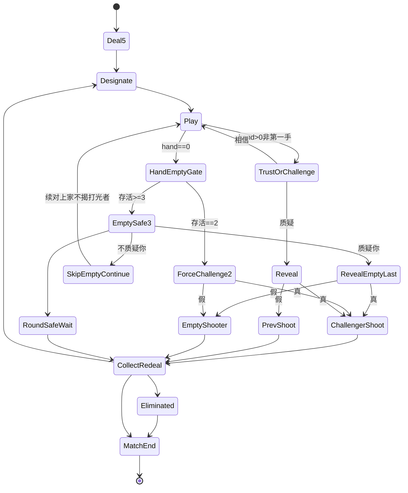

# 左轮对局 · 状态机（规则真源 · 废 3 命 / RoundWin）

| 项 | 内容 |
|----|------|
| 文档版本 | **v1.1.0** |
| 状态 | **2026-09-14 左轮规则真源重锁** · 会签草案 · **合入 ≠ 终验** · 会签前零 ets |
| 范围 | 整局主链 + **打光/hand-empty ≥3/=2**。废 3命 / RoundWin→RedealAll（#160/#163） |

> 真源在本文。Joker除外。旧出牌扣牌/质疑入口 SUPERSEDED。合入≠终验。

## 0. 边界
写：主链、U表、mermaid、≥3/=2、lb_str_*。不写：RoundWin、3命扣命、表外发明。
仍锁：发5、MAX_PLAY=3、第一手不可质疑、Joker符合指定。

## 1. R锁
R1 牌堆20=6K+6Q+6A+2Joker；R2 发5；R3 左轮6膛1实；R4 指定K/Q/A；R5 出1-3可虚张；R6 相信|质疑；R7 真→质疑者开枪/假→上家开枪；R8 任意开枪→CollectRedeal；R9 实弹出局仅剩1胜；R10 废3命与RoundWin；R11 打光§2.6。

## 2. 主链与 mermaid

```
Deal5→Designate→Play→Trust|Challenge→Reveal→Shoot→CollectRedeal
hand==0→HandEmptyGate(§2.6)
```



## 2.3 U转移表
U01 MATCH→Deal5；U02→Designate；U03→Play；U04 Play提交→HandEmptyGate或TrustOrChallenge；U05 TRUST→Play不揭；U06 CHALLENGE→Reveal；U07真→ChallengerShoot；U08假→PrevShoot；U09开枪→CollectRedeal；U10重发→Designate；U11实弹→Eliminated；U12仅剩1→MatchEnd；U13 hand==0且≥3→EmptySafe3；U14不质疑你→跳过续对上家；U15质疑你→RevealEmptyLast；U16假→EmptyShooter真→ChallengerShoot；U17 hand==0且=2→ForceChallenge2；U18强制裁定；U19本轮胜等待→CollectRedeal。

## 2.6 打光分支表（PM群锁 · Joker除外）

| 存活 | 打光者 | 下家 | 开枪 |
|------|--------|------|------|
| ≥3 | 本轮安全 | 不质疑你=跳过续对上家(不揭其最后一手)；质疑你=揭最后一手 | 仅被质疑且假→打光者开枪；真→质疑者开枪；不质疑→本轮胜等他人打完→下一轮 |
| =2 | — | 强制质疑最后一手 | 真→质疑者开枪；假→打光者开枪 |

任意开枪→CollectRedeal。废RoundWin。

## 4. 失败短句
S18-1开枪后未收牌重发；S18-2真假裁定反了；S18-3出局仍发牌/仍出/仍质疑；S18-4相信路径仍进揭牌；S18-5仍走旧3命或RoundWin；S18-6第一手仍可质疑；S18-7牌堆不是20构成；S18-8≥3仍强制质疑；S18-9=2仍可跳过；S18-10打光仍走RoundWin；S18-11未被质疑却开枪；S18-12Joker未除外。keys: lb_str_shot_no_redeal / judge_reversed / out_still_act / trust_revealed / old_lives_or_roundwin / first_hand_challenge / deck_not_20 / empty_force_ge3 / empty_skip_eq2 / empty_still_roundwin / empty_shot_unasked / empty_joker_misjudge。

## 会签
负责人/UI/测试/鸿蒙/美术。合入≠终验。零ets。

| 版本 | 说明 |
|------|------|
| v1.1.0 | 左轮+hand-empty ≥3/=2；Joker除外；废RoundWin |
