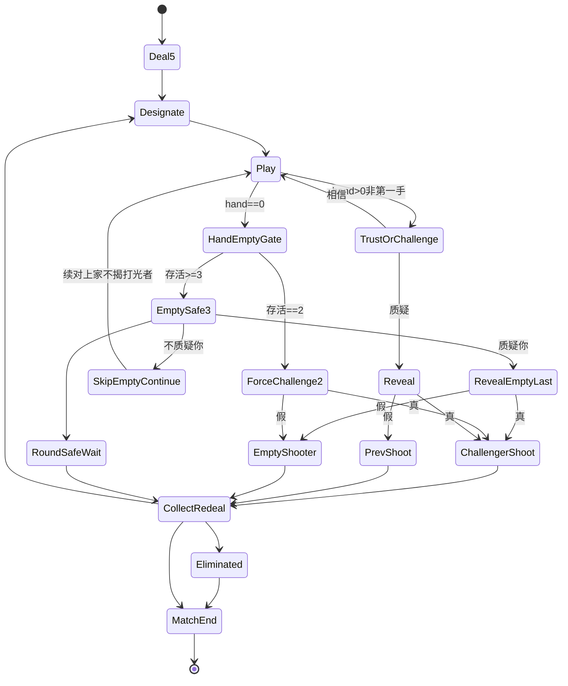

# 左轮对局 · 状态机（规则真源 · 废 3 命 / RoundWin）

| 项 | 内容 |
|----|------|
| 文档版本 | **v1.1.2** |
| 状态 | **2026-09-14 PM 锁：质疑入口改「质疑\|相信」（废真假主读）** · 会签草案 · **合入 ≠ 终验** · 会签前零 ets |
| 范围 | 整局主链 + **打光/hand-empty ≥3/=2** + **TrustOrChallenge 入口文案**。废 3命 / RoundWin→RedealAll（#160/#163）。废入口真/假主读 |

> 真源在本文。Joker除外。旧出牌扣牌/质疑入口 SUPERSEDED。合入≠终验。  
> **入口 UI（2026-09-14）**：前台二键 = **质疑** \| **相信**（非「真/假」）。真/假 **只**作揭牌裁定结果（谁开枪），不作入口按钮文案。

## 0. 边界
写：主链、U表、mermaid、≥3/=2、RoundSafeWait、TrustOrChallenge 入口文案、lb_str_*。不写：RoundWin、3命扣命、表外发明、入口真/假二键。
仍锁：发5、MAX_PLAY=3、第一手不可质疑、Joker符合指定。
生命主读：**烛 + 熄灭**（candle + extinguish）；左轮 HUD/SFX 可留作 **开枪反馈**，**不得**当生命计数 UI。

## 1. R锁
R1 牌堆20=6K+6Q+6A+2Joker；R2 发5；R3 左轮6膛1实；R4 指定K/Q/A；R5 出1-3可虚张；R6 **入口=质疑\|相信**（废真/假作入口主读；真/假仅裁定）；R7 真→质疑者开枪/假→上家开枪；R8 任意开枪→CollectRedeal；R9 实弹出局仅剩1胜；R10 废3命与RoundWin；R11 打光§2.6；R12 生命主读烛+熄灭（左轮仅开枪反馈）。

## 1.1 TrustOrChallenge 入口文案（PM 2026-09-14）

上一手 **PlayLanded** 且 **非第一手** → 必须过本门，才可继续下家出牌。

| 前台键 | 语义 | 结果 | lb_str_* |
|--------|------|------|----------|
| **质疑** | ChallengeCommit：揭上家本手 | → Reveal（ack 后再翻） | `lb_str_challenge_commit` |
| **相信** | Trust / Pass：不揭，续对 | → 下家 Play（可继续出） | `lb_str_challenge_trust` |

**写死：**

1. **废**「真 / 假」作为入口同层二键主读（旧 `lb_str_challenge_true` / `lb_str_challenge_false` **不得**再当入口按钮标签）。  
2. **真 / 假** 仅出现在 **揭牌裁定结果**（谁开枪）：全符合宣称或 Joker → 真 → 质疑者开枪；存在非宣称且非 Joker → 假 → 上家开枪。  
3. 点 **相信** 后必须能继续出牌（禁「相信后仍不可出」）。  
4. 点 **质疑** 必须走揭牌路径（禁「质疑未揭牌」——本地未提交 / 未 ack 冒充已过门除外，见失败短句）。  
5. 荷官进窗句不得再问「真还是假」作入口抉择（见 `lb_str_challenge_dealer_enter`）。

## 2. 主链与 mermaid

```
Deal5→Designate→Play→Trust|Challenge→Reveal→Shoot→CollectRedeal
hand==0→HandEmptyGate(§2.6)
```

入口前台读法：`TrustOrChallenge` = **相信 \| 质疑**（键文案上表）。



## 2.3 U转移表

| ID | From | To | 触发 | 禁 | 失败短句 |
|----|------|-----|------|----|----------|
| U01 | MATCH | Deal5 | 开局/新局进入发牌 | 跳过 Deal5 直接出牌 | — |
| U02 | Deal5 | Designate | 每人发 5 完成 | 发非 5 / 牌堆非 20 构成仍宣称 | S18-7 |
| U03 | Designate | Play | 本轮宣称 K/Q/A 已公布 | Joker 作宣称目标；无宣称就出牌 | — |
| U04 | Play | HandEmptyGate 或 TrustOrChallenge | 权威接受本手提交：hand==0→HandEmptyGate；hand>0 且非第一手→TrustOrChallenge；hand>0 且第一手→下家 Play（不进质疑门） | 第一手进质疑门；hand==0 仍进 TrustOrChallenge | S18-6 |
| U05 | TrustOrChallenge | Play | Trust（**相信**）：不揭本手，续对；下家可继续出 | 相信路径进揭牌 / Reveal；相信后仍锁死不可出 | S18-4 / S18-14 |
| U06 | TrustOrChallenge | Reveal | Challenge（**质疑**）：揭上家本手 | 无上家本手仍质疑；本地先揭；点质疑却不进揭牌 | S18-15 |
| U07 | Reveal | ChallengerShoot | 裁定为真（全符合宣称或 Joker）→ 质疑者开枪 | 真却让上家开枪 | S18-2 |
| U08 | Reveal | PrevShoot | 裁定为假（存在非宣称且非 Joker）→ 上家开枪 | 假却让质疑者开枪 | S18-2 |
| U09 | ChallengerShoot / PrevShoot / EmptyShooter | CollectRedeal | **任意开枪**（空膛或实弹）→ 收牌重发 | 开枪后不收牌重发；静默跳过 CollectRedeal | S18-1 |
| U10 | CollectRedeal | Designate | 存活者重发 5 + 新宣称 | 出局者仍发牌/仍出/仍质疑 | S18-3 |
| U11 | CollectRedeal / Shoot | Eliminated | 实弹 → 该座出局 | 出局后仍发/出/质疑/开枪 | S18-3 |
| U12 | Eliminated / CollectRedeal | MatchEnd | 场上仅剩 1 存活 | 仍走旧 3 命或 RoundWin 整局公式 | S18-5 |
| U13 | HandEmptyGate | EmptySafe3 | hand==0 且存活 ≥3 | ≥3 仍强制质疑 | S18-8 |
| U14 | EmptySafe3 | SkipEmptyContinue（→Play） | 下家选「不质疑你」：跳过续对上家、**不揭**打光者最后一手；打光者进 RoundSafeWait（本轮胜等待） | 不质疑却揭打光者最后一手；不质疑却让打光者开枪 | S18-11 |
| U15 | EmptySafe3 | RevealEmptyLast | 下家选「质疑你」：揭打光者最后一手 | — | — |
| U16 | RevealEmptyLast | EmptyShooter 或 ChallengerShoot | 假→EmptyShooter（打光者开枪）；真→ChallengerShoot（质疑者开枪） | 真假裁定反了；Joker 未除外判假 | S18-2 / S18-12 |
| U17 | HandEmptyGate | ForceChallenge2 | hand==0 且存活 ==2 | =2 仍可跳过质疑 | S18-9 |
| U18 | ForceChallenge2 | ChallengerShoot 或 EmptyShooter | =2 **强制**质疑最后一手并裁定：真→质疑者开枪；假→打光者开枪 | =2 可过/可 Trust；打光仍走 RoundWin | S18-9 / S18-10 |
| U19 | RoundSafeWait | CollectRedeal | 见 **§2.6.1**（主触发 / 收束触发） | 无触发永久挂起；静默跳过 CollectRedeal；发明第三胜负公式 | S18-1 / S18-10 |
| U20 | TrustOrChallenge（UI） | — | 入口二键文案必须为 **质疑** \| **相信** | 入口仍以真/假为主读按钮 | S18-13 |

## 2.6 打光分支表（PM群锁 · Joker除外）

| 存活 | 打光者 | 下家 | 开枪 |
|------|--------|------|------|
| ≥3 | 本轮安全 | 不质疑你=跳过续对上家(不揭其最后一手)；质疑你=揭最后一手 | 仅被质疑且假→打光者开枪；真→质疑者开枪；不质疑→本轮胜等他人打完→下一轮 |
| =2 | — | 强制质疑最后一手 | 真→质疑者开枪；假→打光者开枪 |

任意开枪→CollectRedeal。废RoundWin。

### 2.6.1 RoundSafeWait（≥3 · 不质疑你 · 本轮胜等待 → CollectRedeal）

适用：存活 ≥3，打光者本轮安全，下家选「不质疑你」后，打光者（empty-hander）进入 **RoundSafeWait**（本轮胜等待）；他人按 SkipEmptyContinue 续对上家（不揭该打光者最后一手）。

**已锁（不得重开）：**

- 任意开枪 → 收牌重发（CollectRedeal）
- 本轮胜等他人打完进下一轮（不发明第三套胜负公式）

**写死 · 何时进入 CollectRedeal：**

| 类 | 触发 | 到 |
|----|------|----|
| **主触发** | 本轮内任意后续开枪（含：质疑打光者且真→质疑者开枪；或其他座位 Challenge 后开枪） | **CollectRedeal** |
| **收束触发** | 其余存活座位均已 `hand==0`（均进入本轮安全 / 无可再出）**且**本轮尚未开枪 | **CollectRedeal**（新指定；不发明第三胜负公式） |

**明确禁止：**

1. **禁**无触发就永久挂起（RoundSafeWait 不得无出口死等）。
2. **禁**静默跳过 CollectRedeal（进入下一轮前必须经 CollectRedeal）。
3. **禁**把 RoundSafeWait 写成旧 RoundWin→RedealAll 或 3 命公式。

## 3. lb_str_*（入口 / 荷官 · 本票）

| key | 中文 | 用途 | 备注 |
|-----|------|------|------|
| `lb_str_challenge_commit` | **质疑** | 入口左/主 CTA：ChallengeCommit | **新键**；入口按钮专用 |
| `lb_str_challenge_trust` | **相信** | 入口右/次 CTA：Trust / Pass | **新键**；入口按钮专用 |
| `lb_str_challenge_dealer_enter` | **上家这手——质疑，还是相信？** | 进 TrustOrChallenge / AwaitChallenge | **废**「真，还是假？」作入口问句 |
| `lb_str_challenge_true` / `lb_str_challenge_false` | （旧） | — | **废弃入口按钮用途**；勿 remap 当入口标签（免与裁定真假混淆） |
| 裁定结果文案 | 真 / 假 | Reveal 后谁开枪 | **仅裁定层**；非入口 |

NPC 抉择反馈（入口层，非裁定）：

| key | 中文 |
|-----|------|
| `lb_str_npc_challenge_thinking` | **选择质疑/相信…** |
| `lb_str_npc_challenge_commit` | **选了质疑**（新；优先于旧 true） |
| `lb_str_npc_challenge_trust` | **选了相信**（新；优先于旧 false） |
| `lb_str_npc_challenge_true` / `_false` | 旧入口「选了真/假」→ **废弃入口主读** |

资源：`entry/src/main/resources/base/element/string.json`（本 PR 已改值 / 补新键；见文件内 `_comment_challenge_entry_abolished`）。

## 4. 失败短句

| ID | 失败短句 | lb_str_* | 说明 |
|----|----------|----------|------|
| S18-1 | 开枪后未收牌重发 | `lb_str_shot_no_redeal` | 任意开枪后未进 CollectRedeal / 静默跳过重发 |
| S18-2 | 真假裁定反了 | `lb_str_judge_reversed` | 真却上家开枪 / 假却质疑者开枪（**裁定层**，非入口） |
| S18-3 | 出局仍发牌/仍出/仍质疑 | `lb_str_out_still_act` | 实弹出局座仍参与发/出/质疑/开枪 |
| S18-4 | 相信路径仍进揭牌 | `lb_str_trust_revealed` | Trust 却进 Reveal / 揭面 |
| S18-5 | 仍走旧3命或RoundWin | `lb_str_old_lives_or_roundwin` | 扣命主胜负或打光→RoundWin→RedealAll |
| S18-6 | 第一手仍可质疑 | `lb_str_first_hand_challenge` | 本轮第一手进 TrustOrChallenge / 可 Challenge |
| S18-7 | 牌堆不是20构成 | `lb_str_deck_not_20` | 非 6K+6Q+6A+2Joker |
| S18-8 | ≥3仍强制质疑 | `lb_str_empty_force_ge3` | 存活≥3 打光后仍强制质疑 |
| S18-9 | =2仍可跳过 | `lb_str_empty_skip_eq2` | 存活==2 打光后可 Trust/过 |
| S18-10 | 打光仍走RoundWin | `lb_str_empty_still_roundwin` | hand==0 走旧 RoundWin→RedealAll |
| S18-11 | 未被质疑却开枪 | `lb_str_empty_shot_unasked` | ≥3 且不质疑你时打光者仍开枪 |
| S18-12 | Joker未除外 | `lb_str_empty_joker_misjudge` | Joker 被判假 / 不算符合宣称 |
| **S18-13** | **入口仍真假主读** | `lb_str_entry_still_true_false` | TrustOrChallenge 前台仍以「真/假」为按钮主读；或荷官句仍问真假作入口抉择 |
| **S18-14** | **相信后仍不可出** | `lb_str_trust_still_blocked` | 点相信 / Trust 后下家（或续对座）仍无法出牌 / 卡死在门内 |
| **S18-15** | **质疑未揭牌** | `lb_str_challenge_no_reveal` | 点质疑 / ChallengeCommit 后权威已接受却不进揭牌；或入口提交被当成过门却未揭 |

## 5. 生命表现（本票钉一句）

- **主读**：烛火 + 熄灭序列（candle + extinguish）。  
- **左轮 HUD / 开枪 SFX**：可作 **shot feedback**（扣扳机、实弹/空膛）。  
- **禁**：用左轮膛数 / 子弹图标替代烛，作为「还剩几命」计数 UI（已废 3 命主胜负；存活/出局语义跟烛）。

## 会签
负责人/UI/测试/鸿蒙/美术。合入≠终验。零ets（本票仅 docs + string.json）。

| 版本 | 说明 |
|------|------|
| v1.1.0 | 左轮+hand-empty ≥3/=2；Joker除外；废RoundWin |
| v1.1.1 | PM reject 质量修：U01–U19 全表展开；S18-1～12 表；RoundSafeWait→CollectRedeal 主/收束触发写死；版本对齐 GDD **v0.3.0** |
| **v1.1.2** | PM 锁：入口废真/假主读；前台 **质疑\|相信**；新 lb_str_challenge_commit/trust；荷官句改；S18-13～15；生命主读烛+熄灭（左轮仅开枪反馈） |
