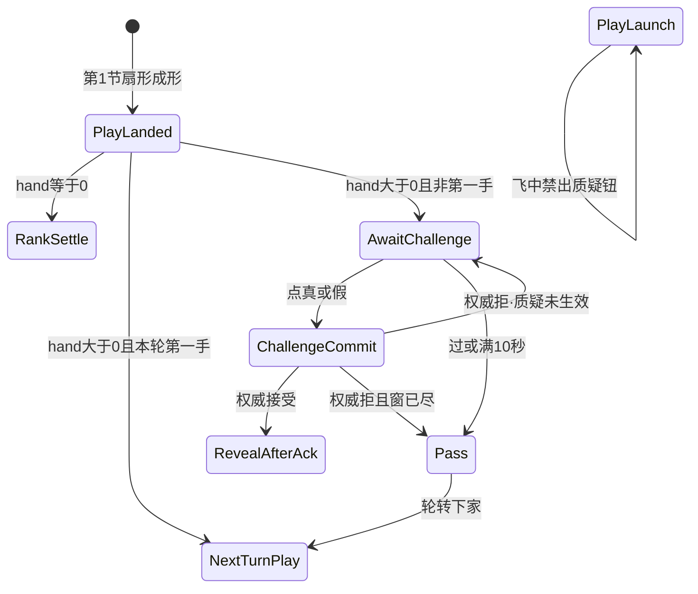

# 质疑入口 · 状态机（第2节入口锁 · AwaitChallenge → ChallengeCommit / Pass）

| 项 | 内容 |
|----|------|
| 文档版本 | **v0.1.0** |
| 状态 | **制作人第2节入口已锁** · 会签草案 · **合入 ≠ 终验** · 会签前零 ets |
| 主笔 | 策划（`feat/design-*`） |
| 范围 | PlayLanded 之后的 **质疑入口**：进不进 AwaitChallenge、真·假同层二键、过、超时、权威 ack 后再翻。不写四拍深潜、押注窗、坟场几何、第4节名次细表 |
| 读者 | @LiarBar负责人 · @LiarBar UI · @LiarBar测试 · @LiarBar鸿蒙开发 · @LiarBar美术 |
| 对照 | [出牌扣牌-状态机](./出牌扣牌-状态机.md)（第1节飞出 + Aron L7 打光名次；本文件只接入口） · [GDD §6.2 / §6.1 / G-Q6](./GDD.md) · [05 T20](../05-技术/02-回合状态机草图.md) · [13 声场](../04-设计/13-局内声场与伴奏规格.md) · [02 命名](../04-设计/02-组件与资源命名约定.md) · [16 飞出](../04-设计/16-局内出牌飞出与身前扣牌规格.md)（本线 **不改** 16 正文数字） |
| 本 PR | **只交 docs**。零 `ets` / `rawfile` / `media`。**线框数字见 17（待开）**，本文不发明 vp |
| 制作人摘要 | 2026-09-13 第2节「质疑阶段」入口锁 |

> **线框数字见 17（待开）。** 本文件不写 vp / 钮高 / 环半径。17 未开之前，入口语义以本文为准。  
> **第1节飞出 / Aron 打光名次 / L7 仍认** [出牌扣牌-状态机](./出牌扣牌-状态机.md)。本线 **不重开** 第4节名次细表。  
> **合入 ≠ 终验。** 会签前零 ets。客户端出牌飞出（#140）是另一条，不顶替本入口。

---

## 0. 边界

| 写 | 不写 |
|----|------|
| AwaitChallenge 进 / 不进；ChallengeCommit / Pass | 四拍演出轴、`lb_scr_challenge` 深潜、押注窗、砸杯 |
| 真·假同层二键；「过」无声 | 多步问卷、旧四拍 / 弱 CTA 双轨 |
| 开牌 **ack 后再翻**；拒则「质疑未生效」 | 本地先开牌、乐观揭面 |
| 超时 **10s**（窗 8～12s）；倒计时环可选 | 发明 17 的 vp；改 `challenge_only_seconds=8` 键名 |
| SFX：`lb_sfx_challenge_enter` / `lb_sfx_challenge_commit` | 交 wav；用 flip / launch / land 冒充质疑；强制 pass 槽 |
| S17 / C2 失败短句（测试可抄） | 整份 C2 勾选纸（`feat/test-*` 另开） |
| 圆桌已锁规则的入口落点 | 重写 GDD 裁定公式、重开 L7 / RankSettle 细分配分 |

**仍锁（本线不得重开）：**

1. **3 命**（`lives_default=3`）。  
2. **`MAX_PLAY=3`**（`max_play_cards=3`）。  
3. **贴底硬修本轮搁置** — 不改 `padB` / `HAND_RING_GAP=24%` / flush / tip。  
4. **打光名次 Aron L7** — 先打光更好；`hand==0` → RankSettle，**禁** AwaitChallenge。细分配分 **第4节详**。  
5. **合入 ≠ 终验。** 会签前零 ets。合入本 PR ≠ 质疑终验 ≠ 出牌飞出终验。

---

## 1. 制作人锁（逐条写死 · 2026-09-13）

### 1.1 第2节入口六条

| # | 锁 | 可执行含义 |
|---|----|------------|
| C1 | **开牌 ack 后再翻**；**禁本地先开牌** | 点真 / 假 = `ChallengeCommit` + 发权威提交。**必须**等权威 ack **接受** 才揭上家本手。本地抢翻、先亮面再等 ack = **质疑未生效 / 本地先开牌** |
| C2 | **真·假同层二键**；**「过」无声**，不强制 pass SFX slot | 入口层同时摆 **真**、**假** 两键（二选同一层）。点一键即提交。禁止先点弱「质疑」再进问卷。**过** = 超时或沉默过；无声；**不**强制 `lb_sfx_challenge_pass` / 第三问卷步 |
| C3 | 超时 = **10s**（窗 **8～12s**）；倒计时环可选 | AwaitChallenge 推荐 **10s**，实现可落在 **8～12s**。到点 **一律 Pass**（不自动质疑、不扣命）。UI **可以**画倒计时环；**线框数字见 17（待开）** |
| C4 | SFX：`lb_sfx_challenge_enter`（进 AwaitChallenge）+ `lb_sfx_challenge_commit`（点质疑 / 真假确认） | 入窗只认 enter。点真 / 假只认 commit。**禁止**把 `lb_sfx_card_flip` / `lb_sfx_play_launch` / `lb_sfx_play_land` 当质疑声。过 **不**强制槽 |
| C5 | 失败短句锁：**质疑未生效** | 权威拒、本地先开牌、提交被打回：桌上 **只准**「质疑未生效」（`lb_str_challenge_reject`）。不另造平行句 |
| C6 | 旧四拍 / 弱 CTA **双轨禁并存** | 入口只认真·假同层二键。旧 `lb_btn_challenge` 单钮弱 CTA、旧四拍全屏当作 **第二条质疑路径** = **质疑双轨并存**。四拍若仍作裁定 **表现**，不得再当入口 |

### 1.2 圆桌已锁（入口落点 · 不重开胜负）

下列圆桌句 **已经锁在别处**（GDD / 出牌扣牌-状态机）。本线只写它们怎么卡入口，**不**重开第4节。

| 圆桌句 | 入口落点 |
|--------|----------|
| 只质疑 **上家本手** | `targetPlay == lastPlay`（上家 **当前这一手**）。指别人、指历史手、指坟场 = **质疑非上家本手** |
| 真 / 假 **二选** | 同层两键，不是多步问卷 |
| **第一手不能质疑**（G-Q6） | 本轮第一手 PlayLanded 后 **不进** AwaitChallenge。下家只出牌。第一手还能点真/假 = **第一手仍可质疑** |
| **hand==0（打光）者不被质疑、也不质疑** | PlayLanded 后 `hand==0` → **RankSettle**，**禁** AwaitChallenge。打光者钮可点、或下游仍开他这手 = **打光者仍被质疑 / 仍能点质疑** |
| PlayLanded ∧ hand>0 ∧ **非第一手** → AwaitChallenge | 三条件同时才进。缺一则不进 |
| PlayLanded ∧ hand==0 → RankSettle | 认 Aron L7。本线不改名次主序 |

**禁止**用本文件重写「先打光更好 / 命归零垫底 / 细分配分」。那些仍在 [出牌扣牌-状态机 §1.2 / §6](./出牌扣牌-状态机.md)。

---

## 2. 状态机

逻辑阶段仍报 GDD `TURN` / `CHALLENGE_RITUAL` / `JUDGE`。下表是 **桌上 UI 拍**，**不**加成 05 引擎 `phase`。

### 2.1 主链（写死）

上游（第1节，不重开）：

```
ConfirmReady → PlayLaunch → PlayLanded
              ├─ hand == 0                 → RankSettle
              ├─ hand > 0 ∧ 本轮第一手     → 下家 TURN（不进 AwaitChallenge）
              └─ hand > 0 ∧ 非第一手       → AwaitChallenge
```

本文件从 AwaitChallenge 写起：

```
AwaitChallenge
        ├─ 点 真 / 假     → ChallengeCommit  → 权威 ack 接受 → 才翻上家本手
        │                                    → 权威拒        → 「质疑未生效」（不翻）
        ├─ 过（沉默）      → Pass            → 下家 TURN
        └─ 满 10s         → Pass            → 下家 TURN
```



| UI 拍 | GDD 阶段 | 画面 | 玩家能做什么 | 禁止 |
|-------|----------|------|--------------|------|
| **PlayLaunch** | `PLAY_REVEAL_SELF` | 飞窗未满 | **无**质疑钮 | **飞中出质疑钮** |
| **PlayLanded** | 本手扇刚成形 | 身前牌背扇 | 立刻按 hand / 是否第一手分流 | 扇未成形就进 AwaitChallenge |
| **AwaitChallenge** | `TURN`（下家） | 身前扇保持；**真·假同层二键**；倒计时环可选 | 点真 / 假；或过（沉默） | 第一手进来；hand==0 进来；旧四拍/弱 CTA 并行；问卷式多步 |
| **ChallengeCommit** | 提交中 | 二键收起或 busy；**牌仍背** | 等 ack。不可再改选、不可本地翻 | **本地先开牌** |
| **Pass** | `TURN` 轮转 | 入口收起 | 无操作。无强制 SFX | 把过做成大声第三键问卷 |
| **RevealAfterAck** | `JUDGE` 起 | **ack 接受之后** 才揭上家本手 | 只验本手。四拍 / 押注 = 后文 | ack 前翻；翻别人的手 |

**写死：** `AwaitChallenge` / `ChallengeCommit` / `Pass` 是 UI 拍名。05 仍用 `TURN` + 权威提交，**不**加成 `phase` 枚举。

### 2.2 转移表（可执行）

| # | 从 | 事件 | 条件 | 到 | 副作用 |
|---|----|------|------|----|--------|
| Q00 | PlayLaunch | 任何质疑点按 | 飞窗未满（`confirmBusy` / Launch busy） | **PlayLaunch**（忽略） | **不出**真/假钮。出现可点 = **飞中出质疑钮** |
| Q01 | PlayLanded | `PILE_FORMED` | 权威已接受 **且** `hand.count == 0` | **RankSettle** | 认 Aron L7。**禁止**进 AwaitChallenge |
| Q02 | PlayLanded | `PILE_FORMED` | 权威已接受 **且** `hand.count > 0` **且** 本轮第一手 | 下家 `TURN`（出牌） | **不进** AwaitChallenge。不播 enter |
| Q03 | PlayLanded | `PILE_FORMED` | 权威已接受 **且** `hand.count > 0` **且** 非第一手 **且** `lastPlay.actor` 未入 `emptyOrder` | **AwaitChallenge** | 播 `lb_sfx_challenge_enter`（非静默）。开 **10s** 窗。出真·假同层二键 |
| Q04 | AwaitChallenge | `TAP_TRUE` 或 `TAP_FALSE` | `canChallenge`；靶 = 上家本手；未 busy | **ChallengeCommit** | 立刻播 `lb_sfx_challenge_commit`（非静默）。发权威提交。**牌仍背** |
| Q05 | AwaitChallenge | `PASS` 或 `TIMEOUT` | 窗内沉默过，或满 **10s**（容差 8～12） | **Pass** | **无声**（不强制 pass 槽）。不质疑、不扣命、不翻牌。轮转下家 |
| Q06 | ChallengeCommit | `AUTHORITY_ACCEPT` | 靶仍是上家本手 | **RevealAfterAck** | **现在才**揭面。禁本地已揭 |
| Q07 | ChallengeCommit | `AUTHORITY_REJECT` | 非法靶 / 第一手 / 打光者 / 竞态 | AwaitChallenge（窗未尽）或 Pass（窗尽） | **必须**出「质疑未生效」。已揭的牌 **盖回**。不进裁定 |

`canChallenge`（写死，与第1节同一条，本线加「非第一手才进窗」）：

```
canChallenge = current.ALIVE
               AND lastPlay != null
               AND 本轮已有上家本手（非第一手）
               AND lastPlay.actor 未因本手打光入 emptyOrder
               AND current 自己未打光（hand==0 者不质疑）
               AND targetPlay == lastPlay          // 只质疑上家本手
```

### 2.3 与 05 / 权威的关系

| 层 | 口径 |
|----|------|
| UI | 点真 / 假 = Q04，**立刻** ChallengeCommit，**不**本地翻 |
| 权威 | 接受才允许揭面。拒 → Q07 +「质疑未生效」 |
| 等 ack 才显示二键 | **禁**（窗在 PlayLanded 分流后就开） |
| 等 ack 才播 enter | **禁**（进窗即 enter；静默局除外） |
| 未 ack 先翻 | **禁**（= **质疑未生效 / 本地先开牌**） |
| 飞中开窗 | **禁**（Launch busy 无质疑钮） |

弱网：commit 后牌必须保持牌背直到 ack。ack 拒绝则盖回并出短句。ack 一直不来：人机 MVP 不得卡死在 ChallengeCommit / AwaitChallenge（见 S17-8）。

---

## 3. 真·假同层二键 · 过

### 3.1 同层二选（写死）

入口 **只** 这一层：

```
[ 真 ]   [ 假 ]
```

| 键 | 语义 | 结果 |
|----|------|------|
| **真** | 同层二选之一；点即 ChallengeCommit | commit SFX；等 ack 再翻 |
| **假** | 同层二选之一；点即 ChallengeCommit | 同上 |
| **过** | 不提交质疑 | 无声；轮转 |

**禁止**的入口形态：

1. 先点 `lb_btn_challenge`（弱 CTA）→ 再出现真/假问卷（两步或更多）= **真假非二选 / 像多步问卷**  
2. 真 / 假分两屏、两层、两拍才选完  
3. 旧四拍全屏（`lb_challenge_windup`…）当作进窗主 CTA，与二键 **同时可走** = **质疑双轨并存**  
4. 底栏一条弱「质疑」+ 桌上真假二键同时可点 = **质疑双轨并存**

旧 `lb_btn_challenge` **不得**与真·假二键并存为第二条路径。17 若保留该 id，只能做二键的别名或删除，不能双轨。

建议操作点（17 确认；本线不锁 vp）：

| 建议 id | 含义 |
|---------|------|
| `lb_btn_challenge_true` | 真 |
| `lb_btn_challenge_false` | 假 |

裁定公式仍认 [GDD §6.2](./GDD.md)（存在非宣称且非 Joker → 质疑成功）。本线不改扣谁命。

### 3.2 「过」无声

| 项 | 锁 |
|----|----|
| 怎么过 | 满 **10s**，或玩家沉默过（17 若画「过」也合法） |
| SFX | **不强制** pass 槽。禁止把 enter / commit / flip / launch / land 拿来当「过」的完成声 |
| 规则 | 过 = 不质疑、不翻、不扣命、轮转下家 |
| 文案 | 不强制出「过」字幕；静默局更不应靠音效提示过 |

把「过」做成必须先点、再确认的第三问卷步 = **真假非二选 / 像多步问卷**。

### 3.3 超时 10s · 环可选

| 项 | 锁 |
|----|----|
| 推荐 | **10s** |
| 容差窗 | **8～12s**（实现落在此窗内即认 10s 锁） |
| 到点 | **Pass**（Q05）。不自动点假、不自动质疑 |
| 倒计时环 | **可选**。UI 可画环。**线框数字见 17（待开）** |
| 与 `challenge_only_seconds=8` | **不是同一窗**。8s 是 GDD §10.1 旧「无牌仅质疑」键，打光者不用。本入口窗是 **10s**。本 PR **不改** 数值表键 |

卡在 AwaitChallenge 超过窗还不 Pass、二键点了没反应、ack 丢了不回滚 = **卡死 AwaitChallenge**。

---

## 4. 开牌：ack 后再翻

### 4.1 时序（写死，盖表现）

```
t0     PlayLanded 且 hand>0 且非第一手
       → AwaitChallenge + lb_sfx_challenge_enter
       → 真·假同层二键（飞中不得提前出现）

t0+N   点真或假
       → ChallengeCommit + lb_sfx_challenge_commit
       → 发权威提交
       → 牌仍背（禁本地先开牌）

t_ack  权威接受 → 现在才揭上家本手（RevealAfterAck）
       权威拒绝 → 「质疑未生效」；盖回；不进裁定
```

**禁止**客户端在 t_ack 之前：

- 把 `lb_cmp_play_front_pile` 揭面  
- 播翻牌揭面动效冒充已开  
- 进 `lb_challenge_reveal` / 任何揭面层  

### 4.2 回滚短句（写死）

| key | 中文 | 何时 |
|-----|------|------|
| `lb_str_challenge_reject` | **质疑未生效** | 权威拒；或发现本地已先开牌必须打回 |

禁止拆成两个 key、禁止平行句（如「质疑失败请重试」顶替本句）。静默局字幕仍出。

与第1节 `lb_str_play_rollback`（「出牌未生效 / 张数已纠正」）**不是**同一句。出牌回滚仍认第1节。

---

## 5. SFX 与美术槽

| 槽 | 何时 | onset | 本票交件 | 静默局 |
|----|------|-------|----------|--------|
| **`lb_sfx_challenge_enter`** | 进入 AwaitChallenge | 贴入窗 / 二键出现 | 否 | **关** |
| **`lb_sfx_challenge_commit`** | 点真 / 假（质疑确认） | 贴按下 | 否 | **关** |
| pass | 「过」 | — | **不强制槽** | 本来就无声 |
| 揭面 | ack **之后** | 见后文 / 17 | 否 | 关 |

**禁止**用下列槽冒充质疑入口声：

- `lb_sfx_card_flip`（只属手牌翻面 S15）  
- `lb_sfx_play_launch` / `lb_sfx_play_land`（只属第1节飞出）  

非静默局进窗无 enter、或只有无声弹层 = **入口无声 / 像静默弹窗（非静默局；enter SFX）**。  
静默局：画面在、enter/commit **关** = 过。

本票不交 wav。美术 / 音频后续按槽名交件，不改调用点。

---

## 6. 进 / 不进 AwaitChallenge（质量闸）

同时满足才进（Q03）：

1. 本手已 **PlayLanded**（扇成形）。  
2. 权威 **已接受** 出牌。  
3. 出牌者提交后 **`hand.count > 0`**。  
4. **非**本轮第一手。  
5. 出牌者 **未**因本手打光入 `emptyOrder`。  
6. 桌上可见该座身前一手扇（靶 = 上家本手）。

任一失败则 **不进**，并对照短句：

| 缺哪条 | 若仍出可点真/假 | 短句 |
|--------|-----------------|------|
| 飞窗未满 | 飞中出现钮 | **飞中出质疑钮** |
| `hand==0` | 打光仍进窗 / 仍能点 | **打光者仍被质疑 / 仍能点质疑** |
| 本轮第一手 | 第一手能点真/假 | **第一手仍可质疑** |
| 靶不是上家本手 | 能开别人 / 历史手 | **质疑非上家本手** |
| 旧四拍或弱 CTA 并行 | 两条路径都能走 | **质疑双轨并存** |

下家自己已打光（`hand==0`）：**不能**再点质疑（圆桌：打光者不质疑）。

---

## 7. 失败短句（S17 / C2 可抄 · 写死）

合入 ≠ 终验。测试 C2 勾选纸未开时，**先抄本表**。与第1节 S16-* **分号**，不抢 16 / C1 编号。

| ID | 短句（写死） | 不过 |
|----|----------------|------|
| **S17-1** | **第一手仍可质疑** | 本轮第一手 PlayLanded 后仍进 AwaitChallenge 且真/假 `_enabled`；或第一手被揭验 |
| **S17-2** | **打光者仍被质疑 / 仍能点质疑** | `hand==0` 仍进 AwaitChallenge；下游仍能开打光者这手；打光者自己还能点真/假 |
| **S17-3** | **质疑非上家本手** | 靶不是 `lastPlay`；开历史手、别座、坟场 |
| **S17-4** | **真假非二选 / 像多步问卷** | 先弱 CTA 再问卷；真假不同层；超过二选才提交 |
| **S17-5** | **飞中出质疑钮** | PlayLaunch / 飞窗未满出现可点真/假或旧质疑钮 |
| **S17-6** | **质疑双轨并存** | 旧四拍入口与真·假二键同时可走；或旧弱 CTA + 新二键并行 |
| **S17-7** | **质疑未生效 / 本地先开牌** | 权威拒后不出「质疑未生效」；或 ack 前已揭面 |
| **S17-8** | **卡死 AwaitChallenge** | 满 10s（8～12）不 Pass；commit 后无 ack 也不回滚；二键无响应至无法出牌 |
| **S17-9** | **入口无声 / 像静默弹窗（非静默局；enter SFX）** | 非静默进 AwaitChallenge 未真播 `lb_sfx_challenge_enter`；或用 flip/launch/land 冒充 |

权威拒的提示与 S17-7 前半 **同一句**（`lb_str_challenge_reject` = **质疑未生效**）。

---

## 8. 鸿蒙旧路径删除清单（文档级）

本票 **不改 ets**。会签后 `feat/client-*` 必须删。旧+新禁并存。出牌飞出客户端（#140）**不**顺带做本入口。

| # | 旧路径 | 禁令 | 新路径 |
|---|--------|------|--------|
| E1 | 飞窗内挂 `lb_btn_challenge` | 飞中出质疑钮 | Q00：Launch busy 无钮 |
| E2 | 第一手钮 `_enabled` | 第一手仍可质疑 | Q02：第一手不进窗 |
| E3 | 打光仍进 AwaitChallenge | 打光者仍被质疑 / 仍能点质疑 | Q01：RankSettle |
| E4 | 点质疑立刻本地揭面 | 本地先开牌 | Q04→Q06：ack 后再翻 |
| E5 | 旧四拍全屏 + 桌上真假同时可进 | 质疑双轨并存 | 只留同层二键入口 |
| E6 | 弱 CTA「质疑」→ 再问真假 | 真假非二选 / 像多步问卷 | 同层二键一次提交 |
| E7 | 用 flip / launch / land 当入窗声 | 入口无声或冒充 | enter + commit |
| E8 | 无超时 / 超时不 Pass | 卡死 AwaitChallenge | **10s** → Pass |
| E9 | 质疑上家以外的手 | 质疑非上家本手 | `targetPlay == lastPlay` |

**会签前零 ets for challenge UI。**

---

## 9. 交叉引用

| 岗 | 文件 | 本线怎么用 |
|----|------|------------|
| 策划 · 上游 | [出牌扣牌-状态机](./出牌扣牌-状态机.md) | PlayLaunch / PlayLanded / RankSettle / L7。本文只接入口。**双向交叉** |
| 规则 | [GDD §6.2](./GDD.md) | 裁定公式不改。GDD 只留索引钉 |
| UI | **17（待开）** | **线框数字见 17（待开）**。本 PR 不发明 vp |
| UI | [16](../04-设计/16-局内出牌飞出与身前扣牌规格.md) | 飞窗 / 扇形仍认 16。**不改 16 正文** |
| 美术 | enter / commit 两槽 | 本票不交文件。过不强制槽 |
| 测试 | C2 / S17-1～9 | 短句抄 §7。C2 勾选纸另开 |
| 鸿蒙 | [05 T20](../05-技术/02-回合状态机草图.md) | 权威提交；UI 拍不加新 phase |

---

## 10. 不做

- 不改 3 命、`MAX_PLAY`、出牌权、贴底硬修、`padB`、`HAND_RING_GAP`。  
- 不改 16 正文数字。  
- 不重开 Aron L7 / 第4节细分配分 / RankSettle 胜负句。  
- 不写四拍深潜、押注窗、坟场几何。  
- 不发明 17 的 vp。  
- 不进 `ets` / `rawfile` / `media`。  
- 不把 UI 拍写成新引擎 `phase`。  
- 不强制 pass SFX 槽。  
- 不保留旧四拍 / 弱 CTA 与二键双轨。

---

## 11. 会签

- [ ] @LiarBar负责人 第2节入口六条 + 圆桌落点（第一手 / 打光 / 只开上家本手 / 10s / ack 再翻）  
- [ ] @LiarBar UI 线框数字见 17（待开）；本 PR 不发明 vp；不改 16  
- [ ] @LiarBar测试 S17-1～9 可抄；C2 另开；不抢 C1 / S16  
- [ ] @LiarBar鸿蒙开发 §2 转移 + §8 E1–E9；**会签前零 ets**（#140 出牌飞出另票）  
- [ ] @LiarBar美术 enter / commit 槽名；禁 flip/launch/land 冒充；过不强制槽  

**未会签禁止落质疑入口 ets。** 合入本 PR ≠ 质疑终验 ≠ 出牌飞出终验。

---

## 12. 版本记录

| 版本 | 日期 | 说明 |
|------|------|------|
| v0.1.0 | 2026-09-13 | 第2节入口锁：ack 后再翻；真·假同层二键；过无声；超时 **10s**（8～12）；enter/commit 两槽；「质疑未生效」；旧四拍/弱 CTA 禁双轨；第一手 / 打光不进窗；S17-1～9。线框数字见 17（待开） |

### 审核记录

| 日期 | 意见 | 提议修改 | 提出人 | 状态 |
|------|------|----------|--------|------|
| 2026-09-13 | 制作人第2节「质疑阶段」入口锁 | 新建 v0.1.0 | 策划 / 制作人摘要 | **待会签** |

---

*维护人：策划文档岗 · 2026-09-13 · docs only · v0.1.0 第2节入口 · 会签前零 ets · 合入 ≠ 终验*
