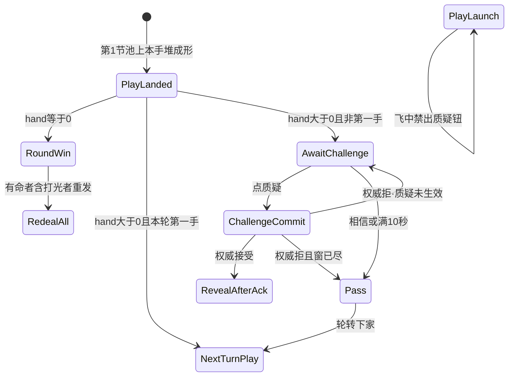

> **SUPERSEDED（胜负 / 打光 / 命数 · 2026-09-14）**  
> 规则真源已迁至 **[对局-状态机](./对局-状态机.md) v2.0.1**（废左轮 · 3烛 · PenaltyExtinguish1）。旧 [左轮对局-状态机](./左轮对局-状态机.md) 亦已 SUPERSEDED。  
> **废** 本文扣命 / RoundWin→RedealAll / 3 命主胜负旧句（#160/#163）。  
>
> **入口文案重锁（仍锁）**：前台二键 = **质疑** \| **相信**（锁 `lb_str_challenge_doubt` / `lb_str_challenge_believe`；btn=`lb_btn_challenge_doubt`/`_believe`；art=`art_btn_challenge_doubt`/`_believe`；SFX 仍 enter/commit，commit 仅质疑）。  
> **旧「真·假同层二键」作入口主读 → SUPERSEDED。** 真/假 **仅**揭牌裁定结果（谁熄烛），不作入口按钮。  
> **F2 全员可见（指针）**：点质疑后 NPC 气泡 / 荷官进窗 / 揭牌舞台 / 真假·谁熄烛 — **桌上全员可读**；禁仅行动座私闪。真源钉在 [对局-状态机 §1.2](./对局-状态机.md)；几何认 [17](../04-设计/17-局内质疑入口规格.md) / [18](../04-设计/18-局内开牌区规格.md)（**不**发明 vp）。失败短句：**质疑无表现** / **揭牌仅自己见**。  
> 下文历史拍（ack 再翻 / 10s / enter·commit SFX）仍可参考；**入口标签与荷官句以 §0.5 + 对局 §1.1 为准**。合入 ≠ 终验 · 会签前零 ets（本票可改 `string.json`）。

# 质疑入口 · 状态机（第2节入口锁 · AwaitChallenge → ChallengeCommit / Trust）

| 项 | 内容 |
|----|------|
| 文档版本 | **v0.2.6**（入口 id=doubt\|believe 锁；胜负 **SUPERSEDED** → 对局 **v2.0.1**；F2 全员可见指针） |
| 状态 | **PM reject 锁：doubt\|believe id** · **F2 全员可见指针** · 会签草案 · **合入 ≠ 终验** · 会签前零 ets（除 string.json） |
| 主笔 | 策划（`feat/design-*`） |
| 范围 | PlayLanded 之后的 **质疑入口**：进不进 AwaitChallenge、**质疑\|相信**二键、相信=Trust/Pass、超时、权威 ack 后再翻。不写四拍深潜、押注窗、坟场几何、第4节名次细表 |
| 读者 | @LiarBar负责人 · @LiarBar UI · @LiarBar测试 · @LiarBar鸿蒙开发 · @LiarBar美术 |
| 对照 | [对局-状态机](./对局-状态机.md)（**规则真源** · §1.1 入口 + §1.2 F2 全员可见） · [出牌扣牌-状态机](./出牌扣牌-状态机.md)（历史飞出） · [GDD §6.2](./GDD.md) · [05 T20](../05-技术/02-回合状态机草图.md) · [17](../04-设计/17-局内质疑入口规格.md) / [18](../04-设计/18-局内开牌区规格.md) |
| 本 PR | **docs + `entry/.../string.json`**。零 `ets` / `rawfile` / `media`。 |
| 制作人摘要 | 2026-09-14 PM reject：入口 id=**doubt\|believe**；RESTORE true/false |

## 0.5 入口文案重锁（PM 2026-09-14 · 盖正文旧「真·假」）

上一手 PlayLanded 且非第一手 → 必须过本门：

```
[ 质疑 ]   [ 相信 ]
```

| 键 | 语义 | 结果 | lb_str_* |
|----|------|------|----------|
| **质疑** | ChallengeCommit：揭上家本手 | ack 接受 → Reveal | `lb_str_challenge_doubt` = 质疑 |
| **相信** | Trust / Pass：不揭，续对 | → 下家可继续出牌 | `lb_str_challenge_believe` = 相信 |

**写死：**

1. **废** 旧「真·假同层二键」作入口主读（正文 §1 / §3 中「真/假」字样凡作入口按钮者，一律以本表为准）。  
2. **真 / 假** 只出现在揭牌裁定（谁开枪），与入口二键 **不是**同一层。  
3. 点质疑 = 旧 Q04 的 ChallengeCommit（不再分 TAP_TRUE / TAP_FALSE 两个入口语义；入口只有「质疑」一键提交揭牌）。  
4. 点相信 = 旧 Pass / Trust（不揭、续对）；**禁止**相信后仍不可出。  
5. 荷官进窗：`lb_str_challenge_dealer_enter` = **上家这手——质疑，还是相信？**（废「真，还是假？」）。  
6. **写死**控件 id：`lb_btn_challenge_doubt` / `lb_btn_challenge_believe`；art=`art_btn_challenge_doubt`/`_on` · `art_btn_challenge_believe`/`_on`；SFX 仍 `lb_sfx_challenge_enter`/`lb_sfx_challenge_commit`（commit 仅质疑）。旧 true/false/pass **不得**当入口。`lb_str_challenge_true`/`false` **保留**（reveal only；DEPRECATED entry）。

失败短句（入口层，可与左轮 S18-13～15 并抄）：

| 短句 | 不过 |
|------|------|
| **入口仍真假主读** | 前台仍以真/假为按钮；或荷官句仍问真假作抉择 |
| **相信后仍不可出** | 点相信后续对座仍无法出牌 |
| **质疑未揭牌** | 点质疑且权威已接受却不进揭牌 |


### 0.5.1 F2 全员可见（指针 · 真源在对局 §1.2）

点 **质疑** 后下列必须对 **桌上全员** 可读（非仅行动座本地闪）：

| 表现 | 全员可见 | 失败短句 | lb_str_* |
|------|----------|----------|----------|
| NPC 气泡 / 荷官进窗句 | 是 | **质疑无表现** | `lb_str_challenge_no_broadcast` |
| `lb_cmp_reveal_stage` 抽→翻 | 是 | **揭牌仅自己见** | `lb_str_reveal_self_only` |
| 真/假裁定 + 谁熄烛 | 是 | **揭牌仅自己见** | `lb_str_reveal_self_only` |

几何 / 全员层认 **17 / 18**（见 UI；**本文件不发明 vp**）。非第一手仍须先 **质疑\|相信**（不变）。细则与 U 表交叉见 [对局-状态机 §1.2](./对局-状态机.md)。

---
## 0. 边界

| 写 | 不写 |
|----|------|
| AwaitChallenge 进 / 不进；ChallengeCommit / Pass | 四拍演出轴、`lb_scr_challenge` 深潜、押注窗、砸杯 |
| 质疑·相信同层二键；「过」无声 | 多步问卷、旧四拍 / 弱 CTA 双轨 |
| 开牌 **ack 后再翻**；拒则「质疑未生效」 | 本地先开牌、乐观揭面 |
| 超时 **10s**（窗 8～12s）；倒计时环可选 | 发明 17 的 vp；改 `challenge_only_seconds=8` 键名 |
| SFX：`lb_sfx_challenge_enter` / `lb_sfx_challenge_commit` | 交 wav；用 flip / launch / land 冒充质疑；强制 pass 槽 |
| S17 / C2 失败短句（测试可抄） | 整份 C2 勾选纸（`feat/test-*` 另开） |
| 圆桌已锁规则的入口落点 | 重写 GDD 裁定公式、重开轮胜重发 L7 / 整局 RankSettle 细分配分 |

**仍锁（本线不得重开）：**

1. **3 命**（`lives_default=3`）。  
2. **`MAX_PLAY=3`**（`max_play_cards=3`）。  
3. **贴底硬修本轮搁置** — 不改 `padB` / `HAND_RING_GAP=24%` / flush / tip。  
4. **轮胜重发 L7（出牌扣牌 v0.4.0）** — `hand==0` → RoundWin→RedealAll，**禁** AwaitChallenge。整局 RankSettle 只认「仅剩 1 人有命」。细分配分 **第4节详**。  
5. **合入 ≠ 终验。** 会签前零 ets。合入本 PR ≠ 质疑终验 ≠ 出牌飞出终验。

---

## 1. 制作人锁（逐条写死 · 2026-09-13）

### 1.1 第2节入口六条

| # | 锁 | 可执行含义 |
|---|----|------------|
| C1 | **开牌 ack 后再翻**；**禁本地先开牌** | 点**质疑** = `ChallengeCommit` + 发权威提交。**必须**等权威 ack **接受** 才揭上家本手。本地抢翻、先亮面再等 ack = **质疑未生效 / 本地先开牌** |
| C2 | **质疑·相信同层二键**；**「过」无声**，不强制 pass SFX slot | 入口层同时摆 **质疑**、**相信** 两键（二选同一层）。点**质疑**=ChallengeCommit；点**相信**=Trust/Pass。禁止先点弱 CTA 再进真假问卷。超时默认可并入相信。**不**强制 pass SFX / 第三问卷步 |
| C3 | 超时 = **10s**（窗 **8～12s**）；倒计时环可选 | AwaitChallenge 推荐 **10s**，实现可落在 **8～12s**。到点 **一律 Pass**（不自动质疑、不扣命）。UI **可以**画倒计时环；**线框数字见 17/18（#148）** |
| C4 | SFX：`lb_sfx_challenge_enter`（进 AwaitChallenge）+ `lb_sfx_challenge_commit`（点质疑 / 真假确认） | 入窗只认 enter。点质疑只认 commit。**禁止**把 `lb_sfx_card_flip` / `lb_sfx_play_launch` / `lb_sfx_play_land` 当质疑声。过 **不**强制槽 |
| C5 | 失败短句锁：**质疑未生效** | 权威拒、本地先开牌、提交被打回：桌上 **只准**「质疑未生效」（`lb_str_challenge_reject`）。不另造平行句 |
| C6 | 旧四拍 / 弱 CTA **双轨禁并存** | 入口只认质疑·相信同层二键。旧 `lb_btn_challenge` 单钮弱 CTA、旧四拍全屏或旧真假入口当作 **第二条质疑路径** = **质疑双轨并存**。四拍若仍作裁定 **表现**，不得再当入口 |

### 1.2 圆桌已锁（入口落点 · 不重开胜负）

下列圆桌句 **已经锁在别处**（GDD / 出牌扣牌-状态机）。本线只写它们怎么卡入口，**不**重开第4节。

| 圆桌句 | 入口落点 |
|--------|----------|
| 只质疑 **上家本手** | `targetPlay == lastPlay`（上家 **当前这一手** = **池上该手叠**）。指别人、指历史手、指空身前、指坟场 = **质疑非上家本手** |
| 质疑 / 相信 **二选** | 同层两键（揭或不揭），不是真假问卷 |
| **第一手不能质疑**（G-Q6） | 本轮第一手 PlayLanded 后 **不进** AwaitChallenge。下家只出牌。第一手还能点质疑 = **第一手仍可质疑** |
| **hand==0（打光）者不被质疑、也不质疑** | PlayLanded 后 `hand==0` → **RoundWin→RedealAll**，**禁** AwaitChallenge。打光者钮可点、或下游仍开他这手 = **打光者仍被质疑 / 仍能点质疑** |
| PlayLanded ∧ hand>0 ∧ **非第一手** → AwaitChallenge | 三条件同时才进。缺一则不进 |
| PlayLanded ∧ hand==0 → RoundWin→RedealAll | 认出牌扣牌 v0.4.0。本线不改轮胜/整局公式 |
| 质疑中途命尽 | 被质疑方/质疑方因裁定 `lives==0` → **淘汰**（不发/不质疑/不出牌）；**不**走「打光→旧 RankSettle-from-empty」。打光只发生在 PlayLanded∧hand==0 |

**禁止**用本文件重写「轮胜重发 / 仅剩 1 人有命整局胜 / 细分配分」。那些仍在 [出牌扣牌-状态机 §1.2 / §6](./出牌扣牌-状态机.md) v0.4.0。

---

## 2. 状态机

逻辑阶段仍报 GDD `TURN` / `CHALLENGE_RITUAL` / `JUDGE`。下表是 **桌上 UI 拍**，**不**加成 05 引擎 `phase`。

### 2.1 主链（写死）

上游（第1节，不重开）：

```
ConfirmReady → PlayLaunch → PlayLanded
              ├─ hand == 0                 → RoundWin → RedealAll（禁 AwaitChallenge）
              ├─ hand > 0 ∧ 本轮第一手     → 下家 TURN（不进 AwaitChallenge）
              └─ hand > 0 ∧ 非第一手       → AwaitChallenge
```

本文件从 AwaitChallenge 写起：

```
AwaitChallenge
        ├─ 点 质疑        → ChallengeCommit  → 权威 ack 接受 → 才翻上家本手
        │                                    → 权威拒        → 「质疑未生效」（不翻）
        ├─ 点 相信        → Pass / Trust     → 下家 TURN（可继续出）
        └─ 满 10s         → Pass / Trust     → 下家 TURN
```



| UI 拍 | GDD 阶段 | 画面 | 玩家能做什么 | 禁止 |
|-------|----------|------|--------------|------|
| **PlayLaunch** | `PLAY_REVEAL_SELF` | 飞窗未满 | **无**质疑钮 | **飞中出质疑钮** |
| **PlayLanded** | 本手堆刚成形 | **池上该手牌背堆** | 立刻按 hand / 是否第一手分流 | 堆未成形就进 AwaitChallenge；身前空区当靶 |
| **AwaitChallenge** | `TURN`（下家） | **池上该手堆保持**；**质疑·相信同层二键**；倒计时环可选 | 点质疑（ChallengeCommit）；或相信（Trust/Pass）；或超时并入相信 | 第一手进来；hand==0 进来；旧四拍/弱 CTA 并行；问卷式多步；**把质疑当成相信/过** |
| **ChallengeCommit** | 提交中 | 二键收起或 busy；**牌仍背、仍在池上** | 等 ack。不可再改选、不可本地翻 | **本地先开牌** |
| **Pass** | `TURN` 轮转 | 入口收起 | 无操作。无强制 SFX | 把过做成大声第三键问卷 |
| **RevealAfterAck** | `JUDGE` 起 | **ack 接受之后** 才进 `lb_cmp_reveal_stage`：整手一拍抽出再翻（数字认 18） | 只验本手。hit/miss = 第3节 | ack 前翻；翻别人的手；blur 打在牌面；**开牌无位** / **开牌挡脸/烛** / **开牌看不清** |

**写死：** `AwaitChallenge` / `ChallengeCommit` / `Pass` 是 UI 拍名。05 仍用 `TURN` + 权威提交，**不**加成 `phase` 枚举。

### 2.2 转移表（可执行）

| # | 从 | 事件 | 条件 | 到 | 副作用 |
|---|----|------|------|----|--------|
| Q00 | PlayLaunch | 任何质疑点按 | 飞窗未满（`confirmBusy` / Launch busy） | **PlayLaunch**（忽略） | **不出**质疑/相信钮。出现可点 = **飞中出质疑钮** |
| Q01 | PlayLanded | `PILE_FORMED` | 权威已接受 **且** `hand.count == 0` | **RoundWin** → **RedealAll** | 认出牌扣牌 v0.4.0 轮胜重发。**禁止**进 AwaitChallenge。**禁止**旧 RankSettle-from-empty |
| Q02 | PlayLanded | `PILE_FORMED` | 权威已接受 **且** `hand.count > 0` **且** 本轮第一手 | 下家 `TURN`（出牌） | **不进** AwaitChallenge。不播 enter |
| Q03 | PlayLanded | `PILE_FORMED` | 权威已接受 **且** `hand.count > 0` **且** 非第一手 **且** `lastPlay.actor` 本手未打光（未进 RoundWin） | **AwaitChallenge** | 播 `lb_sfx_challenge_enter`（非静默）。开 **10s** 窗。出质疑·相信同层二键 |
| Q04 | AwaitChallenge | `TAP_CHALLENGE`（质疑）` | `canChallenge`；靶 = 上家本手；未 busy | **ChallengeCommit** | 立刻播 `lb_sfx_challenge_commit`（非静默）。发权威提交。**牌仍背** |
| Q05 | AwaitChallenge | `PASS` 或 `TIMEOUT` | 窗内沉默过，或满 **10s**（容差 8～12） | **Pass** | **无声**（不强制 pass 槽）。不质疑、不扣命、不翻牌。轮转下家 |
| Q06 | ChallengeCommit | `AUTHORITY_ACCEPT` | 靶仍是上家本手 | **RevealAfterAck** | **现在才**揭面。禁本地已揭 |
| Q07 | ChallengeCommit | `AUTHORITY_REJECT` | 非法靶 / 第一手 / 打光者 / 命尽者 / 竞态 | AwaitChallenge（窗未尽）或 Pass（窗尽） | **必须**出「质疑未生效」。已揭的牌 **盖回**。不进裁定 |

`canChallenge`（写死，与第1节同一条，本线加「非第一手才进窗」）：

```
canChallenge = current.ALIVE                      // lives>0；命尽淘汰者不质疑
               AND lastPlay != null
               AND 本轮已有上家本手（非第一手）
               AND lastPlay.actor 本手未打光（未进 RoundWin）
               AND current 自己未打光且 lives>0（hand==0 / 命尽者不质疑）
               AND targetPlay == lastPlay          // 只质疑上家本手
```

### 2.3 与 05 / 权威的关系

| 层 | 口径 |
|----|------|
| UI | 点质疑 = Q04，**立刻** ChallengeCommit，**不**本地翻 |
| 权威 | 接受才允许揭面。拒 → Q07 +「质疑未生效」 |
| 等 ack 才显示二键 | **禁**（窗在 PlayLanded 分流后就开） |
| 等 ack 才播 enter | **禁**（进窗即 enter；静默局除外） |
| 未 ack 先翻 | **禁**（= **质疑未生效 / 本地先开牌**） |
| 飞中开窗 | **禁**（Launch busy 无质疑钮） |

弱网：commit 后牌必须保持牌背直到 ack。ack 拒绝则盖回并出短句。ack 一直不来：人机 MVP 不得卡死在 ChallengeCommit / AwaitChallenge（见 S17-8）。

---

## 3. 质疑·相信同层二键（旧真·假入口 SUPERSEDED）· 过

### 3.1 同层二选（写死）

入口 **只** 这一层（**盖**旧真/假）：

```
[ 质疑 ]   [ 相信 ]
```

| 键 | 语义 | 结果 |
|----|------|------|
| **质疑** | ChallengeCommit；揭上家本手 | commit SFX；等 ack 再翻 |
| **相信** | Trust/Pass；不揭续对 | 下家可继续出牌 |
| （超时） | 默认可并入相信 | 不强制第三键 |

**禁止**的入口形态：

1. 先点弱 CTA → 再出现真/假或质疑问卷（两步或更多）= **入口非二选 / 像多步问卷**  
2. 质疑 / 相信分两屏、两层、两拍才选完  
3. 旧四拍全屏或旧真假入口与质疑·相信二键 **同时可走** = **质疑双轨并存**  
4. 底栏弱 CTA + 桌上二键双轨 = **质疑双轨并存**

旧 `lb_btn_challenge` / 旧真假键 **不得**与质疑·相信二键并存为第二条路径。17 若保留旧 id，只能做别名或删除，不能双轨。

建议操作点（17 确认；本线不锁 vp）：

| 建议 id | 含义 |
|---------|------|
| `lb_btn_challenge_doubt` | 质疑（**锁**） |
| `lb_btn_challenge_believe` | 相信（**锁**） |
| `lb_btn_challenge_true` / `_false` | **废弃入口主读**（勿当按钮标签） |

裁定公式仍认 [GDD §6.2](./GDD.md)（存在非宣称且非 Joker → 质疑成功）。本线不改扣谁命。

### 3.2 「过」无声

| 项 | 锁 |
|----|----|
| 怎么过 | 满 **10s**，或玩家沉默过（17 若画「过」也合法） |
| SFX | **不强制** pass 槽。禁止把 enter / commit / flip / launch / land 拿来当「过」的完成声 |
| 规则 | 过 = 不质疑、不翻、不扣命、轮转下家 |
| 文案 | 不强制出「过」字幕；静默局更不应靠音效提示过 |

把相信/过做成必须先点再确认的第三问卷步 = **入口非二选 / 像多步问卷**。

### 3.3 超时 10s · 环可选

| 项 | 锁 |
|----|----|
| 推荐 | **10s** |
| 容差窗 | **8～12s**（实现落在此窗内即认 10s 锁） |
| 到点 | **Pass**（Q05）。不自动点假、不自动质疑 |
| 倒计时环 | **可选**。UI 可画环。**线框数字见 17/18（#148）** |
| 与 `challenge_only_seconds=8` | **不是同一窗**。8s 是 GDD §10.1 旧「无牌仅质疑」键，打光者不用。本入口窗是 **10s**。本 PR **不改** 数值表键 |

卡在 AwaitChallenge 超过窗还不 Pass、二键点了没反应、ack 丢了不回滚 = **卡死 AwaitChallenge**。

---

## 4. 开牌：ack 后再翻

### 4.1 时序（写死，盖表现）

```
t0     PlayLanded 且 hand>0 且非第一手
       → AwaitChallenge + lb_sfx_challenge_enter
       → 质疑·相信同层二键（飞中不得提前出现）

t0+N   点质疑
       → ChallengeCommit + lb_sfx_challenge_commit
       → 发权威提交
       → 牌仍背（禁本地先开牌）

t_ack  权威接受 → 现在才进 `lb_cmp_reveal_stage`：`lb_sfx_reveal_draw`→160ms→`lb_sfx_reveal_flip`（RevealAfterAck）
       权威拒绝 → 「质疑未生效」；盖回；不进裁定
```

**禁止**客户端在 t_ack 之前：

- 把池上该手堆 / `lb_cmp_reveal_stage` 在 ack 前揭面  
- 播翻牌揭面动效冒充已开  
- 进 `lb_challenge_reveal` / 任何揭面层  

### 4.2 回滚短句（写死）

| key | 中文 | 何时 |
|-----|------|------|
| `lb_str_challenge_reject` | **质疑未生效** | 权威拒；或发现本地已先开牌必须打回 |

禁止拆成两个 key、禁止平行句（如「质疑失败请重试」顶替本句）。静默局字幕仍出。

与第1节 `lb_str_play_rollback`（「出牌未生效 / 张数已纠正」）**不是**同一句。出牌回滚仍认第1节。

---

## 5. SFX 与美术槽

| 槽 | 何时 | onset | 本票交件 | 静默局 |
|----|------|-------|----------|--------|
| **`lb_sfx_challenge_enter`** | 进入 AwaitChallenge | 贴入窗 / 二键出现 | 否 | **关** |
| **`lb_sfx_challenge_commit`** | 点质疑（ChallengeCommit） | 贴按下 | 否 | **关** |
| pass | 「过」 | — | **不强制槽** | 本来就无声 |
| **`lb_sfx_reveal_draw`** | ack 后抽离（整手一拍） | 贴抽出 | 否（真源 #150） | 关 |
| **`lb_sfx_reveal_flip`** | stage 翻开 | 抽后 **160ms** 翻面起势 | 否（真源 #150） | 关 |

**禁止**用下列槽冒充质疑入口声：

- `lb_sfx_card_flip`（只属手牌翻面 S15）  
- `lb_sfx_play_launch` / `lb_sfx_play_land`（只属第1节飞出）  

非静默局进窗无 enter、或只有无声弹层 = **入口无声 / 像静默弹窗（非静默局；enter SFX）**。  
静默局：画面在、enter/commit **关** = 过。

本票不交 wav。美术 / 音频后续按槽名交件，不改调用点。

---

## 6. 进 / 不进 AwaitChallenge（质量闸）

同时满足才进（Q03）：

1. 本手已 **PlayLanded**（池叠成形）。  
2. 权威 **已接受** 出牌。  
3. 出牌者提交后 **`hand.count > 0`**。  
4. **非**本轮第一手。  
5. 出牌者 **未**因本手打光进 RoundWin。  
6. 桌上可见池上该手牌背堆（靶 = 上家本手）。

任一失败则 **不进**，并对照短句：

| 缺哪条 | 若仍出可点质疑/相信 | 短句 |
|--------|-----------------|------|
| 飞窗未满 | 飞中出现钮 | **飞中出质疑钮** |
| `hand==0` | 打光仍进窗 / 仍能点 | **打光者仍被质疑 / 仍能点质疑** |
| 本轮第一手 | 第一手能点质疑 | **第一手仍可质疑** |
| 靶不是上家本手 | 能开别人 / 历史手 | **质疑非上家本手** |
| 旧四拍或弱 CTA 并行 | 两条路径都能走 | **质疑双轨并存** |

下家自己已打光（`hand==0`）或已命尽（`lives==0`）：**不能**再点质疑（圆桌：打光者本手不进窗；命尽淘汰者不质疑）。质疑中途因裁定命尽 = 淘汰离场，**不是**旧「打光→RankSettle-from-empty」。

---

## 7. 失败短句（S17 / C2 可抄 · 写死）

合入 ≠ 终验。测试 C2 勾选纸未开时，**先抄本表**。与第1节 S16-* **分号**，不抢 16 / C1 编号。

| ID | 短句（写死） | 不过 |
|----|----------------|------|
| **S17-1** | **第一手仍可质疑** | 本轮第一手 PlayLanded 后仍进 AwaitChallenge 且质疑/相信 `_enabled`；或第一手被揭验 |
| **S17-2** | **打光者仍被质疑 / 仍能点质疑** | `hand==0` 仍进 AwaitChallenge；下游仍能开打光者这手；打光者自己还能点质疑 |
| **S17-3** | **质疑非上家本手** | 靶不是 `lastPlay`；开历史手、别座、坟场 |
| **S17-4** | **入口非二选 / 像多步问卷** | 先弱 CTA 再问卷；质疑/相信不同层；或仍以真假作入口主读 |
| **S17-5** | **飞中出质疑钮** | PlayLaunch / 飞窗未满出现可点质疑/相信或旧质疑钮 |
| **S17-6** | **质疑双轨并存** | 旧四拍/旧真假入口与质疑·相信二键同时可走；或弱 CTA + 新二键并行 |
| **S17-7** | **质疑未生效 / 本地先开牌** | 权威拒后不出「质疑未生效」；或 ack 前已揭面 |
| **S17-8** | **卡死 AwaitChallenge** | 满 10s（8～12）不 Pass；commit 后无 ack 也不回滚；二键无响应至无法出牌 |
| **S17-9** | **入口无声 / 像静默弹窗（非静默局；enter SFX）** | 非静默进 AwaitChallenge 未真播 `lb_sfx_challenge_enter`；或用 flip/launch/land 冒充 |
| **S17-10** | **开牌无位** | ack 后无 `lb_cmp_reveal_stage` 几何 |
| **S17-11** | **开牌挡脸/烛** | stage 挡 L/R/对家头像·烛·手牌主行 |
| **S17-12** | **开牌看不清** | <0.85× 或模糊打在牌面点数 |

权威拒的提示与 S17-7 前半 **同一句**（`lb_str_challenge_reject` = **质疑未生效**）。

---

## 8. 鸿蒙旧路径删除清单（文档级）

本票 **不改 ets**。会签后 `feat/client-*` 必须删。旧+新禁并存。出牌飞出客户端（#140）**不**顺带做本入口。

| # | 旧路径 | 禁令 | 新路径 |
|---|--------|------|--------|
| E1 | 飞窗内挂 `lb_btn_challenge` | 飞中出质疑钮 | Q00：Launch busy 无钮 |
| E2 | 第一手钮 `_enabled` | 第一手仍可质疑 | Q02：第一手不进窗 |
| E3 | 打光仍进 AwaitChallenge | 打光者仍被质疑 / 仍能点质疑 | Q01：RoundWin→RedealAll |
| E4 | 点质疑立刻本地揭面 | 本地先开牌 | Q04→Q06：ack 后再翻 |
| E5 | 旧四拍全屏 + 旧真假 / 新二键同时可进 | 质疑双轨并存 | 只留质疑·相信同层二键 |
| E6 | 弱 CTA → 再问真假或分步 | 入口非二选 / 像多步问卷 | 质疑·相信同层一次提交 |
| E7 | 用 flip / launch / land 当入窗声 | 入口无声或冒充 | enter + commit |
| E8 | 无超时 / 超时不 Pass | 卡死 AwaitChallenge | **10s** → Pass |
| E9 | 质疑上家以外的手 | 质疑非上家本手 | `targetPlay == lastPlay` |

**会签前零 ets for challenge UI。**

---

## 9. 交叉引用

| 岗 | 文件 | 本线怎么用 |
|----|------|------------|
| 策划 · 上游 | [出牌扣牌-状态机](./出牌扣牌-状态机.md) | PlayLaunch / PlayLanded / RankSettle / L7。本文只接入口。**双向交叉** |
| 规则 | [GDD §6.2](./GDD.md) | 裁定公式不改。GDD 只留索引钉 |
| UI | [17](../04-设计/17-局内质疑入口规格.md) / [18](../04-设计/18-局内开牌区规格.md) **#148** | 数字认 17/18（池心下56vp / 0.90× / 160ms）。本 PR 不发明冲突 vp |
| UI | [16](../04-设计/16-局内出牌飞出与身前扣牌规格.md) | 飞窗 / 扇形仍认 16。**不改 16 正文** |
| 美术 | enter / commit；reveal_draw / reveal_flip（#150） | 本票不交 wav。过不强制槽 |
| 测试 | C2 / S17-1～9 | 短句抄 §7。C2 勾选纸另开 |
| 鸿蒙 | [05 T20](../05-技术/02-回合状态机草图.md) | 权威提交；UI 拍不加新 phase |

---

## 10. 不做

- 不改 3 命、`MAX_PLAY`、出牌权、贴底硬修、`padB`、`HAND_RING_GAP`。  
- 不改 16 正文数字。  
- 不重开轮胜重发 L7（出牌扣牌 v0.4.0）/ 第4节细分配分 / 整局 RankSettle 公式。  
- 不写四拍深潜、押注窗、坟场几何。  
- 不发明 17 的 vp。  
- 不进 `ets` / `rawfile` / `media`。  
- 不把 UI 拍写成新引擎 `phase`。  
- 不强制 pass SFX 槽。  
- 不保留旧四拍 / 弱 CTA / 旧真假入口与质疑·相信二键双轨。

---

## 11. 会签

- [ ] @LiarBar负责人 第2节入口六条 + 圆桌落点（第一手 / 打光 / 只开上家本手 / 10s / ack 再翻）  
- [ ] @LiarBar UI 线框数字见 17（待开）；本 PR 不发明 vp；不改 16  
- [ ] @LiarBar测试 S17-1～9 可抄；C2 另开；不抢 C1 / S16  
- [ ] @LiarBar鸿蒙开发 §2 转移 + §8 E1–E9；**会签前零 ets**（#140 出牌飞出另票）  
- [ ] @LiarBar美术 enter / commit 槽名；禁 flip/launch/land 冒充；过不强制槽  

**未会签禁止落质疑入口 ets。** 合入本 PR ≠ 质疑终验 ≠ 出牌飞出终验。

---

## 11b. Rebuild 表现补钉（2026-09-14 · 荷官句 / NPC / 短句）

时机 **不改**：仍 = 上家本手 PlayLanded 后进 AwaitChallenge（**非**四人出完才质疑）。**质疑**→ChallengeCommit→ack→`lb_cmp_reveal_stage`；**相信**→不揭续对。**质疑 ≠ 相信**。真/假只在裁定。

### 11b.1 荷官进质疑句（写死）

| key | 默认中文 | 何时 |
|-----|----------|------|
| `lb_str_challenge_dealer_enter` | **上家这手——质疑，还是相信？** | 进 AwaitChallenge / TrustOrChallenge 同起（可与 enter SFX 同窗） |
| `lb_str_challenge_doubt` | **质疑** | 入口键 |
| `lb_str_challenge_believe` | **相信** | 入口键 |

**禁止**提示仍占左上死角（= **提示藏死角**）。宣称 / 轮到你 / 进质疑句可读区认 17 v0.2.1（#155）。

### 11b.2 当前行动者 · 质疑/相信键

- 真人：键挂 **当前行动者身前**（环–手带，对齐 17）；造型可辨（锁 `art_btn_challenge_doubt` / `_believe`；旧 true/false 美术可暂映射但文案必须质疑/相信）。
- **禁止**只贴 BottomEnd / 边角导致看不见（= **质疑入口看不见**）。
- **禁止**入口仍真假主读。

### 11b.3 NPC 抉择反馈（写死 · 入口层）

| key | 中文 | 何时 |
|-----|------|------|
| `lb_str_npc_challenge_thinking` | **选择质疑/相信…** | NPC 座旁气泡起势（思考） |
| `lb_str_npc_challenge_doubt` | **选了质疑** | NPC 落定质疑（新键） |
| `lb_str_npc_challenge_believe` | **选了相信** | NPC 落定相信（新键） |
| `lb_str_npc_challenge_true` / `_false` | （旧「选了真/假」） | **废弃入口主读** |

控件交叉：`lb_cmp_npc_challenge_bubble`（17）。无气泡 / 瞬切无反馈 = **NPC 抉择无反馈**。

### 11b.4 池叠保持

轮转后 **本轮上家该手** 池叠主读必须仍在。消失或数不清 = **池上张数不可读 / 轮转池变空**（交叉出牌扣牌-状态机 / C1-13′）。

### 11b.5 失败短句补钉（写死 · 可与 S17 并抄）

| ID | 短句 | 不过 |
|----|------|------|
| **S17-13** | **池上张数不可读 / 轮转池变空** | 轮转后本手叠消失或不可数 |
| **S17-14** | **质疑入口看不见** | AwaitChallenge 无质疑/相信键，或键在死角/边角不可点 |
| **S17-15** | **提示藏死角** | 荷官进质疑句 / 宣称 / 轮到你仍压左上不可读 |
| **S17-16** | **NPC 抉择无反馈** | NPC 无座旁「选择质疑/相信…」→「选了质疑/相信」 |
| **S17-17** | **入口仍真假主读** | AwaitChallenge 前台仍真/假按钮或荷官仍问真假作入口 |
| **S17-18** | **相信后仍不可出** | 点相信后续对仍不可出牌 |
| **S17-19** | **质疑未揭牌** | 点质疑且权威接受后不进揭牌 |
| **S17-20** | **质疑无表现** | 点质疑后无 NPC 气泡 / 无荷官进窗 / 无全员可读进门反馈（对表对局 S18-22 `lb_str_challenge_no_broadcast`） |
| **S17-21** | **揭牌仅自己见** | Reveal / 真假·谁熄烛仅行动座本地闪（对表对局 S18-23 `lb_str_reveal_self_only`；交叉 18 全员层） |

仍认 S17-10～12（开牌无位 / 挡脸·烛 / 看不清）。

---

## 12. 版本记录

| 版本 | 日期 | 说明 |
|------|------|------|
| v0.1.0 | 2026-09-13 | 第2节入口锁初稿。线框数字见 17（待开） |
| v0.2.0 | 2026-09-14 | 靶改池 + RevealAfterAck→18（压缩稿） |
| **v0.2.1** | 2026-09-14 | **保** Q00–Q07 / mermaid / S17；靶=**池上该手**；RevealAfterAck→`lb_cmp_reveal_stage` + reveal_draw/flip（#150）；短句加开牌无位/挡脸·烛/看不清；数字认 #148 |
| v0.2.2 | 2026-09-14 | Rebuild 表现补钉：荷官进质疑句 `lb_str_challenge_dealer_enter`；NPC 气泡三句；真假键身前可见；S17-13～16（轮转池变空 / 入口看不见 / 提示藏死角 / NPC 抉择无反馈）。交叉 #155/#156/#157 |
| **v0.2.3** | 2026-09-14 | 跟随出牌扣牌 **v0.4.0 轮胜重发**：Q01 hand==0 → RoundWin→RedealAll（仍禁 AwaitChallenge）；澄清质疑中途命尽走淘汰、**不**走旧 RankSettle-from-empty；`canChallenge` 加 lives>0。**不改**真假二键 / 10s / ack 再翻 |
| v0.2.4 | 2026-09-14 | 入口废真假主读 → 质疑\|相信；草稿文案键 commit/trust；对齐左轮 v1.1.2 |
| **v0.2.5** | 2026-09-14 | PM reject：入口 id 锁 doubt\|believe（btn/str/art）；RESTORE true/false；废 commit/trust 文案键（免撞 SFX commit）；对齐左轮 v1.1.3 |
| **v0.2.6** | 2026-09-14 | **F2 全员可见指针**：顶栏真源改指对局 v2.0.1 §1.2；§0.5.1 + S17-20/21（质疑无表现 / 揭牌仅自己见）；交叉 17/18 全员层；非第一手质疑\|相信不变 |

### 审核记录

| 日期 | 意见 | 提议修改 | 提出人 | 状态 |
|------|------|----------|--------|------|
| 2026-09-13 | 制作人第2节「质疑阶段」入口锁 | 新建 v0.1.0 | 策划 / 制作人摘要 | **待会签** |
| 2026-09-14 | 跟随轮胜重发；hand==0 仍禁进窗 | 升 v0.2.3 | 策划 | **待会签** |
| 2026-09-14 | **SUPERSEDED** → 左轮对局-状态机 v1.1.0；废扣命/RoundWin | 顶栏横幅 | 制作人 / Aron | **待会签** |
| 2026-09-14 | **入口废真假主读** → 质疑\|相信 | 升 v0.2.4；对齐左轮 v1.1.2 | 制作人 / Aron | **待会签** |
| 2026-09-14 | **PM reject：锁 doubt\|believe id**；RESTORE true/false；废 commit/trust 文案键 | 升 **v0.2.5**；对齐左轮 **v1.1.3** | 制作人 / Aron | **待会签** |
| 2026-09-14 | **F2 质疑/揭牌全员可见**；禁仅行动座私闪 | 升 **v0.2.6**；指针对局 **v2.0.1** §1.2；S17-20/21 | 制作人 / Aron | **待会签** |


---

*维护人：策划文档岗 · 2026-09-14 · docs + string.json · v0.2.6 · 入口=质疑\|相信 · F2 全员可见指针 · 胜负 SUPERSEDED by 对局 v2.0.1 · 合入 ≠ 终验*
