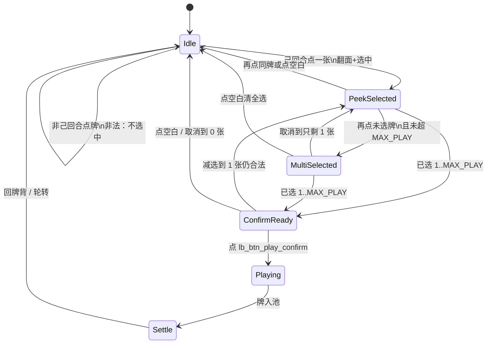

# 15 · 局内手牌触摸出牌规格（线 B）

| 项 | 内容 |
|----|------|
| 版本 | v0.1.3 |
| 状态 | **方案会签草案** · 听感同步交叉 14b · #131 翻牌 Touch Down 合法提前起声 · 未会签禁止落 ets |
| 范围 | `lb_scr_table` 上手牌 **点按翻面 → 多选 → 确认出牌** 的 UI 状态表、动效意图、确认条、触摸目标、SFX **槽位 id**、失败短句 |
| 读者 | UI、美术、策划、测试、鸿蒙、**@LiarBar负责人** |
| 对照 | [GDD §3.4 / §6.1](../02-游戏设计/GDD.md) · [数值 `max_play_cards`](../02-游戏设计/数值与牌堆配置.md) · [01 §6 看牌 / §7 出牌包](./01-主流程线框与交互.md) · [02 命名](./02-组件与资源命名约定.md) · [09 C1 揭面](./09-开桌加载与发牌-UI挂点.md) · [11 横屏 · R-LAND-4](./11-局内横屏与自适应布局.md) · [13 出牌 SFX](./13-局内声场与伴奏规格.md) · [#131](https://github.com/xubin0903/LiarBar/pull/131) `armCardFlipTouchDown` |
| 本 PR | **只交文档**。零 ets、零 rawfile、零新媒体文件 |

> **UI 管**：交互表、线框、控件 id、时序窗、可测失败短句。  
> **策划管**：GDD 出牌条件 / 张数 / 阶段散文（本线不改规则）。  
> **美术管**：确认条铬件与牌面动效皮；**禁止**系统灰钮当终稿。  
> 命名：控件 `lb_*`；媒体 `art_*`；音频调用 `lb_sfx_*`。**禁止** `lb_art_*`。

---

## 0. 边界（写死）

### 0.1 硬用户需求（必须保留，可延伸）

1. **点按手牌 → 翻面动画看见牌面**。  
2. **支持多选**。  
3. **合法选牌之后**，下方出现确认 **「出牌」** 按钮（铬件须后续美术规格；**禁止**系统灰钮当终稿）。

延伸允许：取消（点空白 / 再点已选牌）、超选拒绝、确认条 disabled / enabled。  
延伸 **不允许**：改 `MAX_PLAY`、扩质疑、重开 11 贴底硬修。

### 0.2 写什么 / 不写什么

| 层 | 本文做什么 | 本文不做什么 |
|----|------------|--------------|
| 规则 | 只引用：己回合选 1～`MAX_PLAY`（默认 3）张再提交 | **不改** 出牌权、张数锁、第一手不可质疑 |
| 看牌 | 点按翻面 = **出牌选牌路径** | **不废** 长按 `lb_cmp_peek_mask`（GDD §3.4 / 01 / 09 仍在） |
| 出牌包 | 重定义与 `lb_sheet_play` / `lb_btn_play` 的主次 | 不删锁名；方式/带话/点名 **不在本线重做** |
| 质疑 | 写明仍冻 | **不扩** 四拍、不把确认条做成质疑钮 |
| 贴底 | 确认条可近 **底安全区上沿**，保证可点 | **不绑** 已搁置的手牌贴底硬修；不改 `HAND_RING_GAP` / `padB` / 11 flush 闸 |
| 音频 | 只登记调用槽 | **不交** 新 wav/ogg |
| 落地 | 会签后才开 `feat/client-*` | **本 PR 零 ets** |

**硬闸三句：**

1. **零规则改动**（仍 1～`MAX_PLAY`，默认 3；3 命不变）。  
2. **质疑仍冻**。  
3. **贴底硬修本轮搁置** — 确认条近底是 **可点优先级**，不是 11 flush 硬修的一部分。

---

## 1. 主路径迁移（相对旧出牌包）

旧主路径（[01 §7](./01-主流程线框与交互.md)）：点手牌 → 打开 `lb_sheet_play` / `lb_cmp_packet` → 包内多选 → `lb_btn_play`。

**本线主路径：** 桌上直接点 `lb_cmp_card_*` → 翻面+选中 → 合法后出 `lb_cmp_play_confirm_bar` → `lb_btn_play_confirm` 提交。

| 锁名 | 本线关系 | 测试 |
|------|----------|------|
| `lb_cmp_hand` / `lb_cmp_card_{0-4}` | **主操作面** | 点单张翻面、多选、再点取消 |
| `lb_cmp_play_confirm_bar` | **新** 确认条容器 | 仅合法选中时可见或 enabled |
| `lb_btn_play_confirm` | **新** 主提交（脚手架已预列此 id） | 演示主点此钮 |
| `lb_btn_play` | **不再是唯一主路径**；顶栏/弱铬可留 | 旧用例可暂双认；新用例点 confirm |
| `lb_sheet_play` / `lb_cmp_packet` | **降为次路径**：方式芯片 / 带话 / 点名 | 本线不强制打开；X3 几何仍保留 |
| `lb_btn_challenge` | 锁名保留 | **本线不验** 质疑流 |

默认提交方式：未打开包时记 **SOFT**（GDD「逻辑上至少记录枚举」）。不在本线重做 SLAM/HESITATE 手势闸。

R-LAND-4（稳态无大双 CTA）仍有效：确认条 **只在 ConfirmReady** 出现，不是常驻「出牌+质疑」底栏。

---

## 2. UI 状态机（对齐 GDD，不改阶段枚举）

逻辑阶段仍是 GDD：`TURN` → `PLAY_REVEAL_SELF` → `TURN`（下家）。  
下表是 **桌上选牌 UI 态**，挂在 `TURN` / `PLAY_REVEAL_SELF` 上，不另造引擎阶段。



| UI 态 | GDD 阶段 | 牌面 | 确认条 | 玩家能做什么 |
|-------|----------|------|--------|--------------|
| **Idle** | `TURN`（或别人的回合） | 默认牌背 | 隐 | 己回合：点一张进入 PeekSelected。长按仍可走 peek 遮罩。非己回合：点牌不选中 |
| **PeekSelected** | `TURN` | 该张翻面并抬起 | 已选 1 张且合法 → 可进 ConfirmReady（可与本态同帧） | 再点同牌 = 取消；点空白 = 取消；再点别张 = 多选 |
| **MultiSelected** | `TURN` | 已选张翻面抬起；未选保持背 | 合法则进 ConfirmReady | 再点已选 = 取消该张；点未选 = 加选（未超帽） |
| **ConfirmReady** | `TURN` | 同上 | **出现**；钮 `_enabled` | 点 `lb_btn_play_confirm` 提交；取消路径同前 |
| **Playing** | `PLAY_REVEAL_SELF` | 已选牌飞向池（牌背对他人） | `_disabled` 或收起，防连点 | 不可改选 |
| **Settle** | 回 `TURN`（下家）或超时 AUTO_PLAY | 手牌复位牌背 | 隐 | 本手结束 |

**取消（写死）：**

- 点桌面空白（非手牌、非确认钮）→ 清选择，回 Idle。  
- 再点 **同一张已选牌** → 取消该张；若变为 0 张 → Idle。  
- 不提交。不进 `PLAY_REVEAL_SELF`。

**质疑仍冻：** 本状态机 **无** Challenge 支路。`lb_btn_challenge` 不在本线展开。第一手不可质疑的规则仍在 GDD，本线不画质疑窗。

超时仍认 GDD `timeout_auto_play`：若条已开，按已锁 AUTO_PLAY 收起并自动出 1 张；UI 可 0.3s Toast，不另弹系统确认框。

---

## 3. 翻面 vs 抬起（两条动效）

点按同时要 **看见牌面** 和 **表示选中**。本线定为 **两条动效、一条手势触发、可串行**。

| 动效 | 意图 | 建议时序 / 缓动 | 中断 |
|------|------|-----------------|------|
| **翻面 Peek flip** | 背 → 面，绕竖轴或短 3D 翻转 | **180～240ms**，ease-out | 连点同牌：允许打断，**120ms 内**翻回背 |
| **抬起 Selected-raise** | 选中上移 + 轻微放大 | **120～160ms**，ease-out；抬高建议 **8～16vp** | 取消时同步落下；可与翻回重叠 |

| 要 | 不要 |
|----|------|
| 先翻（或翻到一半）再抬；看起来是「看清再捏住」 | 只抬不翻（看不见面）或只换贴图无翻转 |
| 未选牌保持背；他人永远不见你的面 | 稳态手牌常驻明牌（09 C1 仍锁：落座是背） |
| 长按 peek（全手揭 + 遮罩）与点按翻面 **分流** | 把长按废成单击、或单击弹出旧半屏包当唯一完成 |

**连点：** 允许打断翻面。抬起未完成再点同牌 = 取消，牌落回背。不要排队播完两轮动画才响应。

长按 `lb_cmp_peek_mask`：**本线不改**。演示可继续长按看全手；出牌主路径改点按单张。两者冲突时：手指已按下超过 peek 阈值走长按；短点走翻面选牌。阈值建议沿用 01：长按起势约 **200ms**。

---

## 4. 多选与非法选

帽 = 当前回合 `MAX_PLAY` = 配置 `max_play_cards`（v0.2 默认 **3**）。下限 `min_play_cards` = **1**。不改配置键。

| 操作 | 合法 | 结果 |
|------|------|------|
| 己回合、未出局、手牌 ≥1，点未选牌 | 已选 +1 ≤ `MAX_PLAY` | 翻面+选中 |
| 再点已选 | 是 | 取消该张 |
| 已选 = `MAX_PLAY` 再点未选 | 否 · **超选** | 不选中；该张 `_fail` 轻抖 **150ms** |
| 非己回合点牌 | 否 · **非己回合** | 不翻面当选中；可仍允许长按看自己的牌 |
| 已出局 / 幽灵 | 否 | 同非己回合；不打开确认条 |
| 已选 0 张点确认 | 否 · **张数不符** | 钮应不存在或 `_disabled`；点了不提交 |
| 用脚本强交 >`MAX_PLAY` | 否 · **张数不符** | 引擎拒；UI 不进 Playing |

非法选失败短句（口播 / 测试）：**张数不符** / **非己回合** / **超选**。  
旁注可复用 `lb_str_play` 体系；不写新规则文案进 GDD。建议 key（程序用，中文在字表）：

| key | 默认中文 |
|-----|----------|
| `lb_str_play` | 出牌（已有） |
| `lb_str_play_illegal_count` | 张数不符 |
| `lb_str_play_not_your_turn` | 非己回合 |
| `lb_str_play_over_select` | 超选 |

超选手牌：已选满后其余牌 `_disabled` 或可点但必 fail。不要静默吞掉第 4 下。

---

## 5. 确认条

### 5.1 出现条件

**仅当选择合法**：己回合 + 未出局 + 已选张数 ∈ `[min_play_cards, MAX_PLAY]`。

| 条状态 | 何时 | 钮 |
|--------|------|-----|
| 隐 | Idle；0 张；非己回合 | 不挂树或 `Visibility.None`（不是灰钮占位） |
| 显 · `_disabled` | 可选：选牌过程中条先出但尚未合法（本线 **不推荐**；优先合法再出） | 若出现须可见原因 |
| 显 · `_enabled` | ConfirmReady | `lb_btn_play_confirm` 可点 |
| 显 · `_disabled` | Playing / 提交中 | 防连点 |

推荐：**非法时条不出现**。避免「先看到灰系统钮」。

### 5.2 位置（可点优先 · 不绑贴底硬修）

确认条锚在 **底安全区上沿附近**（条底贴安全区上沿，或与手牌带之间留 **8～16vp** 缝），保证横屏单手能点到。

```
│         池 / 荷官（不挡）                              │
│         ┌── 手牌 ─────────────────────────┐            │
│         │  [A↑] [背] [K↑] [背] [背]       │            │
│         └─────────────────────────────────┘            │
│              ┌─ lb_cmp_play_confirm_bar ─┐             │
│              │      【 出 牌 】           │  ← 近底    │
│              └───────────────────────────┘             │
│         ░ 底安全区 / 手势条 ░                          │
```

| 要 | 不要 |
|----|------|
| 条在手牌 **下方或下沿外侧**，不盖死牌面热区 | 条压在牌心上导致点不到翻面 |
| 近底安全区上沿，拇指够得着 | 把条钉回顶栏当 **唯一** 主路径 |
| 只改条自身边距 / 安全区 inset | 为了「贴底」去改 `HAND_RING_GAP`、加大 `padB`、重开 11 flush 闸 |

**写死：** 确认条近底 = **可点 UX**。**不是** 手牌贴底硬修。11 的贴底缝 / 24% / `padB` 禁令 **本轮不重开**。两条线不得写进同一验收闸。

### 5.3 铬件（美术后补）

| 项 | 口径 |
|----|------|
| 终稿 | 酒馆皮主钮（铜边 / 毡底 / 烛金描边一类）；走美术票 |
| 占位 | 可临时挂已有 `art_btn_primary` / `_on` **仅占位** |
| 候选槽（未锁） | `art_btn_play_confirm` / `art_btn_play_confirm_on` — **美术候选**，本 PR 不交 PNG |
| **禁止** | HarmonyOS 默认灰 `Button` / 系统强调蓝当 **终稿完成** |
| 文案 | `lb_str_play`「出牌」；字对比够 |

失败短句：**终稿仍是系统灰钮** = 不过（会签后的实现闸；本 PR 只锁口径）。

### 5.4 与旧顶栏出牌钮

`lb_btn_play` 锁名 **不废**。本线之后：

- **主路径** = 手牌点按 + `lb_btn_play_confirm`。  
- 顶铬 `lb_btn_play` = 弱入口或隐藏（R-LAND-4）。若仍显示，点击应 **等价提交**（仅 ConfirmReady）或打开次路径 `lb_sheet_play`，不得另造第三套提交规则。  
- 测试新用例写 `lb_btn_play_confirm`；旧用例迁移期可双认，但不得只点顶钮冒充本线完成。

---

## 6. 触摸目标 · 误触 · 横屏单手

| 项 | 建议 |
|----|------|
| 单牌热区 | 整张 `lb_cmp_card_*`；牌档沿用 56×78；热区 **≥ 牌外接矩形**，邻牌可重叠 20%～30% |
| 确认钮 | 高 **≥ 48vp**（目标 56vp）；宽 **≥ 120vp** |
| 误触 | 点座位 / 荷官 / 池 = **不选牌**；点空白 = 取消选中 |
| 滑动 | 本线不把轻滑当出牌（避免误滑交牌）；出牌必须点确认（手势 SLAM 仍在 01，**本线不重做**） |
| 横屏单手 | 条靠底中或底右拇指区；不要把主钮放到对侧顶角 |
| 与 selfDock | 生命 / 头像不得盖最左牌热区（对照 11：selfDock 不压牌） |
| 与 peek | 短点翻单张；按住 ≥200ms 走全手 peek。不要两点都触发 |

---

## 7. SFX 槽（只登记 id · 不交文件）

调用点进程序即可。真源另开音频票。静默局全关。

| 调用点 | 何时 | 材质意图（给后补音频） | 本线交文件？ |
|--------|------|------------------------|--------------|
| `lb_sfx_card_flip` | 己回合、未选中：Touch Down 可合法提前起声（盖 `bufMs≈93`）；耳 onset 须贴翻面视觉起势。`playFlip` 仍管翻面动效、禁止二播。禁只挂 T2 / 动画完 | 短纸翻；轻于发牌 | **否** |
| `lb_sfx_card_select` | 选中抬起（可与 flip 错开 40～80ms） | 轻木贴 / 牌角碰 | **否** |
| `lb_sfx_play_confirm` | 点确认的按下 | 短铜或毡面一触；非 beep | **否** |

已有槽不改名：`lb_sfx_peek`（长按揭）、`lb_sfx_soft` / `_slam` / `_hesitate`（入池方式，提交后 Playing）。  
缺真源：可静音占位。**禁止**用系统按键音冒充终稿。禁止本 PR 往 `rawfile/audio/` 丢文件。

翻牌失败短句与熄灭槽：参见 [15a](./15a-翻牌选牌SFX与失败短句.md) / [14b §2.3](./14b-局内生命显示-打回加严.md)。听感同步优先（交叉 **S15-4**）。

**翻牌合法提前起声（#131 · 只翻牌）：** ArkTS `AudioRenderer` 回调地板 `bufMs≈93` 压不掉。己回合、未选中手牌 **Touch Down** 可 `armCardFlipTouchDown`，让 `lb_sfx_card_flip` 在视觉翻面 kickoff **之前** 起声约 90ms，把 HAL 周期叠进按住→翻面。`CardFace.playFlip` **仍管** `animateTo` 与视觉起势，须复用这次 arm、**禁止二播**。**T2 仍跟视觉拍**（翻面约 210ms 从 visual 起算，不从提前的 T0 起算）；**禁止**只把翻牌声挂到 T2 / 动画结束。调试钮 **早起 / 同起**：早起 = touchDown 提前起声；同起 = 仍等到 `playFlip` 才 `play()`。

**「同起」读法：** 耳 onset 须贴近翻面视觉起势（touchDown-armed 合法）。**不是** `play()` 必须等到 `animateTo`。失败短句仍认 **翻牌声晚于翻面** / **像延迟** / **半秒后才响** / **翻完才响**。早起未贴触点 / 二播另认 15a v0.1.7 **S15-7** **起声未贴触点 / 早起未生效** · **S15-8** **二次起声叠响**。VOL_FLIP→0.95 是音量另项，不改本挂点。

熄灭路径 **未动**（无 touchDown 提前）；熄灭路径仍 **禁止** 本槽。熄灭听感认 14b R-LIFE-4（**熄灭声晚于灭序** / **动画完才响**）。

---

## 8. 失败短句（测试可抄）

合入 ≠ 终验。未会签勿按短句改 ets。

| # | 短句 | 不过 |
|---|------|------|
| F15-1 | **单张不翻面** | 点一张无翻面、仍只见背，或瞬切贴图无翻转意图 |
| F15-2 | **多选无效** | 不能选第 2 / 第 3 张，或选了不抬起 |
| F15-3 | **取消无效** | 点空白或再点同牌仍保持选中 |
| F15-4 | **超选仍选中** | 第 4 张进组；或无「超选」反馈 |
| F15-5 | **非己回合能出** | 别人回合能选中并提交 |
| F15-6 | **张数不符仍出** | 0 张或超帽能进 Playing |
| F15-7 | **合法无确认条** | 已选 1～3 张且己回合，条不出现 |
| F15-8 | **非法仍亮出牌** | 0 张或非己回合确认钮 `_enabled` 且能交 |
| F15-9 | **终稿仍是系统灰钮** | 确认钮用系统默认灰/蓝当完成（占位阶段须标明占位，不得勾终验） |
| F15-10 | **顶钮仍是唯一主路径** | 只能靠旧 `lb_btn_play` / 打开半屏包才能出，手上点按无主路径 |
| F15-11 | **绑了贴底硬修** | 为确认条改 `padB` / `HAND_RING_GAP` 或重开 11 flush 闸 |
| F15-12 | **扩了质疑** | 本线做出质疑窗 / 四拍 |

听感同步（交叉 **S15-4**，不另起 F 号）：翻牌「同起」= 耳 onset 贴翻面视觉起势；己回合未选中 Touch Down 提前起声合法（#131，盖 `bufMs≈93`），`play()` 不必等 `animateTo`。仍禁只挂 T2 / 动画完。晚于翻面 / 像延迟 / 半秒后才响 / 翻完才响 = **翻牌声晚于翻面** / **像延迟**。Down 未起声或仍等视觉拍才播 = 15a **S15-7** **起声未贴触点 / 早起未生效**。Down 起声后又在 `playFlip` 再播 = 15a **S15-8** **二次起声叠响**。短句权威仍认 [15a](./15a-翻牌选牌SFX与失败短句.md) **v0.1.7**；挂点认本文 §7。熄灭不提前。

---

## 9. 会签

- [ ] @LiarBar负责人 规格终审  
- [ ] @LiarBar策划 GDD §6.1 / `MAX_PLAY` 未改；质疑仍冻  
- [ ] @LiarBar美术 确认条铬件另票；禁系统灰钮终稿；翻面皮可后补  
- [ ] @LiarBar UI 主路径 = 手牌点按 + confirm；sheet 降为次路径  
- [ ] @LiarBar测试 短句可抄；合入 ≠ 终验  

**未会签禁止落 ets。** 会签前零 ets。合入本 PR ≠ 触摸出牌终验。

---

## 10. 修订记录

| 版本 | 日期 | 说明 |
|------|------|------|
| v0.1.0 | 2026-09-11 | 会签草案：点按翻面 / 多选 / 确认条；UI 态机；翻+抬两条动效；与 `lb_sheet_play` 迁移；贴底硬修搁置；质疑仍冻 |
| v0.1.1 | 2026-09-12 | §7 参见 15a / 14b；不改本表槽名与 F15-1～12 |
| v0.1.2 | 2026-09-12 | 对齐 14b v0.1.4：翻牌 SFX 与翻面同起；交叉 S15-4 **翻牌声晚于翻面** / **像延迟**。不改 F15-1～12 |
| v0.1.3 | 2026-09-13 | 对齐 #131：翻牌 SFX 合法 Touch Down 提前起声（盖 `bufMs≈93`）；「同起」= 耳 onset 贴翻面视觉起势（touchDown-armed 合法，`play()` 不必等 `animateTo`）；T2 仍视觉；`playFlip` 禁二播。失败仍认 **翻牌声晚于翻面** / **像延迟** / **半秒后才响** / **翻完才响**。早起/二播交叉 15a v0.1.7 **S15-7** **起声未贴触点 / 早起未生效** · **S15-8** **二次起声叠响**。熄灭未动。不改 F15-1～12 / `padB` / flush / 质疑 / 3 命 |

*维护人：UI 文档岗 · 2026-09-13 · docs only · 会签前零 ets*
