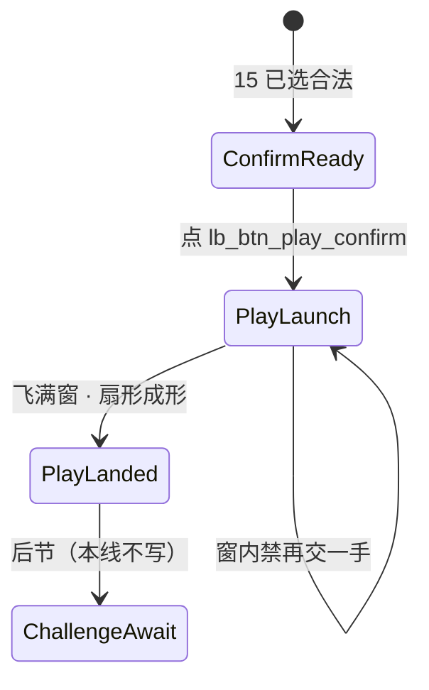

# 16 · 局内出牌飞出与身前扣牌规格（第1节）

| 项 | 内容 |
|----|------|
| 版本 | v0.1.0 |
| 状态 | **方案会签草案** · 线框数字作本版闸 · 未会签禁止落 ets |
| 范围 | `lb_scr_table` 上 **确认出牌之后**：`PlayLaunch` 飞出 + `PlayLanded` 身前扣牌扇形。**第1节 only** |
| 读者 | UI、美术、策划、测试、鸿蒙、**@LiarBar负责人** |
| 对照 | [15 触摸出牌](./15-局内手牌触摸出牌规格.md)（选牌 / ConfirmReady / 确认条）· [02 命名](./02-组件与资源命名约定.md) · [11 横屏](./11-局内横屏与自适应布局.md) · [GDD §6.1 本手扣牌区](../02-游戏设计/GDD.md) · [13 出牌 SFX](./13-局内声场与伴奏规格.md) · [05 状态机 T20](../05-技术/02-回合状态机草图.md) |
| 本 PR | **只交文档**。零 ets、零 rawfile、零新媒体文件 |

> **UI 管**：线框数字、落点、Z、拍表、`lb_*`、可测失败短句。给鸿蒙 `PlayLaunch` / `PlayLanded` 用的数。  
> **策划管**：GDD 出牌条件 / 本手语义（本线不改规则）。乐观飞 vs ack **未决**，见 §6。  
> **美术管**：飞出与扇形用已有 `art_card_back`；**不交**新媒体。  
> 命名：控件 `lb_*`；媒体 `art_*`；音频调用 `lb_sfx_*`。**禁止** `lb_art_*`。

---

## 0. 边界（写死）

### 0.1 第1节写什么 / 不写什么

| 层 | 本文做什么 | 本文不做什么 |
|----|------------|--------------|
| 节 | 确认后飞出 + 身前扇形成形 | **手牌 flush 本轮搁置**（余牌不收缝、不重排） |
| 接 15 | 从 **ConfirmReady** 接着写 `PlayLaunch` / `PlayLanded` | 不重写点按翻面 / 多选 / 确认条铬件 |
| 落点 | 身前扣牌（本手，牌背扇） | **不**把本手飞进桌心 `lb_cmp_pool`；不改池几何 |
| 贴底 | 落点 **禁抬 `padB`** | **不重开** 11 flush / `HAND_RING_GAP` **24%** / tip |
| 确认条 | 仍是 **BottomEnd overlay** | **不**钉进 `handPin`（会撑 hug、抬牌） |
| 质疑 | 写明仍冻；质疑等待 = **后节** | **不扩** 四拍、不画质疑窗 |
| 张数 | **扇形牌背**可读 1/2/3 | **禁止**当面 `Text` 数字冒充张数 |
| 落地 | 会签后才开 `feat/client-*` | **本 PR 零 ets** |

**硬闸四句：**

1. **零规则改动**（仍 1～`MAX_PLAY`，默认 3；3 命不变）。  
2. **质疑仍冻**；挑战等待后节再写。  
3. **贴底硬修本轮搁置** — 不改 `padB` / `HAND_RING_GAP=24%` / flush / tip。  
4. **手牌 flush 本轮搁置** — 飞出后余牌位不动。

### 0.2 与 15 Playing「飞向池」

15 §2 Playing 口播「已选牌飞向池」。**第1节落点改锁为身前扣牌**，对齐 GDD §6.1「本手扣牌区」。

- 桌心 `lb_cmp_dealer` / `lb_cmp_pool` / `dealPileAnchor` **不动**（11 屏心硬闸仍在）。  
- 本手 **不**砸进桌心当完成。  
- 15 选牌 / ConfirmReady / 确认条近底可点 **仍认 15**。本线只接确认之后。

---

## 1. 拍表（给鸿蒙 · 不是新引擎阶段）

逻辑阶段仍是 GDD：`TURN` → `PLAY_REVEAL_SELF` → `TURN`（下家）。  
下表是 **桌上出牌 UI 拍**，挂在 15 的 ConfirmReady 之后，**不另造引擎阶段**。鸿蒙实现 `PlayLaunch` / `PlayLanded` **只认本表数字**。

```
ConfirmReady → PlayLaunch（飞出 + SFX 同起）→ PlayLanded（扇形成形）
                 ↑ 第1节                                    ↑ 第1节完
                                                        质疑等待 = 后节
```



| UI 拍 | GDD 阶段 | 画面 | 玩家能做什么 |
|-------|----------|------|--------------|
| **ConfirmReady** | `TURN` | 15：条在、钮 `_enabled` | 点 `lb_btn_play_confirm`。取消仍认 15 |
| **PlayLaunch** | `PLAY_REVEAL_SELF` | 已选牌从手牌位飞向该座身前锚；**飞出与出牌 SFX 同一 onset** | **不可改选、不可再交**。条 `_disabled` 或收起（认 15 Playing） |
| **PlayLanded** | 回 `TURN`（下家）或仍在本手展示 | 身前扇形 **已成形**；牌背；HitTest None | 本手第1节完成。质疑等待 **后节** |
| **ChallengeAwait** | （后节） | — | **本线不验** |

**写死：** `PlayLaunch` / `PlayLanded` 是 **UI 拍名**，给鸿蒙对表。日志 / 实况窗仍报 GDD 阶段，不得把这两拍写成新的 `phase` 枚举。

超时 AUTO_PLAY 仍认 GDD：自动 1 张也走同一飞出 → 身前单张落点，不另走路。

---

## 2. 线框数字（本版闸 · 会签前当锁）

评委 / 鸿蒙 / 测试 **只认下表**。窗口是实现容差；**推荐值**是对表数。

### 2.1 飞出时长

| 项 | 锁 |
|----|-----|
| 推荐 | **320ms** |
| 窗口 | **280～400ms** |
| 缓动 | ease-out（与 15 翻/抬同族，不另造曲线名） |
| 起点 | 该张在 `lb_cmp_hand` 的选中位（抬起态可当起点） |
| 终点 | 该座身前锚（§2.3） |
| 途中 | 牌背（他人永远不见面）；可用已有 `art_card_back` |
| 听感 | **飞出视觉起势与出牌 SFX 同 onset**（见 §5） |

短于 280ms 闪现、长于 400ms 拖沓，或无位移纯切图 = **无飞出纯提交**。

### 2.2 扇形 ° / 露边（张数闸）

**禁止**当面 `Text` / Badge 写「1」「2」「3」。张数只靠 **牌背扇** 读。`lb_txt_play_count` 是 15 次路径包内「已选 n/3」，**不**挂到身前扣牌。

| 张数 | 转角 | 露边 | 锚 |
|------|------|------|----|
| **1** | **不扇**（0°） | — | **该座身前正中** |
| **2** | **±8°** | 邻牌露边 **10vp** | 以身前正中为轴，左右对称 |
| **3** | **−12° / 0° / +12°** | 邻牌露边 **10vp** | 中张 0° 压轴；左右对称 |

露边 **10vp** = 上一张（或下一张）至少露出 **10vp** 牌背边，一眼能数。重叠到只剩一条缝 = **张数不可读**。

扇形朝向：指向桌心 / 环内，不是朝屏幕外翻。左右座、对家 **镜像** 该座朝心方向（§2.3）。

牌档建议沿用手牌 56×78 或略缩一档；**缩尺不得**靠抬 `padB` 或改 `HAND_RING_GAP` 腾空。本线不锁新 `art_*`。

```
1 张（不扇）          2 张（±8° / 露边 10vp）       3 张（−12°/0°/+12° / 露边 10vp）

      [背]                  [背]  [背]                 [背] [背] [背]
       │                    ╲      ╱                    ╲   │   ╱
     身前正中                 身前正中                     身前正中
```

### 2.3 落点（self / 左 / 右 / 对家）

**Self：** 落在 **自己座位之上 / 身前**（下手 `lb_cmp_seat_self` / `selfDock` 身前空位），在手牌主行 **之上**、桌心 **之下** 的环-手带里。

| 要 | 不要 |
|----|------|
| 身前、贴自己座；1 张居中 | 飞进桌心池 / 荷官 bust 当完成 |
| **不得抬 `padB`** | 加大 `padB` / 底 padding 给扇形腾空 |
| **不得盖手牌主行** | 扇叶压住 `lb_cmp_hand` 牌心或热区 |
| **不得盖生命烛** | 压 `lb_cmp_life_self` / 对手 `lb_cmp_life_seat_pN` |
| 左右座 / 对家 **镜像** 各座锚 | 四座共用一个桌心落点 |

**镜像（写死）：**

| 座 | 锁名 | 身前锚 |
|----|------|--------|
| 自己 | `lb_cmp_seat_self` | 底带身前、手牌主行之上、水平近该座 / 桌面中线身前 |
| 右 · 怂货 | `lb_cmp_seat_p1` | 右侧座 **内侧 / 身前**（朝桌心），边竖直中口径仍认 11 |
| 对家 · 老千 | `lb_cmp_seat_p2` | 上沿座 **身前（靠桌心一侧）** |
| 左 · 杠精 | `lb_cmp_seat_p3` | 左侧座 **内侧 / 身前**（朝桌心） |

11 的 p3/p1 边竖直中、self / p2 上沿 **本轮不改**。身前锚是 **座内侧空位**，不是把座框挪走。

AI 出牌走同一套 ° / 露边 / 时长，只换该座锚。

### 2.4 Z 序与命中

| 层 | 谁 | Z | 命中 |
|----|-----|---|------|
| 下 | 桌心 bust / 池 / 牌堆锚 | 低 | 仍认 11（本线不改） |
| 中 | `lb_cmp_play_fly`（飞）→ `lb_cmp_play_front_pile`（落后） | **高于桌心，低于确认条** | **落后 HitTest None**（不得挡手牌） |
| 上 | `lb_cmp_play_confirm_bar` | 最高可点层之一 | 仍可点（PlayLaunch 起 `_disabled` / 收起） |

确认条 **继续** 15 / 工程口径：`Stack` **BottomEnd overlay**，与 `handPin` **兄弟**，**禁止**进 `handPin`（进 pin 会撑 hug、抬手牌，等于变相抬 `padB`）。

飞出层在 PlayLaunch 窗内可挡误点；**PlayLanded 之后** 身前堆必须 `HitTestMode.None`（或等价），手牌主行 / 余牌点按不被扇形吞掉。

### 2.5 确认条（本线只复述锁，不重开）

```
│     桌心 bust + 池（不动）                         │
│     ░ 环-手 24%（HAND_RING_GAP 数字不动）░          │
│           ╱[背]│[背]╲  ← lb_cmp_play_front_pile    │
│         self 身前 · 不压手、不压烛                   │
│  selfDock │  [余牌][余牌][余牌]   ← 主行不 flush    │
│           └─ 手牌底缘贴底安全区上沿 ─┘               │
│         ┌─ lb_cmp_play_confirm_bar ─┐  BottomEnd    │
│         │   【 出 牌 】（提交后禁用） │  overlay     │
│         └───────────────────────────┘  ≠ handPin    │
│         ░ padB = 仅 inset · 禁加大 ░                │
```

---

## 3. 控件 id（草案 · 已回写 02）

| id | 类型 | 何时 | 说明 |
|----|------|------|------|
| `lb_cmp_play_fly` | 组件 | PlayLaunch | 飞出层 / 在途牌。窗尽即卸或切到 pile |
| `lb_cmp_play_front_pile` | 组件 | PlayLanded 起 | 该座身前扣牌扇。1～3 张牌背。**无**张数 Text |

子实例不必另锁第三套前缀。需要自动化点单张时，用 pile 下标 `0..2`（左→右或逆时针朝心），**不要**发明 `lb_art_*`。

牌面资源：`art_card_back`（02 §5.3 已有）。本 PR **不交** PNG / rawfile。

余牌仍是 `lb_cmp_card_*`。**本线不 flush**：飞走的下标位可空着，不把右边牌滑过来。flush 后节。

---

## 4. 不做（本线写死）

| 不做 | 说明 |
|------|------|
| 手牌 flush | 余牌收缝 / 重排 / 改 `HAND_RING_GAP` **搁置** |
| 抬 `padB` | 禁加大 inset 给扇形或条腾空 |
| 改 GAP / tip | `HAND_RING_GAP=24%` 数字不动；不重开删 tip |
| 质疑 / 四拍 | 仍冻；`ChallengeAwait` 后节 |
| 飞进桌心交差 | 本手 ≠ `lb_cmp_pool` |
| 确认条进 `handPin` | 只许 BottomEnd overlay |
| 张数 Text | 禁止身前 / 扇上挂「2」「3」 |
| 新媒体 / 新 SFX 文件 | 只挂已有调用点 |
| 改 15 选牌闸 | F15-1～12 不重开 |

---

## 5. SFX（只挂点 · 不交文件）

PlayLaunch：**飞出视觉起势与出牌 SFX 同一 onset**（耳 onset 贴飞出 kickoff，不是落到再响）。

| 调用点 | 何时 | 本线交文件？ |
|--------|------|----------------|
| `lb_sfx_soft`（默认 SOFT；13 真源槽 `sfx_play_soft` / `lb_sfx_play_soft`） | PlayLaunch 起 | **否** |
| `lb_sfx_slam` / `lb_sfx_hesitate` | 仅当次路径已选方式；本线默认 SOFT | **否** |
| `lb_sfx_play_confirm` | 仍认 15：点确认 **按下** | **否**（可与飞出同帧，不得晚于飞出起势才第一次出声） |

静默局全关。缺真源可静音占位。**禁止**系统按键音冒充终稿。禁止本 PR 往 `rawfile/audio/` 丢文件。

「同起」读法对齐 15 / 14b：耳 onset 贴 **飞出视觉起势**。落到才响 / 半秒后才响 = 本线听感不过（不另起 F 号；短句仍以 §7 四句为主闸）。

---

## 6. 乐观飞 vs ack（策划未决）

**PM 未拍** 飞出该卡确认点击还是卡 `SUBMIT_PLAY` ack（05 T20）。

| 方案 | 起飞 | 本线要求 |
|------|------|----------|
| 乐观 | 点 `lb_btn_play_confirm` 即 `PlayLaunch` | 引擎拒则收回；**落点仍是该座身前锚** |
| 等 ack | T20 接受后再 `PlayLaunch` | 同一落点；不得改飞进桌心 |

**UI 两种都接得住，前提是落点相同。** 本线不锁谁先谁后，也不因此改 GDD。实现不得用「等 ack」当借口做成 **无飞出纯提交**。

拒牌 / 非法张数仍认 15：不进 PlayLaunch。

---

## 7. 失败短句（测试 / 鸿蒙可抄）

合入 ≠ 终验。未会签勿按短句改 ets。交叉鸿蒙实现闸：对不上 §2 数字 = 同一短句打回。

| # | 短句 | 不过 |
|---|------|------|
| F16-1 | **无飞出纯提交** | 点确认后牌瞬切 / 消失 / 无 280～400ms 位移；或只交引擎不播 `PlayLaunch` |
| F16-2 | **张数不可读** | 1/2/3 看不出；用 Text 数字交差；2/3 张无扇或露边不足 **10vp** 叠死 |
| F16-3 | **扇形压手或烛** | 落后扇盖住 `lb_cmp_hand` 主行或 `lb_cmp_life_*`；或为此抬 `padB` / 改 GAP |
| F16-4 | **动画未完又出一手** | PlayLaunch 未到 PlayLanded 又能再交 / 再选再飞；两手叠飞 |

15 的 F15-1～12（选牌 / 条 / 贴底 / 质疑）**仍有效**，本线不重开、不改号。

---

## 8. 会签

- [ ] @LiarBar负责人 规格终审（° / 露边 / 落点 / 时长 / Z）  
- [ ] @LiarBar策划 GDD §6.1 本手扣牌区未改；乐观飞 vs ack 可后决；质疑仍冻  
- [ ] @LiarBar UI 第1节 = 飞出 + 身前扇；确认条 BottomEnd；禁抬 `padB`  
- [ ] @LiarBar鸿蒙 `PlayLaunch` / `PlayLanded` 对表 §2；会签前零 ets  
- [ ] @LiarBar测试 四句可抄；合入 ≠ 终验  

**未会签禁止落 ets。** 会签前零 ets。合入本 PR ≠ 出牌飞出终验。

---

## 9. 修订记录

| 版本 | 日期 | 说明 |
|------|------|------|
| v0.1.0 | 2026-09-13 | 第1节会签草案：飞 **320ms**（280～400）；1 张不扇居中；2 张 ±8° / 3 张 −12°/0°/+12°；露边 **10vp**；self 身前禁抬 `padB`、禁压手/烛；L/R/对家镜像座锚；Z 高于桌心、低于确认条；落后 HitTest None；拍 ConfirmReady→PlayLaunch→PlayLanded；id `lb_cmp_play_fly` / `lb_cmp_play_front_pile`；失败 **无飞出纯提交** / **张数不可读** / **扇形压手或烛** / **动画未完又出一手**；乐观飞 vs ack 未决（落点相同即可）；flush / GAP / tip / 质疑不重开 |

### 审核记录

| 日期 | 意见 | 提议修改 | 提出人 | 状态 |
|------|------|----------|--------|------|
| 2026-09-13 | 鸿蒙等扇形° / 露边 / self 落点 / Z / 时长 | 本版写入 §2 作闸 | UI 文档岗 | **待 @LiarBar负责人 会签** |

---

*维护人：UI 文档岗 · 2026-09-13 · docs only · 第1节 · 会签前零 ets*
