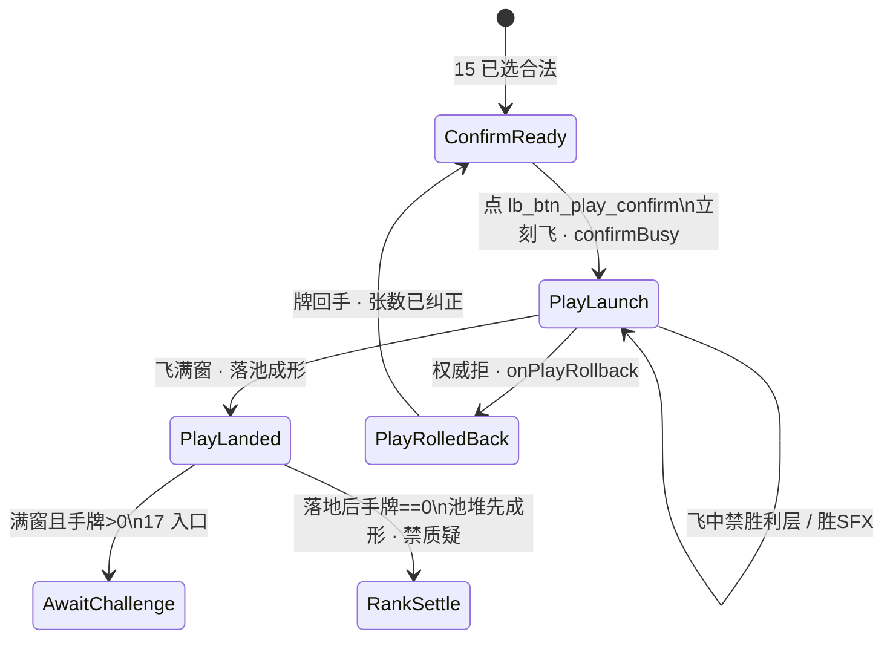

# 16 · 局内出牌飞出与身前扣牌规格（第1节 · 落池）

| 项 | 内容 |
|----|------|
| 版本 | v0.2.0 |
| 状态 | **第1节落池已锁**（PM）· 线框数字作本版闸 · 未会签禁止落 ets |
| 范围 | `lb_scr_table` 上 **确认出牌之后**：乐观 `PlayLaunch` 飞出 + `PlayLanded` **落 `lb_cmp_pool`**（本轮本手堆）+ 权威拒回滚。**第1节 only**（质疑入口认 [17](./17-局内质疑入口规格.md)；开牌区认 [18](./18-局内开牌区规格.md)） |
| 读者 | UI、美术、策划、测试、鸿蒙、**@LiarBar负责人** |
| 对照 | [15 触摸出牌](./15-局内手牌触摸出牌规格.md)（选牌 / ConfirmReady / 确认条）· [02 命名](./02-组件与资源命名约定.md) · [11 横屏](./11-局内横屏与自适应布局.md) · [GDD §6.1 本手](../02-游戏设计/GDD.md) · [13 出牌 SFX](./13-局内声场与伴奏规格.md) · [05 状态机 T20](../05-技术/02-回合状态机草图.md) · [17 质疑入口](./17-局内质疑入口规格.md) · [18 开牌区](./18-局内开牌区规格.md) |
| 本 PR | **只交文档**。零 ets、零 rawfile、零新媒体文件 |

> **UI 管**：线框数字、落点、Z、拍表、`lb_*`、可测失败短句。给鸿蒙 `PlayLaunch` / `PlayLanded` / `onPlayRollback` 用的数。  
> **策划管**：GDD 出牌条件 / 本手语义（本线不改规则）。**乐观飞已锁**（点确认即起飞；权威拒回滚），见 §6。  
> **美术管**：飞出与池堆用已有 `art_card_back`；**不交**新媒体。  
> 命名：控件 `lb_*`；媒体 `art_*`；音频调用 `lb_sfx_*`。**禁止** `lb_art_*`。

---

## 0. 边界（写死）

### 0.1 第1节写什么 / 不写什么

| 层 | 本文做什么 | 本文不做什么 |
|----|------------|--------------|
| 节 | 确认后乐观飞出 + **落池**成形 + 权威拒回滚 | **手牌 flush 硬修另线**（余牌不收缝、不重排；本轮不绑） |
| 接 15 | 从 **ConfirmReady** 接着写 `PlayLaunch` / `PlayLanded` | 不重写点按翻面 / 多选 / 确认条铬件 |
| 落点 | **`lb_cmp_pool`（桌心本轮本手堆）** | **不**把本手落到身前扣区当主读；不改 11 池/bust 屏心硬闸 |
| 贴底 | 落点 **禁抬 `padB`** | **不重开** 11 flush / `HAND_RING_GAP` **24%** / tip |
| 确认条 | 仍是 **BottomEnd overlay** | **不**钉进 `handPin`（会撑 hug、抬牌） |
| 质疑 | **质疑已解冻**（手牌仍 >0）。本线只锁：飞满窗才能进 `AwaitChallenge`；**打光（落地后手牌=0）不进质疑入口**；旧四拍/弱 CTA 与新局内质疑 **禁双轨并存**（入口认 17） | **不**重画 `lb_scr_challenge` 四拍、不挂常驻大双 CTA、不写开牌几何（认 [18](./18-局内开牌区规格.md)）、**不写**名次主序表（认策划 #136 / 第4节） |
| 池堆 | `lb_cmp_pool` **只持本轮这一手**，露边读张 | **不**跨轮无限叠；坟场 / 揭后清空时序 = 17 / 18 |
| 张数 | **池上牌背露边**可读 1/2/3 | **禁止**当面 `Text` / `poolText` / Badge 冒充张数 |
| 落地 | 会签后才开 `feat/client-*` | **本 PR 零 ets** |

**硬闸六句：**

1. **零规则改动**（仍 1～`MAX_PLAY`，默认 3；3 命不变；第一手不可质疑仍在 GDD）。  
2. **质疑已解冻**。废止本篇任何「质疑仍冻」。旧质疑四拍（`lb_scr_challenge` + `lb_challenge_windup` / `_standoff` / `_reveal` / `_result`）/ 弱 CTA 与 **新局内质疑** **禁双轨并存** — 17 写入口；本线见双轨 = **质疑双轨并存**。  
3. **贴底硬修本轮搁置** — 不改 `padB` / `HAND_RING_GAP=24%` / flush / tip。**手牌 flush 硬修另线**，本票不绑。  
4. **落点 = 池** — `PlayLanded` 只认 `lb_cmp_pool`。`lb_cmp_play_front_pile` **废主读**（可空壳，随后删除）。  
5. **乐观飞已锁** — 点确认即 `PlayLaunch`；权威拒走 `onPlayRollback`，不得改回「等 ack 才飞」当完成。  
6. **出牌 ≠ 发牌** — 只走 `PlayLaunch`→`PlayLanded` + `lb_sfx_play_launch` / `lb_sfx_play_land`。**禁止** `DealFx.flyOn` / 发牌路径 / `lb_sfx_deal_*` 冒充出牌。

### 0.2 与 15 Playing「飞向池」

15 §2 Playing 口播「已选牌飞向池」。**本版落点锁回池**，对齐 15 口播；废止 v0.1.x「第1节改锁身前扣牌」当主读。

- 桌心 `lb_cmp_dealer` / `lb_cmp_pool` / `dealPileAnchor` **几何不动**（11 屏心硬闸仍在）。本手 **落进池**，不是把池挪走。  
- 本手 **不**砸进身前扣区当完成。身前再出可读扇 = **身前扣区仍主读**。  
- 15 选牌 / ConfirmReady / 确认条近底可点 **仍认 15**。本线只接确认之后。  
- 15 客户端预检非法（0 张 / 超帽 / 非己回合）**仍不进** `PlayLaunch`（认 F15-5 / F15-6 / F15-8）。本线管的是：**合法点确认之后**立刻飞，以及权威事后拒。

### 0.3 第1节摘要（PM 已锁 · 必须写死）

| # | 锁 | 本线写死 |
|---|----|----------|
| 1 | **落点 = 池** | `PlayLanded` 终点 = **`lb_cmp_pool`**。**不是** `lb_cmp_play_front_pile`。身前扣区 **废主读**（可留空壳再删） |
| 2 | **拍 + 出牌双槽** | 仍 `PlayLaunch`→`PlayLanded`。`lb_sfx_play_launch` 贴飞出 onset；`lb_sfx_play_land` 贴落池。**禁止** `DealFx.flyOn` / 发牌飞 / `lb_sfx_deal_card` / `_whoosh` / `_deal_in` / `lb_sfx_card_flip` 冒充 |
| 3 | **乐观飞 + 回滚** | 点 `lb_btn_play_confirm` **立刻** `PlayLaunch`（不等 T20 / `SUBMIT_PLAY` ack）。权威拒 → `onPlayRollback`：池上本手 **与** 手牌一并回滚。单一 key `lb_str_play_rollback` = **出牌未生效 / 张数已纠正** |
| 4 | **飞不可跳过** | 推荐 **320ms**（窗 280～400）必须播完，才能进 `AwaitChallenge`。窗内 `confirmBusy=true`；**禁止**飞中第二次确认 |
| 5 | **池 = 本轮本手** | `lb_cmp_pool` 只持 **本轮这一手**。露边 **≥10vp** 读 1/2/3。**禁止**张数 Text。质疑 / 揭牌后清空（时序认 17 / 18） |
| 6 | **贴底 / GAP** | `HAND_RING_GAP=24%` **数字不动**。**禁止**抬 `padB`。手牌 flush 硬修 **另线** |
| 7 | **打光** | `PlayLanded` 后 hand==0 → **RankSettle**，**禁止** `AwaitChallenge`（F16-12 仍在） |

开牌几何 / draw→flip **不写在本篇**，认 [18](./18-局内开牌区规格.md)。

---

## 1. 拍表（给鸿蒙 · 不是新引擎阶段）

逻辑阶段仍是 GDD：`TURN` → `PLAY_REVEAL_SELF` → `TURN`（下家）。  
下表是 **桌上出牌 UI 拍**，挂在 15 的 ConfirmReady 之后，**不另造引擎阶段**。鸿蒙实现 `PlayLaunch` / `PlayLanded` / `onPlayRollback` **只认本表数字**。

```
ConfirmReady → PlayLaunch（点确认即飞 + launch SFX）→ PlayLanded（落池成形 + land SFX）
                 ↑ 乐观 · 不等 ack                         ↑ 满 320ms 窗 · 终点 lb_cmp_pool
                      ↘ 权威拒 → onPlayRollback（pool本手+hand 回滚）
PlayLanded → AwaitChallenge     ← 飞未满窗不得进；且落地后手牌 >0；入口认 17
PlayLanded → RankSettle         ← 落地后手牌 == 0：池堆先成形；**禁止**进 AwaitChallenge
```



| UI 拍 | GDD 阶段 | 画面 | 玩家能做什么 |
|-------|----------|------|--------------|
| **ConfirmReady** | `TURN` | 15：条在、钮 `_enabled`；`confirmBusy=false` | 点 `lb_btn_play_confirm`。取消仍认 15 |
| **PlayLaunch** | `PLAY_REVEAL_SELF`（UI 已飞；引擎 ack **可后到**） | 已选牌从手牌位飞向 **`lb_cmp_pool`**；**`lb_sfx_play_launch` 与飞出同一 onset** | **不可改选、不可再交**。`confirmBusy=true`。条 `_disabled` 或收起（认 15 Playing） |
| **PlayLanded** | 回 `TURN`（下家）或仍在本手展示；打光则权威可在 **落地帧** 判胜 | **池上本手堆已成形**；牌背；HitTest None；**`lb_sfx_play_land` 贴落池** | 本手第1节飞出完成。`confirmBusy` 解除。落地后手牌 **>0** → 才准 `AwaitChallenge`。落地后手牌 **==0** → **结算 / 占名次**，**禁止**进质疑入口（§6.3） |
| **PlayRolledBack** | 仍 `TURN`（本座） | 池上本手卸掉；牌回手原位（不 flush）；口播/短句走 **单一** key `lb_str_play_rollback` = **出牌未生效 / 张数已纠正** | 可再选再确认（认 15）。**不得**留下「已出成功」的池堆 |
| **AwaitChallenge** | （17） | 飞已满窗；池上仍是 **这一手**；出牌者手牌 **仍 >0** | 17 写入口。本线只锁：**飞未完不得进**；**打光不得进**；禁与旧四拍/弱 CTA 双轨 |

**写死：** `PlayLaunch` / `PlayLanded` / `AwaitChallenge` 是 **UI 拍名**，给鸿蒙对表。日志 / 实况窗仍报 GDD 阶段，不得把这三拍写成新的 `phase` 枚举。

**乐观（写死）：** 点确认 **即** 进 `PlayLaunch`，**不等** T20 / `SUBMIT_PLAY` ack。ack 后到只用于确认或触发 `onPlayRollback`，不得把「等 ack」做成无位移纯切图。

**`confirmBusy`（写死）：** `PlayLaunch` 全程 `true`（推荐满 **320ms**，不得短于窗下沿 280ms 就放开）。Busy 期间：确认条不可再点；第二次 `confirm` **丢弃**；不得再选再飞。Busy 在 `PlayLanded` 或 `onPlayRollback` 完成时才落 `false`。飞中途放开 busy 又能交 = **动画未完又出一手**。

超时 AUTO_PLAY 仍认 GDD：自动 1 张也走同一乐观飞出 → **落池**单张，不另走路。AUTO_PLAY 满窗后：手牌仍 >0 才准 `AwaitChallenge`；打光（手牌==0）走 §6.3 结算闸，**不进**质疑。

**禁止发牌路径（写死）：** `PlayLaunch` **不是** `DealFx.flyOn` / `dealPileAnchor` 发牌飞。出牌飞层只认 `lb_cmp_play_fly`。复用发牌 `flyOn` / `pull()` / 发牌 stagger = **出牌像发牌**。

---

## 2. 线框数字（本版闸 · 会签前当锁）

评委 / 鸿蒙 / 测试 **只认下表**。窗口是实现容差；**推荐值**是对表数。  
**本版不改** 飞时长 / 露边下限 / Z 族 / `padB` / GAP。**改的是落点：身前 → 池。**

### 2.1 飞出时长（不可跳过）

| 项 | 锁 |
|----|-----|
| 推荐 | **320ms** |
| 窗口 | **280～400ms** |
| 缓动 | ease-out（与 15 翻/抬同族，不另造曲线名） |
| 起点 | 该张在 `lb_cmp_hand` 的选中位（抬起态可当起点）；AI 从该座手/座锚起飞 |
| 终点 | **`lb_cmp_pool` 本手堆锚**（§2.3） |
| 途中 | 牌背（他人永远不见面）；可用已有 `art_card_back` |
| 听感 | **飞出视觉起势与 `lb_sfx_play_launch` 同 onset**（见 §5） |
| 不可跳过 | **必须播完本窗** 才进 `AwaitChallenge` / 才解除 `confirmBusy`（回滚除外） |
| 飞中确认 | **禁止**；`confirmBusy` 吞第二次确认 |
| 路径 | **只** `PlayLaunch`→`PlayLanded`。**禁止** `DealFx.flyOn` |

短于 280ms 闪现、长于 400ms 拖沓，或无位移纯切图 = **无飞出纯提交**。  
未满窗就开质疑 / 跳过飞出 = **飞出被跳过进质疑**。  
飞出去像开局发牌（同路径 / 同 SFX / 同 stagger）= **出牌像发牌**。

### 2.2 池上本手堆（张数闸）

**禁止**当面 `Text` / Badge / 工程 `poolText` 写「1」「2」「3」冒充本手张数。张数只靠 **池上牌背露边** 读。`lb_txt_play_count` 是 15 次路径包内「已选 n/3」，**不**挂到池。

| 张数 | 转角 | 露边 | 锚 |
|------|------|------|----|
| **1** | **不扇**（0°） | — | **`lb_cmp_pool` 正中** |
| **2** | **±8°** | 邻牌露边 **≥10vp** | 以池正中为轴，左右对称 |
| **3** | **−12° / 0° / +12°** | 邻牌露边 **≥10vp** | 中张 0° 压轴；左右对称 |

露边 **≥10vp** = 上一张（或下一张）至少露出 **10vp** 牌背边，一眼能数。重叠到只剩一条缝 = **池上张数不可读**。

扇形朝向：在池上朝环内微展，不是朝屏幕外翻。四座出牌 **共用一个池锚**，不再按座镜像身前落点。

牌档建议沿用手牌 56×78 或略缩一档；**缩尺不得**靠抬 `padB` 或改 `HAND_RING_GAP` 腾空。本线不锁新 `art_*`。

```
1 张（不扇）          2 张（±8° / 露边 ≥10vp）      3 张（−12°/0°/+12° / 露边 ≥10vp）

      [背]                  [背]  [背]                 [背] [背] [背]
       │                    ╲      ╱                    ╲   │   ╱
   lb_cmp_pool              lb_cmp_pool                  lb_cmp_pool
```

### 2.3 落点（写死 · 池 · 不是身前）

**所有座**（self / 左 / 右 / 对家 / AI）飞出终点都是 **桌心 `lb_cmp_pool`**。11 的 bust+池屏心、p3/p1 边竖直中、self / p2 上沿 **本轮不改**。

| 要 | 不要 |
|----|------|
| 落进 `lb_cmp_pool`；1 张居中 | 落进身前扣区 / 座内侧空位当完成 |
| **不得抬 `padB`** | 加大 `padB` / 底 padding 给池或飞层腾空 |
| **不得改 `HAND_RING_GAP=24%`** | 为落池重开 flush / tip |
| **不得盖手牌主行** | 池堆或飞层压住 `lb_cmp_hand` 牌心或热区 |
| **不得盖生命烛** | 压 `lb_cmp_life_self` / 对手 `lb_cmp_life_seat_pN` |
| 四座共用池锚 | 四座各做一套身前主读扇 |

`lb_cmp_play_front_pile`：**废主读。** 允许空壳占位（无牌、无张数、无 HitTest），随后删除。空壳上再摊本手扇、或评委第一眼仍从身前读张数 = **身前扣区仍主读**。落在座前 / 手牌之上 / 荷官 bust 上 / 屏幕外 = **落点不在牌堆**。

AI 出牌走同一套 ° / 露边 / 时长 / 乐观飞，只换起飞座锚，**终点仍是池**。AI 手被权威拒同样 `onPlayRollback`（测试可抄同一短句）。

### 2.4 Z 序与命中

| 层 | 谁 | Z | 命中 |
|----|-----|---|------|
| 下 | 桌心 bust / `dealPileAnchor` | 低 | 仍认 11（本线不改屏心） |
| 中 | `lb_cmp_pool`（本手堆） | 桌心牌堆层 | **落后 HitTest None**（不得挡手牌） |
| 中上 | `lb_cmp_play_fly`（飞） | **高于桌心，低于确认条** | 窗内可挡误点 |
| 上 | `lb_cmp_play_confirm_bar` | 最高可点层之一 | Busy 时不可点；PlayLaunch 起 `_disabled` / 收起 |
| 废 | `lb_cmp_play_front_pile` | 不得高于池冒充主读 | 空壳则 None；有牌当主读 = 不过 |

确认条 **继续** 15 / 工程口径：`Stack` **BottomEnd overlay**，与 `handPin` **兄弟**，**禁止**进 `handPin`（进 pin 会撑 hug、抬手牌，等于变相抬 `padB`）。

飞出层在 PlayLaunch 窗内可挡误点；**PlayLanded 之后** 池堆必须 `HitTestMode.None`（或等价），手牌主行 / 余牌点按不被池堆吞掉。

### 2.5 确认条（本线只复述锁，不重开）

```
│     桌心 bust + lb_cmp_pool（本轮本手 · 露边读张）     │
│           ╱[背]│[背]╲  ← 落点 = 池                     │
│     ░ 环-手 24%（HAND_RING_GAP 数字不动）░            │
│  selfDock │  [余牌][余牌][余牌]   ← 主行不 flush      │
│           └─ 手牌底缘贴底安全区上沿 ─┘                 │
│         ┌─ lb_cmp_play_confirm_bar ─┐  BottomEnd      │
│         │   【 出 牌 】（提交后禁用） │  overlay       │
│         └───────────────────────────┘  ≠ handPin      │
│         ░ padB = 仅 inset · 禁加大 ░                  │
```

Busy 期间条保持 `_disabled` 或已收起，**不是**再亮一颗可点「出牌」。  
身前不再画主读扇。空壳 `lb_cmp_play_front_pile` 不得抢读。

---

## 3. 控件 id（草案 · 已回写 02）

| id | 类型 | 何时 | 说明 |
|----|------|------|------|
| `lb_cmp_play_fly` | 组件 | PlayLaunch | 飞出层 / 在途牌。窗尽即卸或切到池。回滚时中途卸，牌回手。**不是** `DealFx.flyOn` |
| `lb_cmp_pool` | 组件 | PlayLanded 起（主读） | **只持本轮这一手** 1～3 张牌背堆。露边 ≥10vp。**无**张数 Text。质疑 / 揭牌后清空（17 / 18） |
| `lb_cmp_play_front_pile` | 组件（**废主读**） | — | v0.1.x 身前扇。本版 **不得**再当本手主呈现。可空壳，随后删除 |

子实例不必另锁第三套前缀。需要自动化点单张时，用池堆下标 `0..2`（左→右或逆时针朝心），**不要**发明 `lb_art_*`。

牌面资源：`art_card_back`（02 §5.3 已有）。本 PR **不交** PNG / rawfile。

余牌仍是 `lb_cmp_card_*`。**本线不 flush**：飞走的下标位可空着，不把右边牌滑过来。flush 硬修另线。回滚后牌回到原下标，**仍不 flush**。

### 3.1 池堆生命周期（本轮一手）

GDD §6.1 / §6.2：本手是 **刚刚那一手**；质疑翻的也是上家 **刚刚那一手**，不是历史所有。呈现锚从身前改到池，**语义不改**。

| 时点 | `lb_cmp_pool` | 不要 |
|------|---------------|------|
| `PlayLanded` | 换上 **这一手** 堆（1/2/3） | 把上一手留在底下再叠一层；或同时在身前再摊一套 |
| 下家再出（本轮未质疑） | 池上换成 **新的这一手**；不得把多手堆成桌心坟 | 跨手、跨轮无限堆 |
| 权威拒 / `onPlayRollback` | **立刻卸** 这一手；手牌张数回到提交前 | 拒了还留堆 = **出牌未生效** |
| 质疑 / 揭牌之后 | **清空** 该手（抽走后进 18 开牌区） | 揭完仍留旧堆冒充坟场 |
| 新一轮宣称 | 池上本手 **空** | 上一轮堆还在 = **池上跨轮堆叠** |

**坟场 / 弃置堆本线不开。** 清空之后牌去哪、是否另挂 id，认 17 / 18。本线只锁：池 **不是** 无限跨轮栈。

---

## 4. 不做（本线写死）

| 不做 | 说明 |
|------|------|
| 手牌 flush | 余牌收缝 / 重排 / 改 `HAND_RING_GAP` **另线硬修**，本票不绑 |
| 抬 `padB` | 禁加大 inset 给池或条腾空 |
| 改 GAP / tip | `HAND_RING_GAP=24%` 数字不动；不重开删 tip |
| 等 ack 才飞 | 乐观已锁；不得把「等 T20」做成 **无飞出纯提交** |
| 飞中再确认 | `confirmBusy` 必须吞第二次；不得两手叠飞 |
| 跳过飞进质疑 | 未满 320ms 窗不得进 `AwaitChallenge` |
| 飞中出胜利层 | PlayLaunch / 飞中禁胜 UI、`lb_sfx_result_win`、战报抢切；打光表现必须等池堆成形（§6.3） |
| 打光后进质疑 | 落地后手牌 ==0 仍开 `AwaitChallenge` / 质疑入口 = **打光仍进质疑** |
| 池上跨轮堆 | 池只本轮一手；坟场后开 |
| 身前扣区主读 | `lb_cmp_play_front_pile` 不得再当本手主呈现 |
| 质疑双轨 | 旧四拍全屏 + 新局内质疑弱 CTA / 大双底栏 **禁并存**（17） |
| 发牌路径交差 | **禁止** `DealFx.flyOn` / 发牌 stagger / `lb_sfx_deal_*` |
| 确认条进 `handPin` | 只许 BottomEnd overlay |
| 张数 Text | 禁止池上 / 池旁挂「2」「3」/`poolText` 冒充本手张数 |
| `lb_sfx_card_flip` 出牌 | 飞出 / 落池 **禁止** 翻牌槽；只认双槽 `lb_sfx_play_launch` / `lb_sfx_play_land` |
| 新媒体 / 新 SFX 文件 | 本 PR 只挂调用点，不交 wav |
| 改 15 选牌闸 | F15-1～12 不重开 |
| 重写 15 / 14b 正文 | 本票不改那两篇 |
| 开牌几何 | 认 18；本篇不写 draw→flip / 56vp |

---

## 5. SFX（双槽交叉 · 不交文件）

出牌飞出 **只认双槽**，与 13 的 soft/slam/hesitate **方式槽** 不是同一对，与 08/09 **发牌槽** 也不是同一对：

| 调用点 | 何时 | 本线交文件？ |
|--------|------|----------------|
| **`lb_sfx_play_launch`** | **`PlayLaunch` onset**（耳 onset 贴飞出 kickoff，不是落到再响） | **否** |
| **`lb_sfx_play_land`** | **`PlayLanded`**（池上本手成形 / 牌背落锚） | **否** |
| `lb_sfx_play_confirm` | 仍认 15：点确认 **按下** | **否**（可与 launch 同帧，不得晚于飞出起势才第一次出声，也 **不得** 用本槽冒充 launch/land） |
| `lb_sfx_soft` / `_slam` / `_hesitate` | 13 方式槽（SOFT/SLAM/HESITATE）；**不替代** launch/land 双槽 | **否** |

**禁止（写死）：**

- PlayLaunch / PlayLanded / 出牌飞出路径播 **`lb_sfx_card_flip`**（翻牌槽只属 S15-4）。  
- 用 flip 冒充 launch 或 land。  
- 播 **`lb_sfx_deal_card` / `lb_sfx_deal_whoosh` / `lb_sfx_deal_in`** 作出牌飞 / 落池（= **出牌像发牌**）。  
- 只播方式槽、不播双槽，还把 flip / deal 拿来「补一声」。  
- 落地才第一次出声、或半秒后才响（launch 必须贴飞出起势）。

静默局全关。缺真源可静音占位（**占位也必须走双槽 id**，不得改挂 flip / deal）。**禁止**系统按键音冒充终稿。禁止本 PR 往 `rawfile/audio/` 丢文件。

「同起」读法对齐 15 / 14b：

- launch：耳 onset 贴 **飞出视觉起势**。  
- land：耳 onset 贴 **池上本手成形 / 落锚**。  

落到才响 launch / 半秒后才响 = 本线听感不过。误用 flip = **出牌误用翻牌槽**。误用 deal = **出牌像发牌**。短句仍以 §7 为主闸。

13 方式槽盲听区分（soft / slam / hesitate）**不重开**。本线不改 13 正文。08/09 发牌三槽 **不重开**。

---

## 6. 乐观飞 + 回滚（PM 已锁 · 废「未决」）

v0.1.0 §6「乐观飞 vs ack 策划未决」**作废**。本版锁 **乐观**。落点从身前改池，**回滚语义不改**。

| 项 | 锁 |
|----|-----|
| 起飞 | 点 `lb_btn_play_confirm`（或 AUTO_PLAY 触发）**立刻** `PlayLaunch` |
| 不等 | **不等** T20 / `SUBMIT_PLAY` ack / 权威回包 |
| 落点 | **`lb_cmp_pool`**（§2.3）；不得改回身前主读 |
| 权威接受 | 飞继续 → `PlayLanded`。满窗后：手牌 >0 → `AwaitChallenge`；手牌 ==0 → RankSettle（**不进** `AwaitChallenge`） |
| 权威拒绝 | **立刻** `onPlayRollback`（飞中或已落都要回） |

实现不得用「等 ack」当借口做成 **无飞出纯提交**。

### 6.1 `onPlayRollback`（权威拒）

引擎 / 权威拒（非法张数事后发现、座位不同步、本手未成立等）→ 鸿蒙必须调 `onPlayRollback`（UI 拍名；不是新 `phase`）。

**必须同时：**

1. **卸** `lb_cmp_play_fly` 在途牌（若还在飞：中断位移，不做到达）。  
2. **卸** `lb_cmp_pool` 上 **这一手**（若已落）。身前空壳若被误写入，一并卸。  
3. **手牌回滚** 到提交前：牌回原下标；可见张数 = 提交前张数。**不 flush**。  
4. `confirmBusy=false`。条按 15 回到可再选。  
5. 出口播 / 测试短句走 **单一** 文案 key（02）：  
   `lb_str_play_rollback` = **出牌未生效 / 张数已纠正**  
   （两句写在 **一个** key 里，中间用「 / 」；**禁止**再拆 `lb_str_play_not_applied` / `lb_str_play_count_corrected`。）

语义仍是两半、同屏一次出齐：

- **出牌未生效** — 本手不算；池上不得留「已出成功」。  
- **张数已纠正** — 手牌可见张数已回到权威；禁止仍少 N 张像已经打出去。

缺半句、或拆成两个 key 交差 = 同一回滚不过（F16-5 / F16-6 都可抄；锁词仍是这两句）。

| 要 | 不要 |
|----|------|
| pool 本手 + hand **都**回 | 只回手不卸池 / 只卸池不回手 |
| 一个 key 两句都在 | 无声成功吞掉、只 toast「失败」、或拆两个 key |
| 回滚后可再选（15） | 回滚后死锁 `confirmBusy` / 条永不回 |
| 回滚不改 `padB` / GAP | 借回滚重排手牌当 flush |

15 客户端预检仍先挡：未进 `PlayLaunch` 的非法选认 **张数不符** / **非己回合** / **超选**，**不**改叫本 key。  
`lb_str_play_rollback` 只用于 **已经起飞（或已落）之后** 的权威拒。

### 6.2 质疑已解冻 · 禁双轨（指针 17）

**废止** v0.1.0「质疑仍冻」。  
**质疑已解冻。** 飞满窗后的等待拍名 = `AwaitChallenge`。

17 必须锁（本篇不重写入口）：

- 新局内质疑在 `lb_scr_table` 上接 `AwaitChallenge`。  
- **质疑靶 = 池上本手堆**（不是身前扣区）。  
- **禁止**与旧轨并行。见双轨 = **质疑双轨并存**。  
- 揭牌只翻 **这一手**（GDD §6.2）；ack 后进 [18](./18-局内开牌区规格.md) draw→flip。  
- 第一手不可质疑 **仍认 GDD**。

本线（第1节）只验到：飞未满窗不能进质疑；**打光后不能进质疑**；文档与线框 **不得再写「质疑仍冻」**。手牌仍 >0 时质疑已解冻口径不变。

### 6.3 打光胜利层（表现在落地之后 · 不进质疑）

对齐 Aron / PM「**牌打完即胜**」：

- **判定**可以落在 `PlayLanded` **落地帧**（引擎/权威已可记胜 / 占名次）。  
- **表现**必须在池上本手成形 **之后**（F16-11 仍在）。  
- **闸（本线只写这一句）：** `PlayLanded` 之后若该座手牌张数 **== 0**（打光）→ 进 **RankSettle / 占名次**，**禁止**进 `AwaitChallenge`。

| 落地后手牌 | 下一拍 | 不要 |
|------------|--------|------|
| **>0** | `AwaitChallenge`（17；质疑已解冻） | 飞未满窗就进质疑（F16-7） |
| **== 0（打光）** | RankSettle / 占名次（胜利层在池堆成形之后） | 再出牌；再被质疑「下一手」（**无下一手**）；开质疑入口 |

打光后：**不再出牌、不再被质疑「下一手」**。本线不写名次主序（打光先后 / 命归零垫底 / 质疑成功次数）— 那是策划 **#136 / 第4节**。UI 只锁闸：hand=0 after land → settle，**not** AwaitChallenge。

| 时点 | 判定（权威） | 胜利 / 战报 / 名次层 | 质疑 |
|------|----------------|----------------------|------|
| `PlayLaunch` / 飞中 | 可 internally 已知道将打光 | **禁止** 胜利遮罩、名次条、`lb_scr_report` 抢切、`lb_sfx_result_win` | **禁止** |
| `PlayLanded` 池堆 **已成形** 且手牌 **==0** | 落地帧可落胜 / 占名次 | **这之后** 才许胜利层 / 胜 SFX / 进战报 | **禁止** `AwaitChallenge` |
| `PlayLanded` 池堆已成形 且手牌 **>0** | 本手成立，局未因打光结束 | 不进胜层 | 满窗后才准 `AwaitChallenge` |

**写死：**

1. 打光、权威已接受：必须先走满飞出窗，**池上本手成形**（1 张居中 / 2 张 ±8° / 3 张 −12°/0°/+12°，露边 ≥10vp，与 §2 同一套数）。  
2. 堆未成形就盖胜利遮罩、切战报、或先响胜 SFX = **胜利遮未成形扇形**（F16-11；锁词不改，对象从身前扇改为池堆）。  
3. 飞中出胜层 **不得** 用「牌打完即胜」当借口跳过 `PlayLaunch`（那是判定，不是表现）。  
4. 落地后 hand==0 仍开质疑入口 / `AwaitChallenge` = **打光仍进质疑**（F16-12）。  
5. 回滚仍认单一 key `lb_str_play_rollback` = **出牌未生效 / 张数已纠正**（打光闸不改回滚）。  
6. 本条不改露边数字、不改 `padB` / GAP、不改双槽 SFX；**非空手** 的质疑已解冻 **不改**。

---

## 7. 失败短句（测试 / 鸿蒙可抄）

合入 ≠ 终验。未会签勿按短句改 ets。交叉鸿蒙实现闸：对不上 §2 数字 = 同一短句打回。  
**禁止**空勾「OK」/「符合预期」交差 — 必须能指到下表锁词。

**F16-1 / F16-4～7 / F16-9～12 锁词不改**（对象从身前扇改为池堆处已在「不过」列写明）。v0.2.0 **改写 F16-2 / F16-3 / F16-8**，**追加 F16-13～15**。开牌三句（**开牌无位** / **开牌挡脸·烛** / **开牌看不清**）认 [18](./18-局内开牌区规格.md)，本篇不占号。

| # | 短句 | 不过 |
|---|------|------|
| F16-1 | **无飞出纯提交** | 点确认后牌瞬切 / 消失 / 无 280～400ms 位移；或只交引擎不播 `PlayLaunch`；或「等 ack」把飞省掉 |
| F16-2 | **池上张数不可读** | 1/2/3 在 `lb_cmp_pool` 上看不出；用 Text / `poolText` / Badge 数字交差；2/3 张无露边或露边不足 **10vp** 叠死。v0.1.x「张数不可读」锁词 **收成本句** |
| F16-3 | **扇形压手或烛** | 落后池堆或飞层盖住 `lb_cmp_hand` 主行或 `lb_cmp_life_*`；或为此抬 `padB` / 改 GAP |
| F16-4 | **动画未完又出一手** | PlayLaunch 未到 PlayLanded 又能再交 / 再选再飞；两手叠飞；`confirmBusy` 中途放开 |
| F16-5 | **出牌未生效** | 权威拒后牌仍落池 / 不回手 / 仍当本手成立；无 `onPlayRollback`；或已飞/已落后拒了却不出现「出牌未生效」。**注：** 与 F16-6 同属一个 key `lb_str_play_rollback`（文案 **出牌未生效 / 张数已纠正**）；拆两个 key 或不含本半句 = 不过 |
| F16-6 | **张数已纠正** | 回滚后手牌可见张数仍少（像已打出）或仍多；池上张数与权威不一致；或不出现「张数已纠正」。**注：** 与 F16-5 同 key，见上；不得另造 `lb_str_play_count_corrected` |
| F16-7 | **飞出被跳过进质疑** | 未满 **320ms**（短于窗下沿 280ms）就进 `AwaitChallenge` / 可点质疑；或提供跳过飞出的捷径 |
| F16-8 | **池上跨轮堆叠** | `lb_cmp_pool` 叠上轮 / 历史手；无限堆；质疑或揭牌后仍留旧堆当坟场（坟场未开）。v0.1.x「身前跨轮堆叠」锁词 **收成本句** |
| F16-9 | **出牌误用翻牌槽** | PlayLaunch / PlayLanded / 出牌飞出播 `lb_sfx_card_flip`；或缺双槽、用 flip 冒充 launch/land |
| F16-10 | **质疑双轨并存** | 旧 `lb_scr_challenge` 四拍全屏 **同时** 挂新局内质疑入口 / 弱 CTA / 常驻大双底栏，两套可点 |
| F16-11 | **胜利遮未成形扇形** | 打光在 `PlayLaunch` / 飞中就出胜利遮罩、名次层、战报、或 `lb_sfx_result_win`；池堆未成形先盖胜层。判定可在落地帧，**表现**必须在 `PlayLanded` 之后 |
| F16-12 | **打光仍进质疑** | `PlayLanded` 后该座手牌 ==0 仍进 `AwaitChallenge` / 仍亮质疑入口 / 仍等「下一手」被质疑。打光后应 RankSettle / 占名次，**无下一手** |
| F16-13 | **出牌像发牌** | 出牌走 `DealFx.flyOn` / 发牌 `pull()` / 发牌 stagger；或播 `lb_sfx_deal_card` / `_whoosh` / `_deal_in` 冒充 launch/land |
| F16-14 | **落点不在牌堆** | `PlayLanded` 终点不是 `lb_cmp_pool`（落座前、手牌上、bust 上、屏幕外、或仍以身前锚当完成） |
| F16-15 | **身前扣区仍主读** | `lb_cmp_play_front_pile` 仍摊本手扇当第一眼读张；或池上空、身前有牌。空壳可留，**不得**主读 |

15 的 F15-1～12（选牌 / 条 / 贴底 / 15 本线不画焦点窗）**仍有效**，本线不重开、不改号。  
F15-12「扩了质疑」管的是 **15 选牌线不画质疑窗**，**不**否定本篇「质疑已解冻」（手牌 >0）。质疑入口与禁双轨认 **F16-7 / F16-10** + 17。打光禁入口认 **F16-12**。开牌三句认 18。

---

## 8. 会签

- [ ] @LiarBar负责人 规格终审（落点=池 / 露边 / 时长 / Z / 乐观飞 / 解冻质疑 / 禁发牌路径）  
- [ ] @LiarBar策划 GDD §6.1 本手语义未改（呈现锚改池）；乐观飞已锁；质疑已解冻（非空手）；打光不进质疑；第一手不可质疑仍在；名次主序认 #136  
- [ ] @LiarBar UI 第1节 = 乐观飞 + **落池** + 回滚；确认条 BottomEnd；禁抬 `padB`；GAP=24%；front_pile 废主读  
- [ ] @LiarBar鸿蒙 `PlayLaunch` / `PlayLanded` / `onPlayRollback` / `confirmBusy` 对表；双槽 SFX；**禁** `DealFx.flyOn` / `lb_sfx_deal_*`；回滚只认 `lb_str_play_rollback`；打光：池堆后结算、**不进** `AwaitChallenge`；会签前零 ets  
- [ ] @LiarBar测试 F16-1～15 可抄；合入 ≠ 终验；禁止空 OK  

**未会签禁止落 ets。** 会签前零 ets。合入本 PR ≠ 出牌飞出终验。

---

## 9. 修订记录

| 版本 | 日期 | 说明 |
|------|------|------|
| v0.1.0 | 2026-09-13 | 第1节会签草案：飞 **320ms**（280～400）；1 张不扇居中；2 张 ±8° / 3 张 −12°/0°/+12°；露边 **10vp**；self 身前禁抬 `padB`、禁压手/烛；L/R/对家镜像座锚；Z 高于桌心、低于确认条；落后 HitTest None；拍 ConfirmReady→PlayLaunch→PlayLanded；id `lb_cmp_play_fly` / `lb_cmp_play_front_pile`；失败 **无飞出纯提交** / **张数不可读** / **扇形压手或烛** / **动画未完又出一手**；乐观飞 vs ack 未决（落点相同即可）；flush / GAP / tip / 质疑不重开 |
| v0.1.1 | 2026-09-13 | **第1节摘要跟票**：废「质疑仍冻」→ **质疑已解冻**；旧四拍/弱 CTA 与新局内质疑 **禁双轨并存**（第2节，F16-10）。锁乐观飞：点确认即 `PlayLaunch`；权威拒 `onPlayRollback`（pile+hand）；短句 **出牌未生效** / **张数已纠正**（F16-5/6）。锁不可跳过：满 **320ms** 窗 + `confirmBusy`，未满不得进 `AwaitChallenge`（F16-7）。锁 pile **只本轮一手**，质疑/揭后清，坟场后开（F16-8）。双槽 `lb_sfx_play_launch` / `lb_sfx_play_land`；禁 `lb_sfx_card_flip` 出牌（F16-9）。° / 露边 / 落点 / Z / `padB` / GAP / flush / F16-1～4 **不改**。零 ets |
| v0.1.2 | 2026-09-13 | **审口对齐**：回滚文案收成 **单一** key `lb_str_play_rollback` = **出牌未生效 / 张数已纠正**（废刚登记的两个 key）。打光：判定可在落地帧，**表现**必须扇先成形；飞中禁胜 UI/SFX；F16-11 **胜利遮未成形扇形**。° / 露边 / `padB` / GAP / 双槽 / 质疑已解冻 **不改**。零 ets |
| v0.1.3 | 2026-09-13 | **Aron/PM 打光闸**：`PlayLanded` 后手牌 ==0 → 结算 / 占名次，**禁止** `AwaitChallenge`；打光后不再出牌、不再被质疑「下一手」。F16-12 **打光仍进质疑**。不写名次主序（#136 / 第4节）。F16-11 / `lb_str_play_rollback` / 扇形 / `padB` / GAP / 双槽 / 非空手质疑已解冻 **不改**。零 ets |
| v0.2.0 | 2026-09-13 | **PM 落池**：`PlayLanded` 终点改锁 **`lb_cmp_pool`**；`lb_cmp_play_front_pile` **废主读**（空壳可删）。保持 PlayLaunch→PlayLanded + `lb_sfx_play_launch` / `land`；**禁** `DealFx.flyOn` / `lb_sfx_deal_*`。池堆只本轮本手；露边 ≥10vp；禁张数 Text。`HAND_RING_GAP=24%`；禁抬 `padB`；flush 硬修另线。乐观飞 / 回滚 / 320ms / RankSettle **不改**。F16-2 / F16-8 锁词收成 **池上张数不可读** / **池上跨轮堆叠**；增 F16-13 **出牌像发牌**、F16-14 **落点不在牌堆**、F16-15 **身前扣区仍主读**。开牌区认新建 [18](./18-局内开牌区规格.md)。零 ets |

### 审核记录

| 日期 | 意见 | 提议修改 | 提出人 | 状态 |
|------|------|----------|--------|------|
| 2026-09-13 | 鸿蒙等扇形° / 露边 / self 落点 / Z / 时长 | 本版写入 §2 作闸 | UI 文档岗 | **待 @LiarBar负责人 会签** |
| 2026-09-13 | PM 锁第1节摘要：乐观飞+回滚 / 飞不可跳过 / 身前本轮一手；质疑解冻；双槽 SFX | v0.1.1 写入 §0.3 / §6 / §5 / F16-5～10 | UI 文档岗 | **待 @LiarBar负责人 会签** |
| 2026-09-13 | 策划/鸿蒙审口：回滚两 key 应收一；打光胜层不得挡未成形扇 | v0.1.2：`lb_str_play_rollback`；§6.3 + F16-11 | UI 文档岗 | **待 @LiarBar负责人 会签** |
| 2026-09-13 | Aron/PM：打光后不进质疑、无下一手 | v0.1.3：§6.3 闸 + F16-12；名次表不写 | UI 文档岗 | **待 @LiarBar负责人 会签** |
| 2026-09-13 | PM 锁落池：land→`lb_cmp_pool`；front_pile 废主读；禁发牌路径；池上露边读张；开牌区另篇 | v0.2.0：§0.3 / §2.3 / §5 / F16-13～15；18 开牌区 | UI 文档岗 | **待 @LiarBar负责人 会签** |

---

*维护人：UI 文档岗 · 2026-09-13 · docs only · 第1节落池已锁 · 会签前零 ets · 合入 ≠ 终验*
