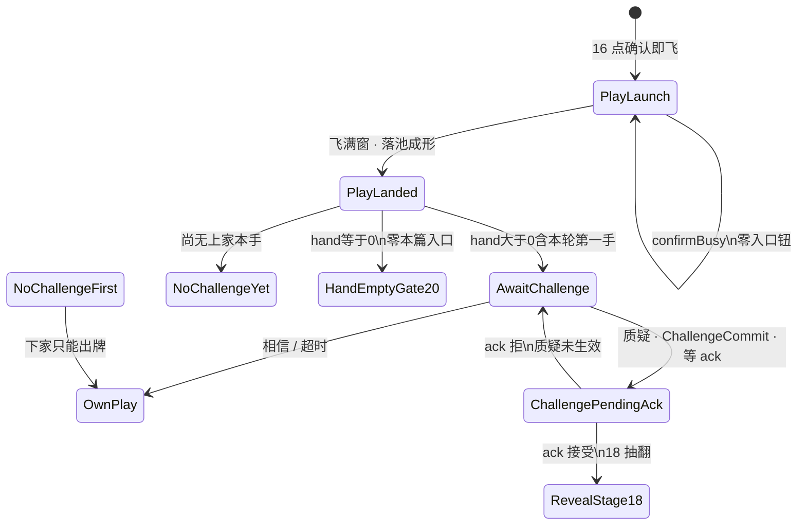

# 17 · 局内质疑入口规格（第2节 · 入口 only）

| 项 | 内容 |
|----|------|
| 版本 | **v0.4.0** |
| 状态 | **第2节入口会签草案**（PM）· **v0.3.0 废「真/假」同义质疑**：**质疑\|相信** 同层二键 · **质疑 ≠ 相信** · **v0.3.1 Rebuild F2/F4**：ChallengeCommit 全员可见层 · 本局宣称+轮到谁改左上 · 线框闸 · **靶 = 池上本手** · **v0.3.2 R2**：第二人可质疑第一手 / 废第一手禁质疑 · **v0.3.3** 交叉 18 时长 · **v0.3.4 R5**：AwaitChallenge 池上本手牌背可见·张数=`lastPlay.count` · **R6 交叉 11**：法官/荷官句全左上 · 中顶仅倒计时 · **v0.3.5**：F17-28/29/30 交叉 **S18-26～28**（去「待策划补」）· **v0.3.6**：交叉桌槌 **[17a](./17a-局内桌槌表现规格.md)** / **S19**（入口语义一字不改）· **v0.3.7**：§3.9 曾同步 17a v0.1.1 头像旁空白 · **v0.3.8**：§3.9 曾同步 **17a v0.2.0** 四座常驻分锚 · **v0.3.9**：§3.9 曾同步 **17a v0.2.1** 空白带 / 96～120vp · **v0.3.10**：§3.9 曾同步 **17a v0.2.2** TOP 左空离脸 / SELF 贴底座旁 · **v0.3.11**：§3.9 曾同步 **17a v0.2.3**（四向锤头朝荷官 / SELF 金框右空 / 砸向随座）· **v0.3.12**：§3.9 曾同步 **17a v0.2.4**（2.5D 抬大砸小 · 认 #267 · 交叉 S19-14）· **v0.3.13**：§3.9 同步 **17a v0.2.5**（读感加严 · 鸿蒙锁数 1.35/0.88/52/220 · 挂点 **须有明显上下砸读感** · S19-14 短句 **砸无上下读感**）· **v0.4.0**：§3.10 **AI 决策表现交叉**（thinkMs 思考态 / 决策同轨桌槌+F2 / 三人格 P0 不强制名牌 / 禁偷看气泡；策划 [人机对局AI](../02-游戏设计/人机对局AI.md) **v0.1.0** · #279）· 生命交叉烛火主读 · 未会签禁止落 ets |
| 范围 | `lb_scr_table` 上 **`AwaitChallenge` / TrustOrChallenge 入口**：何时挂、**质疑\|相信**同层二选、超时=相信、SFX、禁双轨、揭牌 **只锁门**。**第2节入口 only**（开牌呈现 = **[18](./18-局内开牌区规格.md)**；裁定真/假 = 揭牌结果，**不是**入口；**桌槌砸/搁线框 = [17a](./17a-局内桌槌表现规格.md)**；**AI 思考态/落点/人格外显 = §3.10** 旁挂，不改入口语义） |
| 读者 | UI、美术、策划、测试、鸿蒙、**@LiarBar负责人** |
| 对照 | [对局-状态机](../02-游戏设计/对局-状态机.md)（**规则真源** · Trust\|Challenge · **v2.0.5** · R2/S18-6 · **S18-26～28**）· [质疑入口-状态机](../02-游戏设计/质疑入口-状态机.md)（**v0.2.7**）· [人机对局AI](../02-游戏设计/人机对局AI.md)（**v0.1.0** · thinkMs / 三人格 / S-AI-06 F2 · #279）· [质疑相信-桌槌表现](../02-游戏设计/质疑相信-桌槌表现.md)（策划 **#243** · **v0.2.0**）· [16 落池](./16-局内出牌飞出与身前扣牌规格.md)（**v0.2.0** 落点=`lb_cmp_pool`；飞 **320ms** / `padB` / GAP **一字不改**）· [18 开牌区](./18-局内开牌区规格.md)（ack 后 draw→flip→hold · R1′/**R4** · **v0.1.6** 1000/3000 **不动**）· [17a 桌槌](./17a-局内桌槌表现规格.md)（砸/搁线框）· [20 打光二选](./20-局内打光目标二选规格.md)（hand==0 ≥3 你/上家；=2 强制质疑 **不变**）· [02 命名](./02-组件与资源命名约定.md) · [15 触摸出牌](./15-局内手牌触摸出牌规格.md) · [11 横屏](./11-局内横屏与自适应布局.md) · [14 / 14b 生命烛](./14-局内生命显示规格.md) · [GDD §6.2](../02-游戏设计/GDD.md) · [13 声场](./13-局内声场与伴奏规格.md) |
| 本 PR | **只交文档**。零 ets、零 rawfile、零新媒体文件 |

> **UI 管**：入口闸、同层二选、overlay 落点、`lb_*`、可测失败短句。  
> **策划管**：Trust\|Challenge / 本手语义认 [对局-状态机](../02-游戏设计/对局-状态机.md)（R2：首出落地后下家可质疑）。打光分流认 **20**。  
> **美术管**：**不交**新媒体。入口铬件后补；禁止系统灰钮当终稿；旧「真假键」铬 **不得**再当入口面。  
> 命名：控件 `lb_*`；媒体 `art_*`；音频调用 `lb_sfx_*`。**禁止** `lb_art_*`。

> **SUPERSEDE（v0.3.0 · 2026-09-14 PM 锁）**  
> 废入口「真 / 假」双键同义质疑（v0.1.x～v0.2.1）。旧句 **真 ≠ 过** **改写为** **质疑 ≠ 相信**。  
> 自位身前同层二键：**「质疑」\|「相信」**。  
> - **质疑** → `ChallengeCommit`（揭上家本手 / ack→18）  
> - **相信** → Trust / Pass（**不揭**、续对）  
> **禁止**入口再挂「真」「假」「过」三键问卷。超时 = **相信**。  
> **真 / 假** 只出现在 **揭牌裁定结果**（左轮 Reveal / 18），**不是**入口文案。

> **Rebuild F2 / F4（2026-09-14 · 基线 d2fc046 · SUPERSEDE 局部）：**  
> - **F2 全员可见：** `ChallengeCommit` 之后：NPC 气泡 `lb_cmp_npc_challenge_bubble` + 荷官进场/宣布（dealer enter / `lb_cmp_dealer` announce）+ 开牌舞台（认 18 `lb_cmp_reveal_stage`）须挂在 **桌级 / 全员可见层**（table-wide shared overlay），**禁止**只挂行动座私有层。失败：**质疑无表现**（S18-22 `lb_str_challenge_no_broadcast`）/ **揭牌仅自己见**（S18-23 `lb_str_reveal_self_only`）。  
> - **F4 宣言改左上：** **本局宣称牌**（`lb_txt_claim`）+ **轮到谁**（`lb_cmp_table_tip` / 可复用 dealerLine）→ **顶栏左上（TopStart）**。**不得**叠桌心荷官 / 挡 `lb_cmp_pool`。本条 **只**覆盖这两条 tip，**覆盖** v0.2.1「提示迁出左上」对这两项的禁令（Rebuild 再锁）。失败：**宣言不在左上**。  
> - **R6（交叉 11 · SUPERSEDE 局部）：** **全部**法官/荷官句（含 `lb_txt_judge` / dealerLine / 宣布句）→ **顶栏左上**；**中顶（CenterTop）仅**倒计时 `lb_txt_timer`。Claim + dealerLine **仍**左上。失败：**法官句未全左上**（S18-27 `lb_str_judge_not_top_start`）/ **中顶仍叠宣言**（S18-28 `lb_str_center_top_claim_stack`）。  
> - **R5（本版锁）：** `AwaitChallenge` 期间，`lb_cmp_pool` 上 **本手牌背须可见**；张数 = `lastPlay.count`（1～3）。失败：**质疑窗不见上家本手张数**（S18-26 `lb_str_challenge_no_pile_count`）。  
> - 入口面仍锁 **质疑\|相信**；**禁止**退回 真/假/过。

---

## 0. 边界（写死）

### 0.1 第2节入口写什么 / 不写什么

| 层 | 本文做什么 | 本文不做什么 |
|----|------------|--------------|
| 节 | `PlayLanded` 之后的 **质疑\|相信入口**（可点窗 / 超时） | **开牌区几何 / 抽→翻 / 暗场**（**[18](./18-局内开牌区规格.md)**） |
| 接 16 | 从 **PlayLanded（落池）** 接着写入口闸 | **不改** 第1节 320ms / 露边 10vp / `padB` / `HAND_RING_GAP`；**落点认 16 v0.2.0 = 池** |
| 打光 | hand==0 → **20** HandEmptyGate（≥3 你/上家；=2 强制质疑），**零**本篇质疑\|相信入口 | **不写**你/上家线框数字（认 20）；CollectRedeal 认左轮 |
| 揭牌 | **只锁门**：点 **质疑** 后必须 **ack 后** 才进 18；禁止本地先开 | 不写 56vp / 0.90× / `DRAW_TO_FLIP` / `REVEAL_HOLD`（认 18）；不写裁定公式 |
| 旧轨 | 写死禁双轨（F16-10 / F17-7）；废入口真/假/过 | **不**重画 `lb_scr_challenge` 四拍当完成 |
| 生命 | 交叉一句：生命主读仍 **烛火+熄灭**；左轮 HUD/SFX ≠ 生命计数 UI | 不重开 14 / 14b 六闸 |
| 落地 | 会签后才开 `feat/client-*` | **本 PR 零 ets** |

**硬闸六句：**

1. **入口闸对齐 R2**（认对局-状态机 v2.0.3；`MAX_PLAY=3`；**废**「第一手不可质疑」；质疑只验上家本手；打光 ≥3/=2 与 CollectRedeal **不变**）。  
2. **第1节飞数字不动** — 飞 **320ms**（280～400）、露边 ≥10vp、`padB`、`HAND_RING_GAP=24%` **只交叉 16**。落点 **认 16 v0.2.0 = `lb_cmp_pool`**。  
3. **入口闸** — `PlayLanded ∧ 出牌者 hand>0`（**含本轮第一手**）→ 可点 `AwaitChallenge`（TrustOrChallenge）。下家 **必须**过本闸后才能出牌。**仅**尚无上家本手时禁质疑。  
4. **打光零本入口** — 落地后出牌者 hand==0 → **只** 20 / 左轮 HandEmptyGate，**禁止**挂质疑\|相信。  
5. **旧四拍 / 弱 CTA / 入口真假过 与新入口禁双轨并存**（F16-10 / F17-7 / **入口仍真假过**）。  
6. **揭牌门** — 点 **质疑** 之后必须权威 ack 才进 18；**相信** 路径 **禁止**揭牌。**质疑 ≠ 相信。**

### 0.2 与 16 / 18 / 20 / 左轮

16 只锁到：飞满窗才能进入口；打光不进本篇；禁双轨；**落点 = 池**。  
18 只锁：**ack 接受** 之后的开牌区。  
20 只锁：hand==0 的 ≥3 你/上家 / =2 强制质疑。  
左轮写 Trust\|Challenge / Reveal / Shoot / CollectRedeal。  
**本篇写满 hand>0 入口 UI。** 冲突时：° / ms / vp / `padB` / GAP / 落池 **仍认 16**；开牌位 / 尺 / 暗场 **仍认 18**；打光二选 **仍认 20**；入口可点条件 / **质疑\|相信同层** / 超时 **认本文 PM 锁**。

16 的 `AwaitChallenge` / 左轮 `TrustOrChallenge` 是同一后节拍名族，**不是第二套**。

### 0.3 PM 已锁摘要（必须写死 · 2026-09-14）

| # | 锁 | 本线写死 |
|---|----|----------|
| 1 | **入口何时** | `PlayLanded ∧ 出牌者 hand>0`（**含本轮第一手**）→ 可点 `AwaitChallenge`。下家须过闸后才能出牌；尚无上家本手则禁 |
| 2 | **打光** | 出牌者 hand==0 → **20**（≥3 你/上家；=2 强制质疑），**零**质疑\|相信入口。CollectRedeal 认左轮 **不变** |
| 3 | **飞中** | `PlayLaunch` / `confirmBusy`：**零**质疑\|相信钮 |
| 4 | **质疑 / 相信** | **同层两颗钮**，禁止嵌套。**质疑** → ChallengeCommit + `lb_sfx_challenge_commit` → 等 ack → **[18](./18-局内开牌区规格.md)**。**相信** → Trust/Pass（**不揭**、续对）。**质疑 ≠ 相信** |
| 5 | **废第三键「过」** | 入口 **不再**挂 `lb_btn_challenge_pass` 当第三主钮。Trust 文案 = **「相信」**。超时仍 = **相信**（静默） |
| 6 | **超时** | 推荐 **10s**（窗 **8～12**）。倒计时环 **可选**。到点 = **相信**，**不是**自动质疑 |
| 7 | **揭牌门** | **仅质疑**等 ack 后进 18；相信路径禁揭。禁止本地先开 |
| 8 | **SFX** | 入口出现 → `lb_sfx_challenge_enter`；点 **质疑** → `lb_sfx_challenge_commit`。相信 / 超时 **禁止**强制 commit SFX |
| 9 | **失败文案** | 权威拒仍单一 key `lb_str_challenge_reject` = **质疑未生效** |
| 10 | **旧轨** | 旧四拍 / 弱 CTA / **入口真假过三键** **FORBIDDEN** |
| 11 | **布局 · 身前** | 自位 `AwaitChallenge` 时 `lb_cmp_challenge_entry` 落在 **自位身前**（环–手带内），**禁止**只贴 BottomEnd。热区各 **≥44vp**；**不**抬 `padB` / **不**改 GAP；不得盖手牌主行、生命烛、池心、宣称 |
| 12 | **靶** | 质疑对象 = **`lb_cmp_pool` 上本轮这一手**。**不是** `lb_cmp_play_front_pile` |
| 13 | **宣言改左上（F4 · SUPERSEDE v0.2.1）** | **本局宣称牌** `lb_txt_claim` + **轮到谁** `lb_cmp_table_tip`（可复用 dealerLine）→ **顶栏左上 TopStart**；不得叠桌心 / 挡池。失败：**宣言不在左上** |
| 18 | **R5 池上本手可见** | `AwaitChallenge` 时池上本手 **牌背可见**；张数 = **`lastPlay.count`**。禁隐本手 / 张数错。失败：**质疑窗不见上家本手张数**（S18-26 `lb_str_challenge_no_pile_count`） |
| 19 | **R6 法官句左上（交叉 11）** | 全部法官/荷官句 → 顶栏左上；中顶 **仅** `lb_txt_timer`。失败：**法官句未全左上**（S18-27 `lb_str_judge_not_top_start`）/ **中顶仍叠宣言**（S18-28 `lb_str_center_top_claim_stack`） |
| 14 | **NPC 气泡** | `lb_cmp_npc_challenge_bubble`：NPC 座选 **质疑/相信** 时短气泡「质疑」/「相信」；HitTest None；**1000ms**（800～1200）；静音；自位不用。**真/假**不进本气泡（裁定结果另见 18） |
| 15 | **生命交叉** | 生命主读仍 **烛火+熄灭**（14 / 14b）。左轮 HUD/SFX 可作开枪反馈，**不是**生命计数 UI |
| 16 | **全员可见层（F2）** | `ChallengeCommit` 后：NPC 气泡 + 荷官进场/宣布 + 18 `lb_cmp_reveal_stage` = **桌级共享层 / 全员可见**；禁行动座私有。失败：**质疑无表现** / **揭牌仅自己见** |
| 17 | **本票范围** | **只交文档**。零 ets / 零 rawfile / 零新媒体。合入 ≠ 终验 |
| 20 | **桌槌表现（v0.3.13 · 旁挂 17a v0.2.5）** | 四座常驻；质疑=就地 **2.5D 抬大砸小**（鸿蒙锁数：`1.0→1.35` + `−LIFT_VP=−52` + 顶点/持面 **220ms** → `0.88` 贴桌 + 阴影离合；四座同一深度轨 + 分座 `restRot`）；相信=槌不动。分锚 / 朝向 / 砸轨 / 尺 / 层序 / 调试认 **[17a](./17a-局内桌槌表现规格.md) v0.2.5**。挂点 **须有明显上下砸读感** / **砸像平面滑** → **S19-14**（短句 **砸无上下读感**，兼像平面横滑）。入口语义、身前二键、超时=相信、GAP=24%、禁抬 `padB`、开牌 1000/3000、R6 中顶只 timer **不动** |
| 21 | **AI 决策表现（v0.4.0 · 旁挂 §3.10）** | 决策数字认引擎 **#279** / 策划 [人机对局AI](../02-游戏设计/人机对局AI.md) **v0.1.0**。UI 只锁：思考态 `thinkMs ∈ [thinkMsMin, thinkMsMax]`（复用 `lb_cmp_npc_challenge_bubble` 思考态）· **禁**空想无延迟瞬点；落点 **同轨** 桌槌 + F2 全员可见 · **禁**只左上字变；三人格 **P0 不强制**名牌外显（若做：仅调试/旁观，正式局不挡桌心）；**禁**揭前真伪改气泡（交叉 `lb_str_ai_peek`）。入口语义 / 17a 数字 / 开牌 1000/3000 / GAP=24% / 禁抬 `padB` **不动** |

---

## 1. 拍表（接 16 · 不另造引擎阶段）

逻辑阶段仍报左轮 / GDD：`TURN` →（质疑则）Reveal / Shoot / CollectRedeal。  
下表是 **桌上质疑\|相信入口 UI 拍**，挂在 16 的 `PlayLanded` 之后。**不**把 `AwaitChallenge` 加成新 `phase`。

```
ConfirmReady → PlayLaunch（confirmBusy · 零入口钮）→ PlayLanded（落 lb_cmp_pool）
                 ├─ 出牌者 hand > 0（含本轮第一手） → AwaitChallenge（可点 质疑|相信）
                 ├─ 尚无上家本手（无人出过牌）     → 零可点入口
                 └─ 出牌者 hand == 0           → HandEmptyGate / 20（零本篇入口）
AwaitChallenge → 相信 / 超时 → OwnPlay（下座出牌 · 认 15；不揭）
AwaitChallenge → 质疑 → ChallengeCommit + lb_sfx_challenge_commit → ChallengePendingAck（等 ack）
                 → 18 RevealDraw→RevealFlip（裁定真/假 / 开枪认左轮；本线只锁门）
AwaitChallenge → 权威拒质疑 → 质疑未生效（可回到入口，不得留下已揭）
质疑 ≠ 相信。相信不得揭牌。质疑不得当相信卸入口自出牌。
```



| UI 拍 | 左轮 / GDD | 画面 | 玩家能做什么 |
|-------|------------|------|--------------|
| **PlayLaunch** | PLAY 飞中 | 飞出中；`confirmBusy=true` | **零** `lb_btn_challenge_*` 入口钮 |
| **PlayLanded** | 本手刚落池 | 池上本手堆已成形（数字认 16） | 立刻按 §2 分流 |
| **AwaitChallenge** | TrustOrChallenge | `lb_cmp_challenge_entry` 在；**质疑\|相信**同层可点；可选环；**池上本手牌背可见**（张数=`lastPlay.count` · R5） | 点质疑 / 相信。超时视为相信。对象 **只** 池上刚刚那一手 |
| **NoChallengeFirst** | TURN（下家） | 池上本手在；**无**可点入口 | 只能出牌 |
| **HandEmptyGate20** | HandEmptyGate | 认 **20**：≥3 你/上家；=2 强制质疑 | **零**本篇质疑\|相信 |
| **ChallengePendingAck** | 已发 Challenge，等权威 | 入口应收或 `_disabled`；**池上仍牌背** | **仅质疑**进本拍。**禁止**本地先翻。ack 后才进 **18** |

**写死：** `AwaitChallenge` 是 UI 拍名。日志 / 实况窗仍报左轮 / GDD 阶段。

**谁看见入口：** 只挂给 **当前行动座**（下家 / `canChallenge` 的那座）。出牌者自己的桌 **不再**挂一套可点入口。四座同时亮可点入口 = 不过。

**AI 座（v0.4.0 · 旁挂）：** 进入出牌 / 质疑\|相信决策前须 `ThinkHold`（`thinkMs ∈ [thinkMsMin, thinkMsMax]`），再落点。**禁**空想无延迟瞬点。线框认 **§3.10**。不另造引擎 `phase`。

---

## 2. 入口闸（PM 已锁）

### 2.1 可点入口（写死）

同时满足才挂 **可点** `lb_cmp_challenge_entry`（质疑 / 相信 `_enabled`）：

```
PlayLanded
AND lastPlay != null
AND lastPlay 已落池成形          // 16 v0.2.0：在 lb_cmp_pool
AND lastPlay.actor.hand.count > 0
AND lastPlay != null               // 已有上家本手（含本轮第一手落地；R2 废 isFirstOfRound 挡）
AND lastPlay.actor 未因本手打光入 emptyOrder
AND current.ALIVE
AND 当前座 = 该手的下家行动座
```

与左轮 / 策划 `canChallenge` 对齐。  
**本线加严：** 飞未满窗 / `confirmBusy` / 出牌者 hand==0 → **连入口容器都不要可点**。

| 落地后 | 下一拍 | 可点质疑\|相信 |
|--------|--------|----------------|
| 出牌者 hand **>0**（**含本轮第一手**） | `AwaitChallenge` | **要** |
| 尚无上家本手（无人出过牌） | 零可点入口（可空、或 `_disabled` + `lb_str_challenge_disabled_first`） | **禁止** 首出落地后仍挡 |
| 出牌者 hand **==0** | **20** HandEmptyGate | **禁止**（零本篇入口） |
| 仍在 `PlayLaunch` / `confirmBusy` | 飞续 | **禁止** |

下家在本闸未决时直接出牌 = **能跳过出牌**。入口应亮却不可见 / 被挡死 = **质疑入口看不见**。

### 2.2 第一手（G-Q6 翻 · R2 · 写死）

本轮第一手 PlayLanded 后：下家 **必须可质疑**（进 `AwaitChallenge`）。

- **废**「第一手不可质疑」/ `isFirstOfRound` 粘性禁窗。  
- **仅**尚无上家本手（无人出过牌）时：不挂入口，或 `_disabled` + `lb_str_challenge_disabled_first`。  
- 首出落地后下家不能进窗 / 键禁用 = **第二人不可质疑第一手**（F17-1 / 对局 **S18-6**）。

### 2.3 打光（零本篇入口 · 写死）

`PlayLanded` 后出牌者 `hand.count==0`：

1. **只**进 **20** / 左轮 HandEmptyGate（≥3 你/上家；=2 强制质疑）。  
2. **禁止**进本篇 `AwaitChallenge` / 挂质疑\|相信。  
3. CollectRedeal 在开枪后认左轮 **不变**。  

落地后 hand==0 仍亮本篇入口 = **打光者仍被质疑**（与 F17-2 / 20 交叉）。

### 2.4 飞中 / `confirmBusy`（零钮 · 写死）

`PlayLaunch` 全程与任何 `confirmBusy=true`：

- **零** `lb_btn_challenge_doubt` / `_believe`。  
- **零**旧 `lb_btn_challenge_true` / `_false` / `_pass` / `lb_btn_challenge`。  
- 入口容器不挂、或 `Visibility.None`。

飞未满窗就挂可点入口 = 16 **飞出被跳过进质疑**（F16-7）仍有效；本线另记 **飞中出质疑钮**（F17-3）。

### 2.5 质疑只验上家本手（写死 · 靶 = 池）

| 要 | 不要 |
|----|------|
| `targetPlayId = lastPlay.playId` | 翻本轮历史所有、坟场、别人的旧手 |
| 靶 = **`lb_cmp_pool` 上刚刚那一手** | 点入口去揭手牌 / 身前扣区 / `lb_cmp_play_front_pile` |

入口指向非 `lastPlay` = **质疑非上家本手**（F17-4）。

### 2.5a R5 · AwaitChallenge 池上本手牌背可见（2026-09-15 · 写死）

**写死：** `AwaitChallenge` / TrustOrChallenge 窗口期间，`lb_cmp_pool` 上 **本手牌背必须可见**；可见张数 = 引擎 **`lastPlay.count`**（与 16 落池张数一致，1～3）。

| 必须 | 禁（=失败 **质疑窗不见上家本手张数**） |
|------|----------------------------------------|
| 池上本手牌背清晰可读（`art_card_back`） | 隐本手 / 空池 / 只留数字无牌背 |
| 张数 = `lastPlay.count` | 张数错 / 多显示历史他手冒充本手 |
| 入口可点时本手仍在池（未提前抽走） | 进窗前就抽空本手致「不见张数」 |

**失败短句：** **质疑窗不见上家本手张数**（F17-28 · S18-26 `lb_str_challenge_no_pile_count`；已入 `string.json` / #201）。


### 2.6 超时（10s · 窗 8～12）

| 项 | 锁 |
|----|-----|
| 推荐 | **10s** |
| 窗口 | **8～12s** |
| 到点 | **视为相信**（不自动质疑、不揭牌） |
| 倒计时环 | **可选**（`lb_cmp_challenge_timer`） |

短于 8s 闪过、长于 12s 还赖着可点 = **卡死 AwaitChallenge**（F17-9）。

### 2.7 揭牌门（仅质疑 · ack 后进 18）

点 **质疑** → ChallengeCommit + `lb_sfx_challenge_commit` → 发 Challenge → **等权威 ack** → **[18](./18-局内开牌区规格.md)**。  
点 **相信** / 超时 → Trust/Pass → **禁止**进 18 / **禁止**揭面。

| 要 | 不要 |
|----|------|
| ack **接受** 之后才进 18 | 点质疑立刻本地翻池 / 开牌区 |
| ack **拒绝** → `lb_str_challenge_reject` = **质疑未生效** | 拒了还留揭开面 |
| 相信路径不揭 | 相信仍进 Reveal / 仍翻牌（= **相信仍揭牌**） |
| 质疑必揭（ack 后） | 点质疑却卸入口自出牌、跳过 ChallengeCommit（= **质疑未揭** / 当相信） |

**禁止本地先开。** **质疑 ≠ 相信。**

---

## 3. 线框（入口 · 不重开第1节数字）

评委 / 鸿蒙 / 测试 **只认下表**。飞出 ms / 露边 / 池锚 **仍认 16 §2**，开牌位 **仍认 18**，打光 **仍认 20**。

### 3.1 Overlay 族 · **自位身前**

`lb_cmp_challenge_entry` 与 `lb_cmp_play_confirm_bar` **同一家族**（overlay 兄弟），但 **自位 AwaitChallenge 落点加严**：

- `Stack` **overlay**，与 `handPin` **兄弟**  
- **禁止**进 `handPin`  
- **自位身前**：手牌行之上、环–手空隙内 — **禁止**只贴 BottomEnd  
- 与可选 `lb_cmp_challenge_timer` **同容器**  
- 热区质疑/相信各 **≥44vp**；不得盖手牌主行、`lb_cmp_life_*` 烛、池心、`lb_txt_claim`  
- **禁止**第三颗「过」主钮；**禁止**入口面写「真」「假」

确认条与质疑入口 **不得同时可点**。`AwaitChallenge` 时确认条收起；**相信 / 超时** 之后入口卸掉，选牌后再出 15 确认条。**质疑** 走 ChallengeCommit → 等 ack，**不得**卸入口当相信自出牌。

```
│  [TopStart 禁挂：本轮出 X / 轮到你]                     │
│     桌心 bust + lb_cmp_pool（本手堆 · 不挡）            │
│        lb_txt_claim「本轮出 X」≈ 池/荷官宣称带          │
│     ░ 环-手 24%（HAND_RING_GAP 数字不动）░             │
│           ╱[背]│[背]╲  ← 池心不被入口盖住             │
│         本手在池 · HitTest None（认 16）               │
│     ┌─ lb_cmp_challenge_entry（自位身前）─┐            │
│     │   【 质疑 】    【 相信 】         │  overlay   │
│     │      （可选 timer 环）              │  ≠ handPin │
│     └─────────────────────────────────────┘            │
│  selfDock │  [手][手][手][手][手]  ← 入口不压手行     │
│           └─ 手牌底缘贴底安全区上沿 ─┘                  │
│     ░ 顶栏左上：lb_txt_claim + lb_cmp_table_tip「轮到谁」（F4）░        │
│         ░ padB = 仅 inset · 禁加大 ░                   │
```

**禁（入口面）：** `【 真 】【 假 】` / `【 真 】【 假 】【 过 】` = **真假当入口** / **入口仍真假过**。

**不过（布局）：** 只缩在右下角 = **真假键贴边角**（锁词可沿用，对象改为质疑\|相信键贴边角）；压手或烛 = **真假键压手或烛**；挡池心 = **真假键挡池心**。

### 3.2 质疑 / 相信：同层两颗钮（写死）

| 要 | 不要 |
|----|------|
| `lb_btn_challenge_doubt` 与 `lb_btn_challenge_believe` **同一层、并排** | 先点总钮再拆；或入口再挂真/假 |
| 两颗都是主热区，热区各 **≥44vp** | 一颗总钮冒充二选；或保留第三「过」主钮 |
| 可见文案：**质疑** / **相信** | 可见文案「真」「假」「过」当入口；复用押注 `lb_btn_bet_true` / `_fake` |

| 钮 | 语义 | SFX | 下一拍 |
|----|------|-----|--------|
| **`lb_btn_challenge_doubt`** | **质疑**：揭上家本手 | `lb_sfx_challenge_commit` | **ChallengeCommit** → 等 ack → **18**。**质疑 ≠ 相信** |
| **`lb_btn_challenge_believe`** | **相信**：不揭、续对 | **禁止**强制 commit SFX | Trust/Pass → OwnPlay（15）。等同超时 |
| ~~`lb_btn_challenge_true` / `_false`~~ | **废入口**（历史 id） | — | **不得**再当入口可点。若字符串表暂留旧 key，**映射**：true/false **均不得**表达入口二选；入口只认 doubt/believe |
| ~~`lb_btn_challenge_pass`~~ | **废第三入口钮** | — | 超时 / 相信路径吸收其旧 Pass 语义；**不得**再挂第三主钮 |

嵌套、只挂一颗、或入口仍真/假（同义质疑）= **真假非二选** / **真假当入口**。

**真 / 假（裁定）：** 仅在 18 / 左轮 Reveal 后出现（真→质疑者开枪；假→上家开枪）。**禁止**把裁定真假键挪回入口。

### 3.3 相信（静默 · 吸收旧「过」）

- **相信** 在入口同层，**不是**第三套主屏。  
- **禁止**强制 `lb_sfx_challenge_commit` / enter / flip / launch / land / deal / reveal_*。  
- 相信 ≠ 旧仪式跳过 `lb_btn_challenge_skip`。  
- 相信之后不得留在 `AwaitChallenge`。相信 **不**进 18。  
- 超时 = 相信。

### 3.4 热区与可选环

| 项 | 锁 |
|----|-----|
| 质疑 / 相信 热区 | 各 **≥44vp** |
| `lb_cmp_challenge_timer` | **可选** |
| 无环 | **允许**（超时仍须按 §2.6 卸入口） |

### 3.5 不得遮池或声明 / 不得压手烛（写死）

| 不得盖 | 谁 | 本线失败短句 |
|--------|-----|--------------|
| 池上本手 **心** | `lb_cmp_pool` | **真假键挡池心** / **质疑遮扇或声明** |
| 宣称文案 | `lb_txt_claim` | **质疑遮扇或声明** |
| 手牌主行 / 生命烛 | `lb_cmp_life_*` | **真假键压手或烛** |

### 3.6 禁抬 `padB` / 禁改 GAP

与 15 / 16 同一句：不加大 `padB`；不改 `HAND_RING_GAP=24%`；不重开 11 flush / tip。

### 3.7 宣言改左上（v0.3.1 · F4 · SUPERSEDE v0.2.1「提示迁出左上」· 仅两项）

| 元素 | id | 家（Rebuild 再锁） | 禁止 |
|------|-----|-------------------|------|
| **本局宣称牌** | `lb_txt_claim` | **顶栏左上 TopStart** | 叠桌心荷官 / 挡 `lb_cmp_pool`；仍放桌心侧冒充完成；**中顶叠宣言**（R6） |
| **轮到谁** | `lb_cmp_table_tip`（可复用 dealerLine） | **顶栏左上**（与宣称同角或紧邻，不互相挡） | 底中 toast 当本两项主读；叠桌心 / 挡池 |
| **法官/荷官句（R6）** | `lb_txt_judge` / dealerLine / 宣布句 | **顶栏左上**（与宣称同角族） | 落中顶 / 桌心冒充完成 = **法官句未全左上** |
| **倒计时（R6）** | `lb_txt_timer` | **中顶 CenterTop 专席**（本角 **仅**倒计时） | 中顶叠宣称/法官句 = **中顶仍叠宣言** |

**写死：** 本条 **只**覆盖「本局宣称牌 + 轮到谁」两项；**覆盖** v0.2.1「提示迁出左上」对这两项的禁 TopStart。其它 tip（含已删 first-hand empty tip）**不**借本条回迁。  
**不过：** **宣言不在左上** / **宣称挡荷官脸**（叠桌心）/ 挡池。

### 3.7b 全员可见层（v0.3.1 · F2）

`ChallengeCommit` 之后的表现层写死：

| 层 | id / 挂点 | 可见性 |
|----|-----------|--------|
| NPC 气泡 | `lb_cmp_npc_challenge_bubble` | **桌级 / 全员可见**（非行动座私有） |
| 荷官进场/宣布 | `lb_cmp_dealer` announce / dealer enter | 同上 |
| 开牌舞台 | `lb_cmp_reveal_stage`（认 18） | **共享 overlay**；全员可见 |

**不过：** **质疑无表现**（commit 后无气泡/无荷官进场）/ **揭牌仅自己见**（舞台只挂行动座私有层）。

### 3.8 NPC 质疑\|相信气泡（v0.3.0 改写）

| 项 | 锁 |
|----|-----|
| id | **`lb_cmp_npc_challenge_bubble`**（可带座后缀） |
| 何时 | NPC 座选出 **质疑** 或 **相信** 的同一 onset |
| 文案 | 短气泡 **「质疑」** / **「相信」**（**不是**「真」「假」） |
| 锚点 | 该座头像 / 座框旁 |
| HitTest | **`HitTestBehavior.None`** |
| 时长 | **1000ms**（800～1200） |
| 自位 | 人类 self **不用** |
| SFX | 气泡静音；质疑 commit 声认 `lb_sfx_challenge_commit` |

**不过：** **NPC无选向气泡** / **气泡压烛或脸** / **自位误挂NPC气泡**。NPC 气泡仍写「真」「假」当入口方向 = **真假当入口**（交叉）。

**思考态（v0.4.0）：** 选向气泡 **之前** 须先播思考（`thinkMs`）。可复用本 id 思考态；文案 `lb_str_npc_challenge_thinking`。细节与人格边界认 **§3.10**。选向 1000ms / 静音 / HitTest None / F2 **本表不动**。

### 3.9 桌槌表现（v0.3.13 · 线框认 17a v0.2.5 · 入口语义不动）

跟票策划 #270 / client #271：每座头像旁 **常驻** 一把木槌；**相信=槌不动**；**质疑=该放置点就地 2.5D 抬砸→回搁**（抬 `scale 1.0→1.35` + 屏上 `−LIFT_VP=−52` + 顶点/持面 **220ms**；砸 `→0.88` 贴桌 + 阴影收实 + hit；四座同一套深度轨，再叠各座 `restRot`）。**须有明显上下砸读感**。静置锤头朝荷官（仅四向）。SELF 锚=**金框右空**。人模静态贴图 **零改**。全员同轨（F2）。**分锚表 / 静置朝向表 / §4 砸轨数字 / 尺寸闸 / 层序 / 调试 = [17a v0.2.5](./17a-局内桌槌表现规格.md)**（对齐策划 **S19-1～14**，**勿另造短句 key**；**S19-14 短句 = 砸无上下读感**（#270；兼像平面横滑；不新开号）；认策划 #270 / client #271）。

| 锁 | 数字 / id |
|----|-----------|
| 层 | `lb_cmp_choice_act`：全员桌面层；`HitTest None`；四座常驻 |
| 正式 ACK | 质疑座播 **2.5D 抬砸**（同一深度轨 + 该座 `restRot`）；相信座 **保持静置可见即可**（不播搁动画） |
| 调试 | 立刻只播 **本地玩家座位**（质疑=2.5D 抬砸 + 该座 restRot；相信=确认静置零位移）；**零业务** |
| 锚 | **self / p1 / p2 / p3 各写各的**（认 17a §2 / §2.2）。左座=头像右侧空（朝桌心）；右座=头像左侧空（朝桌心）；对家=头像**左空/侧空且离脸**（槌右缘在 44vp 脸左外缘外 8～16vp；建议 DX −120～−128）；自机=**底座金框右空**（贴 `selfDock` 金框右外缘 +8～16；废上旁主锚；禁上漂桌心、禁贴屏左缘、禁压手）。**禁止**一套坐标四座复用。**废**「环–手带 / 二键簇上沿外 8～16vp」主锚 |
| 朝向 | 认 17a §2.3。锤头=槌头端指向荷官。路径：单朝 +X → `restRotOf`。TOP ↓ +90° / SELF ↑ 270° / LEFT → 0° / RIGHT ← +180°。**仅四向**。禁斜向 / 一套旋角四座复用 / 先烤 12 张 |
| 尺 | 常驻显示边长 **96～120vp**（认 17a §2.1；client **112** 在窗内，不动）。**72** 缩略主读 = 不过。抬砸同画幅 |
| 质疑=砸 | 该座放置点 **就地 2.5D 抬砸**（认 #271 / 17a §4：抬 `1.0→1.35` + `−LIFT_VP=−52` + 顶点/持面 **220ms** + 阴影变大变淡；砸 `→0.88` 贴桌 + 阴影收实 + hit）→回搁并恢复该座静置朝向。四座同一深度轨（屏上 −Y），朝向靠 `restRot`。砸点=放置点附近空白。**禁飞牌心 / 池心**。**禁 XY 横滑主轨**。**须有明显上下砸读感**（无近大远小 / 无阴影离合 / 像平面滑 = 不过） |
| 相信=静置 | **槌不动**。朝向保持 §2.3。废「相信也播搁置动画」 |
| 禁压 | `lb_cmp_hand` / `lb_cmp_pool` / 烛 `lb_cmp_life_*`。自机勿压手牌；AI 勿贴牌堆 |
| 调试二键 | `lb_btn_debug_hammer_doubt` / `_believe`（挂 `lb_cmp_debug_life`）。**零业务**。`DebugBuild` 隐 |
| 美术 / SFX | 只登记：`art_fx_mallet` / `_up` / `_hit`；`lb_sfx_hammer_hit` / `lb_sfx_hammer_rest` |
| 挂点 | 无徽只改左上字 → S19-1/2。**须有明显上下砸读感**（无近大远小 / 无阴影离合 / 像平面滑）/ **砸像平面滑** → **S19-14**（短句 **砸无上下读感**，兼像平面横滑）。**静置锤头不朝荷官** / **四座同旋不同向** / **砸向不随座** → **S19-13**。**对家槌盖脸** / **SELF 不在金框右空** / **自机槌飘桌心** → **S19-10**。自机压手 → **S19-12**。锚进手牌行 → S19-5/7/12。砸点贴牌心 → S19-9。相信还在动 → S19-8。**槌过小看不见** / **右座无槌** / **三把全偏左** / **贴屏幕外缘** = 挂点（可交叉 S19-2/4/10/11） |
| **不动** | 入口语义 / 身前二键 / 超时=相信；`HAND_RING_GAP=24%` / 禁抬 `padB`；开牌 **1000/3000**；R6 中顶只 timer |

**不过（只抄策划 S19，不新造 key）：** **质疑无锤砸** / **相信无常驻锤** / **锤仅自己见** / **砸与搁不可辨** / **锤挡池或手** / **调试锤走了业务** / **锤压在牌上** / **相信还在动** / **砸点贴牌心** / **槌不在空位** / **压牌** / **锤头朝向错** / **砸无上下读感**。见 §8 F17-31～43。本版挂点：**须有明显上下砸读感** / **砸像平面滑**（交叉 **S19-14**；短句 **砸无上下读感**，兼像平面横滑）/ **静置锤头不朝荷官** / **四座同旋不同向** / **SELF 不在金框右空** / **砸向不随座**。

**软挂点：** `HOLD_MS=1000` 已在 0.8～1.2s 窗内。`MALLET=112` 过尺闸。2.5D 砸轨已合 #271（`RAISE_SCALE=1.35` / `SMASH_SCALE=0.88` / `LIFT_VP=52` / `CONTACT_HOLD_MS=220` / 阴影）；朝向已合 #262；美术三帧 +X 已合 #264。`string.json` 现帧 value 已合 #270 **砸无上下读感**。本票 **零 ets**。合入 ≠ 终验。

### 3.10 AI 决策表现交叉（v0.4.0 · 旁挂 · 策划 [人机对局AI](../02-游戏设计/人机对局AI.md) v0.1.0 / #279）

跟票策划 **#276** / 实装 **#279**。决策分值 / 三人格阈值 **认引擎**；本文只锁 **思考态 + 落点同轨 + 人格外显边界 + 禁偷看气泡**。  
**不改** §2 入口闸、§3.2 质疑\|相信语义、§3.9 / [17a](./17a-局内桌槌表现规格.md) 桌槌数字、开牌 1000/3000、GAP=24%、禁抬 `padB`。

| 锁 | 写死 |
|----|------|
| **思考态** | AI 进入 **出牌（D1）/ 质疑\|相信（D2）** 决策前，须播思考表现，时长 `thinkMs ∈ [thinkMsMin, thinkMsMax]`（人格 JSON；域 **400～1200**；上限 ≤ `turn_seconds - 2`）。**可复用** `lb_cmp_npc_challenge_bubble` **思考态**（质疑门文案 `lb_str_npc_challenge_thinking` = **选择质疑/相信…**；出牌门同组件思考态，**禁**揭前真伪句）。HitTest None；桌级全员可见（F2）。**禁**空想无延迟瞬点（`thinkMs=0` / 跳过思考直接 commit） |
| **决策落点** | AI 质疑\|相信 **同轨** 人类：选向气泡（§3.8）+ **17a 桌槌**（质疑=2.5D 抬砸 / 相信=槌不动）+ F2 全员可见。**禁**只改左上字冒充完成 |
| **三人格** | `AI_KAREN` / `AI_TIMID` / `AI_SHARK` 决策差异 **在引擎**（#279）。座框 `art_ai_*` 既有头像 **不是**本票新交。UI **P0 不强制**人格名牌外显。**若做外显**：仅调试 / 旁观可选层；正式局 **不挡桌心**（不挡 `lb_cmp_pool` / 荷官 / 宣称主读；中顶仍只 timer） |
| **禁偷看表现** | UI **不得**因揭前「真伪」（未揭 `trueRanks` / 他座手牌）改气泡文案。气泡只「思考…」→「质疑」/「相信」。禁「真」「假」。交叉策划 **`lb_str_ai_peek`**（**AI偷看**） |
| **不动** | 17a 桌槌数字 / 朝向 / 2.5D；开牌 **1000/3000**；`HAND_RING_GAP=24%`；禁抬 `padB`；质疑\|相信入口语义 |

**失败短句（只交叉 · 不新造 key / 不新开 F17 号）：**

| 不过 | 交叉 |
|------|------|
| AI 质疑无进窗 / 无气泡 | **质疑无表现**（F17-26 / F2 / S18-22）· **NPC 抉择无反馈**（S17-16）· **S-AI-06** |
| 空想无延迟瞬点 | 同上 S17-16（无思考起势） |
| 只左上字变、无槌 / 无全员层 | **质疑无锤砸**（F17-31 / S19-1）· **质疑无表现**（F17-26） |
| 揭前真伪改气泡 / GodView 喂表现 | **`lb_str_ai_peek`** / **AI偷看**（策划/测试主读 · S-AI-01/02） |
| 假 AI 脚本冒充落点 | **`lb_str_ai_fake_decision`** / **AI假决策**（策划/测试主读 · 本篇一句交叉） |

`lb_str_ai_peek` / `lb_str_ai_fake_decision` **归策划/测试**（[人机对局AI](../02-游戏设计/人机对局AI.md) §8 · [人机对局AI验收勾选清单](../06-质量/人机对局AI验收勾选清单.md)）。UI 挂点 **只交叉**，不另造短句。本票 **零 ets**。合入 ≠ 终验。

---

## 4. 控件 id（草案 · 回写 02）

| id | 类型 | 何时 | 说明 |
|----|------|------|------|
| `lb_cmp_challenge_entry` | 组件 | AwaitChallenge 可点窗 | 入口容器。**自位身前** overlay ≠ `handPin` |
| **`lb_btn_challenge_doubt`** | 按钮 | 同上 | **质疑**。与相信同层。→ ChallengeCommit + 等 ack |
| **`lb_btn_challenge_believe`** | 按钮 | 同上 | **相信**。与质疑同层。→ Trust/Pass；静默。超时等同本钮 |
| `lb_cmp_challenge_timer` | 组件 | 可选 | 倒计时环 |
| `lb_cmp_table_tip` | 组件 | 轮到谁 tip | **F4** 顶栏左上（可复用 dealerLine）；不得叠桌心/挡池 |
| `lb_cmp_npc_challenge_bubble` | 组件 | NPC 思考态 / 选向 | **v0.4.0** 先思考（`thinkMs` · `lb_str_npc_challenge_thinking`）再「质疑」/「相信」；HitTest None；选向 1000ms；静音；**F2** 桌级全员可见。思考态细节认 §3.10 |
| **`lb_cmp_choice_act`** | 组件 | ACK 后 / 调试立刻 | **17a** 全员锤层；HitTest None；池上；不挡点。线框认 [17a](./17a-局内桌槌表现规格.md) |
| **`lb_btn_debug_hammer_doubt`** | 按钮 | 仅 debug | 挂 `lb_cmp_debug_life`；只播**本地座**砸；零业务 |
| **`lb_btn_debug_hammer_believe`** | 按钮 | 仅 debug | 挂 `lb_cmp_debug_life`；只播**本地座**搁；零业务 |

### 4.1 废入口 id（可留档 · 不得与新入口同时可点）

| 旧 id | 状态 | 说明 |
|-------|------|------|
| `lb_btn_challenge_true` | **废入口** | 历史「真」。若字符串表暂留，**不得**再作入口面；映射见 §3.2 |
| `lb_btn_challenge_false` | **废入口** | 历史「假」。同上 |
| `lb_btn_challenge_pass` | **废第三入口钮** | 旧「过」语义由 **相信** / 超时吸收 |
| `lb_scr_challenge` + 四拍 | 禁双轨 | 旧全屏仪式轨 |
| `lb_btn_challenge` | 禁双轨 | 旧弱 CTA |
| `lb_btn_bet_true` / `_fake` | 非本入口 | 旁观押注 |
| `lb_btn_challenge_skip` | 非相信 | 仪式跳过 |
| `lb_cmp_play_front_pile` | 非靶 | 16 废主读 |

见双轨 = **质疑双轨并存**。入口仍真/假/过 = **入口仍真假过** / **真假当入口**。

本 PR **不交** PNG / rawfile。

---

## 5. SFX（调用点 · 不交文件）

| 调用点 | 何时 | 本线交文件？ |
|--------|------|----------------|
| **`lb_sfx_challenge_enter`** | 入口出现 | **否** |
| **`lb_sfx_challenge_commit`** | 点 **质疑** 按下 | **否** |
| **`lb_sfx_hammer_hit`** | **17a** 质疑锤砸落（ACK 后 / 调试·质疑锤） | **否**。对齐 #236；禁 flip/launch/land/enter/commit/reveal_* 冒充 |
| **`lb_sfx_hammer_rest`** | **17a** 相信锤搁置（ACK 后 / 调试·相信锤） | **否**。轻顿或静默；禁强制 commit / hit |
| 相信 / 超时 | **禁止**强制 **入口** commit SFX | 锤搁声认 `lb_sfx_hammer_rest`（17a），**不是** commit |
| NPC 气泡 | 静音 | **否** |

**禁止：** flip / launch / land / deal / reveal_* 冒充入口；过/相信还强制响 commit；本 PR 往 `rawfile/audio/` 丢文件。

---

## 6. 文案

| key | 默认中文 | 何时 |
|-----|----------|------|
| **`lb_str_challenge_doubt`** | **质疑** | 入口按钮可见字（锁；对齐左轮 / #172） |
| **`lb_str_challenge_believe`** | **相信** | 入口按钮可见字（锁；对齐左轮 / #172） |
| **`lb_str_challenge_reject`** | **质疑未生效** | 权威拒质疑（ChallengeCommit 之后） |
| `lb_str_challenge_disabled_first` | 第一手还没人出过牌 | **仅**尚无上家本手禁用（**不得**首出落地后仍挡；**不得**作局内 tip 主读） |
| `lb_str_entry_still_true_false` | 入口仍真假主读 | **S18-13** 失败短句（UI 口语亦可抄 **入口仍真假过**） |
| `lb_str_believe_still_blocked` | 相信后仍不可出 | **S18-14** 失败短句（#172 锁词=不可出/卡门；**≠**「相信仍揭牌」——揭牌见 S18-4 `lb_str_trust_revealed`） |
| `lb_str_doubt_no_reveal` | 质疑未揭牌 | **S18-15** 失败短句（UI 口语亦可抄 **质疑未揭**） |
| `lb_str_revolver_as_lives` | 左轮膛位当命数主读 | **S18-16** 软交叉 14/14b（生命仍烛火+熄灭） |
| `lb_str_trust_revealed` | 相信路径仍进揭牌 | **S18-4**（UI **相信仍揭牌** / F17-21 对表本键，非 S18-14） |
| `lb_str_choice_doubt_call` | 不信！揭开！ | **#236** 口播/飞词（质疑）；P0 可后置；有则禁挡池 |
| `lb_str_choice_believe_call` | 过。下一家。 | **#236** 口播/飞词（相信）；P0 可后置 |
| `lb_str_challenge_no_act` | 质疑无锤砸 | **S19-1**（F17-31；#236） |
| `lb_str_believe_no_act` | 相信无常驻锤 | **S19-2**（F17-32；#243 改词） |
| `lb_str_choice_act_self_only` | 锤仅自己见 | **S19-3**（F17-33；正式路径） |
| `lb_str_choice_act_same_pose` | 砸与搁不可辨 | **S19-4**（F17-34） |
| `lb_str_choice_act_blocks` | 锤挡池或手 | **S19-5**（F17-35） |
| `lb_str_debug_hammer_has_logic` | 调试锤走了业务 | **S19-6**（F17-36） |
| `lb_str_hammer_on_cards` | 锤压在牌上 | **S19-7**（F17-37；#243） |
| `lb_str_believe_hammer_moves` | 相信还在动 | **S19-8**（F17-38；#243） |
| `lb_str_hammer_smash_on_pool` | 砸点贴牌心 | **S19-9**（F17-39；#243） |
| `lb_str_hammer_not_in_blank` | 槌不在空位 | **S19-10**（F17-40；含对家槌盖脸 / SELF 不在金框右空 / 自机槌飘桌心） |
| `lb_str_hammer_on_screen_edge` | 贴屏缘 | **S19-11**（策划已锁；本票非主闸） |
| `lb_str_hammer_presses_cards` | 压牌 | **S19-12**（F17-41；自机压手仍认） |
| `lb_str_hammer_face_wrong` | 锤头朝向错 | **S19-13**（F17-42；#261；含静置锤头不朝荷官 / 四座同旋不同向 / 砸向不随座） |
| `lb_str_debug_hammer_doubt` | 调试·质疑锤 | 调试钮可见字 |
| `lb_str_debug_hammer_believe` | 调试·相信锤 | 调试钮可见字 |
| `lb_str_npc_challenge_thinking` | 选择质疑/相信… | **v0.4.0** NPC 思考态（交叉质疑入口-状态机 / 对局-状态机；复用 `lb_cmp_npc_challenge_bubble`） |
| `lb_str_ai_peek` | AI偷看 | **交叉** 策划/测试主读（[人机对局AI](../02-游戏设计/人机对局AI.md) §8 · S-AI-01/02）。UI **不得**揭前真伪改气泡 |
| `lb_str_ai_fake_decision` | AI假决策 | **交叉** 策划/测试主读（同上 §8 · S-AI-03/04/07）。UI 挂点一句即可 |

权威拒必须出 **质疑未生效**。  
不得复用 `lb_str_play_rollback` / `lb_str_bet_true` / `_fake`。  
入口面禁止写「真」「假」「过」。入口按钮文案 **只认** `lb_str_challenge_doubt` / `lb_str_challenge_believe`。

---

## 7. 不做（本线写死）

| 不做 | 说明 |
|------|------|
| 改第1节飞数字 | 只交叉 16 |
| 写开牌几何 | 只交叉 18 |
| 改 20 你/上家 / =2 | 打光交叉不变 |
| 改 CollectRedeal | 认左轮 |
| 抬 `padB` / 改 GAP | 不动 |
| 入口真/假/过 | **废**；真假只裁定 |
| 相信揭牌 | **相信仍揭牌**（对表 S18-4 `lb_str_trust_revealed`） |
| 相信后仍不可出 | **相信后仍不可出**（S18-14 `lb_str_believe_still_blocked`；#172 锁词） |
| 质疑不揭 | **质疑未揭** / **质疑未揭牌**（S18-15 `lb_str_doubt_no_reveal`） |
| 入口仍真假主读 | **入口仍真假过** / **入口仍真假主读**（S18-13 `lb_str_entry_still_true_false`） |
| 本地先开 | 禁 |
| 新媒体 / 新 SFX 文件 | 只挂调用点（锤美术/SFX **只登记** 17a，本票不交文件） |
| 左轮当生命计数 UI | 生命仍烛火+熄灭（S18-16 `lb_str_revolver_as_lives`） |
| 改桌槌线框数字 | 锚 / 定格 / 层序认 **17a**；本篇只交叉 |
| 另造 S19 短句 key | 只抄策划 **S19-1～13**（挂点交叉已有键，不另造） |
| 改 17a 桌槌数字 / 朝向 / 2.5D | 认 17a v0.2.5；本篇只交叉 |
| 空想无延迟瞬点 | AI 决策前须 `thinkMs` 思考态（§3.10） |
| 揭前真伪改气泡 | 交叉 **AI偷看** `lb_str_ai_peek`（策划/测试主读） |
| 正式局强制人格名牌挡桌心 | 三人格决策在引擎；UI P0 不强制名牌 |
| 另造 AI 短句 key | `lb_str_ai_peek` / `lb_str_ai_fake_decision` 只交叉，不另造 |

---

## 8. 失败短句（测试 / 鸿蒙可抄）

合入 ≠ 终验。未会签勿按短句改 ets。  
**禁止**空勾「OK」交差 — 必须能指到下表锁词。

16 的 F16-1～15、18 的 F18-1～3、20 的 F20 **仍有效**。F16-10 与 F17-7 同锁。
失败键对齐左轮 **S18-13～16**（#172）：`lb_str_entry_still_true_false` / `lb_str_believe_still_blocked` / `lb_str_doubt_no_reveal` / `lb_str_revolver_as_lives`。UI 口语「相信仍揭牌」对表 **S18-4** `lb_str_trust_revealed`（勿与 S18-14 混键）。

| # | 短句 | 不过 |
|---|------|------|
| F17-1 | **第二人不可质疑第一手** | 本轮第一手 PlayLanded 后下家不进 AwaitChallenge / 质疑键禁用；与对局 **S18-6** 同句 |
| F17-2 | **打光者仍被质疑** | hand==0 仍挂本篇质疑\|相信入口（应走 20） |
| F17-3 | **飞中出质疑钮** | `PlayLaunch` / `confirmBusy` 时出现可点入口 |
| F17-4 | **质疑非上家本手** | 靶非池上 `lastPlay` |
| F17-5 | **真假非二选** | 质疑\|相信嵌套 / 只挂一颗 / 不在同层；或用押注钮顶替 |
| F17-6 | **质疑遮扇或声明** | 入口盖池心 / `lb_txt_claim`；或抬 `padB` / 改 GAP |
| F17-7 | **质疑双轨并存** | 旧四拍 / 弱 CTA **同时**挂新入口 |
| F17-8 | **质疑未生效** | 权威拒后仍当成立 / 已本地揭不收 / 无本短句 |
| F17-9 | **卡死 AwaitChallenge** | 超时走不出去；点质疑/相信后仍停本拍 |
| F17-10 | **入口无声（非静默）** | 非静默局入口出现未播 enter；或用 flip/launch/land/deal/reveal_* 冒充 |
| F17-11 | **质疑未揭**（`lb_str_doubt_no_reveal` / S18-15） | 点质疑却当相信：卸入口自出牌、跳过 ChallengeCommit / 不等 ack / 不进 18（**SUPERSEDE** 旧 F17-11「真当过」） |
| F17-12 | **真假键贴边角** | 自位入口只贴边角、不在身前（锁词沿用；对象=质疑\|相信键） |
| F17-13 | **真假键压手或烛** | 入口盖手牌主行或生命烛 |
| F17-14 | **真假键挡池心** | 入口盖池上本手堆心 |
| F17-15 | **宣言不在左上**（F4 · SUPERSEDE 旧「提示仍占左上」） | 本局宣称牌 / 轮到谁 未落顶栏左上；或仍在桌心侧 / 底中 toast 当这两项主读；或叠桌心挡池 |
| F17-16 | **宣称挡荷官脸** | `lb_txt_claim` 挡荷官 bust |
| F17-17 | **NPC无选向气泡** | NPC 选质疑/相信后无气泡 |
| F17-18 | **气泡压烛或脸** | NPC 气泡压烛或脸 |
| F17-19 | **自位误挂NPC气泡** | 人类 self 挂了 NPC 气泡 |
| F17-20 | **真假当入口** | 入口面仍挂「真」「假」（同义质疑），或把裁定真假键当入口 |
| F17-21 | **相信仍揭牌**（`lb_str_trust_revealed` / S18-4；**非** S18-14） | 点相信 / 超时却进 Reveal / 翻池 / 进 18 |
| F17-22 | **入口仍真假过**（`lb_str_entry_still_true_false` / S18-13） | 入口仍为「真\|假\|过」三键或保留可点 `_pass` 第三主钮（未改为质疑\|相信） |
| F17-23 | **质疑入口看不见** | 应挂可点 `AwaitChallenge` 时入口不可见 / 被挡死 / 热区点不到 |
| F17-24 | **能跳过出牌** | 下家未过质疑\|相信闸（未点相信/质疑/超时）就能出牌 |
| F17-25 | **相信后仍不可出**（`lb_str_believe_still_blocked` / S18-14） | 点相信 / Trust 后下家（或续对座）仍无法出牌 / 卡死在门内（#172 锁词；与 F17-21 揭牌失败 **分键**） |
| F17-26 | **质疑无表现**（F2 · S18-22 `lb_str_challenge_no_broadcast`） | ChallengeCommit 后无 NPC 气泡 / 无荷官进场宣布 / 表现层缺失（对表对局 §1.2 / #186） |
| F17-27 | **揭牌仅自己见**（F2 · S18-23 `lb_str_reveal_self_only` · 交叉 18） | `lb_cmp_reveal_stage` 或 commit 表现只挂行动座私有层，非桌级全员可见 |
| F17-28 | **质疑窗不见上家本手张数**（R5 · S18-26 `lb_str_challenge_no_pile_count`） | `AwaitChallenge` 时池上本手牌背不可见 / 张数 ≠ `lastPlay.count` / 进窗前抽空本手 |
| F17-29 | **法官句未全左上**（R6 · 交叉 11 · S18-27 `lb_str_judge_not_top_start`） | 法官/荷官句未落顶栏左上；或仍在中顶/桌心主读 |
| F17-30 | **中顶仍叠宣言**（R6 · 交叉 11 · S18-28 `lb_str_center_top_claim_stack`） | 中顶除 `lb_txt_timer` 外仍叠宣称 / 法官句 / dealerLine |
| F17-31 | **质疑无锤砸**（S19-1 `lb_str_challenge_no_act` · 17a） | 质疑 ACK / 调试·质疑锤后无抬砸；**无徽只改左上字** |
| F17-32 | **相信无常驻锤**（S19-2 `lb_str_believe_no_act` · 17a） | 相信路径下该座头像旁无搁置槌（**不是**「无搁动画」） |
| F17-33 | **锤仅自己见**（S19-3 `lb_str_choice_act_self_only` · 正式） | 正式路径他座不见谁的锤（调试本地可豁免） |
| F17-34 | **砸与搁不可辨**（S19-4 `lb_str_choice_act_same_pose`） | 抬砸与搁置姿难辨（同姿仅换色）。朝向错走 F17-42 |
| F17-35 | **锤挡池或手**（S19-5 `lb_str_choice_act_blocks`） | 常驻或砸轨压 `lb_cmp_pool` / `lb_cmp_hand` / 烛；或锚压头像本体 |
| F17-36 | **调试锤走了业务**（S19-6 `lb_str_debug_hammer_has_logic`） | 点调试锤却揭牌 / 扣烛 / 改轮转 |
| F17-37 | **锤压在牌上**（S19-7 `lb_str_hammer_on_cards`） | 常驻落点压在手牌行或池叠上 |
| F17-38 | **相信还在动**（S19-8 `lb_str_believe_hammer_moves`） | 相信路径仍播 rest / 位移动画 |
| F17-39 | **砸点贴牌心**（S19-9 `lb_str_hammer_smash_on_pool`） | 质疑砸位移落到牌心/池心，非放置点附近空白 |
| F17-40 | **槌不在空位**（S19-10 `lb_str_hammer_not_in_blank` · 17a） | 含 **对家槌盖脸**、**SELF 不在金框右空** / **自机槌飘桌心**；亦含过小看不见、右座无槌 |
| F17-41 | **压牌**（S19-12 `lb_str_hammer_presses_cards` · 17a） | 常驻或砸轨压牌；**自机压手牌仍认** |
| F17-42 | **锤头朝向错**（S19-13 `lb_str_hammer_face_wrong` · 17a） | 未达 TOP↓ / SELF↑ / LEFT→ / RIGHT←；或四座同朝左无旋座。挂点 **静置锤头不朝荷官** / **四座同旋不同向** / **砸向不随座** |
| F17-43 | **砸无上下读感**（S19-14 `lb_str_hammer_smash_flat_slide` · 17a） | 质疑砸无近大远小 / 无阴影离合 / 像平面滑；或仅横移、无 `1.0→1.35` 抬大 / 无 `→0.88` 砸小贴桌。挂点 **须有明显上下砸读感** / **砸像平面滑**。短句 **砸无上下读感**（兼像平面横滑；不新开号） |

尚无上家本手时出 `lb_str_challenge_disabled_first` **不算** F17-1；首出落地后仍挡 = F17-1。  
静默局入口无声 / 相信静默 **不算** F17-10。

**AI 表现（v0.4.0 · 不新开 F17 号）：** AI 质疑无进窗/无气泡 → **F17-26** / F2 / **S-AI-06** / S17-16。空想瞬点 → S17-16。只左上字变 → F17-26 / F17-31。`lb_str_ai_peek` / `lb_str_ai_fake_decision` 归策划/测试，见 §3.10。

---

## 9. 会签

- [ ] @LiarBar负责人 入口闸 / **质疑\|相信同层** / 10s / 仅质疑 ack→18 / **质疑 ≠ 相信** / 废入口真假过 / 靶=池 / 禁双轨 / 身前 / 生命烛交叉  
- [ ] @LiarBar策划 R2：第二人可质疑第一手；只验上家本手；打光认 20；CollectRedeal 不变；真/假只裁定  
- [ ] @LiarBar UI 入口 = 自位身前 overlay；热区 ≥44vp；禁抬 `padB`；面文案质疑\|相信；禁真假过入口面  
- [ ] @LiarBar鸿蒙 `AwaitChallenge` 对表；质疑→ChallengeCommit→ack→18；相信/超时不揭；新 id `lb_btn_challenge_doubt` / `_believe`；会签前零 ets  
- [ ] @LiarBar测试 F17-1～25 可抄（含 **真假当入口** / **相信仍揭牌**=S18-4 / **相信后仍不可出**=S18-14 / **质疑未揭**=S18-15 / **入口仍真假过**=S18-13 / **质疑入口看不见** / **能跳过出牌**）；F17-31～43 **只抄 S19-1～14**（锤另票细验；本版盯 2.5D 抬砸 / **须有明显上下砸读感** / SELF 金框右空；S19-14 短句 **砸无上下读感**）；合入 ≠ 终验  
- [ ] @LiarBar美术 本票不交新媒体；旧真假键铬不得当入口终稿；气泡文案改质疑/相信  
- [ ] @LiarBar UI / 鸿蒙 §3.10：thinkMs 思考态（复用 NPC 气泡）· 禁瞬点 · AI 质疑\|相信同轨桌槌+F2 · P0 不强制人格名牌 · 禁揭前真伪改气泡（交叉 `lb_str_ai_peek`）  

**未会签禁止落 ets。** 合入本 PR ≠ 质疑入口终验 ≠ 开牌终验 ≠ 打光终验。

---

## 10. 修订记录

| 版本 | 日期 | 说明 |
|------|------|------|
| **v0.3.0** | 2026-09-14 | **PM 锁：废「真/假」双键同义质疑。** 入口改 **质疑\|相信** 同层二键；新 id `lb_btn_challenge_doubt` / `lb_btn_challenge_believe`；废入口 true/false/pass 第三键；超时=相信；**质疑 ≠ 相信**（SUPERSEDE 旧「真 ≠ 过」）；真/假仅揭牌裁定；F17-11 改 **质疑未揭**；增 F17-20～24（真假当入口 / 相信仍揭牌 / 入口仍真假过 / 质疑入口看不见 / 能跳过出牌）；NPC 气泡改质疑/相信；生命交叉烛火主读；20 / CollectRedeal 交叉不变。零 ets |
| v0.3.0 对齐 | 2026-09-14 | 对齐 #172 S18：登记 `lb_str_challenge_doubt`/`believe`；失败键 `lb_str_entry_still_true_false`（S18-13）/ `lb_str_believe_still_blocked`（S18-14=**相信后仍不可出**）/ `lb_str_doubt_no_reveal`（S18-15）/ `lb_str_revolver_as_lives`（S18-16 软交叉 14）；F17-21「相信仍揭牌」对表 S18-4 `lb_str_trust_revealed`（与 S18-14 分键）；增 F17-25。入口锁不变。零 ets |
| **v0.4.0** | 2026-09-21 | **AI 决策表现交叉（跟 #279 / 策划人机对局AI v0.1.0）**：§3.10 锁思考态 `thinkMs ∈ [thinkMsMin, thinkMsMax]`（复用 `lb_cmp_npc_challenge_bubble` 思考态 · 禁空想瞬点）；决策落点同轨桌槌+F2（禁只左上字变）；三人格 P0 不强制名牌（若外显仅调试/旁观、正式局不挡桌心）；禁揭前真伪改气泡（交叉 `lb_str_ai_peek` / `lb_str_ai_fake_decision` 归策划/测试）。失败只交叉 F2 / S17-16 / S-AI-06 / F17-26/31。**不改** 17a 数字/朝向/2.5D、开牌 1000/3000、GAP=24%、禁抬 padB、质疑\|相信入口语义。零 ets |
| **v0.3.13** | 2026-09-21 | **桌槌读感加严（对齐 17a v0.2.5 / #270 / #271）**：§3.9 质疑=2.5D 抬大砸小（抬 `1.0→1.35` + `−LIFT_VP=−52` + 顶点/持面 **220ms**；砸 `→0.88` 贴桌 + 阴影离合 + hit；四座同一深度轨）；挂点 **须有明显上下砸读感** → **S19-14**（短句 **砸无上下读感**，兼像平面横滑；不新开号）；F17-43。**废** 1.2/0.92/LIFT28 主读。朝向 / SELF 金框右空 / 96～120（client 112）、入口语义 / GAP=24% / 禁抬 padB / 开牌 1000/3000 / R6 **一字不改**。零 ets |
| **v0.3.12** | 2026-09-21 | **桌槌砸轨 2.5D（对齐 17a v0.2.4 / #267）**：§3.9 质疑=2.5D 抬大砸小（抬 `1.0→1.2` + `−LIFT_VP=−28`；砸 `→0.92` 贴桌 + 阴影 + hit；四座同一深度轨）；挂点 **砸像平面滑** → **S19-14**；F17-43。朝向 / SELF 金框右空 / 96～120（client 112）、入口语义 / GAP=24% / 禁抬 padB / 开牌 1000/3000 / R6 **一字不改**。零 ets。**1.2/0.92/LIFT28 主读已被 v0.3.13 / 17a v0.2.5 SUPERSEDE** |
| **v0.3.11** | 2026-09-21 | **桌槌再打回（对齐 17a v0.2.3）**：§3.9 四向锤头朝荷官（TOP ↓ +90° / SELF ↑ 270° / LEFT → 0° / RIGHT ← +180°；单朝 +X→旋座）；SELF=**金框右空**；质疑砸向随座；交叉 S19-10/12/13（SELF 不在金框右空 / 压手 / 锤头朝向错）；F17-42。旁空朝桌、TOP 离脸、96～120（client 112）、入口语义 / GAP=24% / 禁抬 padB / 开牌 1000/3000 / R6 **一字不改**。零 ets。**按座 XY 横滑主轨已被 v0.3.12 / 17a v0.2.4 SUPERSEDE**；**1.2/0.92/LIFT28 主读已被 v0.3.13 / 17a v0.2.5 SUPERSEDE** |
| **v0.3.10** | 2026-09-21 | **桌槌再打回（对齐 17a v0.2.2）**：§3.9 TOP=左空离脸；SELF=贴底座头像旁；交叉 S19-10/12（对家槌盖脸 / 自机槌飘桌心 / 压手）；F17-40/41。左/右座朝桌、96～120（client 112）、入口语义 / GAP=24% / 禁抬 padB / 开牌 1000/3000 / R6 **一字不改**。零 ets。**SELF 宽「贴底座旁」+ 未锁朝向已被 v0.3.11 / 17a v0.2.3 SUPERSEDE** |
| **v0.3.9** | 2026-09-21 | **桌槌纠锁（对齐 17a v0.2.1）**：§3.9 空白带=头像与桌心之间；左座=头像右侧空（朝桌心）；右座=头像左侧空（朝桌心）；对家=旁空；自机=旁空不压手；常驻 **96～120vp**；挂点 槌过小看不见 / 右座无槌 / 三把全偏左 / 贴屏幕外缘（不另造 key）。入口语义 / GAP=24% / 禁抬 padB / 开牌 1000/3000 / R6 **一字不改**。零 ets。**TOP/SELF 空旁空已被 v0.3.10 / 17a v0.2.2 SUPERSEDE** |
| **v0.3.8** | 2026-09-19 | **桌槌重钉（对齐 17a v0.2.0 / 策划 #243）**：§3.9 四座常驻分锚 self/p1/p2/p3；相信=槌不动；质疑=就地砸回搁；F17-31～39 = **S19-1～9**（不另造 key）。入口语义 / GAP=24% / 禁抬 padB / 开牌 1000/3000 / R6 **一字不改**。零 ets。**分锚读法已被 v0.3.9 / 17a v0.2.1 SUPERSEDE** |
| **v0.3.7** | 2026-09-19 | **桌槌锚打回（对齐 17a v0.1.1）**：§3.9 主锚改四座 **头像旁空白**；废「二键簇上沿外 8～16vp / 环–手带」主锚；相信=静置；质疑=就地砸。F17-31～36 当时 = **S19-1～6**。入口语义 / GAP=24% / 禁抬 padB / 开牌 1000/3000 / R6 **一字不改**。零 ets |
| **v0.3.6** | 2026-09-19 | **桌槌交叉（对齐 #236 / 17a v0.1.0）**：§3.9 锁砸/搁线框挂点（锚当时 8～16vp · 定格 0.8～1.2s · `lb_cmp_choice_act` · 调试二键）；F17-31～36 = **S19-1～6**（不另造 key）。入口语义 / GAP=24% / 禁抬 padB / 开牌 1000/3000 / R6 **一字不改**。零 ets |
| **v0.3.5** | 2026-09-15 | **去待补（对齐 #201 / 对局 v2.0.5）**：F17-28/29/30 交叉 **S18-26** `lb_str_challenge_no_pile_count` / **S18-27** `lb_str_judge_not_top_start` / **S18-28** `lb_str_center_top_claim_stack`（已入 `string.json`）；去掉「待策划补 S18」标记。R5/R6 语义与 18 R4 **一字不改**。零 ets |
| v0.3.4 | 2026-09-15 | **R5/R6（基线 adb03ea0）**：AwaitChallenge 池上本手牌背可见·张数=`lastPlay.count`（失败 **质疑窗不见上家本手张数** · F17-28 · 当时待策划 S18）；全部法官/荷官句左上 · 中顶仅倒计时（失败 **法官句未全左上** / **中顶仍叠宣言** · F17-29/30；交叉 11）。交叉 18 **R4** 1000/5000。入口语义不动。零 ets |
| **v0.3.3** | 2026-09-15 | **交叉 18 v0.1.3 / 对局 v2.0.4**：揭牌门仍只锁 ack；开牌时长数字认 18（`DRAW_TO_FLIP`/`REVEAL_HOLD`）；入口语义一字不改。零 ets |
| **v0.3.2** | 2026-09-15 | **R2 Rebuild（对齐 #191 / 对局 v2.0.3）**：废「第一手不可质疑」；`PlayLanded ∧ hand>0`（含第一手）→ AwaitChallenge；F17-1 / S18-6 = **第二人不可质疑第一手**；`lb_str_challenge_disabled_first` 仅尚无上家本手。零 ets |
| **v0.3.1** | 2026-09-14 | **Rebuild F2/F4（基线 d2fc046）**：ChallengeCommit 后 NPC 气泡+荷官进场+18 舞台 = 桌级全员可见共享层（失败 **质疑无表现** / **揭牌仅自己见**）；本局宣称+轮到谁 → 顶栏左上（SUPERSEDE v0.2.1 提示迁出左上，仅两项；失败 **宣言不在左上**）。入口仍锁质疑\|相信，禁退回真/假/过。零 ets |
| v0.2.1 | 2026-09-14 | PM Rebuild 三锁：真假身前 / 提示迁出左上 / NPC真假气泡。F17-12～19 |
| v0.2.0 | 2026-09-13 | 靶改池；揭牌门交叉 18 |
| v0.1.1 | 2026-09-13 | #146：真/假都 ChallengeCommit；**真 ≠ 过**；F17-11 真当过 |
| v0.1.0 | 2026-09-13 | 第2节入口会签草案（真假同层 + 过） |

### 审核记录

| 日期 | 意见 | 提议修改 | 提出人 | 状态 |
|------|------|----------|--------|------|
| 2026-09-14 | PM 锁：废真/假同义质疑；自位身前质疑\|相信；相信不揭；质疑揭本手；超时=相信；生命仍烛；20/=2/CollectRedeal 不变 | v0.3.0 全文入口语义改写；回写 02 / README；14/14b 软交叉 | UI 文档岗 | **待 @LiarBar负责人 / 策划 / 鸿蒙 / 测试 / 美术 会签** |
| 2026-09-14 | PM Rebuild：身前 / 提示迁出左上 / NPC气泡 | v0.2.1 | UI 文档岗 | 已写入（入口面语义已被 v0.3.0 SUPERSEDE） |
| 2026-09-13 | #146 真不得当过 | v0.1.1 | PM | 历史（语义已被 v0.3.0 改写为质疑≠相信） |
| 2026-09-19 | Aron A：锤表现立刻干；UI 写线框/锚/层序/调试挂点；对齐 #236 S19 | v0.3.6 §3.9 + [17a](./17a-局内桌槌表现规格.md) v0.1.0 | UI 规格岗 | 已写入（锚口径已被 v0.3.7 / 17a v0.1.1 SUPERSEDE） |
| 2026-09-19 | 负责人 Aron Rebuild：四座槌锚=头像旁空白；相信静置；质疑就地砸；废键簇上沿外 / 环–手带主锚 | v0.3.7 §3.9 同步 [17a](./17a-局内桌槌表现规格.md) v0.1.1 | UI 规格岗 | 已合 #245（口径已被 v0.3.8 / 17a v0.2.0 SUPERSEDE） |
| 2026-09-19 | 负责人 Aron Rebuild 重钉：四座常驻分锚；相信=槌不动；就地砸；S19-7～9 | v0.3.8 §3.9 同步 [17a](./17a-局内桌槌表现规格.md) v0.2.0 / #243 | UI 规格岗 | 已合 #247（分锚读法已被 v0.3.9 / 17a v0.2.1 SUPERSEDE） |
| 2026-09-21 | Aron 真机纠锁：空白带=头像与桌心之间；槌过小；右座无槌；三把全偏左 | v0.3.9 §3.9 同步 [17a](./17a-局内桌槌表现规格.md) v0.2.1 | UI 规格岗 | 已合 #256（TOP/SELF 已被 v0.3.10 SUPERSEDE） |
| 2026-09-21 | Aron Rebuild 再打回 + 截图：对家槌盖脸；自机槌飘离金框 | v0.3.10 §3.9 同步 [17a](./17a-局内桌槌表现规格.md) v0.2.2；F17-40/41=S19-10/12 | UI 规格岗 | 已合 #260（SELF 宽旁 + 未锁朝向已被 v0.3.11 SUPERSEDE） |
| 2026-09-21 | Aron Rebuild 再打回 + 截图：四座静置同横躺；SELF 应收窄金框右空；质疑勿四座同轨同旋 | v0.3.11 §3.9 同步 [17a](./17a-局内桌槌表现规格.md) v0.2.3；F17-42=S19-13 | UI 规格岗 | 已合 #265（XY 横滑主轨已被 v0.3.12 SUPERSEDE） |
| 2026-09-21 | Aron Rebuild：砸改 2.5D 抬大砸小；禁平面滑砸；对齐 #267 / #266 S19-14 | v0.3.12 §3.9 同步 [17a](./17a-局内桌槌表现规格.md) v0.2.4；F17-43=S19-14 | UI 规格岗 | 已合 #269（1.2/0.92/LIFT28 已被 v0.3.13 SUPERSEDE） |
| 2026-09-21 | 跟票 #270/#271：S19-14 短句改 **砸无上下读感**；挂点须有明显上下砸读感；数字 1.35/0.88/52/220 | v0.3.13 §3.9 同步 [17a](./17a-局内桌槌表现规格.md) v0.2.5；F17-43 跟短句 | UI 规格岗 | 已合 #274 |
| 2026-09-21 | #279 已合；UI 开人格/思考态挂点交叉票。策划真源人机对局AI v0.1.0（thinkMs / S-AI-06 F2 / 三人格） | v0.4.0 §3.10；回写 02 / README。不改 17a / 入口语义 / 开牌 1000/3000 / GAP / padB | UI 规格岗 | **本 PR 写入 · 待会签** |

---

*维护人：UI 文档岗 · 2026-09-21 · docs only · 第2节入口会签草案 **v0.4.0** · §3.10 AI 决策表现交叉（thinkMs / 同轨桌槌+F2 / 三人格 P0 不强制名牌 / 禁偷看气泡 · 策划人机对局AI v0.1.0 · #279）· 桌槌交叉 **17a v0.2.5**（读感加严 · 鸿蒙锁数 1.35/0.88/52/220 · 须有明显上下砸读感 · S19-14 短句 **砸无上下读感** · 四向朝荷官 / SELF 金框右空 / 96～120vp）/ **S19-1～14** · **质疑\|相信** · **R2** · **R5** 本手可见 · **R6** 法官句左上 · F17-28/29/30=**S18-26～28** · 交叉 18 **v0.1.6** 1000/3000 · 靶=池 · 会签前零 ets · 合入 ≠ 终验*
