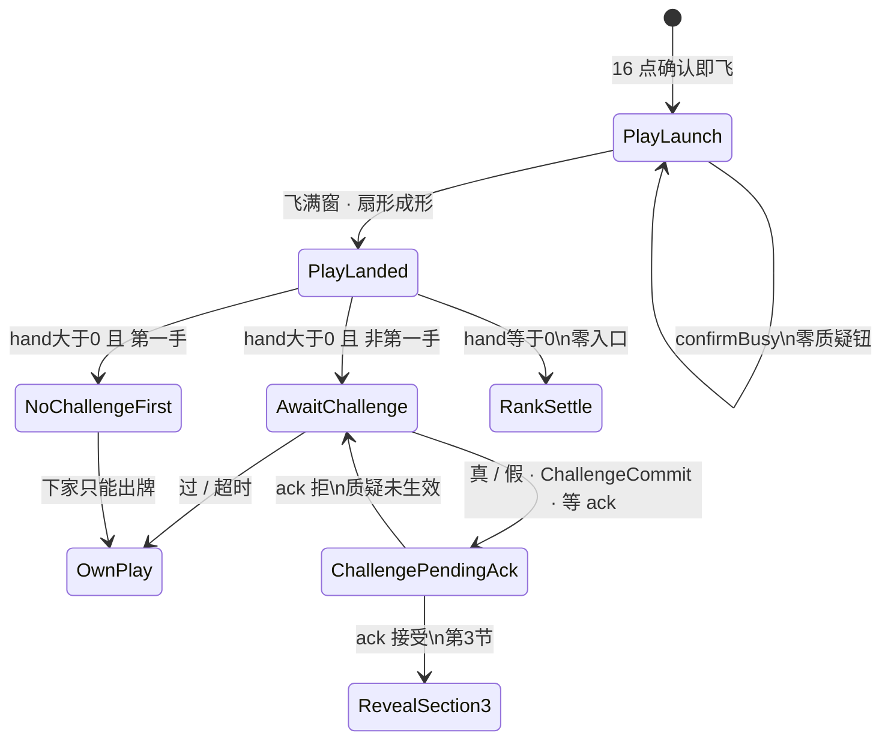

# 17 · 局内质疑入口规格（第2节 · 入口 only）

| 项 | 内容 |
|----|------|
| 版本 | v0.1.1 |
| 状态 | **第2节入口会签草案**（PM）· 线框闸 · **#146 打回：真 ≠ 过** · 未会签禁止落 ets |
| 范围 | `lb_scr_table` 上 **`AwaitChallenge` 入口**：何时挂、真/假同层二选、过、超时、SFX、禁双轨、揭牌 **只锁门**。**第2节入口 only**（揭牌 / 开牌 / 翻验 = **第3节**） |
| 读者 | UI、美术、策划、测试、鸿蒙、**@LiarBar负责人** |
| 对照 | [16 飞出与身前扣牌](./16-局内出牌飞出与身前扣牌规格.md)（第1节数字 **一字不改**）· [出牌扣牌-状态机](../02-游戏设计/出牌扣牌-状态机.md) · [02 命名](./02-组件与资源命名约定.md) · [15 触摸出牌](./15-局内手牌触摸出牌规格.md)（确认条 overlay 族）· [11 横屏](./11-局内横屏与自适应布局.md) · [GDD §6.2 质疑](../02-游戏设计/GDD.md) · [13 声场](./13-局内声场与伴奏规格.md) |
| 本 PR | **只交文档**。零 ets、零 rawfile、零新媒体文件 |

> **UI 管**：入口闸、同层二选、overlay 落点、`lb_*`、可测失败短句。  
> **策划管**：GDD 质疑条件 / 第一手 / 本手语义（本线不改规则）。打光分流仍认 Aron 锁（hand==0 → RankSettle）。  
> **美术管**：**不交**新媒体。入口铬件后补；禁止系统灰钮当终稿。  
> 命名：控件 `lb_*`；媒体 `art_*`；音频调用 `lb_sfx_*`。**禁止** `lb_art_*`。

---

## 0. 边界（写死）

### 0.1 第2节入口写什么 / 不写什么

| 层 | 本文做什么 | 本文不做什么 |
|----|------------|--------------|
| 节 | `PlayLanded` 之后的 **质疑入口**（可点窗 / 真假 / 过 / 超时） | **揭牌 / 开牌 / 翻验轴 / 坟场**（**第3节**） |
| 接 16 | 从 **PlayLanded** 接着写 `AwaitChallenge` 入口闸 | **不改** 第1节 ° / 露边 / 320ms / 落点 / Z / `padB` / `HAND_RING_GAP` |
| 打光 | 复述闸：hand==0 → **RankSettle only**，**零**质疑入口 | **不写**名次主序 / 配分表（**第4节**） |
| 揭牌 | **只锁门**：必须 **ack 后翻**；禁止本地先开 | 不写翻牌时长、揭牌行几何、裁定句 |
| 旧轨 | 写死禁双轨（F16-10 / F17-7） | **不**重画 `lb_scr_challenge` 四拍当完成 |
| 落地 | 会签后才开 `feat/client-*` | **本 PR 零 ets** |

**硬闸六句：**

1. **零规则改动**（仍 3 命；`MAX_PLAY=3`；第一手不可质疑仍在 GDD；质疑只验上家本手）。  
2. **第1节数字不动** — 飞 **320ms**（280～400）、扇形 ° / 露边 10vp、`padB`、`HAND_RING_GAP=24%` **只交叉 16**，本篇不重开。  
3. **入口闸** — `PlayLanded ∧ 出牌者 hand>0 ∧ 非第一手` 才进可点 `AwaitChallenge`。  
4. **打光零入口** — 落地后出牌者 hand==0 → **只** RankSettle，**禁止**质疑入口。  
5. **旧四拍 / 弱 CTA 与新入口禁双轨并存**（F16-10 / F17-7）。  
6. **揭牌门** — 点 **真** 或 **假** 之后必须权威 ack 才翻（猜对/猜错 / 扣命认第3节）；禁止本地先开（第3节写呈现）。**真 ≠ 过。**

### 0.2 与 16 / 策划状态机

16 只锁到：飞满窗才能进 `AwaitChallenge`；打光不进；禁双轨指针第2节。  
策划 [出牌扣牌-状态机 §6](../02-游戏设计/出牌扣牌-状态机.md) 写入口布尔与打光分流。  
**本篇写满入口 UI。** 冲突时：° / ms / vp / `padB` / GAP **仍认 16**；入口可点条件 / 真假同层 / 超时 **认本文 PM 锁**。

16 的 `AwaitChallenge` / `ChallengeAwait` 是同一后节拍名，**不是第二套**。

### 0.3 PM 已锁摘要（必须写死）

| # | 锁 | 本线写死 |
|---|----|----------|
| 1 | **入口何时** | `PlayLanded ∧ 出牌者 hand>0 ∧ 非第一手` → 可点 `AwaitChallenge` |
| 2 | **打光** | 出牌者 hand==0 → **只** RankSettle，**零**质疑入口 |
| 3 | **飞中** | `PlayLaunch` / `confirmBusy`：**零**质疑钮 |
| 4 | **真 / 假** | **同层两颗钮**，禁止嵌套（先点「质疑」再拆真假）。两颗都走 **ChallengeCommit** + `lb_sfx_challenge_commit` → 等 ack → 第3节。**真 ≠ 过** |
| 5 | **过** | 静默；**禁止**强制过 SFX。**仅** `lb_btn_challenge_pass` / 超时 10s → 静默 Pass → 下座出牌（15） |
| 6 | **超时** | 推荐 **10s**（窗 **8～12**）。倒计时环 **可选**（UI 可带环出货）。到点 = 过，**不是**自动点真/假 |
| 7 | **揭牌门** | **真 / 假都等 ack 后翻**；禁止本地先开。第3节写呈现（猜对/猜错 / 扣命）；本线只锁门 |
| 8 | **SFX** | 入口出现 → `lb_sfx_challenge_enter`；点真/假 → `lb_sfx_challenge_commit`。禁止 flip / launch / land 冒充 |
| 9 | **失败文案** | 单一 key `lb_str_challenge_reject` = **质疑未生效** |
| 10 | **旧轨** | 旧四拍 `lb_scr_challenge` / 弱 CTA 大双底栏 **FORBIDDEN**（F16-10） |
| 11 | **布局** | BottomEnd overlay 族（与确认条同族），**≠** `handPin`；热区 **≥44vp**；**不**抬 `padB` / **不**改 `HAND_RING_GAP=24%`；**不得**盖身前扇心或宣称文案 |

---

## 1. 拍表（接 16 · 不另造引擎阶段）

逻辑阶段仍报 GDD：`TURN` →（质疑则）`CHALLENGE_RITUAL` / `JUDGE`。  
下表是 **桌上质疑入口 UI 拍**，挂在 16 的 `PlayLanded` 之后。**不**把 `AwaitChallenge` 加成新 `phase`。

```
ConfirmReady → PlayLaunch（confirmBusy · 零质疑钮）→ PlayLanded
                 ├─ 出牌者 hand > 0 且 非第一手 → AwaitChallenge（可点入口）
                 ├─ 出牌者 hand > 0 且 第一手   → 零可点真/假（G-Q6）
                 └─ 出牌者 hand == 0           → RankSettle（零质疑入口）
AwaitChallenge → 过 / 超时 → 当前座出牌（认 15）
AwaitChallenge → 真 / 假 → ChallengeCommit + lb_sfx_challenge_commit → ChallengePendingAck（等 ack）→ 第3节揭牌（猜对/猜错 / 扣命认第3节；本线只锁门）
AwaitChallenge → 权威拒质疑 → 质疑未生效（可回到入口，不得留下已揭）
真 ≠ 过。真不得卸入口自出牌。
```



| UI 拍 | GDD 阶段 | 画面 | 玩家能做什么 |
|-------|----------|------|--------------|
| **PlayLaunch** | `PLAY_REVEAL_SELF`（UI 已飞） | 飞出中；`confirmBusy=true` | **零** `lb_btn_challenge_*`。飞中出钮 = **飞中出质疑钮** |
| **PlayLanded** | 本手扇刚成形 | 身前扇已成形（数字认 16） | 立刻按 §2 分流。不得未满窗就挂入口 |
| **AwaitChallenge** | `TURN`（下家） | `lb_cmp_challenge_entry` 在；真/假同层可点；过可点；可选环 | 点真 / 假 / 过。超时视为过。对象 **只** 上家刚刚那一手 |
| **NoChallengeFirst** | `TURN`（下家） | 身前扇在；**无**可点真/假 | 只能出牌。挂了 `_enabled` 真/假 = **第一手仍可质疑** |
| **RankSettle** | 入名次 | 扇已成形后的名次（第4节） | **零**质疑入口。下游仍能点 = **打光者仍被质疑** |
| **ChallengePendingAck** | 已发质疑（真/假 **ChallengeCommit**），等权威 | 入口应收或 `_disabled`；**牌背仍扣** | 真/假都进本拍。**禁止**本地先翻。ack 后才进第3节（猜对/猜错 / 扣命认第3节）。**真 ≠ 过** |

**写死：** `AwaitChallenge` 是 UI 拍名。日志 / 实况窗仍报 GDD 阶段。

**谁看见入口：** 只挂给 **当前行动座**（下家 / `canChallenge` 的那座）。出牌者自己的桌 **不再**挂一套可点真/假。四座同时亮可点入口 = 不过。

---

## 2. 入口闸（PM 已锁）

### 2.1 可点入口（写死）

同时满足才挂 **可点** `lb_cmp_challenge_entry`（真 / 假 `_enabled`）：

```
PlayLanded
AND lastPlay != null
AND lastPlay 已扇形成形
AND lastPlay.actor.hand.count > 0
AND playIndexInRound >= 1          // 非本轮第一手
AND lastPlay.actor 未因本手打光入 emptyOrder
AND current.ALIVE
AND 当前座 = 该手的下家行动座
```

与策划 `canChallenge` 对齐：`current.ALIVE ∧ lastPlay != null ∧ playIndexInRound >= 1 ∧ lastPlay.actor 未打光`。  
**本线加严：** 飞未满窗 / `confirmBusy` / 出牌者 hand==0 → **连入口容器都不要可点**。

| 落地后 | 下一拍 | 可点真/假 |
|--------|--------|-----------|
| 出牌者 hand **>0** 且 **非第一手** | `AwaitChallenge` | **要** |
| 出牌者 hand **>0** 且 **第一手** | 零可点入口（可空、或 `_disabled` + `lb_str_challenge_disabled_first`） | **禁止** `_enabled` |
| 出牌者 hand **==0** | `RankSettle` | **禁止**（零入口） |
| 仍在 `PlayLaunch` / `confirmBusy` | 飞续 | **禁止** |

### 2.2 第一手（G-Q6 · 写死）

本轮第一手（`playIndexInRound==0` 刚变成 1 的那手、无「上家本手」语境）：**不可质疑**。

- **解冻 ≠ 第一手能质疑。**  
- 策划状态机可仍报拍名 `AwaitChallenge`（hand>0），但 `canChallenge==false`。  
- 本线：**不得**亮 `_enabled` 的 `lb_btn_challenge_true` / `lb_btn_challenge_false`。  
- 允许：不挂 `lb_cmp_challenge_entry`；或挂但真/假 `_disabled` + `lb_str_challenge_disabled_first`（「第一手还没人出过牌」）。  
- 第一手就能点真/假 / 能发 `INTENT_CHALLENGE` = **第一手仍可质疑**。

第一手就打光：走 RankSettle，**不适用**「第一手可质疑」，也 **不**走本入口。

### 2.3 打光（零入口 · 写死）

`PlayLanded` 后出牌者 `hand.count==0`：

1. **只**进 RankSettle / 占名次（表现仍须扇先成形，认 16 §6.3）。  
2. **禁止**进 `AwaitChallenge`。  
3. **禁止**挂 `lb_cmp_challenge_entry` / 可点真/假/过。  
4. 该手 **不得**再给下游当质疑靶。  
5. 打光者 **不再出牌、不再被质疑「下一手」**（无下一手）。

落地后 hand==0 仍亮入口 / 下游仍能质疑该手 = **打光者仍被质疑**。  
旧文案 `lb_str_hand_empty`「没有牌了，只能质疑」**不得**拿来给刚打光的座位交差。

本线 **不写**名次主序 / 面子分表（第4节）。

### 2.4 飞中 / `confirmBusy`（零钮 · 写死）

`PlayLaunch` 全程与任何 `confirmBusy=true`：

- **零** `lb_btn_challenge_true` / `_false` / `_pass`。  
- **零**旧 `lb_btn_challenge`。  
- 入口容器不挂、或 `Visibility.None`（不是灰钮占位可点）。

飞未满 320ms 窗（短于 280ms）就挂可点入口 = 16 的 **飞出被跳过进质疑**（F16-7）**仍有效**；本线另记 **飞中出质疑钮**。

### 2.5 质疑只验上家本手（写死）

| 要 | 不要 |
|----|------|
| `targetPlayId = lastPlay.playId` | 翻本轮历史所有、坟场、别人的旧手 |
| 身前扇 = **刚刚那一手**（16 pile 只本轮一手） | 点入口去揭手牌 / 池里的牌 |
| 非法目标引擎忽略（05 T12） | UI 提供「选一张历史牌来质疑」 |

入口指向非 `lastPlay` / 非上家刚刚那一手 = **质疑非上家本手**。

### 2.6 超时（10s · 窗 8～12）

| 项 | 锁 |
|----|-----|
| 推荐 | **10s** |
| 窗口 | **8～12s**（实现容差；推荐值是对表数） |
| 到点 | **视为过**（不自动质疑、不扣命） |
| 倒计时环 | **可选**。可挂 `lb_cmp_challenge_timer`；不带环 **不算**本线失败 |
| 与数值表 | **不改**已锁 `challenge_only_seconds=8`（那是 §10.1 无牌仅质疑窗；刚打光者不走）。本窗是 **AwaitChallenge 入口窗** |

短于 8s 闪过、长于 12s 还赖着可点、或超时仍停在本拍 = **卡死 AwaitChallenge**。

普通出牌钟（`turn_seconds`）与本入口窗 **互斥**：入口在时只跑入口钟，不得两只倒计时同时催。

### 2.7 揭牌门（ack 后翻 · 本线只锁门）

点 **真** 或 **假** → **ChallengeCommit** + `lb_sfx_challenge_commit` → 发 `INTENT_CHALLENGE` → **等权威 ack** → 第3节才翻上家这一手（猜对/猜错 / 扣命认第3节）。**真 ≠ 过。**

| 要 | 不要 |
|----|------|
| ack **接受** 之后才进第3节揭牌 | 点真/假立刻本地翻 `lb_cmp_play_front_pile` / `lb_cmp_reveal_card_*` |
| ack **拒绝** → `lb_str_challenge_reject` = **质疑未生效**；牌背仍扣 | 拒了还留揭开面；无短句当成功 |
| 第3节写翻验呈现 | 本线写翻牌 ms / 揭牌行 / 裁定句 |
| 真 / 假都走 ChallengeCommit | 点真当过：卸入口自出牌、跳过 ChallengeCommit（= **真当过**） |

**禁止本地先开（local-first open）。** 本线不写第3节画面。

---

## 3. 线框（入口 · 不重开第1节数字）

评委 / 鸿蒙 / 测试 **只认下表**。扇形 ° / 飞出 ms / 露边 / 座锚 **仍认 16 §2**，本稿不抄一套新数。

### 3.1 Overlay 族（与确认条同族）

`lb_cmp_challenge_entry` 与 `lb_cmp_play_confirm_bar` **同一家族**：

- `Stack` **BottomEnd overlay**  
- 与 `handPin` **兄弟**  
- **禁止**进 `handPin`（进 pin 会撑 hug、抬手牌，等于变相抬 `padB`）

确认条与质疑入口 **不得同时可点**（R-LAND-4：稳态无大双 CTA）。`AwaitChallenge` 时确认条收起；**过 / 超时** 之后入口卸掉，选牌后再出 15 确认条。**真 / 假** 走 ChallengeCommit → 等 ack，**不得**卸入口自出牌。

```
│     桌心 bust + 池 + lb_txt_claim（不挡）              │
│     ░ 环-手 24%（HAND_RING_GAP 数字不动）░             │
│           ╱[背]│[背]╲  ← 扇心不被入口盖住             │
│         self 身前 pile · HitTest None（认 16）         │
│  selfDock │  [余牌][余牌][余牌]                        │
│           └─ 手牌底缘贴底安全区上沿 ─┘                  │
│         ┌─ lb_cmp_challenge_entry ─┐  BottomEnd       │
│         │   【 真 】  【 假 】      │  overlay        │
│         │        【 过 】           │  ≠ handPin      │
│         └───────────────────────────┘                 │
│         ░ padB = 仅 inset · 禁加大 ░                   │
```

### 3.2 真 / 假：同层两颗钮（写死）

| 要 | 不要 |
|----|------|
| `lb_btn_challenge_true` 与 `lb_btn_challenge_false` **同一层、并排** | 先点「质疑」再弹出真/假（嵌套） |
| 两颗都是主热区，热区各 **≥44vp** | 一颗总钮冒充二选；或真/假藏进半屏 sheet |
| 可见文案：**真** / **假** | 复用旁观押注 `lb_btn_bet_true` / `_fake`（全真/有假）当入口 |

| 钮 | 语义 | SFX | 下一拍 |
|----|------|-----|--------|
| `lb_btn_challenge_true` | 认定真，发起质疑（猜对/猜错 / 扣命认第3节） | `lb_sfx_challenge_commit` | **ChallengeCommit** → 等 ack → 第3节揭牌；禁本地先开。**真 ≠ 过** |
| `lb_btn_challenge_false` | 认定假，发起质疑（猜对/猜错 / 扣命认第3节） | `lb_sfx_challenge_commit` | **ChallengeCommit** → 等 ack → 第3节揭牌；禁本地先开 |
| `lb_btn_challenge_pass` | 过 | **禁止**强制过 SFX | 等同超时：静默 Pass，卸入口，下座出牌（15）。**仅此**与超时可走 OwnPlay |

嵌套、只挂一颗「质疑」、或真/假不在同一层 = **真假非二选**。

### 3.3 过（静默）

- `lb_btn_challenge_pass` 在入口层内，**不是**第三套主屏。  
- **禁止**强制 `lb_sfx_challenge_commit` / enter / flip / launch / land / 系统按键音。  
- 过 ≠ 仪式跳过 `lb_btn_challenge_skip`（那是旧四拍）。  
- 过之后不得留在 `AwaitChallenge`。

### 3.4 热区与可选环

| 项 | 锁 |
|----|-----|
| 真 / 假 / 过 热区 | 各 **≥44vp**（宽或高；推荐正方形触点） |
| `lb_cmp_challenge_timer` | **可选**。环/秒数可贴入口，**不得**压扇心或 `lb_txt_claim` |
| 无环 | **允许**（超时仍须按 §2.6 卸入口） |

### 3.5 不得遮扇或声明（写死）

| 不得盖 | 谁 |
|--------|-----|
| 身前扇 **心**（pile 牌背可读区 / 1 张居中或 2/3 张扇轴） | `lb_cmp_play_front_pile` |
| 宣称文案 | `lb_txt_claim`（及宣称徽） |
| 手牌主行热区 / 生命烛 | 认 16：禁压手、禁压 `lb_cmp_life_*` |

入口条贴底 overlay，**往上长**不得吃进环-手带把扇心或宣称盖住。盖住 = **质疑遮扇或声明**。

### 3.6 禁抬 `padB` / 禁改 GAP

与 15 / 16 同一句，本轮不重开：

- **不**加大 `padB` 给入口腾空  
- **不**改 `HAND_RING_GAP=24%`  
- **不**重开 11 flush / tip  
- 只改入口自身边距 / 安全区 inset  

为入口抬 `padB` 或改 GAP = 与 16 F16-3 同一类不过；本线抄 **质疑遮扇或声明**（若同时盖住扇/宣称）或打回贴底闸。

---

## 4. 控件 id（草案 · 回写 02）

| id | 类型 | 何时 | 说明 |
|----|------|------|------|
| `lb_cmp_challenge_entry` | 组件 | AwaitChallenge 可点窗 | 入口容器。BottomEnd overlay，≠ `handPin` |
| `lb_btn_challenge_true` | 按钮 | 同上 | **真**。与假同层。点后 ChallengeCommit + 等 ack（**真 ≠ 过**） |
| `lb_btn_challenge_false` | 按钮 | 同上 | **假**。与真同层。点后 ChallengeCommit + 等 ack |
| `lb_btn_challenge_pass` | 按钮 | 同上 | **过**。静默，无强制 SFX |
| `lb_cmp_challenge_timer` | 组件 | 可选 | 倒计时环 / 秒。可不挂 |

**禁止**用下列旧锁名交差本入口（锁名可留档，**不得**与新入口同时可点）：

| 旧 id | 为什么不是本入口 |
|-------|------------------|
| `lb_scr_challenge` + 四拍 | 旧全屏仪式轨 |
| `lb_btn_challenge` | 旧桌底弱 CTA / 大双底栏 |
| `lb_btn_play` + `lb_btn_challenge` 常驻 | R-LAND-4 禁大双 |
| `lb_btn_bet_true` / `lb_btn_bet_fake` | 旁观押注（拍2），不是下家入口 |
| `lb_btn_challenge_skip` | 仪式跳过，不是过 |

见双轨 = **质疑双轨并存**（与 F16-10 同一把锁）。

本 PR **不交** PNG / rawfile。入口铬件未锁新 `art_*`。

---

## 5. SFX（调用点 · 不交文件）

| 调用点 | 何时 | 本线交文件？ |
|--------|------|----------------|
| **`lb_sfx_challenge_enter`** | **入口出现** 的同一 onset（耳 onset 贴 `lb_cmp_challenge_entry` 可见起势） | **否** |
| **`lb_sfx_challenge_commit`** | 点 **真** 或 **假** 按下 | **否** |
| 过 / 超时 | **禁止**强制 SFX | — |

**禁止（写死）：**

- 入口出现或点真/假时播 `lb_sfx_card_flip` / `lb_sfx_play_launch` / `lb_sfx_play_land`（冒充）。  
- 用旧四拍槽 `lb_sfx_challenge_windup` / `_standoff` / `_flip` / `_flip_fake` 冒充本入口双槽。  
- 非静默局入口出现完全无声（= **入口无声（非静默）**）。  
- 过还强制响 commit / enter。  
- 系统按键音冒充终稿。  
- 本 PR 往 `rawfile/audio/` 丢文件。

静默局全关。缺真源可静音占位（**占位也必须走上述 id**，不得改挂 flip / launch / land）。

「同起」读法对齐 15 / 16：enter 贴入口 **可见起势**；commit 贴真/假 **按下**。

13 质疑四拍仍只是旧轨占位，**不**替代本双槽。本线不改 13 正文。

---

## 6. 文案

| key | 默认中文 | 何时 |
|-----|----------|------|
| **`lb_str_challenge_reject`** | **质疑未生效** | 权威拒质疑（未 ack / 非法目标事后发现等）。**单一** key，禁止再拆 |
| `lb_str_challenge_disabled_first` | 第一手还没人出过牌 | 第一手真/假 `_disabled` 时（02 已有） |
| 真 / 假 / 过 | 可见字 **真** / **假** / **过** | 按钮面。本线 **不**另登记第三套 str（02 只加 reject） |

权威拒必须出口播 / 测试短句 **质疑未生效**。缺句、或拆成两个 key、或只 toast「失败」= **质疑未生效** 不过。

静默局字幕仍出本句。  
15 客户端预检未发出质疑的，不改叫本 key。本 key 只用于 **已经点真或假（ChallengeCommit）之后** 的权威拒。

不得复用 `lb_str_play_rollback`（那是出牌回滚）。不得复用 `lb_str_bet_true` / `_fake`。

---

## 7. 不做（本线写死）

| 不做 | 说明 |
|------|------|
| 改第1节数字 | 320ms / ° / 10vp / 落点 / Z **只交叉 16** |
| 抬 `padB` / 改 GAP | `HAND_RING_GAP=24%` 不动 |
| 名次配分表 | 第4节；打光只锁零入口 |
| 揭牌呈现 | 第3节；本线只锁 ack 后翻 |
| 旧四拍当完成 | 禁与新入口双轨 |
| 飞中 / busy 出钮 | 零质疑钮 |
| 打光仍开入口 | RankSettle only |
| 真假嵌套 | 必须同层二选 |
| 强制过 SFX | 过 / 超时静默 |
| 本地先开 | 禁 local-first open |
| 真当过 | 真不得卸入口自出牌 / 跳过 ChallengeCommit |
| flip / launch / land 冒充 | 只认 enter / commit |
| 新媒体 / 新 SFX 文件 | 只挂调用点 |
| 改 15 选牌闸 / 14b | F15 / R-LIFE 不重开 |
| 重写 16 / 15 正文 | 本票不改那两篇 |

---

## 8. 失败短句（测试 / 鸿蒙可抄）

合入 ≠ 终验。未会签勿按短句改 ets。  
**禁止**空勾「OK」/「符合预期」交差 — 必须能指到下表锁词。

16 的 F16-1～12（飞出 / 扇 / 回滚 / 双轨 / 打光）**仍有效**，本线不改号。F16-10 与 F17-7 **同一把双轨锁**（入口写满后两边都可抄）。F16-7 / F16-12 仍管飞未满窗进质疑、打光进 AwaitChallenge。

| # | 短句 | 不过 |
|---|------|------|
| F17-1 | **第一手仍可质疑** | 本轮第一手（无上家本手）仍亮 `_enabled` 真/假，或能发 `INTENT_CHALLENGE` / 能揭第一手 |
| F17-2 | **打光者仍被质疑** | `PlayLanded` 后出牌者 hand==0 仍进 `AwaitChallenge` / 仍挂入口 / 下游仍能质疑该打光手 |
| F17-3 | **飞中出质疑钮** | `PlayLaunch` 或 `confirmBusy=true` 时出现可点真/假/过 / 旧 `lb_btn_challenge` |
| F17-4 | **质疑非上家本手** | 入口或提交指向历史手、坟场、非 `lastPlay`、或揭了不是上家刚刚那一手 |
| F17-5 | **真假非二选** | 真/假嵌套（先总钮再拆）；只挂一颗「质疑」冒充二选；真/假不在同一层；或用押注钮顶替入口 |
| F17-6 | **质疑遮扇或声明** | 入口 / 环 / 钮盖住身前扇心或 `lb_txt_claim`；或为此抬 `padB` / 改 `HAND_RING_GAP` |
| F17-7 | **质疑双轨并存** | 旧 `lb_scr_challenge` 四拍全屏 **同时** 挂新入口 / 弱 CTA / 常驻大双底栏，两套可点（与 F16-10 同锁） |
| F17-8 | **质疑未生效** | 权威拒后仍当质疑成立 / 已本地揭开不收回 / 不出现「质疑未生效」；或拆两个 key / 复用出牌回滚 key |
| F17-9 | **卡死 AwaitChallenge** | 超时（超 12s 仍可点或不卸）走不出去；点真/假/过后仍停在本拍；拒了既不回入口也不给短句，桌死 |
| F17-10 | **入口无声（非静默）** | 非静默局入口出现未播 `lb_sfx_challenge_enter`；或用 `lb_sfx_card_flip` / `lb_sfx_play_launch` / `lb_sfx_play_land` 冒充 enter / commit |
| F17-11 | **真当过** | 点 `lb_btn_challenge_true` 当过：卸入口自出牌、跳过 ChallengeCommit / 不等 ack / 不进第3节揭牌门（真被伪装成过） |

第一手禁用态出 `lb_str_challenge_disabled_first` **不算** F17-1。  
静默局入口无声 **不算** F17-10。过 / 超时无声 **不算** F17-10。

---

## 9. 会签

- [ ] @LiarBar负责人 入口闸 / 真假同层 / 10s / 真假都 ack 后翻 / **真 ≠ 过** / 禁双轨  
- [ ] @LiarBar策划 第一手不可质疑仍在；只验上家本手；打光零入口；名次表仍第4节；不改 3 命 / `MAX_PLAY`  
- [ ] @LiarBar UI 入口 = BottomEnd overlay ≠ `handPin`；热区 ≥44vp；禁抬 `padB` / 禁改 GAP；不挡扇心/宣称  
- [ ] @LiarBar鸿蒙 `AwaitChallenge` 对表；飞中零钮；真/假→ChallengeCommit→等 ack；双槽 SFX；拒只认 `lb_str_challenge_reject`；会签前零 ets  
- [ ] @LiarBar测试 F17-1～11 可抄；F16-1～12 不改号；合入 ≠ 终验；禁止空 OK  

**未会签禁止落 ets。** 会签前零 ets。合入本 PR ≠ 质疑入口终验 ≠ 揭牌终验 ≠ 名次终验。

---

## 10. 修订记录

| 版本 | 日期 | 说明 |
|------|------|------|
| v0.1.1 | 2026-09-13 | **#146 打回**：废 v0.1.0「真 = 不揭牌 / 卸入口自出牌」。`lb_btn_challenge_true` 与 `_false` **都**走 ChallengeCommit + `lb_sfx_challenge_commit` → 等 ack → 第3节揭牌（猜对/猜错 / 扣命认第3节）。**仅** `_pass` / 超时 10s → 静默 Pass → 下座出牌（15）。**真 ≠ 过。** 增 F17-11 **真当过**。F17-1～10 锁词不改。`lb_str_challenge_reject` 不改。零 ets |
| v0.1.0 | 2026-09-13 | 第2节入口会签草案：`PlayLanded ∧ hand>0 ∧ 非第一手` → AwaitChallenge；hand==0 → RankSettle 零入口；飞中 / busy 零钮；真假同层二选；过静默；超时 **10s**（8～12），环可选；揭牌 **ack 后翻**；SFX `lb_sfx_challenge_enter` / `lb_sfx_challenge_commit`；短句 key `lb_str_challenge_reject` = **质疑未生效**；禁旧四拍/弱 CTA 双轨；BottomEnd overlay ≠ `handPin`；热区 ≥44vp；禁抬 `padB` / 禁改 GAP；不挡扇心/宣称；id `lb_cmp_challenge_entry` / `_true` / `_false` / `_pass` / 可选 timer；失败 F17-1～10。第1节数字不改。零 ets |

### 审核记录

| 日期 | 意见 | 提议修改 | 提出人 | 状态 |
|------|------|----------|--------|------|
| 2026-09-13 | **#146 PM 打回**：v0.1.0 把真写成不揭牌 / 卸入口自出牌，真被伪装成过 | v0.1.1：真/假都 ChallengeCommit → 等 ack → 第3节；仅过/超时走 OwnPlay；F17-11 **真当过** | PM / UI 文档岗 | **待 @LiarBar负责人 会签** |
| 2026-09-13 | PM 锁第2节入口：何时 / 打光零入口 / 飞中零钮 / 真假同层 / 过静默 / 10s / ack 后翻 / 双槽 SFX / 质疑未生效 / 禁双轨 / overlay 族 | 新建 v0.1.0 | UI 文档岗 | **待 @LiarBar负责人 会签** |

---

*维护人：UI 文档岗 · 2026-09-13 · docs only · 第2节入口会签草案 v0.1.1 · **真 ≠ 过** · 会签前零 ets · 合入 ≠ 终验*
