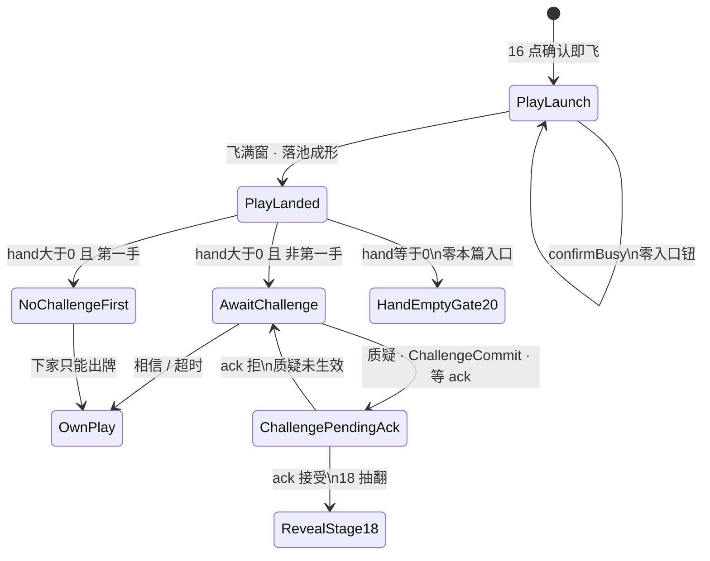

# 17 · 局内质疑入口规格（第2节 · 入口 only）

| 项 | 内容 |
|----|------|
| 版本 | **v0.3.0** |
| 状态 | **第2节入口会签草案**（PM）· **v0.3.0 废「真/假」同义质疑**：**质疑\|相信** 同层二键 · **质疑 ≠ 相信** · 线框闸 · **靶 = 池上本手** · 生命交叉烛火主读 · 未会签禁止落 ets |
| 范围 | `lb_scr_table` 上 **`AwaitChallenge` / TrustOrChallenge 入口**：何时挂、**质疑\|相信**同层二选、超时=相信、SFX、禁双轨、揭牌 **只锁门**。**第2节入口 only**（开牌呈现 = **[18](./18-局内开牌区规格.md)**；裁定真/假 = 揭牌结果，**不是**入口） |
| 读者 | UI、美术、策划、测试、鸿蒙、**@LiarBar负责人** |
| 对照 | [左轮对局-状态机](../02-游戏设计/左轮对局-状态机.md)（**规则真源** · Trust\|Challenge · **v1.1.3** · S18-13～16）· [16 落池](./16-局内出牌飞出与身前扣牌规格.md)（**v0.2.0** 落点=`lb_cmp_pool`；飞 **320ms** / `padB` / GAP **一字不改**）· [18 开牌区](./18-局内开牌区规格.md)（ack 后 draw→flip）· [20 打光二选](./20-局内打光目标二选规格.md)（hand==0 ≥3 你/上家；=2 强制质疑 **不变**）· [02 命名](./02-组件与资源命名约定.md) · [15 触摸出牌](./15-局内手牌触摸出牌规格.md) · [11 横屏](./11-局内横屏与自适应布局.md) · [14 / 14b 生命烛](./14-局内生命显示规格.md) · [GDD §6.2](../02-游戏设计/GDD.md) · [13 声场](./13-局内声场与伴奏规格.md) |
| 本 PR | **只交文档**。零 ets、零 rawfile、零新媒体文件 |

> **UI 管**：入口闸、同层二选、overlay 落点、`lb_*`、可测失败短句。  
> **策划管**：左轮 Trust\|Challenge / 第一手 / 本手语义（本线不改规则）。打光分流认 **20** + 左轮 §2.6。  
> **美术管**：**不交**新媒体。入口铬件后补；禁止系统灰钮当终稿；旧「真假键」铬 **不得**再当入口面。  
> 命名：控件 `lb_*`；媒体 `art_*`；音频调用 `lb_sfx_*`。**禁止** `lb_art_*`。

> **SUPERSEDE（v0.3.0 · 2026-09-14 PM 锁）**  
> 废入口「真 / 假」双键同义质疑（v0.1.x～v0.2.1）。旧句 **真 ≠ 过** **改写为** **质疑 ≠ 相信**。  
> 自位身前同层二键：**「质疑」\|「相信」**。  
> - **质疑** → `ChallengeCommit`（揭上家本手 / ack→18）  
> - **相信** → Trust / Pass（**不揭**、续对）  
> **禁止**入口再挂「真」「假」「过」三键问卷。超时 = **相信**。  
> **真 / 假** 只出现在 **揭牌裁定结果**（左轮 Reveal / 18），**不是**入口文案。

---

## 0. 边界（写死）

### 0.1 第2节入口写什么 / 不写什么

| 层 | 本文做什么 | 本文不做什么 |
|----|------------|--------------|
| 节 | `PlayLanded` 之后的 **质疑\|相信入口**（可点窗 / 超时） | **开牌区几何 / 抽→翻 / 暗场**（**[18](./18-局内开牌区规格.md)**） |
| 接 16 | 从 **PlayLanded（落池）** 接着写入口闸 | **不改** 第1节 320ms / 露边 10vp / `padB` / `HAND_RING_GAP`；**落点认 16 v0.2.0 = 池** |
| 打光 | hand==0 → **20** HandEmptyGate（≥3 你/上家；=2 强制质疑），**零**本篇质疑\|相信入口 | **不写**你/上家线框数字（认 20）；CollectRedeal 认左轮 |
| 揭牌 | **只锁门**：点 **质疑** 后必须 **ack 后** 才进 18；禁止本地先开 | 不写 56vp / 0.90× / 160ms（认 18）；不写裁定公式 |
| 旧轨 | 写死禁双轨（F16-10 / F17-7）；废入口真/假/过 | **不**重画 `lb_scr_challenge` 四拍当完成 |
| 生命 | 交叉一句：生命主读仍 **烛火+熄灭**；左轮 HUD/SFX ≠ 生命计数 UI | 不重开 14 / 14b 六闸 |
| 落地 | 会签后才开 `feat/client-*` | **本 PR 零 ets** |

**硬闸六句：**

1. **零规则改动**（认左轮；`MAX_PLAY=3`；第一手不可质疑仍在；质疑只验上家本手；打光 ≥3/=2 与 CollectRedeal **不变**）。  
2. **第1节飞数字不动** — 飞 **320ms**（280～400）、露边 ≥10vp、`padB`、`HAND_RING_GAP=24%` **只交叉 16**。落点 **认 16 v0.2.0 = `lb_cmp_pool`**。  
3. **入口闸** — `PlayLanded ∧ 出牌者 hand>0 ∧ 非第一手` 才进可点 `AwaitChallenge`（TrustOrChallenge）。下家 **必须**过本闸后才能出牌。  
4. **打光零本入口** — 落地后出牌者 hand==0 → **只** 20 / 左轮 HandEmptyGate，**禁止**挂质疑\|相信。  
5. **旧四拍 / 弱 CTA / 入口真假过 与新入口禁双轨并存**（F16-10 / F17-7 / **入口仍真假过**）。  
6. **揭牌门** — 点 **质疑** 之后必须权威 ack 才进 18；**相信** 路径 **禁止**揭牌。**质疑 ≠ 相信。**

### 0.2 与 16 / 18 / 20 / 左轮

16 只锁到：飞满窗才能进入口；打光不进本篇；禁双轨；**落点 = 池**。  
18 只锁：**ack 接受** 之后的开牌区。  
20 只锁：hand==0 的 ≥3 你/上家 / =2 强制质疑。  
左轮写 Trust\|Challenge / Reveal / Shoot / CollectRedeal。  
**本篇写满 hand>0 入口 UI。** 冲突时：° / ms / vp / `padB` / GAP / 落池 **仍认 16**；开牌位 / 尺 / 暗场 **仍认 18**；打光二选 **仍认 20**；入口可点条件 / **质疑\|相信同层** / 超时 **认本文 PM 锁**。

16 的 `AwaitChallenge` / 左轮 `TrustOrChallenge` 是同一后节拍名族，**不是第二套**。

### 0.3 PM 已锁摘要（必须写死 · 2026-09-14）

| # | 锁 | 本线写死 |
|---|----|----------|
| 1 | **入口何时** | `PlayLanded ∧ 出牌者 hand>0 ∧ 非第一手` → 可点 `AwaitChallenge`。下家须过闸后才能出牌 |
| 2 | **打光** | 出牌者 hand==0 → **20**（≥3 你/上家；=2 强制质疑），**零**质疑\|相信入口。CollectRedeal 认左轮 **不变** |
| 3 | **飞中** | `PlayLaunch` / `confirmBusy`：**零**质疑\|相信钮 |
| 4 | **质疑 / 相信** | **同层两颗钮**，禁止嵌套。**质疑** → ChallengeCommit + `lb_sfx_challenge_commit` → 等 ack → **[18](./18-局内开牌区规格.md)**。**相信** → Trust/Pass（**不揭**、续对）。**质疑 ≠ 相信** |
| 5 | **废第三键「过」** | 入口 **不再**挂 `lb_btn_challenge_pass` 当第三主钮。Trust 文案 = **「相信」**。超时仍 = **相信**（静默） |
| 6 | **超时** | 推荐 **10s**（窗 **8～12**）。倒计时环 **可选**。到点 = **相信**，**不是**自动质疑 |
| 7 | **揭牌门** | **仅质疑**等 ack 后进 18；相信路径禁揭。禁止本地先开 |
| 8 | **SFX** | 入口出现 → `lb_sfx_challenge_enter`；点 **质疑** → `lb_sfx_challenge_commit`。相信 / 超时 **禁止**强制 commit SFX |
| 9 | **失败文案** | 权威拒仍单一 key `lb_str_challenge_reject` = **质疑未生效** |
| 10 | **旧轨** | 旧四拍 / 弱 CTA / **入口真假过三键** **FORBIDDEN** |
| 11 | **布局 · 身前** | 自位 `AwaitChallenge` 时 `lb_cmp_challenge_entry` 落在 **自位身前**（环–手带内），**禁止**只贴 BottomEnd。热区各 **≥44vp**；**不**抬 `padB` / **不**改 GAP；不得盖手牌主行、生命烛、池心、宣称 |
| 12 | **靶** | 质疑对象 = **`lb_cmp_pool` 上本轮这一手**。**不是** `lb_cmp_play_front_pile` |
| 13 | **提示迁出左上** | 宣称 `lb_txt_claim` → **桌心侧**；瞬时 tip `lb_cmp_table_tip` → **底中 toast**（认 v0.2.1） |
| 14 | **NPC 气泡** | `lb_cmp_npc_challenge_bubble`：NPC 座选 **质疑/相信** 时短气泡「质疑」/「相信」；HitTest None；**1000ms**（800～1200）；静音；自位不用。**真/假**不进本气泡（裁定结果另见 18） |
| 15 | **生命交叉** | 生命主读仍 **烛火+熄灭**（14 / 14b）。左轮 HUD/SFX 可作开枪反馈，**不是**生命计数 UI |
| 16 | **本票范围** | **只交文档**。零 ets / 零 rawfile / 零新媒体。合入 ≠ 终验 |

---

## 1. 拍表（接 16 · 不另造引擎阶段）

逻辑阶段仍报左轮 / GDD：`TURN` →（质疑则）Reveal / Shoot / CollectRedeal。  
下表是 **桌上质疑\|相信入口 UI 拍**，挂在 16 的 `PlayLanded` 之后。**不**把 `AwaitChallenge` 加成新 `phase`。

```
ConfirmReady → PlayLaunch（confirmBusy · 零入口钮）→ PlayLanded（落 lb_cmp_pool）
                 ├─ 出牌者 hand > 0 且 非第一手 → AwaitChallenge（可点 质疑|相信）
                 ├─ 出牌者 hand > 0 且 第一手   → 零可点入口（G-Q6）
                 └─ 出牌者 hand == 0           → HandEmptyGate / 20（零本篇入口）
AwaitChallenge → 相信 / 超时 → OwnPlay（下座出牌 · 认 15；不揭）
AwaitChallenge → 质疑 → ChallengeCommit + lb_sfx_challenge_commit → ChallengePendingAck（等 ack）
                 → 18 RevealDraw→RevealFlip（裁定真/假 / 开枪认左轮；本线只锁门）
AwaitChallenge → 权威拒质疑 → 质疑未生效（可回到入口，不得留下已揭）
质疑 ≠ 相信。相信不得揭牌。质疑不得当相信卸入口自出牌。
```



| UI 拍 | 左轮 / GDD | 画面 | 玩家能做什么 |
|-------|------------|------|--------------|
| **PlayLaunch** | PLAY 飞中 | 飞出中；`confirmBusy=true` | **零** `lb_btn_challenge_*` 入口钮 |
| **PlayLanded** | 本手刚落池 | 池上本手堆已成形（数字认 16） | 立刻按 §2 分流 |
| **AwaitChallenge** | TrustOrChallenge | `lb_cmp_challenge_entry` 在；**质疑\|相信**同层可点；可选环 | 点质疑 / 相信。超时视为相信。对象 **只** 池上刚刚那一手 |
| **NoChallengeFirst** | TURN（下家） | 池上本手在；**无**可点入口 | 只能出牌 |
| **HandEmptyGate20** | HandEmptyGate | 认 **20**：≥3 你/上家；=2 强制质疑 | **零**本篇质疑\|相信 |
| **ChallengePendingAck** | 已发 Challenge，等权威 | 入口应收或 `_disabled`；**池上仍牌背** | **仅质疑**进本拍。**禁止**本地先翻。ack 后才进 **18** |

**写死：** `AwaitChallenge` 是 UI 拍名。日志 / 实况窗仍报左轮 / GDD 阶段。

**谁看见入口：** 只挂给 **当前行动座**（下家 / `canChallenge` 的那座）。出牌者自己的桌 **不再**挂一套可点入口。四座同时亮可点入口 = 不过。

---

## 2. 入口闸（PM 已锁）

### 2.1 可点入口（写死）

同时满足才挂 **可点** `lb_cmp_challenge_entry`（质疑 / 相信 `_enabled`）：

```
PlayLanded
AND lastPlay != null
AND lastPlay 已落池成形          // 16 v0.2.0：在 lb_cmp_pool
AND lastPlay.actor.hand.count > 0
AND playIndexInRound >= 1          // 非本轮第一手
AND lastPlay.actor 未因本手打光入 emptyOrder
AND current.ALIVE
AND 当前座 = 该手的下家行动座
```

与左轮 / 策划 `canChallenge` 对齐。  
**本线加严：** 飞未满窗 / `confirmBusy` / 出牌者 hand==0 → **连入口容器都不要可点**。

| 落地后 | 下一拍 | 可点质疑\|相信 |
|--------|--------|----------------|
| 出牌者 hand **>0** 且 **非第一手** | `AwaitChallenge` | **要** |
| 出牌者 hand **>0** 且 **第一手** | 零可点入口（可空、或 `_disabled` + `lb_str_challenge_disabled_first`） | **禁止** `_enabled` |
| 出牌者 hand **==0** | **20** HandEmptyGate | **禁止**（零本篇入口） |
| 仍在 `PlayLaunch` / `confirmBusy` | 飞续 | **禁止** |

下家在本闸未决时直接出牌 = **能跳过出牌**。入口应亮却不可见 / 被挡死 = **质疑入口看不见**。

### 2.2 第一手（G-Q6 · 写死）

本轮第一手：**不可质疑**。

- 本线：**不得**亮 `_enabled` 的 `lb_btn_challenge_doubt` / `lb_btn_challenge_believe`。  
- 允许：不挂 `lb_cmp_challenge_entry`；或挂但 `_disabled` + `lb_str_challenge_disabled_first`。  
- 第一手就能点质疑 / 能发 Challenge = **第一手仍可质疑**（F17-1）。

### 2.3 打光（零本篇入口 · 写死）

`PlayLanded` 后出牌者 `hand.count==0`：

1. **只**进 **20** / 左轮 HandEmptyGate（≥3 你/上家；=2 强制质疑）。  
2. **禁止**进本篇 `AwaitChallenge` / 挂质疑\|相信。  
3. CollectRedeal 在开枪后认左轮 **不变**。  

落地后 hand==0 仍亮本篇入口 = **打光者仍被质疑**（与 F17-2 / 20 交叉）。

### 2.4 飞中 / `confirmBusy`（零钮 · 写死）

`PlayLaunch` 全程与任何 `confirmBusy=true`：

- **零** `lb_btn_challenge_doubt` / `_believe`。  
- **零**旧 `lb_btn_challenge_true` / `_false` / `_pass` / `lb_btn_challenge`。  
- 入口容器不挂、或 `Visibility.None`。

飞未满窗就挂可点入口 = 16 **飞出被跳过进质疑**（F16-7）仍有效；本线另记 **飞中出质疑钮**（F17-3）。

### 2.5 质疑只验上家本手（写死 · 靶 = 池）

| 要 | 不要 |
|----|------|
| `targetPlayId = lastPlay.playId` | 翻本轮历史所有、坟场、别人的旧手 |
| 靶 = **`lb_cmp_pool` 上刚刚那一手** | 点入口去揭手牌 / 身前扣区 / `lb_cmp_play_front_pile` |

入口指向非 `lastPlay` = **质疑非上家本手**（F17-4）。

### 2.6 超时（10s · 窗 8～12）

| 项 | 锁 |
|----|-----|
| 推荐 | **10s** |
| 窗口 | **8～12s** |
| 到点 | **视为相信**（不自动质疑、不揭牌） |
| 倒计时环 | **可选**（`lb_cmp_challenge_timer`） |

短于 8s 闪过、长于 12s 还赖着可点 = **卡死 AwaitChallenge**（F17-9）。

### 2.7 揭牌门（仅质疑 · ack 后进 18）

点 **质疑** → ChallengeCommit + `lb_sfx_challenge_commit` → 发 Challenge → **等权威 ack** → **[18](./18-局内开牌区规格.md)**。  
点 **相信** / 超时 → Trust/Pass → **禁止**进 18 / **禁止**揭面。

| 要 | 不要 |
|----|------|
| ack **接受** 之后才进 18 | 点质疑立刻本地翻池 / 开牌区 |
| ack **拒绝** → `lb_str_challenge_reject` = **质疑未生效** | 拒了还留揭开面 |
| 相信路径不揭 | 相信仍进 Reveal / 仍翻牌（= **相信仍揭牌**） |
| 质疑必揭（ack 后） | 点质疑却卸入口自出牌、跳过 ChallengeCommit（= **质疑未揭** / 当相信） |

**禁止本地先开。** **质疑 ≠ 相信。**

---

## 3. 线框（入口 · 不重开第1节数字）

评委 / 鸿蒙 / 测试 **只认下表**。飞出 ms / 露边 / 池锚 **仍认 16 §2**，开牌位 **仍认 18**，打光 **仍认 20**。

### 3.1 Overlay 族 · **自位身前**

`lb_cmp_challenge_entry` 与 `lb_cmp_play_confirm_bar` **同一家族**（overlay 兄弟），但 **自位 AwaitChallenge 落点加严**：

- `Stack` **overlay**，与 `handPin` **兄弟**  
- **禁止**进 `handPin`  
- **自位身前**：手牌行之上、环–手空隙内 — **禁止**只贴 BottomEnd  
- 与可选 `lb_cmp_challenge_timer` **同容器**  
- 热区质疑/相信各 **≥44vp**；不得盖手牌主行、`lb_cmp_life_*` 烛、池心、`lb_txt_claim`  
- **禁止**第三颗「过」主钮；**禁止**入口面写「真」「假」

确认条与质疑入口 **不得同时可点**。`AwaitChallenge` 时确认条收起；**相信 / 超时** 之后入口卸掉，选牌后再出 15 确认条。**质疑** 走 ChallengeCommit → 等 ack，**不得**卸入口当相信自出牌。

```
│  [TopStart 禁挂：本轮出 X / 轮到你]                     │
│     桌心 bust + lb_cmp_pool（本手堆 · 不挡）            │
│        lb_txt_claim「本轮出 X」≈ 池/荷官宣称带          │
│     ░ 环-手 24%（HAND_RING_GAP 数字不动）░             │
│           ╱[背]│[背]╲  ← 池心不被入口盖住             │
│         本手在池 · HitTest None（认 16）               │
│     ┌─ lb_cmp_challenge_entry（自位身前）─┐            │
│     │   【 质疑 】    【 相信 】         │  overlay   │
│     │      （可选 timer 环）              │  ≠ handPin │
│     └─────────────────────────────────────┘            │
│  selfDock │  [手][手][手][手][手]  ← 入口不压手行     │
│           └─ 手牌底缘贴底安全区上沿 ─┘                  │
│     ░ 底中 toast 带：lb_cmp_table_tip「轮到你」░        │
│         ░ padB = 仅 inset · 禁加大 ░                   │
```

**禁（入口面）：** `【 真 】【 假 】` / `【 真 】【 假 】【 过 】` = **真假当入口** / **入口仍真假过**。

**不过（布局）：** 只缩在右下角 = **真假键贴边角**（锁词可沿用，对象改为质疑\|相信键贴边角）；压手或烛 = **真假键压手或烛**；挡池心 = **真假键挡池心**。

### 3.2 质疑 / 相信：同层两颗钮（写死）

| 要 | 不要 |
|----|------|
| `lb_btn_challenge_doubt` 与 `lb_btn_challenge_believe` **同一层、并排** | 先点总钮再拆；或入口再挂真/假 |
| 两颗都是主热区，热区各 **≥44vp** | 一颗总钮冒充二选；或保留第三「过」主钮 |
| 可见文案：**质疑** / **相信** | 可见文案「真」「假」「过」当入口；复用押注 `lb_btn_bet_true` / `_fake` |

| 钮 | 语义 | SFX | 下一拍 |
|----|------|-----|--------|
| **`lb_btn_challenge_doubt`** | **质疑**：揭上家本手 | `lb_sfx_challenge_commit` | **ChallengeCommit** → 等 ack → **18**。**质疑 ≠ 相信** |
| **`lb_btn_challenge_believe`** | **相信**：不揭、续对 | **禁止**强制 commit SFX | Trust/Pass → OwnPlay（15）。等同超时 |
| ~~`lb_btn_challenge_true` / `_false`~~ | **废入口**（历史 id） | — | **不得**再当入口可点。若字符串表暂留旧 key，**映射**：true/false **均不得**表达入口二选；入口只认 doubt/believe |
| ~~`lb_btn_challenge_pass`~~ | **废第三入口钮** | — | 超时 / 相信路径吸收其旧 Pass 语义；**不得**再挂第三主钮 |

嵌套、只挂一颗、或入口仍真/假（同义质疑）= **真假非二选** / **真假当入口**。

**真 / 假（裁定）：** 仅在 18 / 左轮 Reveal 后出现（真→质疑者开枪；假→上家开枪）。**禁止**把裁定真假键挪回入口。

### 3.3 相信（静默 · 吸收旧「过」）

- **相信** 在入口同层，**不是**第三套主屏。  
- **禁止**强制 `lb_sfx_challenge_commit` / enter / flip / launch / land / deal / reveal_*。  
- 相信 ≠ 旧仪式跳过 `lb_btn_challenge_skip`。  
- 相信之后不得留在 `AwaitChallenge`。相信 **不**进 18。  
- 超时 = 相信。

### 3.4 热区与可选环

| 项 | 锁 |
|----|-----|
| 质疑 / 相信 热区 | 各 **≥44vp** |
| `lb_cmp_challenge_timer` | **可选** |
| 无环 | **允许**（超时仍须按 §2.6 卸入口） |

### 3.5 不得遮池或声明 / 不得压手烛（写死）

| 不得盖 | 谁 | 本线失败短句 |
|--------|-----|--------------|
| 池上本手 **心** | `lb_cmp_pool` | **真假键挡池心** / **质疑遮扇或声明** |
| 宣称文案 | `lb_txt_claim` | **质疑遮扇或声明** |
| 手牌主行 / 生命烛 | `lb_cmp_life_*` | **真假键压手或烛** |

### 3.6 禁抬 `padB` / 禁改 GAP

与 15 / 16 同一句：不加大 `padB`；不改 `HAND_RING_GAP=24%`；不重开 11 flush / tip。

### 3.7 提示迁出左上（v0.2.1 锁 · 本版不重开）

| 元素 | id | 家 | 禁止 |
|------|-----|-----|------|
| 稳态宣称 | `lb_txt_claim` | 桌心侧（近池 / 荷官带） | TopStart |
| 瞬时 tip | `lb_cmp_table_tip` | 底中 toast 带 | TopStart |

**不过：** **提示仍占左上** / **宣称挡荷官脸**。

### 3.8 NPC 质疑\|相信气泡（v0.3.0 改写）

| 项 | 锁 |
|----|-----|
| id | **`lb_cmp_npc_challenge_bubble`**（可带座后缀） |
| 何时 | NPC 座选出 **质疑** 或 **相信** 的同一 onset |
| 文案 | 短气泡 **「质疑」** / **「相信」**（**不是**「真」「假」） |
| 锚点 | 该座头像 / 座框旁 |
| HitTest | **`HitTestBehavior.None`** |
| 时长 | **1000ms**（800～1200） |
| 自位 | 人类 self **不用** |
| SFX | 气泡静音；质疑 commit 声认 `lb_sfx_challenge_commit` |

**不过：** **NPC无选向气泡** / **气泡压烛或脸** / **自位误挂NPC气泡**。NPC 气泡仍写「真」「假」当入口方向 = **真假当入口**（交叉）。

---

## 4. 控件 id（草案 · 回写 02）

| id | 类型 | 何时 | 说明 |
|----|------|------|------|
| `lb_cmp_challenge_entry` | 组件 | AwaitChallenge 可点窗 | 入口容器。**自位身前** overlay ≠ `handPin` |
| **`lb_btn_challenge_doubt`** | 按钮 | 同上 | **质疑**。与相信同层。→ ChallengeCommit + 等 ack |
| **`lb_btn_challenge_believe`** | 按钮 | 同上 | **相信**。与质疑同层。→ Trust/Pass；静默。超时等同本钮 |
| `lb_cmp_challenge_timer` | 组件 | 可选 | 倒计时环 |
| `lb_cmp_table_tip` | 组件 | 瞬时 tip | 底中 toast；禁 TopStart |
| `lb_cmp_npc_challenge_bubble` | 组件 | NPC 选向 | 「质疑」/「相信」；HitTest None；1000ms；静音 |

### 4.1 废入口 id（可留档 · 不得与新入口同时可点）

| 旧 id | 状态 | 说明 |
|-------|------|------|
| `lb_btn_challenge_true` | **废入口** | 历史「真」。若字符串表暂留，**不得**再作入口面；映射见 §3.2 |
| `lb_btn_challenge_false` | **废入口** | 历史「假」。同上 |
| `lb_btn_challenge_pass` | **废第三入口钮** | 旧「过」语义由 **相信** / 超时吸收 |
| `lb_scr_challenge` + 四拍 | 禁双轨 | 旧全屏仪式轨 |
| `lb_btn_challenge` | 禁双轨 | 旧弱 CTA |
| `lb_btn_bet_true` / `_fake` | 非本入口 | 旁观押注 |
| `lb_btn_challenge_skip` | 非相信 | 仪式跳过 |
| `lb_cmp_play_front_pile` | 非靶 | 16 废主读 |

见双轨 = **质疑双轨并存**。入口仍真/假/过 = **入口仍真假过** / **真假当入口**。

本 PR **不交** PNG / rawfile。

---

## 5. SFX（调用点 · 不交文件）

| 调用点 | 何时 | 本线交文件？ |
|--------|------|----------------|
| **`lb_sfx_challenge_enter`** | 入口出现 | **否** |
| **`lb_sfx_challenge_commit`** | 点 **质疑** 按下 | **否** |
| 相信 / 超时 | **禁止**强制 SFX | — |
| NPC 气泡 | 静音 | **否** |

**禁止：** flip / launch / land / deal / reveal_* 冒充入口；过/相信还强制响 commit；本 PR 往 `rawfile/audio/` 丢文件。

---

## 6. 文案

| key | 默认中文 | 何时 |
|-----|----------|------|
| **`lb_str_challenge_doubt`** | **质疑** | 入口按钮可见字（锁；对齐左轮 / #172） |
| **`lb_str_challenge_believe`** | **相信** | 入口按钮可见字（锁；对齐左轮 / #172） |
| **`lb_str_challenge_reject`** | **质疑未生效** | 权威拒质疑（ChallengeCommit 之后） |
| `lb_str_challenge_disabled_first` | 第一手还没人出过牌 | 第一手禁用态（**不得**作局内 tip 主读） |
| `lb_str_entry_still_true_false` | 入口仍真假主读 | **S18-13** 失败短句（UI 口语亦可抄 **入口仍真假过**） |
| `lb_str_believe_still_blocked` | 相信后仍不可出 | **S18-14** 失败短句（#172 锁词=不可出/卡门；**≠**「相信仍揭牌」——揭牌见 S18-4 `lb_str_trust_revealed`） |
| `lb_str_doubt_no_reveal` | 质疑未揭牌 | **S18-15** 失败短句（UI 口语亦可抄 **质疑未揭**） |
| `lb_str_revolver_as_lives` | 左轮膛位当命数主读 | **S18-16** 软交叉 14/14b（生命仍烛火+熄灭） |
| `lb_str_trust_revealed` | 相信路径仍进揭牌 | **S18-4**（UI **相信仍揭牌** / F17-21 对表本键，非 S18-14） |

权威拒必须出 **质疑未生效**。  
不得复用 `lb_str_play_rollback` / `lb_str_bet_true` / `_fake`。  
入口面禁止写「真」「假」「过」。入口按钮文案 **只认** `lb_str_challenge_doubt` / `lb_str_challenge_believe`。

---

## 7. 不做（本线写死）

| 不做 | 说明 |
|------|------|
| 改第1节飞数字 | 只交叉 16 |
| 写开牌几何 | 只交叉 18 |
| 改 20 你/上家 / =2 | 打光交叉不变 |
| 改 CollectRedeal | 认左轮 |
| 抬 `padB` / 改 GAP | 不动 |
| 入口真/假/过 | **废**；真假只裁定 |
| 相信揭牌 | **相信仍揭牌**（对表 S18-4 `lb_str_trust_revealed`） |
| 相信后仍不可出 | **相信后仍不可出**（S18-14 `lb_str_believe_still_blocked`；#172 锁词） |
| 质疑不揭 | **质疑未揭** / **质疑未揭牌**（S18-15 `lb_str_doubt_no_reveal`） |
| 入口仍真假主读 | **入口仍真假过** / **入口仍真假主读**（S18-13 `lb_str_entry_still_true_false`） |
| 本地先开 | 禁 |
| 新媒体 / 新 SFX 文件 | 只挂调用点 |
| 左轮当生命计数 UI | 生命仍烛火+熄灭（S18-16 `lb_str_revolver_as_lives`） |

---

## 8. 失败短句（测试 / 鸿蒙可抄）

合入 ≠ 终验。未会签勿按短句改 ets。  
**禁止**空勾「OK」交差 — 必须能指到下表锁词。

16 的 F16-1～15、18 的 F18-1～3、20 的 F20 **仍有效**。F16-10 与 F17-7 同锁。
失败键对齐左轮 **S18-13～16**（#172）：`lb_str_entry_still_true_false` / `lb_str_believe_still_blocked` / `lb_str_doubt_no_reveal` / `lb_str_revolver_as_lives`。UI 口语「相信仍揭牌」对表 **S18-4** `lb_str_trust_revealed`（勿与 S18-14 混键）。

| # | 短句 | 不过 |
|---|------|------|
| F17-1 | **第一手仍可质疑** | 本轮第一手仍亮 `_enabled` 质疑\|相信，或能发 Challenge |
| F17-2 | **打光者仍被质疑** | hand==0 仍挂本篇质疑\|相信入口（应走 20） |
| F17-3 | **飞中出质疑钮** | `PlayLaunch` / `confirmBusy` 时出现可点入口 |
| F17-4 | **质疑非上家本手** | 靶非池上 `lastPlay` |
| F17-5 | **真假非二选** | 质疑\|相信嵌套 / 只挂一颗 / 不在同层；或用押注钮顶替 |
| F17-6 | **质疑遮扇或声明** | 入口盖池心 / `lb_txt_claim`；或抬 `padB` / 改 GAP |
| F17-7 | **质疑双轨并存** | 旧四拍 / 弱 CTA **同时**挂新入口 |
| F17-8 | **质疑未生效** | 权威拒后仍当成立 / 已本地揭不收 / 无本短句 |
| F17-9 | **卡死 AwaitChallenge** | 超时走不出去；点质疑/相信后仍停本拍 |
| F17-10 | **入口无声（非静默）** | 非静默局入口出现未播 enter；或用 flip/launch/land/deal/reveal_* 冒充 |
| F17-11 | **质疑未揭**（`lb_str_doubt_no_reveal` / S18-15） | 点质疑却当相信：卸入口自出牌、跳过 ChallengeCommit / 不等 ack / 不进 18（**SUPERSEDE** 旧 F17-11「真当过」） |
| F17-12 | **真假键贴边角** | 自位入口只贴边角、不在身前（锁词沿用；对象=质疑\|相信键） |
| F17-13 | **真假键压手或烛** | 入口盖手牌主行或生命烛 |
| F17-14 | **真假键挡池心** | 入口盖池上本手堆心 |
| F17-15 | **提示仍占左上** | 宣称或 tip 仍占 TopStart |
| F17-16 | **宣称挡荷官脸** | `lb_txt_claim` 挡荷官 bust |
| F17-17 | **NPC无选向气泡** | NPC 选质疑/相信后无气泡 |
| F17-18 | **气泡压烛或脸** | NPC 气泡压烛或脸 |
| F17-19 | **自位误挂NPC气泡** | 人类 self 挂了 NPC 气泡 |
| F17-20 | **真假当入口** | 入口面仍挂「真」「假」（同义质疑），或把裁定真假键当入口 |
| F17-21 | **相信仍揭牌**（`lb_str_trust_revealed` / S18-4；**非** S18-14） | 点相信 / 超时却进 Reveal / 翻池 / 进 18 |
| F17-22 | **入口仍真假过**（`lb_str_entry_still_true_false` / S18-13） | 入口仍为「真\|假\|过」三键或保留可点 `_pass` 第三主钮（未改为质疑\|相信） |
| F17-23 | **质疑入口看不见** | 应挂可点 `AwaitChallenge` 时入口不可见 / 被挡死 / 热区点不到 |
| F17-24 | **能跳过出牌** | 下家未过质疑\|相信闸（未点相信/质疑/超时）就能出牌 |
| F17-25 | **相信后仍不可出**（`lb_str_believe_still_blocked` / S18-14） | 点相信 / Trust 后下家（或续对座）仍无法出牌 / 卡死在门内（#172 锁词；与 F17-21 揭牌失败 **分键**） |

第一手禁用态出 `lb_str_challenge_disabled_first` **不算** F17-1。  
静默局入口无声 / 相信静默 **不算** F17-10。

---

## 9. 会签

- [ ] @LiarBar负责人 入口闸 / **质疑\|相信同层** / 10s / 仅质疑 ack→18 / **质疑 ≠ 相信** / 废入口真假过 / 靶=池 / 禁双轨 / 身前 / 生命烛交叉  
- [ ] @LiarBar策划 第一手不可质疑仍在；只验上家本手；打光认 20 + 左轮；CollectRedeal 不变；真/假只裁定  
- [ ] @LiarBar UI 入口 = 自位身前 overlay；热区 ≥44vp；禁抬 `padB`；面文案质疑\|相信；禁真假过入口面  
- [ ] @LiarBar鸿蒙 `AwaitChallenge` 对表；质疑→ChallengeCommit→ack→18；相信/超时不揭；新 id `lb_btn_challenge_doubt` / `_believe`；会签前零 ets  
- [ ] @LiarBar测试 F17-1～25 可抄（含 **真假当入口** / **相信仍揭牌**=S18-4 / **相信后仍不可出**=S18-14 / **质疑未揭**=S18-15 / **入口仍真假过**=S18-13 / **质疑入口看不见** / **能跳过出牌**）；合入 ≠ 终验  
- [ ] @LiarBar美术 本票不交新媒体；旧真假键铬不得当入口终稿；气泡文案改质疑/相信  

**未会签禁止落 ets。** 合入本 PR ≠ 质疑入口终验 ≠ 开牌终验 ≠ 打光终验。

---

## 10. 修订记录

| 版本 | 日期 | 说明 |
|------|------|------|
| **v0.3.0** | 2026-09-14 | **PM 锁：废「真/假」双键同义质疑。** 入口改 **质疑\|相信** 同层二键；新 id `lb_btn_challenge_doubt` / `lb_btn_challenge_believe`；废入口 true/false/pass 第三键；超时=相信；**质疑 ≠ 相信**（SUPERSEDE 旧「真 ≠ 过」）；真/假仅揭牌裁定；F17-11 改 **质疑未揭**；增 F17-20～24（真假当入口 / 相信仍揭牌 / 入口仍真假过 / 质疑入口看不见 / 能跳过出牌）；NPC 气泡改质疑/相信；生命交叉烛火主读；20 / CollectRedeal 交叉不变。零 ets |
| v0.3.0 对齐 | 2026-09-14 | 对齐 #172 S18：登记 `lb_str_challenge_doubt`/`believe`；失败键 `lb_str_entry_still_true_false`（S18-13）/ `lb_str_believe_still_blocked`（S18-14=**相信后仍不可出**）/ `lb_str_doubt_no_reveal`（S18-15）/ `lb_str_revolver_as_lives`（S18-16 软交叉 14）；F17-21「相信仍揭牌」对表 S18-4 `lb_str_trust_revealed`（与 S18-14 分键）；增 F17-25。入口锁不变。零 ets |
| v0.2.1 | 2026-09-14 | PM Rebuild 三锁：真假身前 / 提示迁出左上 / NPC真假气泡。F17-12～19 |
| v0.2.0 | 2026-09-13 | 靶改池；揭牌门交叉 18 |
| v0.1.1 | 2026-09-13 | #146：真/假都 ChallengeCommit；**真 ≠ 过**；F17-11 真当过 |
| v0.1.0 | 2026-09-13 | 第2节入口会签草案（真假同层 + 过） |

### 审核记录

| 日期 | 意见 | 提议修改 | 提出人 | 状态 |
|------|------|----------|--------|------|
| 2026-09-14 | PM 锁：废真/假同义质疑；自位身前质疑\|相信；相信不揭；质疑揭本手；超时=相信；生命仍烛；20/=2/CollectRedeal 不变 | v0.3.0 全文入口语义改写；回写 02 / README；14/14b 软交叉 | UI 文档岗 | **待 @LiarBar负责人 / 策划 / 鸿蒙 / 测试 / 美术 会签** |
| 2026-09-14 | PM Rebuild：身前 / 提示迁出左上 / NPC气泡 | v0.2.1 | UI 文档岗 | 已写入（入口面语义已被 v0.3.0 SUPERSEDE） |
| 2026-09-13 | #146 真不得当过 | v0.1.1 | PM | 历史（语义已被 v0.3.0 改写为质疑≠相信） |

---

*维护人：UI 文档岗 · 2026-09-14 · docs only · 第2节入口会签草案 **v0.3.0** · **质疑\|相信** · **质疑 ≠ 相信** · 废入口真假过 · 靶=池 · 会签前零 ets · 合入 ≠ 终验*
