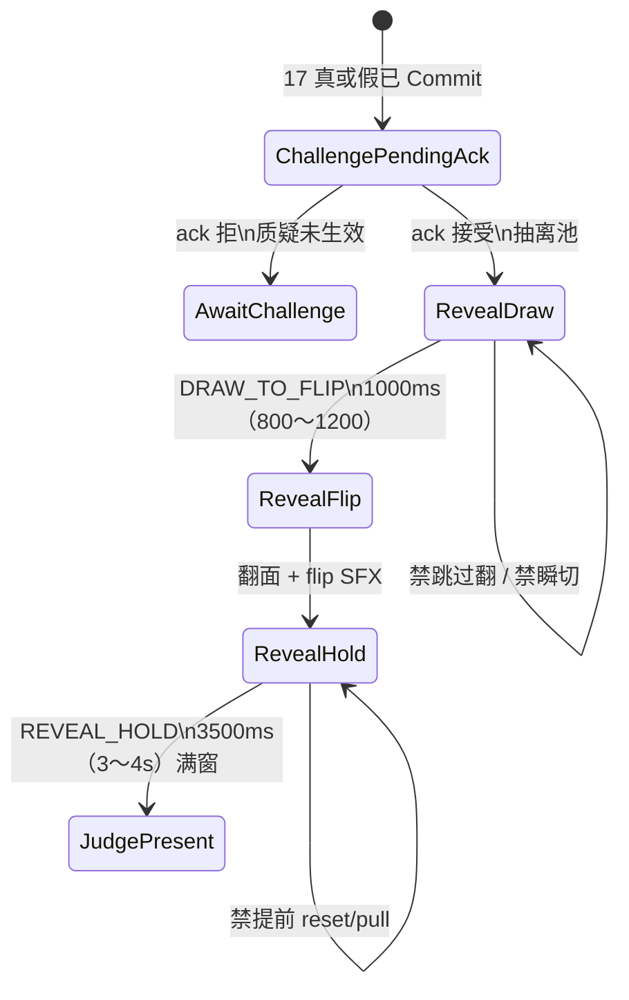

# 18 · 局内开牌区规格（第3节 · 开牌呈现）

| 项 | 内容 |
|----|------|
| 版本 | **v0.1.5** |
| 状态 | **第3节开牌区会签草案**（PM）· 线框数字作本版闸 · **v0.1.1 Rebuild F2**：`lb_cmp_reveal_stage` = 桌级共享 overlay / 全员可见 · **v0.1.2 R1**：开牌=真实 `lastPlayRanks` / 禁宣称假面 · **v0.1.3 R1′/R3**：空 ranks 禁瞎演；禁 hold 前 reset · **v0.1.4 R4**：`DRAW_TO_FLIP=1000ms` / 曾锁 `REVEAL_HOLD=5000ms` · **v0.1.5 改数**：`REVEAL_HOLD=3500ms`（窗 3～4s；**SUPERSEDE 5000 主读**；DRAW 仍 1000）· 未会签禁止落 ets |
| 范围 | `lb_scr_table` 上 **权威 ack 之后** 的开牌呈现：`lb_cmp_reveal_stage` 几何 / 抽→翻 / 双槽 SFX / 安全距 / **全员可见共享层**。**第3节呈现 only**（入口认 [17](./17-局内质疑入口规格.md)；落池认 [16](./16-局内出牌飞出与身前扣牌规格.md)） |
| 读者 | UI、美术、策划、测试、鸿蒙、**@LiarBar负责人** |
| 对照 | [17 质疑入口](./17-局内质疑入口规格.md)（**质疑\|相信** · ChallengeCommit→ack · **R2 第二人可质疑第一手** · F2 全员可见）· [对局-状态机 §1.3](../02-游戏设计/对局-状态机.md)（**R1′ 开牌真牌面加严** / **R4 开牌时长改数** `REVEAL_HOLD=3500` SUPERSEDE 5000 / S18-24 / S18-25 · 对齐 **#204** `22aa360`）· [16 落池](./16-局内出牌飞出与身前扣牌规格.md)（靶 = 池上本手）· [02 命名](./02-组件与资源命名约定.md) · [11 横屏](./11-局内横屏与自适应布局.md) · [GDD §6.2 质疑](../02-游戏设计/GDD.md) · [13 声场](./13-局内声场与伴奏规格.md) |
| 本 PR | **只交文档**。零 ets、零 rawfile、零新媒体文件 |

> **UI 管**：开牌区位、尺、暗场、拍、`lb_*`、可测失败短句。  
> **策划管**：GDD 裁定 / 扣命（本线不改公式）。猜对/猜错句可后补，不挡本版闸。  
> **美术管**：**不交**新媒体。牌面用已有 `art_card_*`；暗场走程序 overlay。  
> 命名：控件 `lb_*`；媒体 `art_*`；音频调用 `lb_sfx_*`。**禁止** `lb_art_*`。

---

## 0. 边界（写死）

### 0.1 第3节写什么 / 不写什么

| 层 | 本文做什么 | 本文不做什么 |
|----|------------|--------------|
| 节 | ack **接受** 之后的开牌区：抽离池 → 翻面 | **质疑入口**（真/假/过/10s / 真 ≠ 过 · 认 17） |
| 接 17 | 从 `ChallengePendingAck` 接 `RevealDraw`→`RevealFlip` | 不改 17 同层二选 / overlay 族 / enter·commit |
| 接 16 | 靶只认 **池上本手**；抽走后池清空 | 不改 16 落点 / 320ms / 乐观飞 / RankSettle |
| 旧轨 | 写死：本区 **不是** `lb_scr_challenge` 四拍 / `lb_cmp_reveal_row` | **不**重画全屏仪式当完成 |
| 落地 | 会签后才开 `feat/client-*` | **本 PR 零 ets** |

**硬闸五句：**

1. **开牌真牌面（R1′）**（认对局-状态机 §1.3；`MAX_PLAY=3`；只翻上家刚刚那一手；faceUp = 真实 `lastPlayRanks`/`lastPicked`；**禁** claim/宣称假面填充；**空 ranks 禁瞎演 / n=1 假面**）。  
2. **入口不重开** — 真 ≠ 过；真/假都 ChallengeCommit→ack。本篇只写 **ack 之后**。  
3. **靶 = 池上本手** — 从 `lb_cmp_pool` 抽，**不是** `lb_cmp_play_front_pile`。  
4. **贴底不动** — 不改 `padB` / `HAND_RING_GAP=24%` / flush / tip。  
5. **SFX 只认开牌双槽** — `lb_sfx_reveal_draw` / `lb_sfx_reveal_flip`。禁止 flip / enter / commit / deal 冒充。

### 0.2 PM 已锁摘要（必须写死）

| # | 锁 | 本线写死 |
|---|----|----------|
| 1 | **门** | 17 `ChallengeCommit` → 权威 ack **接受** 才进本区。ack 拒走 17 `lb_str_challenge_reject` = **质疑未生效**，**不**开本区 |
| 2 | **位** | `lb_cmp_reveal_stage` 在池 **正下**。舞台中心 = 池中心 **下 56vp**（窗 **48～64**） |
| 3 | **尺** | 开牌牌面缩放 **0.90×**（窗 **0.85～0.95**） |
| 4 | **暗场** | 背景压暗 **0.40**、模糊 **6vp**。**只糊背景，永不糊牌面** |
| 5 | **拍** | 抽→翻 **`DRAW_TO_FLIP=1000ms`**（窗 **800～1200**）；翻后持面 **`REVEAL_HOLD=3500ms`**（窗 **3～4s**）。先 `RevealDraw` 再 `RevealFlip`，不可跳过翻；**持面满窗才允许** `resetRevealUi` / `pull`（**禁** hold 前 reset）。**SUPERSEDE** 5000 主读（及 R3 500/2000） |
| 6 | **安全距** | 距头像 **≥24vp**、烛 **≥20vp**、手牌 **≥16vp**、底栏 **≥12vp** |
| 7 | **SFX** | 抽 = `lb_sfx_reveal_draw`；翻 = `lb_sfx_reveal_flip`。禁止 `lb_sfx_card_flip` / `lb_sfx_challenge_enter` / `_commit` / `lb_sfx_deal_*` / `lb_sfx_play_launch` / `_land` 冒充 |
| 8 | **失败** | **开牌无位** / **开牌挡脸·烛** / **开牌看不清** / **揭牌仅自己见** / **开牌假面** / **开牌过快** |
| 9 | **全员可见（F2）** | `lb_cmp_reveal_stage` = **桌级共享 overlay**；全员可见；**禁止**只挂行动座私有层 |

---

### 0.3 R1′ 开牌真牌面加严（2026-09-15 Rebuild · 写死）

**写死：** `lb_cmp_reveal_stage` faceUp 点数 **=** 上家本手真实打出牌（引擎 `lastPlayRanks` / `lastPicked` 或权威等价真源）。

| 必须 | 禁（=失败 **开牌假面** / S18-24） |
|------|----------------------------------|
| 揭开看见的点数 = 上家实际打出 | 用本轮宣称点数 / `currentClaim.rank` 填充假面 |
| 真/假裁定仍对照宣称（含 Joker 除外） | `ranksForReveal` 在空 ranks 时用 claim fallback 冒充 |
| 空 ranks → 0 张 / 等待真源（可 defer） | 空 ranks 瞎演 n=1 / 宣称面交差 |

交叉 [对局-状态机 §1.3](../02-游戏设计/对局-状态机.md)；失败短句 **S18-24** `lb_str_reveal_claim_face` = **开牌假面**。

### 0.4 R4 开牌时长（2026-09-15 Rebuild · **v0.1.5 改数** · 写死 · SUPERSEDE 5000）

**写死 · PM 锁（对齐 #204 / develop `22aa360`）：** 抽→翻仍 **`DRAW_TO_FLIP=1000ms`**（窗 **800～1200**）**不动**；翻后持面 **`REVEAL_HOLD=3500ms`**（窗 **3～4s**）。**SUPERSEDE** 5000 作主读（及 R3 500/2000、旧 160ms）。

| 常量 | 推荐（锁） | 窗口（容差） | 禁 |
|------|------------|--------------|----|
| 抽→翻 `DRAW_TO_FLIP` | **1000ms** | **800～1200ms** | 仍锁 160 / 500ms；瞬切明牌；抽完立刻消失 |
| 翻后持面 `REVEAL_HOLD` | **3500ms** | **3～4s** | 仍锁 **5000** / 2000ms 主读；持面未满就 `resetRevealUi` / `pull` / 进下一拍 |

持面满窗才允许卸舞台 / 下一拍。失败短句仍 **S18-25** `lb_str_reveal_too_fast` = **开牌过快**（持面 <3s / 仍锁 5000 主读）。

> **软挂点注（零 ets · 本 PR 不改代码）：** develop 已合 #204 — `PlayFlyFx.REVEAL_HOLD_MS=3500`（`REVEAL_HOLD_MS_MIN=3500`）；`DRAW_TO_FLIP_MS=1000` 不变。本文只跟文档数字；**禁止**本 PR 动 `.ets`。

## 1. 拍表（接 17 · 不另造引擎阶段）

逻辑阶段仍报 GDD：`CHALLENGE_RITUAL` / `JUDGE`。  
下表是 **桌上开牌 UI 拍**。**不**把 `RevealDraw` / `RevealFlip` 加成新 `phase`。

```
17 AwaitChallenge → 真 / 假 → ChallengeCommit → ChallengePendingAck
                         ├─ ack 拒 → 质疑未生效（17；不开本区）
                         └─ ack 接受 → RevealDraw（抽离池 + draw SFX）
                                      → RevealFlip（DRAW_TO_FLIP=1000ms + flip SFX）
                                      → 持面 REVEAL_HOLD=3500ms（满窗才 reset/pull）
                                      → 裁定呈现（猜对/猜错 / 扣命 · 句可后补）
真 ≠ 过。过 / 超时不进本区。
```



| UI 拍 | GDD 阶段 | 画面 | 玩家能做什么 |
|-------|----------|------|--------------|
| **ChallengePendingAck** | 已发质疑，等权威 | 入口收或 `_disabled`；**池上仍牌背** | **禁止**本地先开。认 17 |
| **RevealDraw** | `CHALLENGE_RITUAL` / `JUDGE`（UI 已抽） | 本手从 `lb_cmp_pool` 抽到 `lb_cmp_reveal_stage`；池清空该手；**`lb_sfx_reveal_draw` 贴抽离起势**；牌背 | 不可点真/假/过。不可改选 |
| **RevealFlip** | 同上 | `DRAW_TO_FLIP` 满后翻面；**`lb_sfx_reveal_flip` 贴翻面起势**；暗场已在（只糊背景） | 不可跳过翻。未满 `DRAW_TO_FLIP` 不得瞬切明牌 |
| **RevealHold** | 同上 | faceUp 持面 `REVEAL_HOLD`；点数可读 | **禁** hold 未满 `resetRevealUi` / `pull`（= **开牌过快**） |
| **JudgePresent** | `JUDGE` | 持面满窗后才卸舞台；扣命 / 猜对猜错（公式认 GDD；句后补） | 本线不锁名次 / 坟场 |

**写死：** 未 ack 就抽或翻 = 17 **本地先开**（F17-8 仍可抄）+ 本篇 **开牌无位**（无合法舞台时序）。过 / 超时 **零**本区。

---

## 2. 线框数字（本版闸 · 会签前当锁）

评委 / 鸿蒙 / 测试 **只认下表**。窗口是实现容差；**推荐值**是对表数。

### 2.1 舞台位（池正下）

| 项 | 锁 |
|----|-----|
| 容器 | **`lb_cmp_reveal_stage`**（挂 `lb_scr_table` **桌级共享 overlay**，**不是** `lb_scr_challenge`；**F2** 全员可见，禁行动座私有） |
| 水平 | 与 `lb_cmp_pool` **同中**（池水平中线） |
| 竖直 | 舞台中心 = 池中心 **下 56vp** |
| 窗口 | **48～64vp**（短于 48 贴池、长于 64 掉进手牌带 = **开牌无位**） |
| 旧 id | `lb_cmp_reveal_row` / `lb_cmp_reveal_card_*` 是旧四拍行，**不得**顶替本舞台 |

无舞台、舞台不在池下、或仍在身前扣区 / 全屏四拍里翻 = **开牌无位**。

```
│     bust + lb_cmp_pool（抽走前本手仍扣）              │
│                    ↓ 56vp（窗 48–64）                 │
│              ┌ lb_cmp_reveal_stage ┐                  │
│              │     [牌 0.90×]      │                  │
│              └─────────────────────┘                  │
│     ░ 环-手 24%（HAND_RING_GAP 数字不动）░            │
│              [手牌]  距舞台 ≥16vp                      │
│         ┌─ 底栏 overlay ─┐  距舞台 ≥12vp              │
```

### 2.2 牌尺与暗场

| 项 | 锁 |
|----|-----|
| 牌面缩放 | **0.90×**（相对桌内基准牌档；窗 **0.85～0.95**） |
| 张数 | 与池上本手相同（1～3）。多张在舞台内保持可读，露边精神对齐 16（≥10vp），**不**另造第三套 ° |
| 暗场压暗 | **0.40**（背景 overlay 不透明度） |
| 暗场模糊 | **6vp** |
| 暗场范围 | **只**桌布 / bust / 座位环 / 手牌带等背景。**禁止**糊、压暗、或半透明罩住 **开牌牌面** |

牌小于 0.85×、大于 0.95×、或暗场糊到牌面 = **开牌看不清**。

### 2.3 安全距（写死）

舞台外沿（或牌外接框，取更严）到下列元素的间隙：

| 对象 | 最小距 | 锁名参考 |
|------|--------|----------|
| 头像 / 座框 | **≥24vp** | `lb_cmp_seat_self` / `_p1` / `_p2` / `_p3` |
| 生命烛 | **≥20vp** | `lb_cmp_life_self` / `lb_cmp_life_seat_pN` |
| 手牌主行 | **≥16vp** | `lb_cmp_hand` |
| 底栏（质疑入口或确认条 overlay） | **≥12vp** | `lb_cmp_challenge_entry` / `lb_cmp_play_confirm_bar` |

挡脸或挡烛 = **开牌挡脸·烛**。为腾位抬 `padB` 或改 `HAND_RING_GAP=24%` = 与 16 F16-3 同一类不过；本线仍抄 **开牌挡脸·烛** 或 **开牌无位**。

### 2.4 抽→翻 / 持面时长（R4 改数 · SUPERSEDE 5000 主读 · DRAW 仍 1000）

| 项 | 锁 |
|----|-----|
| 抽→翻 `DRAW_TO_FLIP` | 锁 **1000ms**；窗 **800～1200ms**（**不动**） |
| 翻后持面 `REVEAL_HOLD` | 锁 **3500ms**；窗 **3～4s**（**废 5000 主读**） |
| 缓动 | ease-out（与 15 / 16 同族，不另造曲线名） |
| 途中 | 抽离阶段牌背；翻面后见 `art_card_a` / `_k` / `_q` / `_joker` |
| 不可跳过 | 必须走 `RevealDraw`→`RevealFlip`→**持面满窗**。ack 后瞬切明牌、只抽不翻 = **开牌看不清**；抽→翻 <800ms 或持面 <3s / 仍锁 5000 主读就 reset/pull = **开牌过快**（S18-25） |
| 卸舞台闸 | **持面满窗**才允许 `resetRevealUi` / `pull` / 进下一拍。**禁止** hold 未满提前 reset |

短于窗下沿闪揭、长于窗上沿拖沓，评委按窗打。旧 **160ms** / **R3 500/2000** / **R4 史锁 5000** **不作**本版主闸。

### 2.5 Z 序

| 层 | 谁 | 说明 |
|----|-----|------|
| 下 | 桌布 / bust / 池（已空或抽走） | 被暗场覆盖 |
| 中 | 暗场 overlay（0.40 / 6vp） | **不得**盖到舞台牌面 |
| 上 | `lb_cmp_reveal_stage` 牌面 | 清晰、不糊 |
| 顶可点 | 本窗 **零**真/假/过 | 入口已卸或 `_disabled`（认 17） |

---

## 3. 控件 id（草案 · 已回写 02）

| id | 类型 | 何时 | 说明 |
|----|------|------|------|
| `lb_cmp_reveal_stage` | 组件 | RevealDraw 起 | 开牌舞台。池正下 56vp。挂 `lb_scr_table` **桌级共享 overlay**（**F2** 全员可见）；**不是**行动座私有层；**不是**旧四拍行 |

舞台内单张不必另锁第三套前缀。自动化可用下标 `0..2`。  
**禁止**用 `lb_cmp_reveal_row` / `lb_cmp_reveal_card_*`（旧全屏轨）交差本区。  
本 PR **不交** PNG / rawfile。

---

## 4. SFX（双槽交叉 · 不交文件）

| 调用点 | 何时 | 本线交文件？ |
|--------|------|----------------|
| **`lb_sfx_reveal_draw`** | **`RevealDraw` onset**（耳 onset 贴抽离池的视觉起势） | **否** |
| **`lb_sfx_reveal_flip`** | **`RevealFlip` onset**（耳 onset 贴翻面起势） | **否** |

**禁止（写死 · 冒充即不过）：**

- `lb_sfx_card_flip`（S15-4 手牌翻面槽）  
- `lb_sfx_challenge_enter` / `lb_sfx_challenge_commit`（17 入口双槽）  
- `lb_sfx_deal_card` / `_whoosh` / `_deal_in`（发牌）  
- `lb_sfx_play_launch` / `lb_sfx_play_land`（16 出牌双槽）  
- 旧四拍 `_flip` / `_flip_fake`  
- 系统按键音  

静默局全关。缺真源可静音占位（**占位也必须走上述 id**）。禁止本 PR 往 `rawfile/audio/` 丢文件。

---

## 5. 不做（本线写死）

| 不做 | 说明 |
|------|------|
| 改 17 入口 | 真 ≠ 过 / 10s / overlay / enter·commit **只交叉 17** |
| 改 16 落点 | 320ms / 池 / 乐观飞 / RankSettle **只交叉 16** |
| 抬 `padB` / 改 GAP | `HAND_RING_GAP=24%` 不动 |
| 本地先开 | 未 ack 抽/翻 |
| hold 前 reset | 翻后持面未满 `REVEAL_HOLD` 就 `resetRevealUi` / `pull`（= **开牌过快**） |
| 身前扣区开牌 | 靶与抽离只认池 |
| 暗场糊牌面 | 0.40 / 6vp 只打背景 |
| 旧四拍当完成 | 禁与 17 双轨；本区不回 `lb_scr_challenge` |
| 名次配分表 | 第4节 |
| 新媒体 / 新 SFX 文件 | 只挂调用点 |

---

## 6. 失败短句（测试 / 鸿蒙可抄）

合入 ≠ 终验。未会签勿按短句改 ets。  
**禁止**空勾「OK」/「符合预期」交差 — 必须能指到下表锁词。

16 的 F16-1～15、17 的 F17-1～11 **仍有效**，本线不改号。本篇开牌失败短句见下表（含假面 / 过快）。

| # | 短句 | 不过 |
|---|------|------|
| F18-1 | **开牌无位** | 无 `lb_cmp_reveal_stage`；舞台不在池正下；竖直偏移超出 **48～64vp**；仍在身前扣区 / 旧四拍行 / 全屏仪式里翻；ack 前就抽 |
| F18-2 | **开牌挡脸·烛** | 舞台或牌外接框距头像 **<24vp**、距烛 **<20vp**；或挡 `lb_cmp_seat_*` 脸 / `lb_cmp_life_*`。为腾位抬 `padB` / 改 GAP 亦不过 |
| F18-3 | **开牌看不清** | 缩放超出 **0.85～0.95**（推荐 0.90×）；暗场糊/压到牌面；无合法翻窗（瞬切或只抽不翻）；用 flip / enter / commit / deal / launch / land 冒充 draw/flip 且牌面不可读 |
| F18-4 | **揭牌仅自己见**（F2 · S18-23 `lb_str_reveal_self_only` · 交叉 17） | `lb_cmp_reveal_stage` 只挂行动座私有层 / 非桌级共享 overlay；他座玩家看不见揭牌 |
| F18-5 | **开牌假面**（对局 **S18-24** `lb_str_reveal_claim_face`） | faceUp 用本轮宣称/claim 填充，而非上家真实 `lastPlayRanks`/`lastPicked`；或 `ranksForReveal` 走 claim fallback；空 ranks 瞎演 |
| F18-6 | **开牌过快**（对局 **S18-25** `lb_str_reveal_too_fast`） | 抽→翻 <800ms（或仍锁 160/500ms 主闸）；或翻后持面 <3s / 仍锁 5000 主读就 `resetRevealUi` / `pull`；看不清点数 |

距手牌 <16vp 或距底栏 <12vp：若同时挡脸/烛抄 F18-2；仅挤位无脸烛冲突抄 **开牌无位**。  
静默局无声 **不算** F18-3（听感另线；本句主闸是看得见）。

---

## 7. 会签

- [ ] @LiarBar负责人 位 56vp / 尺 0.90× / 暗场 0.40·6vp / `DRAW_TO_FLIP=1000ms` / `REVEAL_HOLD=3500ms` / 安全距 / 双槽 SFX  
- [ ] @LiarBar策划 只翻上家本手；ack 后才开；不改裁定公式；真 ≠ 过仍在 17；空 ranks 禁瞎演  
- [ ] @LiarBar UI 舞台 = 池正下；暗场不糊牌面；禁抬 `padB` / 禁改 GAP；禁 hold 前 reset  
- [ ] @LiarBar鸿蒙 `RevealDraw`→`RevealFlip`→持面满窗 对表；抽离 `lb_cmp_pool`；双槽 id；会签前零 ets  
- [ ] @LiarBar测试 F18-1～6 可抄（含 **开牌假面**=S18-24 / **开牌过快**=S18-25）；F16 / F17 不改号；合入 ≠ 终验；禁止空 OK  

**未会签禁止落 ets。** 会签前零 ets。合入本 PR ≠ 开牌终验 ≠ 质疑入口终验 ≠ 出牌飞出终验。

---

## 8. 修订记录

| 版本 | 日期 | 说明 |
|------|------|------|
| **v0.1.5** | 2026-09-15 | **改数（对齐 #204）**：`REVEAL_HOLD=3500ms`（窗 **3～4s**）；**SUPERSEDE 5000 主读**；`DRAW_TO_FLIP=1000ms` **不动**；S18-25 / F18-6 仍 **开牌过快**（阈跟 <3s / 禁仍锁 5000）。软挂点注：`PlayFlyFx.REVEAL_HOLD_MS=3500` 已在 develop。零 ets |
| v0.1.0 | 2026-09-13 | 第3节开牌区会签草案：`lb_cmp_reveal_stage` 池正下 **56vp**（48～64）；牌 **0.90×**（0.85～0.95）；暗场 **0.40** / 模糊 **6vp**（只打背景）；抽→翻 **160ms**（120～200）；安全距 头像 ≥24 / 烛 ≥20 / 手 ≥16 / 底栏 ≥12；SFX `lb_sfx_reveal_draw` / `lb_sfx_reveal_flip`；禁 flip/enter/commit/deal 冒充；失败 **开牌无位** / **开牌挡脸·烛** / **开牌看不清**。入口只认 17；落池只认 16。零 ets |
| **v0.1.4** | 2026-09-15 | **R4（基线 adb03ea0）**：`DRAW_TO_FLIP=1000ms`（窗 800～1200）/ `REVEAL_HOLD=5000ms`（窗 4～6s）；**SUPERSEDE** R3 500/2000 作主闸；失败仍 **开牌过快**（S18-25 / F18-6）。真牌面 / 禁 hold 前 reset **不动**。零 ets |
| **v0.1.3** | 2026-09-15 | **R1′/R3（对齐 #195 / 对局 v2.0.4）**：空 ranks 禁瞎演；废 160ms 主闸；`DRAW_TO_FLIP=500ms`（400～600）/ `REVEAL_HOLD=2000ms`（1.5～2.5s）；禁 hold 前 reset/pull；失败 **开牌过快**（S18-25 / F18-6）；仍锁真牌面（S18-24）。零 ets |
| **v0.1.2** | 2026-09-15 | **R1 Rebuild（对齐 #191 / 对局 §1.3）**：锁 faceUp=`lastPlayRanks` 真牌面；禁 claim 假面；失败 **开牌假面**（S18-24 / F18-5）；废「第一手不可质疑仍在 GDD」交叉。零 ets |
| **v0.1.1** | 2026-09-14 | **Rebuild F2（基线 d2fc046）**：`lb_cmp_reveal_stage` 写死为桌级共享 overlay / 全员可见；禁行动座私有层。失败补 **揭牌仅自己见**（交叉 17）。入口仍认 17 质疑\|相信。零 ets |

### 审核记录

| 日期 | 意见 | 提议修改 | 提出人 | 状态 |
|------|------|----------|--------|------|
| 2026-09-15 | PM：REVEAL_HOLD 5000→3500（窗 3～4s）；废 5000 主读；DRAW 仍 1000；S18-25 仍开牌过快 | v0.1.5：跟 #204；软挂点注 PlayFlyFx.REVEAL_HOLD_MS=3500 | UI 文档岗 | **本 PR 写入 · 待会签** |
| 2026-09-13 | PM 锁开牌区：池下 56vp / 0.90× / 暗场 0.40·6vp / 160ms / 安全距 / draw·flip 双槽 | 新建 v0.1.0 | UI 文档岗 | **待 @LiarBar负责人 会签** |

---

*维护人：UI 文档岗 · 2026-09-15 · docs only · 第3节开牌区会签草案 **v0.1.5** · R1′ 真牌面加严 · **R4 改数** 1000/3500（废 5000 主读）· 会签前零 ets · 合入 ≠ 终验*
