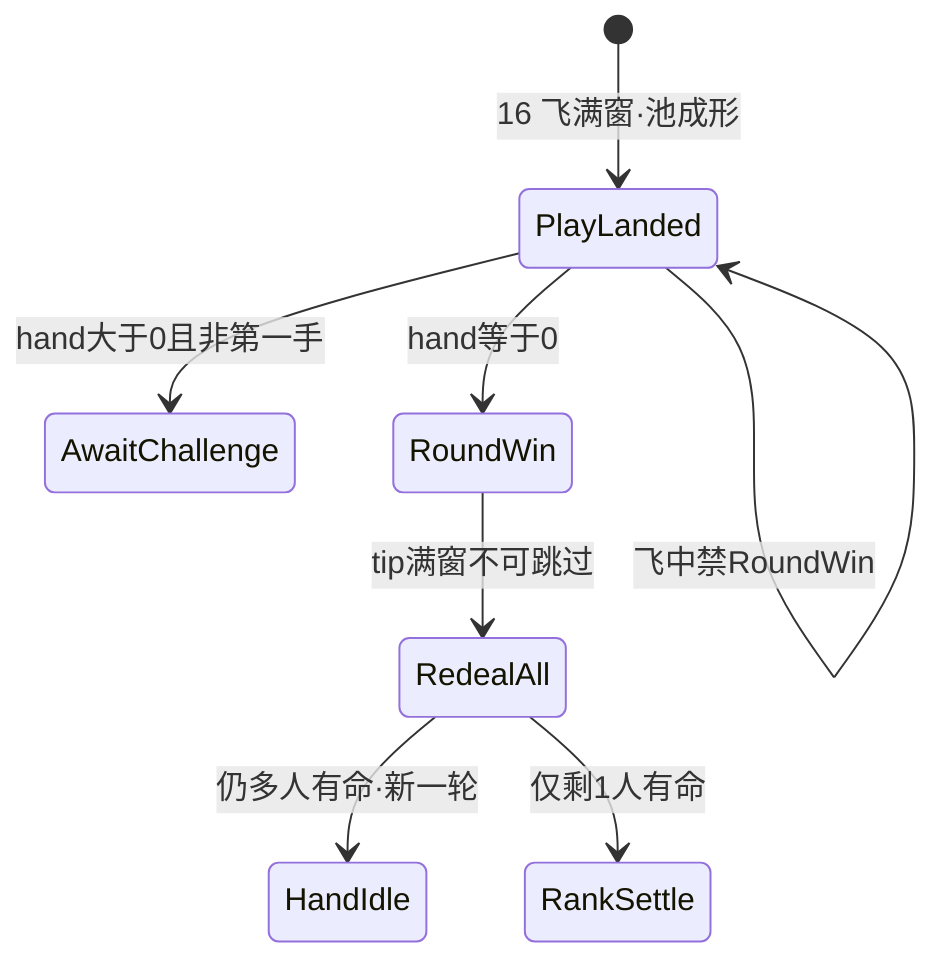

# 19 · 局内轮胜与重发规格（RoundWin → RedealAll）

| 项 | 内容 |
|----|------|
| 版本 | v0.1.0 |
| 状态 | **轮胜提示 + 全员重发会签草案**（PM · 对齐 #160 / `e80b5aa`）· 线框闸 · 未会签禁止落 ets |
| 范围 | `lb_scr_table` 上 **`PlayLanded ∧ hand==0` 之后**：`RoundWin` 提示 overlay → **`RedealAll` 过场**；命尽淘汰座表现；整局结束只在「仅剩 1 人有命」。**本篇 only**（落池认 [16](./16-局内出牌飞出与身前扣牌规格.md)；质疑认 [17](./17-局内质疑入口规格.md)；开牌认 [18](./18-局内开牌区规格.md)） |
| 读者 | UI、美术、策划、测试、鸿蒙、**@LiarBar负责人** |
| 对照 | [出牌扣牌-状态机 v0.4.0](../02-游戏设计/出牌扣牌-状态机.md)（L7 / U03b）· [GDD](../02-游戏设计/GDD.md) · [16 落池](./16-局内出牌飞出与身前扣牌规格.md) · [17 质疑入口](./17-局内质疑入口规格.md) · [18 开牌区](./18-局内开牌区规格.md) · [02 命名](./02-组件与资源命名约定.md) · [11 横屏](./11-局内横屏与自适应布局.md) · [08/09 发牌](./08-开桌加载与发牌体验.md) |
| 本 PR | **只交文档**。零 ets、零 rawfile、零新媒体文件 |

> **UI 管**：轮胜 tip 位 / 时长 / 不可跳过、`RedealAll` 过场挂点、淘汰座视觉口径、`lb_*`、可测失败短句。  
> **策划管**：#160 已锁规则（本线 **不改** 3 命 / `MAX_PLAY=3` / 质疑-before-play / 第一手不可质疑）。文案 exact copy 可后补。  
> **美术管**：**不交**新媒体。tip / 重发过场可用程序文字 + 已有牌背；禁系统灰 toast 当终稿。  
> 命名：控件 `lb_*`；媒体 `art_*`。**禁止** `lb_art_*`。

---

## 0. 边界（写死）

### 0.1 本篇写什么 / 不写什么

| 层 | 本文做什么 | 本文不做什么 |
|----|------------|--------------|
| 拍 | `PlayLanded` 后 hand==0 → **RoundWin** → **RedealAll**；仅剩 1 人有命 → RankSettle | **不改** 16 飞 320ms / 落池 / 露边；**不改** 17 真假同层；**不改** 18 抽→翻 |
| 旧 L7 | 写死：**废止**「hand==0 → RankSettle / 坐穿不再出」 | 16 正文里旧 RankSettle-on-empty / F16-12「应 RankSettle」句 = **已被本篇 supersede**（见 §0.3） |
| 命尽 | `lives==0` → Eliminated：不发 / 不质疑 / 不出 | 不发明第4节细分配分 |
| 布局 | tip **禁** TopStart 左上死角；重发 **禁抬 `padB`** / **禁改 GAP=24%** | 不重开 11 flush 硬修 |
| 落地 | 会签后才开 `feat/client-*` | **本 PR 零 ets** |

**硬闸六句：**

1. **零规则改动于本 PR** — 规则锁认 #160；本篇只写桌上 UI。仍锁：3 命、`MAX_PLAY=3`、GAP=24%、禁抬 `padB`、challenge-before-play、第一手不可质疑。  
2. **打光路径** — `PlayLanded ∧ hand==0` → **RoundWin（必须有提示）→ RedealAll**；**禁止**进 `AwaitChallenge`；**禁止**把打光当整局 RankSettle（除非 RedealAll 后已仅剩 1 人有命）。  
3. **轮胜 tip 不可跳过** — 推荐 **1000ms**，窗 **800～1200**；点空白 / 跳过 / 提前切重发 = 不过。  
4. **等待落地** — 必须等飞满窗 **且** 池上本手成形，才许出 RoundWin（交叉 16 F16-11）。  
5. **命尽不发** — `lives==0` 座：本轮 / 重发 **零手牌**、零质疑入口；视觉可 dim/ghost。  
6. **本票范围** — **只交文档**。零 ets / 零 rawfile / 零 media。合入 ≠ 终验。

### 0.2 PM 已锁摘要（必须写死 · 对齐 #160）

| # | 锁 | 本线写死 |
|---|----|----------|
| 1 | **打光 = 本轮胜** | `PlayLanded ∧ hand==0` → **RoundWin**（计一轮）→ **RedealAll**（`lives>0` 者 **含** 刚打光 / 刚打光且仍有命的座） |
| 2 | **命尽 = 淘汰** | `lives==0` → Eliminated：不发牌、不质疑、不出牌 |
| 3 | **整局结束** | **仅**当场上只剩 **1** 人有命 → RankSettle / 战报。最终分以 **lives** 为主；轮胜次数 = **可选**展示，不挡本版闸 |
| 4 | **多人同手打光** | 同一落地瞬间多人 `hand==0` → **并列本轮胜**（都计一轮）→ **一次** RedealAll |
| 5 | **RoundWin tip** | 推荐 **1.0s（1000ms）**，窗 **0.8～1.2s（800～1200）**，**不可跳过**，然后才 RedealAll |
| 6 | **仍锁** | GAP=24%、禁抬 `padB`、3 命、`MAX_PLAY=3`、challenge-before-play / 第一手不可质疑 |
| 7 | **废止** | 打光后坐穿；打光进了整局名次不重发；旧 L7 RankSettle-on-empty |

### 0.3 相对 16 / 17 / 18（交叉 · 一字不改对方数字）

| 文档 | 仍有效 | 本篇 supersede |
|------|--------|----------------|
| **16** | 落点=`lb_cmp_pool`；飞 320ms；乐观飞；禁抬 `padB`；GAP=24%；F16-11 池堆先成形；hand==0 **禁** AwaitChallenge（F16-12 锁词「打光仍进质疑」**仍有效**） | 16 文中「hand==0 → RankSettle / 占名次」旧句 → 改为认本篇 **RoundWin→RedealAll**（见 16 文首 / §6.3  supersede 注） |
| **17** | `PlayLanded ∧ hand>0 ∧ 非第一手` → AwaitChallenge；靶=池；真≠过；身前入口；tip 迁出左上 | hand==0 **零入口** 不变；目的地从「RankSettle」改为本篇 RoundWin 路径（17 若仍写 RankSettle-only，以本篇 + #160 为准） |
| **18** | ack 后 reveal_stage / 160ms / draw·flip | **不改**。打光路径 **不进** 18 |

**写死：** 16 的 land-to-pool / 飞窗 / 露边 **一字不改**。本篇只接管 empty-hand 后半拍。

---

## 1. 拍表（接 16 · 不另造引擎 phase）

逻辑阶段仍报 GDD / 策划状态机。下表是 **桌上 UI 拍**。

```
ConfirmReady → PlayLaunch（confirmBusy）→ PlayLanded（落 lb_cmp_pool）
                 ├─ hand > 0 ∧ 非第一手 → AwaitChallenge（17）
                 ├─ hand > 0 ∧ 第一手   → 下家 TURN
                 └─ hand == 0           → RoundWin（lb_cmp_round_win · 1000ms 不可跳过）
                                           → RedealAll（lb_cmp_redeal_all 可选过场）
                                                ├─ 仍 ≥2 人有命 → 新宣称 / HandIdle
                                                └─ 仅 1 人有命 → RankSettle（整局）
lives==0 座：全程跳过发牌 / 质疑 / 出牌（Eliminated）
```



| UI 拍 | 画面 | 玩家能做什么 |
|-------|------|--------------|
| **RoundWin** | `lb_cmp_round_win` tip overlay 可见；文案走 `lb_str_round_win`（可「本轮胜」/ 座名 — exact copy 策划可后补） | **不可跳过**。不可点出牌 / 质疑 / 提前重发 |
| **RedealAll** | 可选 `lb_cmp_redeal_all` 过场；有命座重发；池本手清空；新宣称 | 自动。**禁抬 `padB`** / **禁改 GAP**。命尽座 **零发牌** |
| **RankSettle** | 仅整局（1 人有命） | 战报 / 名次。细分配分第4节 |
| **Eliminated** | `lives==0` 座 dim/ghost 可选 | 无手牌、无质疑入口、不可出牌 |

**写死：**

1. 飞中 / 池未成形 → **禁止** RoundWin（抄 16 F16-11 精神 + 本篇 **轮胜无提示** 若直接跳过 tip）。  
2. tip 未满窗就 RedealAll / 可点跳过 = **轮胜可跳过**。  
3. 无 tip 直接重发或直接整局名次 = **轮胜无提示** / **打光进了整局名次不重发**。  
4. 有命打光者漏发、或有命却坐穿不再出 = **打光后坐穿**。  
5. 命尽仍发到手 = **命尽仍发牌**。  
6. 重发为腾位抬 `padB` = **重发抬了padB**。

---

## 2. 线框：RoundWin tip（本版闸）

### 2.1 容器与位

| 项 | 锁 |
|----|-----|
| 容器 | **`lb_cmp_round_win`**（挂 `lb_scr_table` Stack overlay） |
| 文案 key | **`lb_str_round_win`**（默认可读作「本轮胜」；可带座名 / 「并列本轮胜」— **soft**：exact copy 归策划） |
| 水平 | **屏心** 或 **宣称带 / 池锚近侧**（claim zone 附近） |
| 竖直 | 桌心可读带；**禁止** TopStart / 左上死角主读（与 17 tip 迁出左上同精神） |
| HitTest | tip 期间吞点击（防误触出牌/质疑）；**不是**可点「跳过」钮 |
| Z | 高于池本手与座位环；**不得**永久挡手牌主行（满窗后收起再 RedealAll） |

无 tip、tip 只在左上、或 tip 被裁切不可读 = **轮胜无提示**。

```
│         bust + lb_cmp_pool（本手已成形）              │
│              ┌ lb_cmp_round_win ┐                     │
│              │  lb_str_round_win │  ← 屏心 / 近宣称带 │
│              └───────────────────┘                    │
│     ░ 环-手 24%（HAND_RING_GAP 数字不动）░            │
│   ※ 禁 TopStart 左上死角 ※ 禁抬 padB ※               │
```

### 2.2 时长（写死）

| 项 | 锁 |
|----|-----|
| 推荐 | **1000ms** |
| 窗口 | **800～1200ms** |
| 可跳过？ | **否（不可跳过）** |
| 满窗后 | **立刻**进 RedealAll（或短衔接 ≤1 帧），不得再等二次确认 |

短于 800、长于 1200 且被评委判「闪一下 / 拖太久」、或任意跳过手势提前切走 = **轮胜可跳过**（时长违规亦抄本句或 **轮胜无提示**）。

### 2.3 并列本轮胜

同一落地瞬间多人 `hand==0`：

- 都计一轮贡献；tip 可同屏列出多座或统一「并列本轮胜」（copy soft）。  
- **一次** RedealAll，禁止每人各走一套完整 tip+重发把局拖死。  
- 仍 **禁止** AwaitChallenge。

---

## 3. RedealAll 过场

| 项 | 锁 |
|----|-----|
| 可选容器 | **`lb_cmp_redeal_all`**（过场层；可与既有 DEAL 飞牌视觉同族，**不是**新主屏） |
| 谁发 | 所有 `lives>0`（**含**刚打光且仍有命者）按默认手牌数重发 |
| 谁不发 | `lives==0` → **零**手牌交易 |
| 池 | 本轮本手清空；新宣称后新一轮才再落池（认 16） |
| 布局 | **禁止**抬 `padB`；**禁止**改 `HAND_RING_GAP=24%`；flush 硬修另线 |
| 与开桌 DEAL | 可复用 08/09 发牌飞 + SFX 精神；**禁止**用出牌 launch/land 冒充发牌感的反向混乱；本线不交新 SFX 文件 |

重发过程中抬了下手垫高 / `padB` = **重发抬了padB**。

---

## 4. 淘汰座（Eliminated）

| 项 | 锁 |
|----|-----|
| 条件 | `lives==0`（扣命归零；**不是**打光） |
| 发牌 | RedealAll / 开局 DEAL：**不发** |
| 质疑 | **零** `AwaitChallenge` 入口 |
| 出牌 | **不可**进 ConfirmReady / PlayLaunch |
| 视觉 | **可选** dim / ghost / `_ghost` 态（交叉 02 `_life_0` / `_ghost`）；不挡本版闸的硬失败句是 **命尽仍发牌** |

有命却因「打光」被当成整局出局、坐穿不再发 = **打光后坐穿**（与命尽句分开抄）。

---

## 5. 控件 id（草案 · 已回写 02）

| id | 类型 | 说明 |
|----|------|------|
| `lb_cmp_round_win` | 组件 | RoundWin tip overlay。屏心或近宣称/池带；**禁**左上死角 |
| `lb_str_round_win` | 文案 key | 「本轮胜」等；并列 / 座名 soft |
| `lb_cmp_redeal_all` | 组件（可选） | RedealAll 过场层；无独立容器时可用既有 DEAL 层，但测试仍要能指到重发发生 |

本线 **不**新锁 SFX 文件；胜提示若复用既有 result 槽，不得在飞中抢响（交叉 16）。

---

## 6. 不做（本线写死）

| 不做 | 说明 |
|------|------|
| 改 16 落池数字 | 320ms / 露边 / 池锚 **只交叉** |
| 改 17 / 18 | 入口与开牌 **不变**（empty-hand 不进） |
| 抬 `padB` / 改 GAP | 24% 不动 |
| 可跳过 tip | 800～1200 满窗 |
| 打光→整局名次不重发 | 废旧 L7 |
| 打光后坐穿 | 有命必须进 RedealAll |
| 命尽仍发牌 | Eliminated 零手 |
| 新媒体 / ets | 本 PR 零 |

---

## 7. 失败短句（测试 / 鸿蒙可抄）

合入 ≠ 终验。未会签勿按短句改 ets。  
**禁止**空勾「OK」交差 — 必须能指到下表锁词。

16 F16-1～15、17 F17-*、18 F18-1～3 **仍有效**；其中 F16-12 **打光仍进质疑** 继续管「hand==0 还进 AwaitChallenge」。本篇追加轮胜/重发句（不占 F16 号）。

| # | 短句 | 不过 |
|---|------|------|
| F19-1 | **轮胜无提示** | `PlayLanded∧hand==0` 后无 `lb_cmp_round_win` / 无可见 `lb_str_round_win`；tip 裁切不可读；tip 只在 TopStart 左上死角；无 tip 直接 RedealAll 或直接战报 |
| F19-2 | **轮胜可跳过** | tip 窗内可点跳过 / 点空白提前切走；时长 <800ms 闪过或未满窗就 RedealAll；可跳过钮当完成 |
| F19-3 | **打光后坐穿** | 打光后 `lives>0` 却不再发 / 不再出 / 被当整局出局旁观；有命者漏出 RedealAll |
| F19-4 | **命尽仍发牌** | `lives==0` 座在 RedealAll / DEAL 仍拿到手牌；或仍能进质疑 / 出牌 |
| F19-5 | **打光进了整局名次不重发** | hand==0 后直接整局 RankSettle / 战报 / 名次条，**跳过** RoundWin→RedealAll（场上仍 ≥2 人有命时） |
| F19-6 | **重发抬了padB** | RedealAll / 重发过程为腾位抬 `padB`、改 `HAND_RING_GAP=24%`、或垫高下手破坏贴底锁 |

**边界复查（开 PR 前必过）：**

- [x] 等飞/池 land 后才 RoundWin  
- [x] 禁 RankSettle-as-match-end on empty hand（场上仍多人有命时）  
- [x] 零 ets this PR  
- [x] 上表六句齐全  

---

## 8. 会签

- [ ] @LiarBar负责人 RoundWin 1000ms 不可跳过 → RedealAll；废旧 L7 坐穿 / 打光进整局名次  
- [ ] @LiarBar策划 对齐 #160；并列本轮胜；最终分 lives 主、轮胜次数可选；exact copy soft  
- [ ] @LiarBar UI tip 位（非左上）；禁抬 `padB` / 禁改 GAP；淘汰 dim 可选  
- [ ] @LiarBar鸿蒙 RoundWin→RedealAll 对表；会签前零 ets；命尽零发  
- [ ] @LiarBar测试 F19-1～6 可抄；F16-12 仍管打光进质疑；合入 ≠ 终验  
- [ ] @LiarBar美术 不交新媒体；程序 tip 可过会签门  

**未会签禁止落 ets。** 会签前零 ets。合入本 PR ≠ 轮胜/重发终验 ≠ 出牌飞出终验 ≠ 质疑终验 ≠ 开牌终验。

---

## 9. 修订记录

| 版本 | 日期 | 说明 |
|------|------|------|
| v0.1.0 | 2026-09-14 | 新建：对齐 #160 PM 轮胜重发。`lb_cmp_round_win` + `lb_str_round_win`；tip **1000ms**（800～1200）**不可跳过** → `lb_cmp_redeal_all`（可选）；废 16/旧 L7 RankSettle-on-empty / 坐穿；淘汰座不发；失败 **轮胜无提示** / **轮胜可跳过** / **打光后坐穿** / **命尽仍发牌** / **打光进了整局名次不重发** / **重发抬了padB**。16 land-to-pool 不动。零 ets |

### 审核记录

| 日期 | 意见 | 提议修改 | 提出人 | 状态 |
|------|------|----------|--------|------|
| 2026-09-14 | PM #160：打光=本轮胜→RedealAll；tip 1.0s 不可跳过 | 新建 19 v0.1.0 | UI 文档岗 | **待 @LiarBar负责人 会签** |

---

*维护人：UI 文档岗 · 2026-09-14 · docs only · 轮胜与重发会签草案 v0.1.0 · 会签前零 ets · 合入 ≠ 终验*
