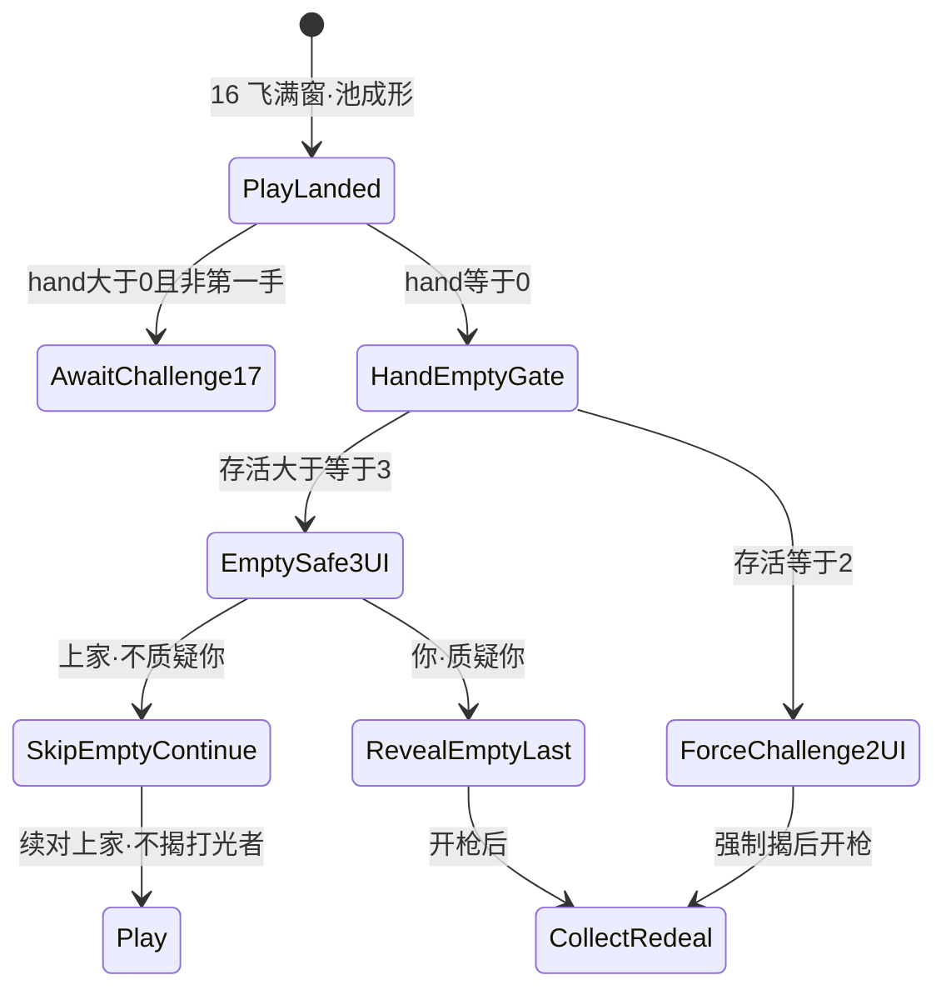

# 20 · 局内打光目标二选规格（hand-empty · ≥3 你/上家 · =2 强制质疑）

| 项 | 内容 |
|----|------|
| 版本 | **v0.1.0** |
| 状态 | **打光目标二选会签草案**（对齐 #164 / 左轮 v1.1.1 · GDD v0.3.0）· 线框闸 · **合入 ≠ 终验** · 会签前零 ets |
| 范围 | `lb_scr_table` 上 **`PlayLanded ∧ hand==0` 之后** 的 **HandEmptyGate UI**：存活 ≥3 → **你/上家** 二选；存活 ==2 → **强制** ChallengeCommit（无你/上家）。**本篇 only** |
| 读者 | UI、美术、策划、测试、鸿蒙、**@LiarBar负责人** |
| 对照 | [左轮对局-状态机 v1.1.1](../02-游戏设计/左轮对局-状态机.md)（**规则真源** · §2.6 / RoundSafeWait / CollectRedeal）· [GDD v0.3.0](../02-游戏设计/GDD.md) · [17 质疑入口](./17-局内质疑入口规格.md)（hand>0 真/假仍在）· [19 轮胜与重发](./19-局内轮胜与重发规格.md)（**SUPERSEDED / 冻结** · RoundWin 不得再主读）· [16 落池](./16-局内出牌飞出与身前扣牌规格.md) · [02 命名](./02-组件与资源命名约定.md) · [11 横屏](./11-局内横屏与自适应布局.md) |
| 本 PR | **只交文档**。零 ets、零 rawfile、零新媒体文件 |

> **UI 管**：打光后目标二选 overlay、落点、`lb_*`、与 17 真/假互斥、可测失败短句。  
> **策划管**：规则认左轮 §2.6 / U13–U19；本线 **不改** 规则、**不发明**第三套胜负。  
> **美术管**：**不交**新媒体。二选铬件后补；禁止系统灰钮当终稿。  
> 命名：控件 `lb_*`；媒体 `art_*`。**禁止** `lb_art_*`。

---

## 0. 边界（写死）

### 0.1 本篇写什么 / 不写什么

| 层 | 本文做什么 | 本文不做什么 |
|----|------------|--------------|
| 闸 | `PlayLanded ∧ hand==0` → **HandEmptyGate** UI：≥3 你/上家；=2 强制质疑 | **不改** 16 飞 320ms / 落池；**不改** 17 hand>0 真/假同层；**不改** 18 抽→翻 |
| 规则 | **复述**左轮 §2.6 / RoundSafeWait / CollectRedeal / EmptyShooter（一字不改语义） | **不发明**第三套胜负；**不**写回 RoundWin→RedealAll / 3 命 |
| 与 17 | hand>0 非第一手 → 17 真/假 **仍在**；本篇 = 打光 **额外闸** | 不把你/上家写成真/假别名；不双轨并存可点 |
| 与 19 | 写死：**RoundWin 冻结**；打光主读改认本文 + 左轮 | 不重开 19 tip 时长 / RedealAll 过场当现行 |
| 布局 | 与 17 同族：**当前行动座身前**；≠ `handPin`；≥44vp；禁左上；不挡池心 | 不抬 `padB`；不改 `HAND_RING_GAP=24%` |
| 落地 | 会签后才开 `feat/client-*` | **本 PR 零 ets** |

**硬闸六句：**

1. **规则真源 = 左轮** — Trust\|Challenge → Reveal → Shoot → **CollectRedeal**；打光认 §2.6；**废** 3 命 / RoundWin（#160/#162/#163 / #164）。  
2. **≥3 打光** — 下家见 **你 / 上家** 二选（**不是** 真/假）；隐藏 17 真/假入口（互斥）。  
3. **=2 打光** — **强制**进 ChallengeCommit / RevealEmptyLast 路径；**无** 你/上家二选；禁 Trust / 过 / 跳过。  
4. **落点** — `lb_cmp_empty_target_choice` = **当前行动座身前**（环–手带内），overlay ≠ `handPin`；热区各 **≥44vp**；**禁** TopStart / 左上；**不**盖池心 / 手行 / 烛。  
5. **仍锁** — `HAND_RING_GAP=24%`；**禁抬 `padB`**；Joker 除外认左轮；任意开枪 → CollectRedeal。  
6. **本票范围** — **只交文档**。零 ets / 零 rawfile / 零 media。合入 ≠ 终验。**禁发明。**

### 0.2 PM / 左轮已锁摘要（必须写死）

| # | 锁 | 本线写死 |
|---|----|----------|
| 1 | **主环** | 宣称 K\|Q\|A；出 1–3；相信=续 / 质疑=揭；真→质疑者开枪，假→上家开枪；任意开枪→CollectRedeal+新宣称；实弹=出局；最后幸存者胜 |
| 2 | **hand==0 ∧ 存活≥3** | 打光座本轮安全（RoundSafe）；下家 **你/上家** 二选：**质疑你** → RevealEmptyLast；**不质疑你**（上家路径）→ SkipEmptyContinue（跳过打光座、续对上家节奏、**不揭**打光者最后一手）；打光者进 **RoundSafeWait** |
| 3 | **hand==0 ∧ 存活==2** | **强制**质疑最后一手；无你/上家；真→质疑者开枪；假→打光者开枪 |
| 4 | **裁定（质疑你 / =2 强制揭）** | 存在非宣称且非 Joker → 假 → EmptyShooter（打光者开枪）；全宣称/Joker → 真 → ChallengerShoot |
| 5 | **废 RoundWin** | 19 RoundWin→RedealAll **SUPERSEDED / 冻结**；失败短句 **RoundWin仍主读** |
| 6 | **17 交叉** | hand>0 非第一手的 真/假入口 **仍存在**；本篇是打光 **额外闸**，与真/假 **互斥**（同时只挂一套） |

### 0.3 相对 16 / 17 / 18 / 19

| 文档 | 仍有效 | 本篇接管 |
|------|--------|----------|
| **16** | 落点=`lb_cmp_pool`；飞 320ms；禁抬 `padB`；GAP=24%；F16-11 池堆先成形 | hand==0 **不再**走旧 RankSettle / RoundWin 主读；分流认本文 + 左轮 HandEmptyGate |
| **17** | `PlayLanded ∧ hand>0 ∧ 非第一手` → AwaitChallenge 真/假；靶=池；真≠过；身前入口 | hand==0 **不**挂 `lb_cmp_challenge_entry` 真/假；改挂本篇二选或强制质疑 |
| **18** | ack 后 reveal_stage | **质疑你** / =2 强制揭 的揭牌门仍认 ack→18（与左轮 RevealEmptyLast 对齐）；本线不重开 18 数字 |
| **19** | 历史可读 | **SUPERSEDED / 冻结**。打光后若仍主读 RoundWin tip = **RoundWin仍主读** |

---

## 1. 拍表（接 16 · 对齐左轮 HandEmptyGate）

逻辑阶段认左轮。下表是 **桌上 UI 拍**。

```
ConfirmReady → PlayLaunch → PlayLanded（落 lb_cmp_pool）
                 ├─ hand > 0 ∧ 非第一手 → AwaitChallenge（17 真/假）
                 ├─ hand > 0 ∧ 第一手   → 下家 TURN
                 └─ hand == 0           → HandEmptyGate（本篇）
                      ├─ 存活 ≥3 → EmptySafe3UI（lb_cmp_empty_target_choice · 你/上家）
                      │              ├─ 上家 / 不质疑你 → SkipEmptyContinue → 续对上家（不揭打光者）
                      │              │                    + 打光者 RoundSafeWait
                      │              └─ 你 / 质疑你     → RevealEmptyLast → ChallengeCommit 路径
                      │                                   → 假 EmptyShooter / 真 ChallengerShoot
                      │                                   → CollectRedeal
                      └─ 存活 ==2 → ForceChallenge2UI（无你/上家；强制 ChallengeCommit）
                                     → 真 ChallengerShoot / 假 EmptyShooter → CollectRedeal
```



| UI 拍 | 左轮对应 | 画面 | 玩家能做什么 |
|-------|----------|------|--------------|
| **HandEmptyGate** | U04 → HandEmptyGate | 池上本手已成形；按存活分流 | 立刻分流；**禁**再挂 17 真/假 |
| **EmptySafe3UI** | EmptySafe3 / U13–U15 | `lb_cmp_empty_target_choice` 在；**你** / **上家** 同层可点；**无** 真/假 | 点你或上家 |
| **ForceChallenge2UI** | ForceChallenge2 / U17–U18 | **无** 你/上家；强制进入 ChallengeCommit / RevealEmptyLast（可复用 17 提交路径或强制-only CTA） | **不能** Trust / 过 / 跳过；**不能**选上家路径 |
| **SkipEmptyContinue** | U14 | 二选卸掉；续对上家节奏；打光者 RoundSafeWait | 按左轮续对；**不揭**打光者最后一手 |
| **RevealEmptyLast** | U15–U16 | ChallengeCommit → 等 ack → 18 抽→翻 | 裁定后开枪 → CollectRedeal |

**写死：**

1. 飞中 / 池未成形 → **禁止**挂二选（抄 16 F16-11）。  
2. EmptySafe3UI 时若仍亮 17 真/假 = 互斥失败（抄 **打光后无你上家二选** 或与 17 双轨）。  
3. =2 仍出你/上家、或可过/可 Trust = **二人局未强制质疑**。  
4. 打光后主读仍是 `lb_cmp_round_win` / RoundWin tip = **RoundWin仍主读**。

---

## 2. 入口闸（写死）

### 2.1 ≥3 · 你/上家二选

同时满足才挂 **可点** `lb_cmp_empty_target_choice`：

```
PlayLanded
AND lastPlay != null
AND lastPlay 已落池成形
AND lastPlay.actor.hand.count == 0
AND 存活座位数 >= 3
AND current.ALIVE
AND 当前座 = 打光者的下家行动座
```

| 钮 | id | 可见字 | 语义（认左轮） | 下一拍 |
|----|-----|--------|----------------|--------|
| **你** | `lb_btn_challenge_you` | **你**（可辅读「质疑你」） | 质疑打光者：揭其最后一手 | RevealEmptyLast → ChallengeCommit → ack → 18；假→EmptyShooter；真→ChallengerShoot → CollectRedeal |
| **上家** | `lb_btn_challenge_prev` | **上家**（可辅读「不质疑你」） | 跳过打光座；续对上家节奏；**不揭**打光者最后一手 | SkipEmptyContinue → Play；打光者 **RoundSafeWait** |

**互斥（写死）：**

- EmptySafe3UI 期间：**隐藏** `lb_cmp_challenge_entry` / `lb_btn_challenge_true` / `_false` / `_pass`（或 `Visibility.None`，不是灰着可点）。  
- 17 真/假 **仅**服务 hand>0 非第一手。  
- 禁止你/上家与真/假同屏可点。

### 2.2 =2 · 强制质疑（无你/上家）

```
PlayLanded
AND lastPlay.actor.hand.count == 0
AND 存活座位数 == 2
AND 当前座 = 打光者的下家行动座
```

| 要 | 不要 |
|----|------|
| **强制**进入 ChallengeCommit / RevealEmptyLast（揭打光者最后一手） | 挂 `lb_cmp_empty_target_choice` 你/上家 |
| 可复用 17 ChallengeCommit 提交路径，或单一强制-only CTA（文案认左轮「强制质疑」；**不发明**第三套问卷） | Trust / 过 / 超时当过 / 跳过揭牌 |
| 真→ChallengerShoot；假→EmptyShooter；→ CollectRedeal | 打光者可「不质疑你」逃过；=2 仍进 RoundWin |

**=2 不得**出现你/上家二选。出现 = **二人局未强制质疑**。

### 2.3 RoundSafeWait（≥3 · 上家路径）

认左轮 §2.6.1：

- 主触发：本轮任意后续开枪 → CollectRedeal  
- 收束触发：其余存活均 `hand==0` 且本轮尚未开枪 → CollectRedeal  
- **禁**无触发永久挂起；**禁**静默跳过 CollectRedeal；**禁**写成旧 RoundWin→RedealAll

本线 **不**另造 RoundSafeWait 大屏；打光座可用轻量安全态（dim / 角标 soft），**不得**用 `lb_cmp_round_win` 交差。

---

## 3. 线框（与 17 同族 · 当前行动座身前）

### 3.1 Overlay 族

`lb_cmp_empty_target_choice` 与 `lb_cmp_challenge_entry` **同一家族**：

- `Stack` **overlay**，与 `handPin` **兄弟**  
- **禁止**进 `handPin`  
- **当前行动座身前**：手牌行之上 / **环–手空隙（`HAND_RING_GAP=24%`）** 内、身体正面可读  
- **禁止**只贴 BottomEnd / 右下角 / TopStart / 左上  
- 热区你/上家各 **≥44vp**  
- **不得**盖手牌主行、`lb_cmp_life_*` 烛、池上本手堆心、`lb_txt_claim`

```
│     桌心 bust + lb_cmp_pool（本手堆 · 不挡）            │
│     ░ 环-手 24%（HAND_RING_GAP 数字不动）░             │
│     ┌─ lb_cmp_empty_target_choice（行动座身前）─┐     │
│     │   【 你 】     【 上家 】                  │     │
│     │  challenge_you   challenge_prev           │     │
│     └────────────────────────────────────────────┘     │
│  selfDock │  [手][手][手]…  ← 二选不压手行            │
│         ░ padB = 仅 inset · 禁加大 ░                   │
```

**不过（布局）：** 你/上家只缩边角 = **你上家键贴边角**；压手或烛 = **二选压手或烛**；挡池心 = 与 17 **真假键挡池心** 同精神（本线抄 **二选压手或烛** 或布局打回）。

### 3.2 禁抬 `padB` / 禁改 GAP

与 15 / 16 / 17 同一句：

- **不**加大 `padB` 给二选腾空  
- **不**改 `HAND_RING_GAP=24%`  
- 只改二选自身边距 / 安全区 inset

### 3.3 SFX（调用点 · 不交文件）

| 调用点 | 何时 | 本线交文件？ |
|--------|------|----------------|
| 可复用 `lb_sfx_challenge_enter` | 二选出现（与入口可见起势同起） | **否** |
| 可复用 `lb_sfx_challenge_commit` | 点 **你**（质疑你）或 =2 强制提交 | **否** |
| 点 **上家**（不质疑你） | **禁止**强制 commit 声（对齐 17「过」静默精神） | — |

**禁止** flip / launch / land / deal / reveal_* 冒充。本 PR **不交**新 SFX / rawfile。

---

## 4. 控件 id（草案 · 回写 02）

| id | 类型 | 何时 | 说明 |
|----|------|------|------|
| `lb_cmp_empty_target_choice` | 组件 | ≥3 打光后 EmptySafe3UI | 你/上家二选容器。**当前行动座身前** overlay ≠ `handPin`；禁只贴边角 / 左上 |
| `lb_btn_challenge_you` | 按钮 | 同上 | 可见字 **你**（质疑你）。与上家同层 |
| `lb_btn_challenge_prev` | 按钮 | 同上 | 可见字 **上家**（不质疑你 / 上家路径）。与你同层 |

**=2** 不登记新你/上家 id；强制路径复用 17 ChallengeCommit 或强制-only CTA（会签后客户端另票锁具体 id，本线 **禁发明**第三套真假问卷）。

**禁止**用下列交差本闸：

| 旧 / 错 id | 为什么不是 |
|------------|------------|
| `lb_cmp_challenge_entry` + 真/假 | 17 hand>0 入口；打光 ≥3 须互斥隐藏 |
| `lb_cmp_round_win` / `lb_cmp_redeal_all` | 19 RoundWin 已冻结；不得再当打光主读 |
| `lb_btn_challenge_true` / `_false` 冒充你/上家 | 可见语义必须是 **你/上家**，不是真/假 |

---

## 5. 不做（本线写死）

| 不做 | 说明 |
|------|------|
| 改 16 落池数字 | 320ms / 露边 / 池锚 **只交叉** |
| 废 17 hand>0 真/假 | 非打光局入口仍认 17 |
| 发明第三胜负公式 | 只认左轮 CollectRedeal / RoundSafeWait |
| 恢复 RoundWin 主读 | 19 冻结；失败 **RoundWin仍主读** |
| 抬 `padB` / 改 GAP | 24% 不动 |
| ≥3 强制质疑 | 与左轮 S18-8 同禁 |
| =2 可跳过质疑 | 与左轮 S18-9 同禁 |
| 新媒体 / ets | 本 PR 零 |
| 禁发明 | 表外规则 / 表外 id / 表外短句 **不写** |

---

## 6. 失败短句（测试 / 鸿蒙可抄）

合入 ≠ 终验。未会签勿按短句改 ets。  
**禁止**空勾「OK」交差 — 必须能指到下表锁词。

16 / 17 / 18 既有短句 **仍有效**。左轮 S18-8～12 **仍有效**。本篇追加打光目标二选句。

| # | 短句 | 不过 |
|---|------|------|
| F20-1 | **打光后无你上家二选** | 存活≥3 且上家打光后，下家行动座 **无** `lb_cmp_empty_target_choice` / 无可用 **你·上家**；或仍只挂 17 真/假当完成；或二选与真/假同屏可点 |
| F20-2 | **二人局未强制质疑** | 存活==2 且打光后仍出你/上家、或可 Trust/过/跳过、或不进 ChallengeCommit/RevealEmptyLast |
| F20-3 | **你上家键贴边角** | 二选只贴 BottomEnd / 右下角 / TopStart / 左上，**不在**当前行动座身前（环–手带内）正面可读 |
| F20-4 | **二选压手或烛** | `lb_cmp_empty_target_choice` / 你·上家热区盖住行动座手牌主行或 `lb_cmp_life_*`；或挡池上本手堆心；或为此抬 `padB` / 改 GAP |
| F20-5 | **RoundWin仍主读** | 打光后仍以 `lb_cmp_round_win` / RoundWin→RedealAll / 3 命公式为主路径（未改认左轮 HandEmptyGate + 本篇） |

**边界复查（开 PR 前必过）：**

- [x] ≥3 你/上家；隐藏 17 真/假  
- [x] =2 强制质疑；无你/上家  
- [x] 身前 overlay ≠ handPin；≥44vp；禁左上；不压手/烛/池心  
- [x] GAP=24%；禁抬 padB  
- [x] 19 RoundWin 标 SUPERSEDED/冻结  
- [x] 零 ets this PR  
- [x] 上表五句齐全  

---

## 7. 会签

- [ ] @LiarBar负责人 ≥3 你/上家；=2 强制质疑；废 RoundWin 主读；合入≠终验  
- [ ] @LiarBar策划 对齐左轮 §2.6 / RoundSafeWait / CollectRedeal；Joker 除外；禁发明  
- [ ] @LiarBar鸿蒙 HandEmptyGate 对表；与 17 互斥；会签前零 ets  
- [ ] @LiarBar测试 F20-1～5 可抄；S18-8～12 不改号；合入 ≠ 终验  
- [ ] @LiarBar美术 不交新媒体；二选铬后补；禁系统灰钮当终稿  

**未会签禁止落 ets。** 会签前零 ets。合入本 PR ≠ 打光二选终验 ≠ 质疑终验 ≠ 开牌终验。

---

## 8. 修订记录

| 版本 | 日期 | 说明 |
|------|------|------|
| **v0.1.0** | 2026-09-14 | 新建：对齐 #164 左轮 hand-empty ≥3/=2。`lb_cmp_empty_target_choice` + `lb_btn_challenge_you` / `lb_btn_challenge_prev`；行动座身前；与 17 真/假互斥；=2 强制 ChallengeCommit；19 RoundWin 冻结交叉；失败 **打光后无你上家二选** / **二人局未强制质疑** / **你上家键贴边角** / **二选压手或烛** / **RoundWin仍主读**。GAP=24% / 禁抬 padB。零 ets |

### 审核记录

| 日期 | 意见 | 提议修改 | 提出人 | 状态 |
|------|------|----------|--------|------|
| 2026-09-14 | #164 锁打光≥3 你/上家、=2 强制质疑；废 RoundWin；UI 需二选线框 | 新建 20 v0.1.0 | UI 文档岗 | **待 @LiarBar负责人 / 策划 / 鸿蒙 / 测试 / 美术 会签** |

---

*维护人：UI 文档岗 · 2026-09-14 · docs only · 打光目标二选会签草案 **v0.1.0** · 会签前零 ets · 合入 ≠ 终验*
