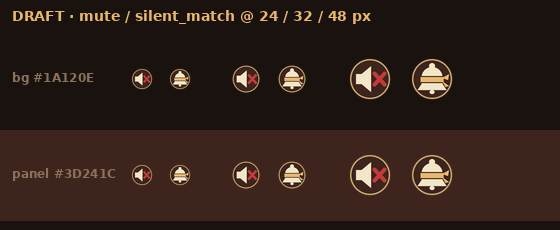
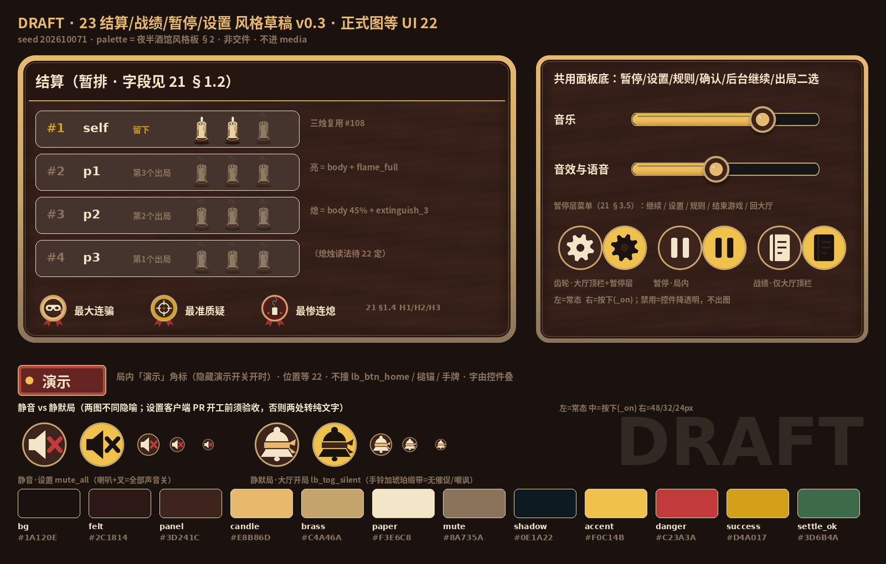

# 23 · 美术 · 结算/战绩/暂停/设置 · 资源清单与风格草稿

| 项 | 内容 |
|----|------|
| 版本 | **v0.3.2**（草稿） |
| 状态 | **DRAFT**：资源清单 + 风格草稿。**正式图等 UI 22 线框锁定后再出** |
| 基线 | develop@`e34e8ce`（#296 PR-B、#300 21 补7b、#297 22 v0.1.3、#301 21 补7c 已合）。21、22、02 行号全部按 `e34e8ce` 的文件（21 补7c、870 行；#301 只改 21，22、02 与 `507361b` 逐字节相同） |
| 来源 | 负责人分派单 v1（2026-10-07）【美术】条 + 群内同日补充（战绩仅大厅入口 / `lb_btn_report_lobby` 定名 / 局内「演示」角标） |
| 对齐 | 策划 [21-结算战报·战绩·暂停·设置·规则](./21-结算战报·战绩·暂停·设置·规则.md) **21 补7c**（#301 已 squash 合入 develop@`e34e8ce`；补7c 只就地改 21:5 / :7 / :329 / :376 四行、文末追加 :870，不移行；21:376 §3.2 待停态 toast 改顶栏待停条，键 `lb_str_pause_pending` 不变，对齐 22 §6.2 22:372，见 #2。补7 / 7b（#300，develop@`53f3733`）只改 21 的 §2.6 与 §4.2 第 3 条「单键写盘」及 S21-47，本文引到的章节号与条目不变，§2.6 之后行号后移 2 行）。UI [22](./22-结算·战绩·暂停·设置·规则线框.md) **v0.1.3**（#297 已 squash 合入 develop@`507361b`；与 feat/ui@`6e1d85c` 逐字节一致，行号不变）。命名 [02](./02-组件与资源命名约定.md) **v0.1.40**（随 #297 合入）。字段、三高光、暂停状态机、设置清单、string 键全部以 21 为准；本文正文引章节号，行号对照见 §7，不另造键 |
| 依赖 | 策划 **21**（上行）· UI **22**（线框、控件 id、挂点坐标、02 登记） |
| 本 PR 范围 | 零 `.ets`；**不进** `entry/src/main/resources/**/media`；草稿只放 `docs/04-设计/art-drafts/23/`；不改任何 `scripts/*_check.mjs` |
| 色板真源 | [夜半酒馆-风格板 §2](./夜半酒馆-风格板.md) = `entry/src/main/resources/base/element/color.json` = `scripts/gen_scaffold_assets.py` 常量（三处一致） |

> 规则：v0.2 规则与质疑机制不动，不发明玩法。下表 `art_*` 中 #297 已登记进 02（v0.1.40，develop@`507361b`）的标 **「已登记02:行」**：`art_panel_base` 02:94；`art_icon_mute` 02:353；`art_icon_silent_match` 02:93 / :353（另见 02 修订记录 :583）；已有槽 `art_hl_*` 02:439、`art_result_bar_win` / `_lose` 02:438。其余（`art_icon_settings` / `art_icon_pause` / `art_icon_records`、`art_panel_report`、`art_slider_*`、`art_badge_demo`）仍是 **拟名**：挂点控件 id 02 已登记（见各行），`art_*` 名要等 UI 下一轮登记进 02 才算数。控件 id 以 02 v0.1.40 登记为准，行号对照见 §7。合入 ≠ 终验。

---

## 0. 现有资产盘点（develop@53f3733 实测；#296 改了 ets，未动 media / rawfile / string.json，仍 341 键；#300 只改 21；#297 只改文档，develop@`507361b` 下同；#301 只改 21，develop@`e34e8ce` 下同）

### 0.1 本轮可直接复用

| 现有文件 | 尺寸 | 现状 | 本轮用法 |
|----------|------|------|----------|
| `art_life_candle_body` | 128×160 | #108 精致化交件 | 结算每座三烛的烛身（21 §1.2「剩烛：3 支烛图，亮 = 剩，灭 = 熄」） |
| `art_life_candle_flame_full` | 128×160 | 同上 | 结算「剩烛」亮焰 |
| `art_life_candle_extinguish_3` | 128×160 | 同上（灭序末帧：烟缕） | 结算「熄烛」（21 §8.2「熄尽态烛图，复用 #108 烛身」） |
| `art_life_candle_flame_hurt` / `_dying` / `extinguish_0…2` | 128×160 | 同上 | 结算 **不用**（结算是静态终态，不播灭序） |
| `art_btn_primary` / `_on` | 720×144 | 大厅 v2 交件（木纹 + 铜钉 + 烛光） | 主键皮：结算「再来一局」、暂停层「继续」、出局层「直接看结算」**复用现有 `art_btn_primary` 族**（含 `_press`；已定，22 K2 22:578） |
| `art_card_a` / `_k` / `_q` / `_joker` / `_back` | 240×336 | 牌面交件 | 规则说明页插图（21 §5，静态，缩放即可） |
| `art_dealer_bust_idle` | 324×432 | 荷官交件 | 战绩空态 **不用**（已定：22:492 空态只有标题行、`lb_str_records_empty`、返回键） |
| `art_frame_player_idle` / `_ghost` | 256 / 216 | 头像框交件 | 结算座次行头像框（ghost = 出局），候选 |

### 0.2 已有槽、但仍是脚手架占位（#10 `e841ff9` 平涂色块，`gen_scaffold_assets.py:178-182`）

| 槽 | 尺寸 | 21 怎么用 | 本轮处理 |
|----|------|-----------|----------|
| `art_hl_long_bluff` | 96×96 | **H1 最大连骗**（21 §1.4.1） | 正式图 **同名覆盖**，不改代码 |
| `art_hl_best_challenge` | 96×96 | **H2 最准质疑**（21 §1.4.2） | 同名覆盖 |
| `art_hl_worst_break` | 96×96 | **H3 最惨连熄**（21 §1.4.3；槽名沿用旧「破防」词，21 §1.2 已明确就用此槽，美术不改名） | 同名覆盖 |
| `art_result_bar_win` / `_lose` | 1080×120 | 结算顶句 胜 / 负 / **中退** 三态（21 §1.2「顶句」） | 横屏要重出；**不加 `_quit`**，中退复用现有 `art_result_bar_win` / `_lose`（已定，22 K9 22:585） |

`ReportPanel.ets:15-37` 现在挂的就是上面两组占位。

### 0.3 现有 SFX 槽（实测）与 21 的要求

| 槽 id | 文件 | 谁加载 | 21 用法 |
|-------|------|--------|---------|
| `lb_sfx_cta_tap` | `rawfile/audio/sfx/sfx_cta_tap.wav` | **只有** `LobbyAudio`（`PATH_CTA` :18，`playCtaTap(secondary)` :179；行号按 53f3733） | 21 §4.2 第 3 条（补7 / 7b 改为单键写盘，试听口径不变）：大厅 SFX 滑条松手试听一记 |
| `lb_sfx_turn_tick` | `sfx_turn_tick.wav` | `TableAudio` | 21 §4.2 第 3 条：局内 SFX 滑条松手试听一记 |
| `lb_sfx_result_win` / `_lose` | `sfx_result_win.wav` / `_lose.wav` | `TableAudio` | 结算沿用 |
| `lb_sfx_recap` | — | 02 §6 登记过，**无文件、无代码** | 21 未要求，不新建 |

21 §8.2 给美术的口径：**SFX 复用现槽，不新开**。

---

## 1. 资源清单（拟名 · 草稿 · 正式图按 22 出）

状态统一写：**草稿；22 锁定后出正式图**。尺寸都是源图像素；显示尺寸以 22 为准。

| # | `art_*`（拟名；已登记的标 02 行号） | 用途 / 挂点（21 章节） | 源尺寸 · 九宫 | 状态变体 | 复用 / 新出 | 草稿 |
|---|------|------|------|------|------|------|
| 1 | `art_icon_settings` / `_on` | 齿轮。**大厅顶栏**设置入口（`lb_btn_settings` 已登记02:171，图标位 `lb_ico_settings` 02:351；21 §4.1）。局内设置只从暂停层菜单「设置」进（21 §4.1 / §3.5），菜单项「设置」带齿轮字形（已定，22 §6.1 线框 22:343 `⚙ 设置 lb_btn_pause_settings`） | 96×96，不九宫 | 常态 / 按下 `_on`；禁用 = 控件降透明，**不出图** | 新出 | `draft_icon_settings.png` |
| 2 | `art_icon_pause` / `_on` | 局内暂停键（`lb_btn_pause` · `lb_ico_pause` 已登记02:338；21 §3.5）。**位置已定**（22 §3.2（22:136 起）+ 02:338）：`homeExitChrome` 同带，`[lb_btn_pause] ←≥12vp→ [lb_btn_home]`，图标 24vp、热区 44×44vp（22:155）；右簇从右到左 `lb_btn_home` → `lb_btn_pause` → `lb_cmp_demo_badge` → `lb_cmp_spectate_badge` → `weakCta`，整簇不越过窗宽 55%（22:162），不下探 NPC 气泡带（22:163），LOBBY / RECAP / END 不显示（22:165），短边 <320vp 热区仍 44vp（22:167；22:162-167 写死 6 条）。三态 `_idle` / `_press` / `_pending` 按 22 §3.3（22:169） | 96×96 | 常态 / `_on`；**待停态** `PAUSE_PENDING`（21 §3.1 / §3.2：暂停键置「待停」视觉、不可再触发；21 补7c 起配顶栏待停条 `lb_str_pause_pending`，取代原 toast，见 22 §6.2 22:372）= 图标 `_on` 40% 不透明 + 程序绘制外圈细环（Circle 描边，22 §3.3 22:175），**不出图**，不新增 media id、不加 string（**已定 b**，见 #14 / #15 下方；22 v0.1.4 在 22:175 补外圈程序绘制句） | 新出 | `draft_icon_pause.png` |
| 3 | `art_icon_records` / `_on` | 战绩。**仅大厅顶栏**（`lb_btn_records` 已登记02:170，图标位 `lb_ico_records` 02:349；21 L9 / §2.5）。桌面、暂停层、结算页 **都不放**（S21-20）。大厅是竖屏 | 96×96 | 常态 / `_on` | 新出 | `draft_icon_records.png` |
| 4 | `art_panel_base`（**已登记02:94**） | **共用面板底**，以下全部同一张：暂停层菜单 `PAUSED.MENU`、设置 `SETTINGS`、规则 `RULES`、结束游戏确认 `CONFIRM_END`、离局确认 `CONFIRM_LOBBY`、后台回来 `BG_RESUME`、出局二选 `ELIM_CHOICE`（21 §3.1 子层全表）；大厅侧的设置面板、规则面板（21 §4.1 / §5.0 同一组件）与战绩面板也用它；**战绩是大厅内叠层面板，不进 `lb_scr_report`**（21 §2.5 / S21-19）。**竖屏大厅 + 横屏局内都要用**，所以必须九宫 | 256×256，**九宫 slice 48**（四边等宽；中区木纹可拉伸） | 单态 | 新出 | `draft_panel_base.png` |
| 5 | `art_panel_report` | 横屏结算面板底（21 §1.6：保持横屏；内容区纵向滚动）。**布局依赖**：按钮条固定在安全区底部、在滚动区之外、不被裁（S21-28），由 UI 22 / 鸿蒙结算面板 PR 落实，不影响本面板底的画法 | 384×384，**九宫 slice：上 96 / 左右下 48**（标题带落在上片内，不被拉花） | 单态；胜 / 负 / 中退由顶条区分（#7），面板不分三张 | 新出 | `draft_panel_report.png` |
| 6a | `art_hl_long_bluff`（已有槽，已登记02:439） | **H1 最大连骗**（21 §1.4.1；卡标题 `lb_str_hl_bluff_title`） | 96×96 | 入选 = 原图；**本卡未入选但另有高光入选**（21 §1.4.3a 规则 1）= 卡照常显示本卡降级句 `lb_str_hl_bluff_none`，徽章由程序降透明 / 去饱和，不出新图 | **同名换皮** | `draft_hl_long_bluff.png`（面 `tavern_candle` · 半面具） |
| 6b | `art_hl_best_challenge`（已有槽，已登记02:439） | **H2 最准质疑**（21 §1.4.2；`lb_str_hl_doubt_title`） | 96×96 | 同上（规则 1 降级句 `lb_str_hl_doubt_none`，徽章程序降暗） | **同名换皮** | `draft_hl_best_challenge.png`（面 `tavern_success` · 准星） |
| 6c | `art_hl_worst_break`（已有槽，已登记02:439） | **H3 最惨连熄**（21 §1.4.3；`lb_str_hl_burn_title`） | 96×96 | 同上（规则 1 降级句 `lb_str_hl_burn_none`，徽章程序降暗） | **同名换皮** | `draft_hl_worst_break.png`（面 `tavern_danger_deep` · 灭烛 + 烟 + 两点「连熄」） |
| 6d | （无新图） | **三条都不入选**（21 §1.4.3a 规则 2）：三卡收成**一行、不带徽章**——整局未判过质疑（含开局即中退）→ `lb_str_hl_none`；有过质疑但都未达门槛 → `lb_str_hl_quiet`；本卡降级句不出现，也不退回胜者行（S21-46）。回放句无靶时**整行隐藏**（规则 3） | — | 单行纯文字 `tavern_paper`（已定，22:273） | **不出图** | 无 |
| 7 | `art_result_bar_win` / `_lose`（已有槽，已登记02:438；**不加 `_quit`**） | 结算顶句条：胜 `lb_str_rpt_win` / 负 `lb_str_rpt_lose` / 中退 `lb_str_rpt_quit`（21 §1.2）；中退态复用现有两条，只换顶句（已定，22 K9 22:585；线框 22:186） | 现 1080×120；横屏按 22 §4.2 顶区 `lb_cmp_report_head` 高 ≤20%（22:211）重出 | win / lose（无 quit） | 同名换皮（已定，22 K9） | 无（正式图按 22:211 顶区出） |
| 8 | `art_slider_track` | 设置「音乐」「音效与语音」两条滑条底槽（挂 `lb_cmp_vol_bgm` / `lb_cmp_vol_sfx`，已登记02:352；21 §4.2，0～100 步进 5） | 480×24，**横向三片**（左右端帽 12，中段拉伸） | 单态 | 新出 | `draft_slider_track.png` |
| 9 | `art_slider_fill` | 滑条已填段（暖烛金渐变） | 480×24，三片同上；程序按百分比裁宽 | 单态；**静音开时滑条值不变**（21 §4.2 / S21-23），只程序降透明表示「当前无声」 | 新出 | `draft_slider_fill.png` |
| 10 | `art_slider_thumb` / `_on` | 滑条拇指（铜沿 + 烛芯，像蜡封） | 64×64；视觉 ≥24vp，**热区 ≥48vp 由控件给** | 常态 / 拖动中 `_on` | 新出 | `draft_slider_thumb.png` |
| 11 | `art_badge_demo` | **局内「演示」角标**（挂 `lb_cmp_demo_badge`，已登记02:339）：答辩演示局才显示，字 = `lb_str_demo_badge`（21 §4.4）。位置已定（22 §3.2，22:136 起；落点 22:156）：顶栏右簇、暂停键左侧 ≥8vp 缝，胶囊高 ≤24vp，**不撞** `lb_btn_home`、四座槌锚、手牌（21 原文「不挡桌心与手牌」） | 160×56，可左右三片拉伸；字由控件叠 | 单态 | 新出 | `draft_badge_demo.png` |
| 11b | （复用 #11 外形） | 观战角标（挂 `lb_cmp_spectate_badge`，已登记02:331），字 = `lb_str_spectating`（21 §1.7「继续观战」后） | 同 #11 | 建议程序换 `tavern_ghost` 底色；22 若要独立图再补 | **不新出** | 无 |
| 12 | （复用）`art_life_candle_body` + `_flame_full` / `_extinguish_3` | 结算每座「剩烛 / 熄烛」三枚（21 §1.2；校验剩烛 + 熄烛 = 3，S21-27） | 128×160 原图缩放 | 亮 = body + flame_full；熄 = body 45% 透明 + extinguish_3（程序降透明） | **复用 #108，零新图** | 见接触表 |
| 13 | `art_life_candle_burnt`（**不出**） | 熄烛读法已定：复用 14b 烛身 + 熄尽态（22:225 / K8 22:584），不另出熄后烛身 | 128×160 | — | **不出**（已定，22 K8） | 无 |
| 14 | `art_icon_mute` / `_on`（**已登记02:353**，有草稿） | 设置面板「静音」总开关（`mute_all`，`lb_str_set_mute`；21 §4.2）行首图标：**喇叭 + 红叉（铜沿）= 全部声音关**（同 22 §7.2 静音行 22:516 / K5 22:581「完整喇叭 + 右侧红叉，黄铜外圈」）。喇叭完整不被斜杠切断，叉在右侧（`tavern_danger`；按下态叉改 `tavern_bg`）。大厅、暂停层进的是同一面板（S21-24）。**负责人裁定**：保留拟名；美术负责，**设置客户端 PR 开工前**正式图须验收，否则 #14/#15 两处一起改纯文字，不许占位图上线（22 图标交付行 22:517 同口径） | 96×96，同图标网格 | 关 / 开 `_on` | 新出；设置客户端 PR 开工前交真图验收（22:517） | `draft_icon_mute.png` |
| 15 | `art_icon_silent_match` / `_on`（**已登记02:93 / :353**，有草稿） | 静默局 `lb_tog_silent`（21 §4.2 第 5 条：GDD §10 静默局，按局生效）：**手铃加琥珀缎带**（铜沿；缎带用 `tavern_candle`；22:516 / :581 记作「酒馆手摇铃 + 琥珀缎带，黄铜外圈」，同一图形；22 v0.1.4 就地统一用词，见下方已定 a）= 无催促抖动 / 嘲讽音 / 强弹幕（措辞照 21 §4.2 第 5 条）；不是喇叭、没有叉，和 #14 不同隐喻。`lb_tog_silent` 只在**大厅开桌设置**（`LobbyPanel.ets:78-79` Switch），**不是局内控件**；局内设置面板只显示 `lb_str_set_silent_match_note` 文字，不放本图标。负责人裁定、负责人与截止同 #14 | 96×96，同图标网格 | 关 / 开 `_on` | 新出；设置客户端 PR 开工前交真图验收（22:517） | `draft_icon_silent_match.png` |

#14 与 #15 **必须两种图形**，不能共用一枚：静音 ≠ 静默局（21 §4.2 第 5 条；S21-23 / 测试 SET-4）。#14 = 喇叭 + 红叉（铜沿）；#15 = 手铃加琥珀缎带（铜沿），不用喇叭、不带叉，避免和 #14 混读（负责人裁定）。21 本身没有要求这两枚图标（21 §8.2 只点名暂停 / 设置图标）；挂在哪一行已由 22 §7.2（22:516）/ K5（22:581）写定。本文出拟名 + 草稿，正式图按 22 出、设置客户端 PR 开工前交件，不抢烤。

**已定（负责人裁定）**（本文实质不改）：**a.** #15 名字统一叫「琥珀缎带」，与 22:516 / :581 同一图形；22 v0.1.4 跟改（就地改字，不移行）。合入顺序：22 v0.1.4 先合，23 v0.3.2 后合。**b.** 暂停键待停外圈细环（22 §3.3 22:175 / K5 22:581）由程序绘制，不出图：Circle 描边，图标 `_on` 40% 不透明，不新增 media id、不加 string，与本文 #2 一致；22 v0.1.4 在 22:175 / K5 补「外圈细环由程序绘制，不出图」。

### 1.1 不出图的部分（按风格板 §2.2 按钮族 + 现有资产）

| 面 | 键 / 内容（21 章节 · 键） | 做法 |
|----|------|------|
| 结算按钮条（21 §1.6；22 §4.1 / §4.2） | 左：回大厅 **`lb_btn_report_lobby`**（锁名，21 L10；已登记02:317；文案 `lb_str_report_lobby`「回大厅」，21 §1.6 / §6.0）· 右：再来一局 `lb_btn_again`（21 §1.6 暂名；22 §4.2 采用；已登记02:316） | **右 = 再来一局 = 主按钮**（实心，复用 `art_btn_primary` 候选）；**左 = 回大厅 = 次按钮**（描边 / 透明底 + `tavern_paper` 字）。与 22 v0.1.3 一致：§4.1 线框（22:201）、§4.2 按钮条（22:213，负责人 #297 裁定「主选在右」）、§2.1 按键序（22:113）。`lb_btn_home` 只作局内退出键，不在结算页出现 |
| 暂停层菜单（21 §3.5） | 标题 `lb_str_pause_title`；顺序 继续 `lb_str_pause_resume` / 设置 `lb_str_pause_settings` / 规则 `lb_str_pause_rules` / 结束游戏 `lb_str_pause_end` / 回大厅 `lb_str_pause_lobby`（21 补3 Q8 就地改「回大厅」） | 继续 = 主按钮族；设置、规则 = 次按钮；结束游戏、回大厅 = 危险按钮族（`tavern_danger` 边字；两者都记中退负，21 §2.4）。**菜单里无战绩**（21 §3.5） |
| 结束游戏确认（21 §3.5 / §6.6） | `lb_str_confirm_end_title` / `_body` / 确认 `lb_str_confirm_end_ok` / 取消 `lb_str_confirm_cancel` | 小号 `art_panel_base`；确认 = 危险按钮族，取消 = 次按钮 |
| 离局确认（21 §3.5 / §6.0 / §6.6） | 沿用 PR-A 键：`lb_str_leave_confirm_title` / 在局 `lb_str_leave_confirm_body` / 观战 `lb_str_confirm_lobby_ghost_body` / 确认 `lb_str_leave_confirm_ok` / 取消 `lb_str_leave_confirm_cancel` | 同上。由 `lb_btn_home`、系统返回键、暂停层「回大厅」三处进（`lb_btn_home` 文案 `lb_str_home` = 「回大厅」，21 §3.5；F3 锁控件与行为、不锁文案）（21 §3.1 P06 / P12）；弹窗打开即暂停（P06），所以和暂停层同一张面板底，不另做弹窗皮 |
| 后台回来 `BG_RESUME`（21 §3.6） | 提示 `lb_str_pause_bg_note` + **只有「继续」一键**（S21-40） | 复用暂停层面板底 + 单个主键；21 写明这是临时样式，22 合入后换皮，语义不变 |
| 出局二选 `ELIM_CHOICE`（21 §1.7 / §6.3） | `lb_str_elim_title` / `_body` / 主键 `lb_str_elim_to_report`「直接看结算」/ 次键 `lb_str_elim_spectate`「继续观战」 | 面板底同上；主键 = 主按钮族，次键 = 次按钮。期间按暂停处理，不加新图。系统返回键 = 继续观战（Q4），无美术影响 |
| 快进画面（21 §1.7 Q10 / §6.3） | 选「直接看结算」后桌面停在点击那一帧、压暗，叠一行 `lb_str_ff_running`「快进中」；不逐步渲染、不放音效，跑到 `RECAP` 直接进结算 | **不出图**：压暗 = 程序全屏遮罩，同 `lb_cmp_overlay_mask`（22:325；`tavern_bg` 55%～65% 不透明，22:106）；「快进中」一行用 `art_panel_base` 小条，同待停条款式（22:326）；不加转圈动画 |
| 结算表格（21 §1.2 / §1.5） | 表头 `lb_str_rpt_col_*`；状态标 留下 / 第 k 个出局 / 中退 / 在桌（`lb_str_rpt_tag_*`）；名次、时长、轮数·手数、快进附注 `lb_str_rpt_ff_note` | 纯文字：胜者行 `tavern_success`，其余 `tavern_paper` / `tavern_mute`；不做徽章 |
| 设置（21 §4.2 / §6.7） | 音乐 `lb_str_set_bgm`、音效与语音 `lb_str_set_sfx`（滑条 #8～10）；静音 `lb_str_set_mute` + `lb_str_set_mute_hint`；规则说明 `lb_str_set_rules`；关于 `lb_str_set_about`；静默局提示 `lb_str_set_silent_match_note` | 静音开关、答辩演示开关（21 §4.4：**仅大厅**设置 → 关于连点版本号 7 次才出现，局内设置不出现；内存态）同一套程序开关：开 = `tavern_accent`，关 = `tavern_life_empty`。22 要求皮肤再补；行首图标见 #14（静音）/ #15（静默局，大厅） |
| 关于 / 版本（21 §4.3） | `lb_str_set_about_body`、`lb_str_set_version_fmt`、`lb_str_set_credits` | 纯文字，**不需要美术** |
| 战绩面板（21 §2.5） | 汇总三行 → `lb_str_rec_recent` → 最近 20 局；空态 `lb_str_records_empty` + 关闭 `lb_str_back`；大厅内叠层，不进 `lb_scr_report`（S21-19） | 行用 `art_panel_base` 内程序分隔线；空态不放插图（22:492） |
| 规则说明（21 §5） | 7 段全文，键见 21 §6.8 | `art_panel_base` + 文字；插图只用现有牌面和烛图；大厅「进桌看看」改规则入口（21 §5.0）不需要新图 |
| 暂停遮罩（21 §3.5「全屏，吃掉所有桌面点击」） | — | 程序色罩 `lb_cmp_overlay_mask`（`tavern_bg` 55%～65% 不透明，22:106），不出全屏图 |

结算页禁用词（21 §1.6 第 4 条：命 / 开枪 / 左轮 / 膛位）在美术上同样适用：**结算、战绩、暂停各面不出现左轮筒、膛位、子弹类图形**。

---

## 2. 风格规则（本批全部遵守）

1. **只用风格板色**，不出系统灰。本批用到的 token（hex 抄自风格板 §2 / `color.json`）：

   | token | hex | 本批用在 |
   |-------|-----|----------|
   | `tavern_bg` | `#1A120E` | 接触表底、木纹暗角、暂停遮罩建议色 |
   | `tavern_felt` | `#2C1814` | 木纹暗纹、结算标题带 |
   | `tavern_panel` | `#3D241C` | 面板木纹主色、图标底盘、徽章内盘 |
   | `tavern_candle` | `#E8B86D` | 面板内细线、铜边渐变高点、滑条填充、拇指芯、H1 徽章面 |
   | `tavern_brass` | `#C4A46A` | 面板铜边、图标描边、徽章铜圈、滑条槽边 |
   | `tavern_paper` | `#F3E6C8` | 图标字形、徽章字形、正文 |
   | `tavern_mute` | `#8A735A` | 铜边渐变低点、弱化文字、灭烛芯 |
   | `tavern_shadow` | `#0E1A22` | 滑条槽底（与 bg 1:1 混） |
   | `tavern_accent` | `#F0C14B` | 按下态底、滑条填充高点、演示角标圆点 |
   | `tavern_danger` | `#C23A3A` | 演示角标底、徽章绶带、准星心、「连熄」两点 |
   | `tavern_danger_deep` | `#6B1218` | H3 徽章面 |
   | `tavern_success` | `#D4A017` | H2 徽章面、滑条填充低点、结算胜者行 |
   | `tavern_ghost` | `#6E7A86` | H3 烟缕；观战角标建议底色 |
   | `tavern_life_empty` | `#4A3028` | 开关关态（建议） |

   派生色只做 token 之间的线性混合（生成脚本 `mix()`），不另造色。
2. **材质族**：木纹面板 + 铜边 + 烛金内细线，和 `art_btn_primary` / `art_btn_play_confirm` 一族。
3. **图标网格**：96 源图 = 8 边距 + 80 圆底盘（`tavern_panel`，3px `tavern_brass` 描边，符合风格板 §9「2～3px @96」）+ 56 字形框。字形用 **实心剪影**（`tavern_paper`），不用细线，横屏 32～40vp 显示也读得清。按下 `_on` = 底盘 `tavern_accent` + 字形 `tavern_bg`（对齐风格板 §2.2 主按钮按下态）。例外两处：#14 静音的叉用 `tavern_danger`（按下态转 `tavern_bg`）；#15 静默局的琥珀缎带用 `tavern_candle`（按下态转 `tavern_panel`），都只为 24px 下一眼分开两图。热区 ≥48vp（风格板 §5.4）。
4. **高光徽章三枚同形**：铜圈 + 彩面 + 木盘 + 纸色字形 + 红绶带；三枚只换面色和中心字形，同屏一眼成套、一眼可分（H1 半面具 / H2 准星 / H3 灭烛）。
5. **横屏可读**：正文 `tavern_paper` 压在木纹中区（中区比边缘亮，边缘压暗角），对比按风格板 §2.2 验；字一律由控件叠，**不烤进 PNG**（「演示」「观战中」同样由控件叠）。
6. **九宫**：四角和铜边整圈等宽，中区只有横向木纹，拉伸不变形；竖屏大厅、横屏局内同一张。客户端用 ArkUI `Image.resizable({ slice })`（API 版本由鸿蒙确认）。
7. **不抢层级**：暂停键、演示 / 观战角标弱于桌面信息；角标只占小角，不压宣称、计时、手牌、烛。

---

## 3. 风格草稿（DRAFT · 非交件）

路径：`docs/04-设计/art-drafts/23/`。生成器：`scripts/gen_art_drafts_23.py`。`SEED_DRAFT = 202610071`（木纹噪声），4× 超采样后 LANCZOS 缩小。生成环境 Pillow 12.3.0；换 Pillow 版本可能导致 SHA 不同（字体栅格化）。接触表里的烛图是从 media **只读**合成，media 文件没动。同环境连跑两次 SHA 一致（已验）。

草稿字体（`scripts/gen_art_drafts_23.py:51-52`，只用于草稿 PNG 里的占位字，正式图字由控件叠、不烤字）：

- `FONT_LATIN` = `/usr/share/fonts/truetype/dejavu/DejaVuSans-Bold.ttf`（DejaVu Sans Bold）：Bitstream Vera 字体许可（DejaVu 自己的改动属公有领域），**不是 OFL**。
- `FONT_CJK` = `/usr/share/fonts/opentype/noto/NotoSansCJK-Bold.ttc`（Noto Sans CJK Bold）：SIL Open Font License 1.1。
- 两种许可都允许随草稿再分发（栅格化进 PNG 也不受限）。

| 文件 | 尺寸 | 大小 | SHA256 |
|------|------|------|--------|
| `draft_icon_settings.png` | 96x96 | 8886 B | `718d7b0e64b018b8886b3f1aa612c62ca13899345b63af8068c2cd5c60bba06c` |
| `draft_icon_pause.png` | 96x96 | 5904 B | `1af0d2975b4357b9f6a8c948b8a5361f91b294e4a1981c8e4dc3dcc0a7386745` |
| `draft_icon_records.png` | 96x96 | 6366 B | `961a461c0dc8d2b6e66a193aa67ece28c6c0473a75b8e095a5e688717b33e71f` |
| `draft_icon_mute.png` | 96x96 | 7788 B | `a7d658fb0454105a2916bb83b43c739a614234cbad5b35fc00c5464b096453aa` |
| `draft_icon_silent_match.png` | 96x96 | 8242 B | `6d694d2d4b60ddc38fe84e8f4e98bb3d2c97e2903e668d4d3071496c27066614` |
| `draft_icon_mute_silent_small.png` | 560x230 | 30959 B | `5dacf4d68918d4e84a9754910839b4802fccfea64e77e0f8efaa9731156417d1` |
| `draft_panel_report.png` | 384x384 | 25566 B | `5afa14a509b4aa578e287054ee42c9aee7054510dc55a41b2e99242aac3855df` |
| `draft_panel_base.png` | 256x256 | 17637 B | `146f2558b7ee5fbe3035dc0a4167e6be12fa83f17ac71069eb6847fe4c7370e7` |
| `draft_hl_long_bluff.png` | 96x96 | 9766 B | `6f6f008e6198b6d6ed8a58cb7ce40f463b75b4cd8dc1ea34cd9d52572691fa38` |
| `draft_hl_best_challenge.png` | 96x96 | 10813 B | `9df756addbd14e08cdf192a1d0e74348577f531275ac591d5f40e3c1ed47522a` |
| `draft_hl_worst_break.png` | 96x96 | 9550 B | `5d307436466d4f1a64671cfb0334f793335ad887f83c1232c9ec3f4e538f82ff` |
| `draft_slider_track.png` | 480x24 | 1526 B | `22f27e9b57da5cb1e3e8f8463f2c9642128571e50714167d2c019e0ebbc8cb62` |
| `draft_slider_fill.png` | 480x24 | 1334 B | `ba33c52bdd70abb4de8653856c7e61ee471ed90d015e217194eb9b3e5cb541f9` |
| `draft_slider_thumb.png` | 64x64 | 6016 B | `47e6c6d6b30ea8533564d05b9c817e6e5e81f7669918fd289a3c7c63f42cbd5a` |
| `draft_badge_demo.png` | 160x56 | 1950 B | `9f730238b1c4d2109e771f8c7281c8e15dcd4ce12e63e2a326a22d97e1694593` |
| `draft_contact_sheet.png` | 1600x1020 | 382187 B | `7509f441930e2934e53e87af092ac86d843287c16138119d6f017cc5132c727b` |

接触表 `draft_contact_sheet.png`：横屏结算样排（座名用 self/p1/p2/p3 占位，状态标取 21 §6.1 文案）、三烛亮 / 熄读法、H1/H2/H3 三枚徽章、共用面板底 + 「音乐」「音效与语音」两条滑条、暂停层菜单顺序、三个图标常态 / 按下、「演示」角标、静音 vs 静默局两图（常态 / 按下 / 48·32·24px）、14 色 token 中的 12 色色卡。整张标 DRAFT。

小尺寸读感条 `draft_icon_mute_silent_small.png`：#14 / #15 在 24 / 32 / 48px、`tavern_bg #1A120E` 与 `tavern_panel #3D241C` 两种底上并排（LANCZOS 从 96 母版缩）。自检：24px 下喇叭 + 叉、手铃加琥珀缎带两种轮廓都能一眼分开；`tavern_panel` 底上圆盘与底同色，靠铜边圈出轮廓，仍可读。

---

## 4. SFX（本批不交文件）

- 21 §8.2：**SFX 复用现槽，不新开**。本批不出任何 WAV。
- 设置滑条松手试听（21 §4.2 第 3 条，仅 SFX 滑条；补7 / 7b 把同条的写盘改为单键写，试听不变）：大厅 `lb_sfx_cta_tap`、局内 `lb_sfx_turn_tick`，都是现槽现文件。
- 暂停 / 继续 / 确认 / 返回点击：21 没有要求点击声。局内 **不加**；大厅侧面板若沿用现有大厅点击习惯，就是 `lb_sfx_cta_tap` 本槽（`LobbyAudio.playCtaTap` 已有主 / 次两档）。局内若 22 要点击声，再按 21 / 22 点名的槽出，不拿 `turn_tick`、`card_flip` 或别的槽冒充点击。
- **暂停本身不出声**：暂停是 150ms 淡出后 `pause()` BGM（21 §3.3 #11），不加「暂停音」。
- 结算入场沿用 `lb_sfx_result_win` / `_lose`；02 里的 `lb_sfx_recap` 无文件，**不拿 win/lose 冒充 recap**。
- 音量设置只乘到现有槽上（21 §4.2「乘子层」，PR-B `AudioSettings`），**不改任何 WAV**。
- 原则不变：**新 SFX 只在 21/22 点名后出；不拿一个 SFX 冒充另一个。**

---

## 5. 左轮残留 SFX 待清单（P2 · 本 PR 只列不改）

背景：14/14b v0.1.6 已废左轮，02 §4.4e / §6 冻结了这三个槽。代码里还留着完整的加载、播放、补播链路，**主路径零调用**（`Table.ets` 只剩注释 :234 / :2079 / :2759 / :3657 / :3684）。分派单点名的 `TableAudio.ets:362-376`（三个 `playRevolver*` 方法体）和 `:584-592`（onLoaded 补播调用）是 develop@3c75ce7 行号；#296（PR-B）改过 `TableAudio.ets` / `Ids.ets` / `Table.ets`，**本节行号全部按 develop@`53f3733` 重核**（= `f1d6dcb`，#300 只改 21）：三个方法 = :492-507，onLoaded 补播 = :718-729。

### 5.1 三个槽的全部引用（`entry/src/main/ets/features/table/TableAudio.ets` 未注明的都是这个文件）

| 槽 id | 文件 | `Ids.ets` | 路径常量 | 别名 / 音量 / soundId / pending | 加载 | 播放方法 | 复位 / pending 开关 | onLoaded 补播 | clearPendingShots（#296 新增） | clearPendings | 静默日志 | 主路径调用 |
|------|------|------|------|------|------|------|------|------|------|------|------|------|
| `lb_sfx_revolver_click` | `rawfile/audio/sfx/sfx_revolver_click.wav` | :181-182 | :25 `PATH_REV_CLICK` | :64 / :98 `VOL_REV_CLICK=0.42` / :131 / :155 | :268 | :492-495（体 **:493-494**） | :593 / :656-657 | :718-721（调用 **:720**） | :399 | :999 | :223 | **无** |
| `lb_sfx_revolver_shot` | `rawfile/audio/sfx/sfx_revolver_shot.wav` | :183-184 | :26 `PATH_REV_SHOT` | :65 / :99 `VOL_REV_SHOT=0.48` / :132 / :156 | :269 | :498-501（体 **:499-500**） | :594 / :658-659 | :722-725（调用 **:724**） | :400 | :1000 | :223 | **无** |
| `lb_sfx_revolver_spin` | `rawfile/audio/sfx/sfx_revolver_spin.wav` | :185-186 | :27 `PATH_REV_SPIN` | :66 / :100 `VOL_REV_SPIN=0.40` / :133 / :157 | :270 | :504-507（体 **:505-506**） | :595 / :660-661 | :726-729（调用 **:728**） | :401 | :1001 | :223 | **无** |

三个 WAV 除 `TableAudio.ets` 外 **没有别的 ets 引用**；生成器是 `scripts/gen_revolver_sfx.py`；交件文档是 `左轮与你上家键-资产交件.md`。

### 5.2 断言这些槽的闸（P2 清理时必须同票改写 / 退役）

develop@53f3733 上四个闸当前都绿（3c75ce7 → 53f3733 → `507361b` → `e34e8ce` 未改这四个闸与 ets，下表行号不变）（本地 `node scripts/*.mjs` 实跑）。

| 槽 | `scripts/revolver_art_bind_check.mjs`（**正向断言：删了就红**） | `scripts/revolver_rules_check.mjs`（反向：Table 不得调用） | 其他（反向，通用） |
|----|------|------|------|
| click | :49 WAV 存在且 ≥5000B · :62 `SfxIds.REVOLVER_CLICK` · :84 / :87 路径与 `playRevolverClick` 存在 · :95 / :108 / :111 方法体不冒充且带 `REVOLVER_CLICK` · :121 Table 不调用（反向） | :175 · :190 | `client_rebuild_f2_f4_f5_check.mjs:42`（Table 出现 `playRevolver` 即红） |
| shot | :50 WAV ≥7000B · :63 · :85 / :88 · :96 / :109 / :112 · :127 Table 不调用（反向） | :177 · :191 | 同上 :42 |
| spin | :51 WAV ≥7000B · :64 · :86 / :89 · :97 / :110 / :113 · :128 Table 不调用（反向） | :178 · :191 | 同上 :42 |

- `revolver_art_bind_check.mjs:84-92` 的失败文案就是「keep frozen stubs」。**只删代码或 WAV、不改这个闸，CI 当场红。**
- 反向断言删了也不会红，但留着就是空转，应同票改成「全仓无 revolver SFX」或退役。
- `revolver_art_bind_check.mjs` 里还有你/上家键媒体断言（:33-37、:73），和左轮无关，改写时要留下。
- `challenge_await_check.mjs:385-389` 只防「左轮筒当命读」，不涉 SFX，不受影响。

**结论：P2 清左轮残留时，上面这些闸必须在同一张票里改写或退役；SFX、代码、闸三者同票同 PR，不分拆。** 本 PR 不改任何脚本。

### 5.3 顺带列出的同类残留（非 SFX，P2 一并评估，本 PR 不动）

| 项 | 位置 | 备注 |
|----|------|------|
| `art_revolver_cylinder` / `_chamber_live` / `_chamber_spent` | `base/media/`（128 / 48 / 48） | ets 零引用，闸零引用；生成器 `scripts/gen_revolver_hud_art.py`。美术侧可在 P2 同票删 |
| `RevolverGun.ets` | `engine/` | 无 import；`revolver_rules_check.mjs:69-73 / :138-143` 只断言「MatchEngine 不得接」 |
| `RevolverRulesApi.ets` | `engine/` | 只导出 `REVOLVER_RULES_API='v2-no-revolver'` 标记 |
| `revolver_chambers` / `revolver_live` | `config/MatchDefaults.ets:15-17` | 分派单 P2「死配置键」 |
| `heardEventCount` / `hearRevolverEvents` | `pages/Table.ets:234-235` / `:2762` | 空函数，注释写「keep signature for bisect」 |
| `chamberIndex` / `liveChamberIndex` | `engine/MatchTypes.ets:119-122`、`MatchEngine.ets:1887-1888` | 恒 −1 |
| `lb_str_revolver_as_lives` / `lb_str_still_revolver_shoot` | `string.json` | 是 **失败短句**（S18-16/17），不是残留，**保留** |
| 旧 `rawfile/sfx/sfx_boot.wav` / `sfx_cta.wav` / `sfx_lobby_amb.wav` | `rawfile/sfx/` | 非左轮。ets 零引用，`lobby_boot_check.mjs:277-295`、`:711-724` 禁止再绑（行号按 develop@53f3733，#296 / #300 未动该闸）；属于未用资源，P2 可一并删 |

02 §4.4e / §6 的冻结登记，P2 清理时请 UI 同步改。

---

21 §8.1 也把「左轮残留 SFX（`TableAudio.ets` REVOLVER_* 与 `playRevolver*`）」列为 P2，与本节一致。

---

## 6. 依赖与下一步

| 顺序 | 谁 | 交什么 | 美术跟什么 |
|------|----|--------|------------|
| 1 | 策划 | 21 补7c（#301，develop@`e34e8ce`；补7b #300 develop@`53f3733`；本文已对齐：§1.2 字段、§1.4 三高光、§1.7 出局二选、§3 暂停、§4 设置、§6 键） | 已对齐；21 改版本美术跟改本节引用 |
| 2 | UI | 22 v0.1.3（#297，已合入 develop@`507361b`）：结算横屏、战绩含空态、暂停层（含待停态、`BG_RESUME` 换皮）、确认框、设置（演示开关隐藏位只在大厅设置）、规则、出局二选、演示角标；暂停键与角标坐标；新名登记 02 | 本文 §1 拟名转正；面板九宫数、滑条显示尺寸、结算顶条画幅（含中退态）、熄烛读法、观战角标是否独立 |
| 3 | 美术 | 正式图（同 `feat/art`，进 media，附 SHA 交件）：`art_hl_*` 三枚同名覆盖、面板底两张、图标三组、滑条三件、演示角标；`art_icon_mute` / `art_icon_silent_match` 两组须在**设置客户端 PR 开工前**交件验收，过不了两处改纯文字 | 22 合入后才开烤，**不抢烤** |
| P2 | 鸿蒙 + 美术 + 测试 | 左轮残留清理（§5，SFX + 代码 + 闸同票） | 删 `art_revolver_*` 与 `sfx_revolver_*` 由美术同票出 |

---

## 7. 21 / 22 引用行号对照

正文只引章节号 / 条目号；下表给行号，便于复核。**21 = develop@`e34e8ce`（21 补7c、870 行）**：与补7b（develop@`53f3733` = `507361b`，869 行）比只就地改 :5 / :7 / :329 / :376、文末加 :870，下表行号全部不变，只有 §3.2 待停态 :376 改了字；「补6 行」= develop@`f1d6dcb`，仅作对照（补7 / 7b 在 §2.6 加 2 行，其后整体 +2）。**22 = develop@`507361b`（22 v0.1.3，#297 已合；与 feat/ui@`6e1d85c` 逐字节一致；`e34e8ce` 未改）**；UI 的 22 v0.1.4（未合）只就地改字，正文行号不动，只有 changelog 22:671 → :672，下表 22 行号不受影响。**02 = develop@`507361b`（v0.1.40；`e34e8ce` 未改）**。

| 21 锚点 | 章节 | 补6 行（f1d6dcb） | **补7c 行（e34e8ce；= 补7b 53f3733）** | 锚文本 |
|------|------|------|------|------|
| L9（战绩只在大厅） | §0.2 | 40 | 40 | `\| L9 \| 战绩只在大厅进` |
| L10（`lb_btn_report_lobby` / `lb_btn_home` 分工） | §0.2 | 41 | 41 | `\| L10 \| 命名：Report 回大厅键` |
| §1.2 字段表 | §1.2 | 80 | 80 | `### 1.2 字段表` |
| §1.2 剩烛行 | §1.2 | 87 | 87 | `\| 剩烛 \| … 3 支烛图，亮 = 剩，灭 = 熄` |
| §1.2 顶句行（胜 / 负 / 中退） | §1.2 | 101 | 101 | `\| 顶句 \| 人类胜 / 负 / 中退` |
| §1.2 三高光行（三徽章槽） | §1.2 | 105 | 105 | `\| 三高光 \| §1.4 \| … art_hl_worst_break` |
| §1.4.1 H1 最大连骗 | §1.4.1 | 137 | 137 | `#### 1.4.1 H1 最大连骗` |
| §1.4.2 H2 最准质疑 | §1.4.2 | 150 | 150 | `#### 1.4.2 H2 最准质疑` |
| §1.4.3 H3 最惨连熄 | §1.4.3 | 161 | 161 | `#### 1.4.3 H3 最惨连熄` |
| §1.4.3a 兜底三条 | §1.4.3a | 174 | 174 | `#### 1.4.3a 兜底三条` |
| §1.4.3a 规则 1 / 2 / 3 | §1.4.3a | 180 / 181 / 182 | 180 / 181 / 182 | `\| 1 \| 三条高光至少一条入选` / `\| 2 \| 三条都不入选` / `\| 3 \| 回放句无靶` |
| §1.5 名次 | §1.5 | 203 | 203 | `### 1.5 名次与淘汰顺序` |
| §1.6 按钮与布局 | §1.6 | 214 | 214 | `### 1.6 按钮与布局` |
| §1.6 再来一局行 | §1.6 | 218 | 218 | `\| 再来一局 \| 现 lb_btn_again（暂名）` |
| §1.6 回大厅行 | §1.6 | 219 | 219 | `\| 回大厅 \| lb_btn_report_lobby（锁名）· 文案 lb_str_report_lobby` |
| §1.6 布局第 2 条（按钮条固定，S21-28） | §1.6 | 225 | 225 | `2. 内容区可纵向滚动；按钮条固定在安全区底部` |
| §1.6 布局第 4 条（禁用词） | §1.6 | 227 | 227 | `4. 全页禁止出现「命」「开枪」「左轮」「膛位」` |
| §1.7 出局选择 | §1.7 | 229 | 229 | `### 1.7 出局选择（L3）` |
| §1.7 Q10 快进画面 | §1.7 | 237 | 237 | `\| 快进画面（Q10 · 写死）` |
| §1.7 Q4 返回键 | §1.7 | 239 | 239 | `\| 系统返回键（Q4 · 写死）` |
| §1.7 继续观战（角标 `lb_str_spectating`） | §1.7 | 243 | 243 | `\| 继续观战 \| 恢复对局；角标 lb_str_spectating` |
| §2.4 写入时机（中退记负） | §2.4 | 294 | 294 | `### 2.4 写入时机（只写一次）` |
| §2.5 战绩入口与面板 | §2.5 | 307 | 307 | `### 2.5 入口与面板（L9）` |
| §3.1 状态机 | §3.1 | 335 | 337 | `### 3.1 状态机` |
| §3.1 PAUSED 子层全表 | §3.1 | 341 | 343 | `\| PAUSED \| 已冻结；子层：MENU …` |
| §3.1 P06 / P12 | §3.1 | 350 / 356 | 352 / 358 | `\| P06 \| PLAYING / PAUSE_PENDING \| PAUSED.CONFIRM_LOBBY` / `\| P12 \| PAUSED.MENU \| CONFIRM_LOBBY` |
| §3.2 待停态视觉（补7c 就地改：toast → 顶栏待停条） | §3.2 | 374 | 376 | `\| 待停态 \| 暂停键置「待停」视觉、不可再触发；顶栏待停条 lb_str_pause_pending` |
| §3.3 冻结清单 #11 BGM | §3.3 | 393 | 395 | `\| 11 \| BGM \| TableAudio 局内床 \| 150ms 淡出后 pause()` |
| §3.5 暂停层与离局确认 | §3.5 | 419 | 421 | `### 3.5 暂停层与离局确认` |
| §3.5 菜单五项顺序 | §3.5 | 424 | 426 | `\| 菜单 \| 标题 lb_str_pause_title；顺序：继续 / 设置 / 规则 / 结束游戏 / 回大厅` |
| §3.5 局内退出键（`lb_str_home`，F3 不锁文案） | §3.5 | 428 | 430 | `\| 局内退出键 \| lb_btn_home（文案 lb_str_home=「回大厅」` |
| §3.6 切后台 / `BG_RESUME` | §3.6 | 432 / 437 | 434 / 439 | `### 3.6 切后台自动暂停` / `\| 回前台 \| … 只有「继续」一键` |
| §4.1 设置入口 | §4.1 | 455 | 457 | `### 4.1 入口与面板` |
| §4.2 设置清单 | §4.2 | 464 | 466 | `### 4.2 设置清单` |
| §4.2 第 1 条 乘子层 | §4.2 | 477 | 479 | `1. 乘子层：实际音量 = 代码常量` |
| §4.2 第 3 条 松手写盘 + 试听（补7 / 7b 改单键写盘） | §4.2 | 479 | 481 | `3. 松手：只写这个滑条自己的键 … 松手时试听一记`（补6 原文 `3. 松手：写 Preferences 并 flush()`） |
| §4.2 第 5 条 静音 ≠ 静默局 | §4.2 | 481 | 483 | `5. **静音 ≠ 静默局**` |
| §4.3 关于 / 版本 | §4.3 | 483 | 485 | `### 4.3 关于 / 版本` |
| §4.4 答辩演示开关 / 角标 | §4.4 | 491 / 501 | 493 / 503 | `### 4.4 答辩演示开关` / `\| 角标 \| 演示局局内显示 lb_str_demo_badge` |
| §5 规则说明 / §5.0 入口 | §5 | 509 / 511 | 511 / 513 | `## 5. 规则说明` / `### 5.0 入口` |
| §6.0 PR-A 键就地改文案 | §6.0 | 542 | 544 | `### 6.0 PR-A（#293）临时键` |
| §6.1 结算键（状态标文案） | §6.1 | 556 | 558 | `### 6.1 结算（21）` |
| §6.3 出局选择键 | §6.3 | 605 | 607 | `### 6.3 出局选择（6）` |
| §6.6 确认键 | §6.6 | 648 | 650 | `### 6.6 确认（5）` |
| §6.7 设置键 | §6.7 | 658 | 660 | `### 6.7 设置（15）` |
| §6.8 规则键 | §6.8 | 678 | 680 | `### 6.8 规则（16）` |
| §8.1 P2 左轮残留 | §8.1 | 816 | 818 | `\| **P2** \| 左轮残留 SFX（TableAudio.ets REVOLVER_* 与 playRevolver*）` |
| §8.2 美术对接（熄尽态烛图 / SFX 复用现槽） | §8.2 | 828 | 830 | `\| 美术 \| … 熄尽态烛图（复用 #108 烛身）… SFX 复用现槽，不新开` |
| 补3 Q8（「回大厅」就地改） | 版本 | 862 | 864 | `Q8 lb_str_home / lb_str_pause_lobby 就地改「回大厅」` |
| S21-19 / -20 / -23 / -24 | §7 | 776 / 777 / 780 / 781 | 778 / 779 / 782 / 783 | `\| **S21-19** \| **大厅战绩打开空战报**` 等 |
| S21-27 / -28 / -40 / -46 | §7 | 784 / 785 / 797 / 803 | 786 / 787 / 799 / 805 | `\| **S21-27** \| **结算烛数对不上**` 等 |

| 22 锚点 | 章节 | 行（507361b = e34e8ce） | 锚文本 |
|------|------|------|------|
| 暂停键与角标落点定稿 | §3.2 | 136 | `### 3.2 定稿（方案 A · 负责人已批 2026-10-07）` |
| 暂停键落点（定稿方案 A） | §3.2 | 155 | `\| 暂停键 \| lb_btn_pause \| homeExitChrome 同带，TopEnd 对齐后向左排：[lb_btn_pause] ←≥12vp→ [lb_btn_home]` |
| 演示角标落点 | §3.2 | 156 | `\| 演示角标 \| lb_cmp_demo_badge \| 顶栏右簇，暂停键左侧，≥8vp 缝` |
| 右簇顺序 / 55% / 不下探 / 阶段显示 / L-small | §3.2 写死 1～6 | 162-167 | `1. 右簇从右到左顺序固定：lb_btn_home → lb_btn_pause → …` |
| 暂停键三态 | §3.3 | 169 | `### 3.3 暂停键状态`（`_idle` 173 / `_press` 174 / `_pending` 175） |
| 待停条（取代 21 §3.2 toast） | §6.2 | 372 | `\| 待停条 \| lb_txt_pause_pending … 顶栏待停条取代 21 §3.2 待停态的 toast，键 lb_str_pause_pending 不变` |
| 一行两键按键序 | §2.1 | 113 | `\| 按键序 \| 一行两键：左 = 取消 / 次选，右 = 确认 / 主选` |
| 结算线框按钮行 | §4.1 | 201 | `[ 回大厅  lb_btn_report_lobby ]          [ 再来一局  lb_btn_again ]` |
| 结算按钮条规则（负责人 #297 裁定主选在右） | §4.2 | 213 | `\| 按钮条 \| lb_cmp_report_btnbar \| … 右 = 再来一局 lb_btn_again（主，实心），左 = 回大厅 lb_btn_report_lobby（次，描边）` |
| 静音 / 静默局两图外观（锚文本按 22 v0.1.4 就地改后的原文；v0.1.4 先合） | §7.2 | 516 | `\| 静音（G2） \| lb_tog_mute 绑 21 mute_all … art_icon_mute（完整喇叭 + 右侧红叉，黄铜外圈）… art_icon_silent_match（酒馆手摇铃 + 琥珀缎带，黄铜外圈；无喇叭、无叉）` |
| 两图交付期限（负责人裁） | §7.2 | 517 | `\| 图标交付（负责人裁） \| art_icon_mute / art_icon_silent_match 须在设置 PR 之前由美术交真图` |
| 美术需求 K5 图标 | §8 | 581 | `\| K5 \| 图标：齿轮（设置）、暂停（双竖条 + 待停外圈）、战绩（账本）、静音 art_icon_mute …` |
| 遮罩压暗 | §2.1 | 106 | `\| 遮罩 \| lb_cmp_overlay_mask 全屏、吃掉全部点击（S21-12）；压暗建议 tavern_bg 55%～65% 不透明` |
| 结算线框顶区（结果条 + 顶句含 `_quit`） | §4.1 | 186 | `│ ▌art_result_bar_win/lose▐ 顶句 lb_str_rpt_win / _lose / _quit` |
| 结算顶区高度 | §4.2 | 211 | `\| 顶区 \| lb_cmp_report_head \| 高 ≤ 20%：结果条 + 顶句` |
| 剩烛列（烛图复用） | §4.3 | 225 | `\| 剩烛 \| lb_str_rpt_col_candles \| 3 枚烛图：亮 = 剩，熄尽态 = 灭（复用 14b 烛身 + 熄尽态` |
| 高光兜底行颜色 | §4.4 | 273 | `\| 兜底行（态 B） \| 占三卡原区域上沿，一行居中（L-small 可折两行），tavern_paper` |
| 快进罩遮罩 / 文案小条 | §5.1 | 325 / 326 | `\| 遮罩 \| 同 lb_cmp_overlay_mask` / `\| 文案 \| 只一行 lb_txt_ff_running「快进中」，安全矩形正中，art_panel_base 小条` |
| 暂停菜单「设置」齿轮字形 | §6.1 | 343 | `[ ② ⚙ 设置 lb_btn_pause_settings ]` |
| 战绩空态 | §7.1 | 492 | `\| 空态 \| total=0：面板只有标题行、正文 lb_str_records_empty（居中）、返回键` |
| 美术需求 K2 按钮铬 | §8 | 578 | `\| K2 \| 按钮铬三态：主（实心）/ 常规（描边）/ 危险（描边 + 强调字） \| … 可复用 art_btn_primary 族；含 _press` |
| 美术需求 K8 结算烛图 | §8 | 584 | `\| K8 \| 结算烛图：亮 / 熄尽态` |
| 美术需求 K9 结果条 | §8 | 585 | `\| K9 \| 结果条 \| lb_cmp_report_head \| 继续 art_result_bar_win / _lose` |
| 暂停键待停态（已定 b：外圈细环程序画） | §3.3 | 175 | `\| _pending \| PAUSE_PENDING（21 P02） \| 图标 40% 不透明 + 外圈细环；不可再触发` |

| 02 登记 | 章节 | 行（507361b = e34e8ce） | 本文行 |
|------|------|------|------|
| `lb_tog_silent` → 图标 `art_icon_silent_match` | §2 | 93 | #15 |
| 22 叠层共用 `art_panel_base` | §2 | 94 | #4 |
| `lb_btn_records` / `lb_btn_settings` | §4.1 | 170 / 171 | #3 / #1 |
| `lb_btn_again`（右，主）/ `lb_btn_report_lobby`（左，次） | §4.5 | 316 / 317 | §1.1 结算按钮条 |
| `lb_cmp_spectate_badge` | §4.5 | 331 | #11b |
| `lb_btn_pause` · `lb_ico_pause` | §4.6 | 338 | #2 |
| `lb_cmp_demo_badge` | §4.6 | 339 | #11 |
| `lb_ico_records` / `lb_ico_settings` | §4.6 | 349 / 351 | #3 / #1 |
| `lb_cmp_vol_bgm` / `lb_cmp_vol_sfx` | §4.6 | 352 | #8～10 |
| `lb_tog_mute` · `lb_ico_mute` → `art_icon_mute`（≠ `art_icon_silent_match`） | §4.6 | 353 | #14 / #15 |
| `art_result_bar_win` / `_lose`（已有槽） | §5.6 | 438 | #7 |
| `art_hl_long_bluff` / `_best_challenge` / `_worst_break`（已有槽） | §5.6 | 439 | #6a～6c |
| 修订记录 v0.1.39（`art_icon_mute` ≠ `art_icon_silent_match`） | §9 | 583 | #14 / #15 |

---

## 8. 修订记录

| 版本 | 日期 | 说明 |
|------|------|------|
| v0.3.2 | 2026-10-08 | 负责人审 #302（`ff0369b`）打回措辞，范围与内容已过。rebase 到 develop@`e34e8ce`（#301 21 补7c 已合；只就地改 21:5 / :7 / :329 / :376、文末加 :870，21 补7c、870 行，不移行；22、02 未变）。a / b 两项写成「已定（负责人裁定）」：a. #15 名字统一叫「琥珀缎带」，22 v0.1.4 跟改 22:516 / :581；b. 暂停键待停外圈细环由程序绘制（Circle 描边，图标 `_on` 40% 不透明），不出图，不新增 media id / string（22 v0.1.4 在 22:175 / K5 补一句）。#2 暂停键：toast 改顶栏待停条（21:376 补7c ↔ 22:372）；删「22 若要独立待停图再补 `_pending`」与「呼吸」；暂停键写成已定落点（22 §3.2 22:136 起 + 02:338：22:155、:162-167；三态按 22 §3.3 22:169）；#11 演示角标落点同改（22 §3.2，22:136 起，落点 22:156）。#15 / §7 22:516 锚文本统一「琥珀缎带」（按 22 v0.1.4 原文）。其余原先留给 UI 文档的占位全部写成已定：主键皮复用 `art_btn_primary` 族（22 K2 22:578）；结果条不加 `_quit`、复用 `art_result_bar_win` / `_lose`（22 K9 22:585；顶区 22:211）；#13 熄后烛身不出（22 K8 22:584）；暂停菜单「设置」带齿轮字形（22:343）；高光兜底行 `tavern_paper`（22:273）；快进罩遮罩同 `lb_cmp_overlay_mask` 且「快进中」用 `art_panel_base` 小条（22:325 / :326），暂停遮罩压暗改按 22:106 的 55%～65%；战绩空态不放荷官插图（22:492）；#14 / #15 交付写成设置客户端 PR 开工前（22:517）。**合入顺序：22 v0.1.4 先合，23 v0.3.2 后合。**#15 补「22 v0.1.4 跟改」。§3 补草稿字体来源与许可（`gen_art_drafts_23.py:51-52`：DejaVu Sans Bold = Bitstream Vera 许可，DejaVu 改动属公有领域，非 OFL；Noto Sans CJK Bold = SIL OFL 1.1；均可随草稿再分发）。§7 21 列改按 `e34e8ce`（行号全不变，:376 锚文本更新）；22 表加 22:106 / :136 / :155 / :156 / :162-167 / :169 / :186 / :211 / :225 / :273 / :325-326 / :343 / :372 / :492 / :578 / :584 / :585，待停态行改「已定 b」；记 22 v0.1.4 只就地改字、changelog :671 → :672。草稿 PNG 与生成器不变（16 张 SHA 同 v0.3.1） |
| v0.3.1 | 2026-10-08 | rebase 到 develop@`507361b`（#296 PR-B、#300 21 补7b、#297 22 v0.1.3 已合）；21 按「21 补7b」逐条复核（章节号不变，§2.6 之后行号 +2），22 按 develop@`507361b` 引（与 feat/ui@`6e1d85c` 逐字节一致，行号不变）。#297 已登记进 02（v0.1.40）的项标「已登记02:行」：`art_panel_base` 02:94、`art_icon_mute` 02:353、`art_icon_silent_match` 02:93 / :353，已有槽 `art_hl_*` 02:439、`art_result_bar_*` 02:438；挂点控件 id 同标 02 行号，§7 加 02 对照表。增 a（#15 缎带措辞与 22 对齐）/ b（暂停待停外圈出图还是程序画）两项（v0.3.2 已定）。#15 `art_icon_silent_match` 措辞改「手铃加琥珀缎带」（铜沿），#14 `art_icon_mute` 仍为喇叭 + 红叉（铜沿）；#15 用途措辞照 21 §4.2 第 5 条（无催促抖动 / 嘲讽音 / 强弹幕）；删 §1 下方「烛 + 嘘 / 不出草稿」旧句；修 §1 表 #13 / #14 间多余空行（原 #14 / #15 断出表外）。结算按钮条：右 = 再来一局（主）、左 = `lb_btn_report_lobby`（次），与 22 v0.1.3 §4.1 / §4.2 一致；#14 / #15 外观与交付口径补引 22 §7.2（22:516-517）/ §8 K5（22:581）；回大厅类文案全文统一「回大厅」。§5 左轮 P2 表按 `53f3733` 重核行号（含 #296 新增 `clearPendingShots`），§5.3 同步。§7 新增 21 / 22 引用行号对照。接触表静默局标签同步改字，仅 `draft_contact_sheet.png` 变（382187 B），其余 15 张 SHA 不变 |
| v0.3 | 2026-10-07 | 跟 21 v0.1 补3（#295 · `7bdec44`，已 squash 合入 develop@`3c75ce7`，键总数 341；本文 rebase 到 `3c75ce7`）：暂停层第五项与离局入口文案改「回大厅」（`lb_str_pause_lobby` / `lb_str_home` 就地改，Q8）；补快进画面行（压暗 + `lb_str_ff_running`「快进中」，不出图，Q10）；出局层返回键 = 继续观战（Q4，无美术影响）；演示开关仅大厅设置（Q5/Q6）。负责人裁定 #14 / #15：保留 `art_icon_mute`（喇叭 + 叉）与 `art_icon_silent_match`（缠布铃），新增草稿 `draft_icon_mute` / `draft_icon_silent_match` 与 24/32/48px 读感条 `draft_icon_mute_silent_small`，接触表加一行（1600×1020）；设置客户端 PR 开工前须验收，否则两处纯文字。21 键与章节号按 `7bdec44` 逐条复核 |
| v0.2 | 2026-10-07 | 跟 21 v0.1 补2（#295 · `4ec9683`）：高光兜底改按 21 §1.4.3a 三条（至少一条入选→三卡都在、未入选卡用本卡降级句且徽章程序降暗；都不入选→收成一行无徽章 `lb_str_hl_none` / `lb_str_hl_quiet`；回放无靶整行隐藏），删旧的「降级卡常显」口径；战绩 = 大厅叠层、共用 `art_panel_base`、不进 `lb_scr_report`（S21-19）；结算按钮条固定底部记为布局依赖（S21-28）；离局确认改用 PR-A 键 `lb_str_leave_confirm_*`、回大厅文案 `lb_str_report_lobby`、战绩空态 `lb_str_records_empty`（21 §6.0）；登记静音 `art_icon_mute` 与静默局 `art_icon_silent_match` 两枚拟名（无草稿）；核对暂停层五项与后台单键继续；21 章节号逐条复核。草稿不变 |
| v0.1 | 2026-10-07 | 首稿：资源清单（拟名）+ 风格草稿 13 张（seed 202610071）+ 左轮残留 SFX P2 清单与闸对照（闸须同票改写 / 退役）。对齐策划 21 v0.1：三高光 H1 最大连骗 / H2 最准质疑 / H3 最惨连熄 = 已有 `art_hl_*` 三槽同名换皮；暂停层五项菜单、待停态、`BG_RESUME` 单键继续、出局二选、两种确认框 **共用一张面板底**；设置 = 音乐 / 音效与语音 / 静音 / 规则说明 / 关于（+ 隐藏演示开关）；SFX 复用现槽不新开。补群内同日三条：战绩仅大厅顶栏；`lb_btn_report_lobby` / `lb_btn_home` 分工；局内「演示」角标 `art_badge_demo`。零 ets，不进 media。合入 ≠ 终验 |
