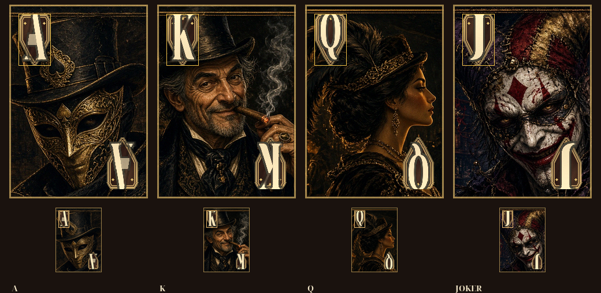

# 牌面与发牌 · 资产交件

> **样张交件 · 待 UI 会签角标安全区 · 未会签≠完成**

| 项 | 内容 |
|----|------|
| 文档版本 | v0.1（样张 + 规格） |
| 状态 | **未会签禁止当完成** · 横构图附件只算风格预览 · 交件是竖卡 240×336 · **零 ets** · 不改玩法规则 · **大厅资产本批不动** |
| 读者 | **@LiarBar UI**（先会签角标安全区）、音频 / 鸿蒙、**@负责人终审** |
| 规格对齐 | [关键资源规格清单.md §2.4](./关键资源规格清单.md) 牌面槽 · [02-组件与资源命名约定.md §5.3](./02-组件与资源命名约定.md) `lb_cmp_card_*` · 色板 [夜半酒馆-风格板.md](./夜半酒馆-风格板.md) |
| 生成 | 仓库根 `scripts/gen_card_faces.py` · `scripts/gen_deal_sfx.py` |
| 源图 | `scripts/art_src/src_card_{a,k,q,joker,back}.png`（1280×720 横图，**不是** `$r` 槽） |

> 命名：图 **`art_*`**，音频 **`sfx_*`**。控件 / 调用点 **`lb_cmp_*` / `lb_sfx_*`**。**禁止 `lb_art_*`。**  
> 本 PR **零规则改动**（不改 GDD / PRD / 数值 / 引擎），**零 ets**（不改 Lobby / Table / 局内）。  
> 大厅 `art_lobby_*` / `art_splash_*` / `art_dealer_*` / `rawfile/audio` 大厅五层 **本批不改**。

---

## 0. 会签门（先过再谈完成）

UI 预签数字 **已锁**，正式会签看本批 PNG 是否落在框里，不另开一套角标。

| 锁 | 数字 / 口径 | 本批 |
|----|-------------|------|
| 交件画幅 | **竖版 240×336**（5:7，@3x） | 横样张只作风格预览，已重裁 |
| 人物 | 居中偏下；角标占左上，不挡识人 | 四张身份可辨 |
| 角标形态 | **同一盾/徽模板**（不要 A 用 L 角框、其它用盾） | 四张同一 heater 盾 |
| 字母 | A / K / Q / J **bake 进 PNG**；禁止指望程序叠字 | 已烤进 `art_card_*` |
| 字母高 | **≥74px**（≈ 牌面高 22%） | 脚本自检 |
| 左上框 | **约 56×90 px @3x（字母区）** | 见 §2 |
| 右下 | 同一盾 **旋转 180°** | 已镜像 |
| 安全边 | 四周 **16px** | 盾外沿从 (16,16) 起 |
| 缩略 | 80×112 仍能认 A/K/Q/J | 示意见 [牌面与发牌-角标安全区示意.png](./牌面与发牌-角标安全区示意.png) |

**未会签 ≠ 完成。** 合入 `develop` 只表示样张进包；UI 未在框上签字前，不要把本批当桌面挂图验收过关。

---

## 1. 四身份（人物差）

GDD §3 只有 `A` / `K` / `Q` / `JOKER`。本批人物必须 **四张不同身份**，禁止只换 hue / 同一 bust 换字母。

| 文件 | 身份 | 认人点 | `$r` | 建议控件 |
|------|------|--------|------|----------|
| `art_card_a.png` | **A · 王牌面具** | 金面具 + 高顶礼帽（帽上黑桃徽） | `app.media.art_card_a` | `lb_cmp_card_*` / `lb_cmp_reveal_card_*` |
| `art_card_k.png` | **K · 雪茄老千** | 灰须老千、叼雪茄、烟缕 | `app.media.art_card_k` | 同上 |
| `art_card_q.png` | **Q · 烛光女客** | 侧脸、羽饰与铜冠、烛暖光 | `app.media.art_card_q` | 同上 |
| `art_card_joker.png` | **Joker · 歪帽小丑** | 裂妆、歪铃帽、尖齿笑 | `app.media.art_card_joker` | 同上 |
| `art_card_back.png` | **牌背** | 酒红织纹 + 中央烛圈；**无字母角标** | `app.media.art_card_back` | `lb_cmp_card_*` 默认 / `lb_cmp_pool` |

Joker **不作宣称目标**（无 `art_claim_badge_joker`）。本批不改宣称徽章。

横构图附件里的风景 / 远处酒客，竖裁后只保留胸像与桌氛，不当第二套牌面。

---

## 2. 角标安全区（请 @LiarBar UI 会签）

坐标一律 **@3x 源像素**，原点在牌面左上。组件 `80×112 vp` 时按 1/3 缩放同一框。

| 框 | 左 | 上 | 宽 | 高 | 用途 |
|----|----|----|----|----|------|
| 牌面 | 0 | 0 | 240 | 336 | 交件画幅 |
| 安全边 | 16 | 16 | 208 | 304 | 内容勿贴边（圆角由组件 `borderRadius` clip） |
| **左上字母区（会签框）** | **16** | **16** | **56** | **90** | 盾/徽 + 字母 A/K/Q/J |
| **右下镜像** | **168** | **230** | **56** | **90** | 同一盾旋转 180° |
| 80×112 左上对应 | ≈5.3 | ≈5.3 | ≈18.7 | ≈30 | 缩略可读验收 |

示意（金框 = 56×90 @3x；下行 = 80×112 同框）：



### 2.1 盾/徽模板（四张共用）

- 形态：尖底 heater **盾**，铜/brass 描边 + `tavern_panel` 底托。不是 L 形角框，不是方框图章。
- 字母：衬线大写，纸色 / 烛金填、深描边；**写进 PNG**。
- 程序 **不要**再叠 `Text("A")`。选中态用组件描边，不必第二张图。

请 UI 会签时只答两句：

1. 左上 56×90 / 右下镜像 / 安全边 16px **是否锁定**（或改数字回写本文）。  
2. 80×112 手牌条上 A/K/Q/J **是否一眼可读**。

---

## 3. 图 · 交件清单

路径一律：`entry/src/main/resources/base/media/`。

| 文件 | 尺寸(px) | 透明外 | 用途 |
|------|----------|--------|------|
| `art_card_a.png` | **240×336** | 满幅绘画（无白底方砖） | 正面 A |
| `art_card_k.png` | **240×336** | 同上 | 正面 K |
| `art_card_q.png` | **240×336** | 同上 | 正面 Q |
| `art_card_joker.png` | **240×336** | 同上 | 正面万能 |
| `art_card_back.png` | **240×336** | 同上 | 牌背 / 未揭 |

圆角按风格板 **10vp 在组件上 clip**，源图直角。本批替换原 Pillow 色块占位同名文件。

调用建议（本 PR **不改 ets**，只给挂点）：

```ts
// 手牌 / 翻牌：控件 lb_cmp_card_{0-4} · lb_cmp_reveal_card_{0-2}
Image($r('app.media.art_card_a'))   // K/Q/joker/back 同理
  .width(80).height(112)
  .borderRadius(10)
  .id('lb_cmp_card_0')
```

---

## 4. 音频 · 交件清单

路径一律：`entry/src/main/resources/rawfile/audio/sfx/`（不要写成 `art_*`，更禁止 `lb_art_*`）。

| 文件 | 格式 | 声道 / 采样 | 时长 | 循环 | 建议调用点 | 听感 |
|------|------|-------------|------|------|------------|------|
| `sfx_match_open.wav` | PCM 16-bit | **单声道 48 kHz** | **0.72s**（≤0.8s） | 否 · 单次 | `lb_sfx_match_open`（开桌；可与线框 `lb_sfx_deal_in` 并一槽，由 UI 定） | 木质桌布 / 铜钉 + 短厅响。**不是 beep** |
| `sfx_deal_card.wav` | PCM 16-bit | **单声道 48 kHz** | **0.155s**；主体 **≤120ms** | 否 · **可叠播** | `lb_sfx_deal_card` | 纸摩擦 + 短落桌 |
| `sfx_deal_whoosh.wav` | PCM 16-bit | **单声道 48 kHz** | **0.14s** | 否 · 可选 | `lb_sfx_deal_whoosh` | 薄气声走牌；可不用 |

峰值：开桌约 **−10 dBFS**（锁在 −12～−8）；发牌约 **−11 dBFS**，留给叠播余量。

**静默由客户端关。** `lb_tog_silent == on` 时不调播放器（不要 duck 到 −24 dB）。本批不改开关逻辑。

本批 **不要**发明 `sfx_stagger_*`、`sfx_dealer_cup`、局内 `bgm_table_*`，也不改大厅 `sfx_boot_hit` / `sfx_cta_tap` / `sfx_amb_tavern`。

---

## 5. 制作口径

- 横样张 → 竖卡：cover + 焦点居中偏下，再叠 **同一** 盾/徽。禁止把 16:9 原图直接当交件。  
- 角标不够大或裁掉原角标时：Pillow 重画盾（`tavern_panel` + brass），字母 bake。  
- 禁止：纯色块占位、只换 hue、糊字、方框图章、A 用 L 角框而其它用盾。  
- 音频：分层 Foley（布面 / 木 / 铜模态 / 纸噪），禁止方波 tip。  
- 重出图：`python3 scripts/gen_card_faces.py`  
- 重出声：`python3 scripts/gen_deal_sfx.py`  
- 脚手架 `gen_scaffold_assets.py` **不要**盖本表五个 `art_card_*`。

---

## 6. 自检

- [x] 五张均为 **240×336** PNG，写入 `base/media/` 锁名
- [x] 四张脸身份不同（面具 / 雪茄老千 / 烛光女客 / 歪帽小丑）
- [x] 四张同一盾/徽；字母 A/K/Q/J bake；左上 (16,16) 56×90；右下镜像
- [x] 字母高 ≥74px；80×112 仍有对比
- [x] 牌背无角标字母
- [x] `sfx_match_open` ≤0.8s、48k、峰值在 −12～−8；`sfx_deal_card` 主体 ≤120ms、可叠播
- [x] 文件名 `art_*` / `sfx_*`，无 `lb_art_*`
- [x] **未改任何 `.ets`**；未改 GDD / PRD / 互动方案 / 数值 v0.2
- [x] **未改大厅资产**
- [ ] **@LiarBar UI 会签角标安全区**（未勾 = 本批未完成）
- [ ] **@负责人终审**

### 审核记录

| 日期 | 意见 | 提议修改 | 提出人 | 状态 |
|------|------|----------|--------|------|
| 2026-09-09 | 牌面人物差 + 大角标 + 开桌/发牌音；先 draft | 样张竖裁 + 文档规格；零 ets | 用户票 | **样张交件 · 待会签** |
| 2026-09-09 | UI 预签数字已锁：必须竖 240×336；角标统一盾/徽；字母 bake ≥74px；左上约 56×90 | 重裁人物居中偏下；四张同一盾模板 | UI 预签 | **已落入 PNG · 待正式会签** |

---

*维护人：美术 / 音频岗 · 2026-09-09*
