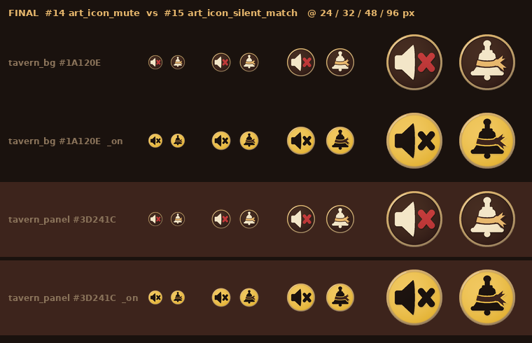

# 静音与静默局图标 · 资产交件

| 项 | 内容 |
|----|------|
| 文档版本 | v1.0 |
| 状态 | **正式图（非草稿）** · **合入 ≠ 终验** · 不改玩法规则 · **零 ets** |
| 读者 | @LiarBar UI 会签（22:516-517 合规 + 24px 读感条）· **@LiarBar负责人** 终审（23 #14 / #15）· 鸿蒙（设置 PR 挂图） |
| 票 | 23 #14 `art_icon_mute` / `_on`、#15 `art_icon_silent_match` / `_on`：**设置客户端 PR 开工前**交真图验收（23:80-81 · 22:517） |
| 本 PR | `feat/art` → `develop`（父 develop@`2c5b843`） |
| 生成 | `scripts/gen_art_icons_mute_silent.py`（Pillow 程序化，确定性，无随机数） |
| 对照 | [23 资源清单与风格草稿](./23-美术-结算战绩暂停设置-资源清单与风格草稿.md) · [22 线框](./22-结算·战绩·暂停·设置·规则线框.md) §7.2 / §8 K5 · [02 命名约定](./02-组件与资源命名约定.md) · [夜半酒馆-风格板](./夜半酒馆-风格板.md) §2 / §9 |

> 本 PR 只交 4 张 media + 1 张读感条（docs）+ 生成脚本 + 本文。不挂代码：挂图由设置客户端 PR 做。  
> `gen_art_drafts_23.py` 与 16 张 `draft_*` PNG **一字节未动**。质疑仍冻。

---

## 1. 用途

| 图 | 挂点 | 含义 |
|----|------|------|
| `art_icon_mute` / `_on` | 设置面板 `lb_cmp_settings_panel` 静音行行首图标位 **`lb_ico_mute`**（开关 `lb_tog_mute`，绑 21 `mute_all`）。大厅 `lb_btn_settings` 与暂停 `lb_btn_pause_settings` 进的是同一面板（22:513「同一组件」/ S21-24） | 全部声音关 |
| `art_icon_silent_match` / `_on` | **只在大厅开桌面板** `LobbyPanel` 的静默局开关 **`lb_tog_silent`**（`LobbyPanel.ets:78` Switch，id `ControlIds.SILENT`）。**不进设置面板、不进局内**；局内设置只显示 `lb_str_set_silent_match_note` 文字（23:81 · 22:516 · 02:93） | 静默局：无催促抖动 / 嘲讽音 / 强弹幕（措辞照 21 §4.2 第 5 条） |

**两图必须两种图形**（23:83 · 22:516「两者**不得**共用图标」· K5 22:581「静音图标 ≠ 静默局图标」· 02:353）：

- #14 = **完整喇叭**（不被斜杠切断）+ **右侧红叉**（`tavern_danger`），黄铜外圈。
- #15 = **酒馆手摇铃**（握柄 + 铃身 + 外翻铃口 + 铃舌）+ **琥珀缎带**（`tavern_candle`，绕铃腰、右侧系结两条燕尾），黄铜外圈；**无喇叭、无叉**。
- 读法区分：#14 左右不对称（喇叭朝右 + 叉）；#15 左右基本对称的竖向铃形 + 横向亮带。24px 下靠轮廓即可分开（见 §4 读感条）。

## 2. 规格引用（文档:行，按 develop@`2c5b843` 重核）

| 引用 | 文档:行 | 要点 |
|------|---------|------|
| #14 `art_icon_mute` | 23:80 | 喇叭 + 红叉（铜沿）；喇叭完整不被斜杠切断，叉在右侧（`tavern_danger`；按下态叉改 `tavern_bg`）；设置客户端 PR 开工前交真图验收 |
| #15 `art_icon_silent_match` | 23:81 | 手铃加琥珀缎带（铜沿；缎带 `tavern_candle`）；不是喇叭、没有叉；`lb_tog_silent` 只在大厅开桌设置，不是局内控件 |
| 两种图形 | 23:83 | #14 / #15 必须两种图形，不能共用一枚（负责人裁定） |
| 色板 | 23:110-128（§2 第 1 条 token 表） | 只用风格板色；`tavern_candle` = 铜边渐变高点，`tavern_mute` = 铜边渐变低点 |
| 图标网格 | 23:132（§2 第 3 条） | 96 = 8 边距 + 80 圆底盘（`tavern_panel`，3px `tavern_brass` 描边）+ 56 字形框；实心剪影 `tavern_paper`；`_on` = 底盘 `tavern_accent` + 字形 `tavern_bg`；例外：#14 叉 `tavern_danger`（`_on` → `tavern_bg`），#15 缎带 `tavern_candle`（`_on` → `tavern_panel`） |
| 交件口径 | 23:250 | `art_icon_mute` / `art_icon_silent_match` 两组须在设置客户端 PR 开工前交件验收，过不了两处改纯文字 |
| 线框静音行 | 22:503 | `[art_icon_mute] lb_str_set_mute … ← lb_tog_mute（mute_all）` |
| 静音（G2） | 22:516 | `lb_ico_mute` 用 `art_icon_mute`（完整喇叭 + 右侧红叉，黄铜外圈）；`lb_tog_silent` 只在大厅开桌面板，图标 `art_icon_silent_match`（酒馆手摇铃 + 琥珀缎带，黄铜外圈；无喇叭、无叉）；不得共用图标 |
| 图标交付（负责人裁） | 22:517 | 须在设置 PR 之前由美术交真图；未交则两处都改纯文字，仍不得同图 |
| K5 | 22:581 | 静音 `art_icon_mute` / 静默局 `art_icon_silent_match`（大厅开桌面板用）；静音 ≠ 静默局；不新增 media id 和 string |
| 已登记 id | 02:93（`lb_tog_silent` → `art_icon_silent_match`）· 02:353（`lb_tog_mute` · `lb_ico_mute` → `art_icon_mute`） | 文件为 `docs/04-设计/02-组件与资源命名约定.md`；本 PR 不新增 id |
| 线宽 | 风格板:252（§9） | 图标 2～3px（按 96 源）→ 铜圈 3px |

## 3. 交付文件

| 文件 | 尺寸 | 格式 | 字节 | sha256 |
|------|------|------|------|--------|
| `entry/src/main/resources/base/media/art_icon_mute.png` | 96×96 | PNG RGBA | 8428 | `3c99fa553aaae6c0d5513b835b823005d7b956f91486d54394b7b31fdf7fe6ac` |
| `entry/src/main/resources/base/media/art_icon_mute_on.png` | 96×96 | PNG RGBA | 8505 | `732665ce8865fe2f2ca44f5f5c0abeb29e2ba37cf744b5af3652e44b43524547` |
| `entry/src/main/resources/base/media/art_icon_silent_match.png` | 96×96 | PNG RGBA | 9447 | `658433fafad150fcade99e922964f55aa10fbdc6a2efdcb6e8b6bfd4436db295` |
| `entry/src/main/resources/base/media/art_icon_silent_match_on.png` | 96×96 | PNG RGBA | 9012 | `e74b34d65120a79ecfc254e5dd8b19ed7432651842b6cf6f04fdcc7b597fe459` |
| `docs/04-设计/art-drafts/23/final_icon_mute_silent_small.png`（读感条，docs，不进 media） | 760×490 | PNG RGBA | 114798 | `9c0da74724cd947b44f0a3413fed29895db8cc5a8c1aa9bdb89bf3db21baaf98` |

实测（脚本自检，四张同）：bbox = (8, 8, 88, 88)，即 80px 圆盘；圆外（r > 41px）alpha 全 0；四角 `(0,0,0,0)`。连跑两次 sha256 一致。

### 3.1 网格与画法

- 4× 超采（384）绘制 → LANCZOS 缩 96；缩后 alpha 再按 BOX 精确覆盖圆裁一次，去掉 LANCZOS 越过铜圈的振铃（`gen_art_icons_mute_silent.py:378` `finish`）。
- 底盘（`:136` `plate`）：80px 圆；3px 铜圈按 23 §2 写法做渐变 `tavern_candle`（左上高点）→ `tavern_brass` → `tavern_mute`（右下低点）；左上弧一道 `tavern_paper` 细高光；圈内一圈很淡的暗边（底盘被铜圈压出的倒角）。常态底盘 `tavern_panel` 轻微径向明暗（中心混 7% `tavern_brass`，边缘混 75% `tavern_felt`）；`_on` 底盘 `tavern_accent`（中心混 16% `tavern_paper`，边缘混 45% `tavern_success`）。
- 字形：**实心剪影**，无细线；常态 `tavern_paper`，右下 45% 内平缓过渡到混 30% `tavern_brass`（只是体积感，读出来仍是纸色实心）；`_on` 为 `tavern_bg`。字形下方一层模糊投影，只落在圆盘内。
- #14（`:214` 喇叭 / `:232` 叉 / `:240` 合成）：喇叭 x 20～48.6、y 23～73（96 单位），完整不切；叉为圆头双笔，笔宽 9（96 单位），中心线 x 57.5～72.5、y 39～57，在喇叭右侧留 ≥4 单位空隙。常态叉 `tavern_danger`（上沿混 12% `tavern_candle`、下沿混 35% `tavern_danger_deep` 做体积）；`_on` 叉 = `tavern_bg`。
- #15（`:270` 铃 / `:300` 缎带 / `:352` 合成）：铃 y 16.5～73.7，握柄球头 + 握杆 + 铃领 + 圆顶铃身 + 外翻圆角铃口 + 铃舌；缎带绕铃腰（y 45～52，前沿下垂 2.2 显出包圆），右侧系结 + 上下两条燕尾。缎带外一圈底盘色间隙（常态 `tavern_panel` / `_on` `tavern_accent`），24px 下缎带与铃身不粘连。常态缎带 `tavern_candle`（上沿混 25% `tavern_paper`、下沿混 30% `tavern_mute`）；`_on` 缎带 = `tavern_panel`。

### 3.2 用到的色（全为风格板 token，派生色只做 token 间线性混合）

| token | hex | 用在 |
|-------|-----|------|
| `tavern_panel` | `#3D241C` | 常态底盘；#15 `_on` 缎带；#15 常态缎带间隙 |
| `tavern_felt` | `#2C1814` | 常态底盘边缘暗角、圈内倒角 |
| `tavern_bg` | `#1A120E` | `_on` 字形；#14 `_on` 叉；字形投影；读感条底 |
| `tavern_brass` | `#C4A46A` | 铜圈主色；字形右下体积混色 |
| `tavern_candle` | `#E8B86D` | 铜圈渐变高点；#15 常态琥珀缎带 |
| `tavern_mute` | `#8A735A` | 铜圈渐变低点 |
| `tavern_paper` | `#F3E6C8` | 常态字形；铜圈高光 |
| `tavern_accent` | `#F0C14B` | `_on` 底盘；#15 `_on` 缎带间隙 |
| `tavern_success` | `#D4A017` | `_on` 底盘边缘（混 45%） |
| `tavern_danger` | `#C23A3A` | #14 常态红叉 |
| `tavern_danger_deep` | `#6B1218` | #14 红叉下沿体积（混 35%） |

## 4. 小尺寸读感条



四行 = `tavern_bg #1A120E` 常态 / `_on`、`tavern_panel #3D241C` 常态 / `_on`；每行 24 / 32 / 48 / 96px，左 #14、右 #15（LANCZOS 从 96 母版缩）。

自检：

- 24px：#14 = 左侧实心三角喇叭 + 右侧红（`_on` 黑）叉，轮廓左右不对称；#15 = 竖向铃形（顶上球头）+ 横向琥珀亮带，轮廓左右基本对称。两图一眼分开，不会把 #15 读成静音。
- `tavern_panel` 底上圆盘与底同色，靠铜圈圈出轮廓，仍可读。
- `_on` 两图在亮金底上为深色剪影，同样可分（叉 vs 铃 + 深色缎带被金色间隙勾出）。

## 5. 生成

```bash
python3 scripts/gen_art_icons_mute_silent.py
```

依赖 Pillow（本次 12.3.0）；读感条标注字体 DejaVu Sans Bold（`/usr/share/fonts/truetype/dejavu/DejaVuSans-Bold.ttf`，只用在 docs 读感条，media 不含文字）。脚本写 4 张 media + 读感条，并打印尺寸 / 字节 / sha256。不读不写任何其它 media、rawfile、`string.json`；不碰 `gen_art_drafts_23.py` 与 `draft_*`。

## 6. 挂点（给设置客户端 PR；本 PR 不改代码）

| 控件 | 图 | 位置 | 备注 |
|------|----|------|------|
| `lb_ico_mute`（`lb_tog_mute` 行首） | `$r('app.media.art_icon_mute')`；按下 / 开态用 `art_icon_mute_on` | 设置面板静音行（大厅、局内同一面板） | 22:503 / :516 |
| `lb_tog_silent` 旁 | `$r('app.media.art_icon_silent_match')` / `_on` | **仅大厅** `LobbyPanel` 开桌面板 | 不进设置面板，不进局内（22:516 · 23:81 · 02:93） |

- 显示尺寸按 22 / 风格板：横屏 32～40vp 可读（23:132），热区 ≥ 48vp（风格板:188 §5.4，由控件撑，不靠图）。
- 禁用态由控件降透明，不出图。

## 7. 范围与不动项

- **零 ets**；`string.json` 未动（341 键，sha256 `137cb0e413b64538bc318d09985f83f29c5b24ab14cbda2ed4e4a38dd09c5eb1`）；rawfile 未动；除本表 4 张外 media 未动。
- 不新增 id：4 个文件名已登记于 02:93 / :353 与 23:80-81。
- 不画暂停 / 设置 / 战绩图标（23 #1～#3 另票）。

## 8. 会签

- [ ] @LiarBar UI：22:516-517 合规（两图不同、挂点）+ 24px 读感条
- [ ] @LiarBar负责人：23 #14 / #15 终审

合入≠终验
