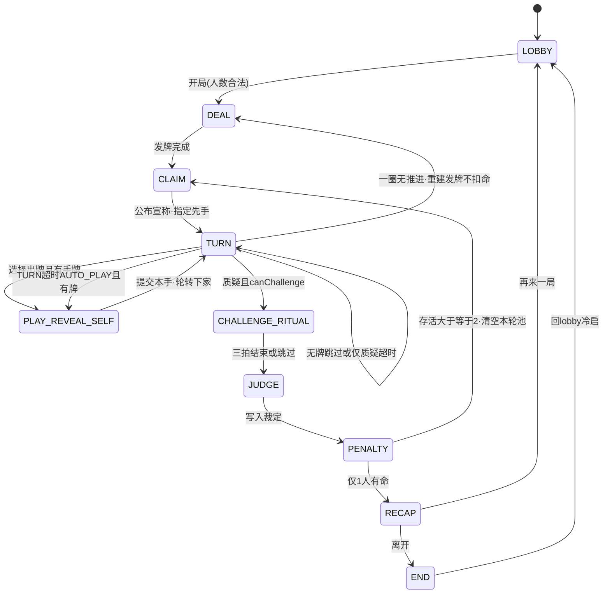

# 02 · 回合状态机草图

| 项 | 内容 |
|----|------|
| 文档版本 | v0.2-tech-draft |
| 状态 | 草图 · 对齐 GDD v0.2 · **不扩联网 / 反作弊** |
| 展开 | [GDD §14](../02-游戏设计/GDD.md)（原文件名指向「状态机与规则引擎」＝本文） |
| 权威 | 冲突时以 GDD §2.3 / §4.1 / §6 / §10.1 为准，改本文不改规则 |

> 草图级：够写纯函数引擎与单测，不够当网同步协议。  
> **禁止**以手牌多寡判胜；胜负只认「命归零出局，仅 1 人有命」。

---

## 1. 阶段枚举（与 GDD §4.1 逐字对齐）

逻辑名 **不得另起别名**。UI 可以有子视图，但对外日志与实况窗只报下表 ID。

| 阶段 ID | 名称 | 可执行操作 | 谁推进 |
|---------|------|------------|--------|
| `LOBBY` | 等待开局 | 配置人数/命数/静默、准备、开始 | 开桌人 |
| `DEAL` | 发牌表演 | 自动（含 §10.1 重建发牌） | 荷官 |
| `CLAIM` | 公布宣称 | 自动 + 短播报 | 荷官 |
| `TURN` | 回合决策 | 出牌 / 质疑（条件见 §3） | 当前座位 或 超时 |
| `PLAY_REVEAL_SELF` | 自己确认出牌 | 选牌、方式、话术（可跳过）、点名；手牌仍防窥 | 当前座位 |
| `CHALLENGE_RITUAL` | 质疑仪式 | 三拍 + 旁观押注；可跳过 | 荷官计时 / 玩家跳过 |
| `JUDGE` | 结算 | 自动翻验上家**本手** | 荷官 |
| `PENALTY` | 惩罚演出 | 掉命 / 出局 | 荷官 |
| `RECAP` | 战报 | 再来、分享 | 开桌人 |
| `END` | 结束 | 回 `lb_scr_lobby` | 开桌人 |

**不是新阶段、只是 `TURN` 的窗模式**（避免把 GDD 枚举撑爆）：

| 窗模式 | 条件 | 开放操作 | 时限键 |
|--------|------|----------|--------|
| `NORMAL` | 有手牌 | 出牌；若 `canChallenge` 则可质疑 | `turn_seconds`（默认 15） |
| `CHALLENGE_ONLY` | 手牌 0 且 `canChallenge` | **仅质疑**，不出牌 | `challenge_only_seconds`（**8**） |
| `AUTO_SKIP` | 手牌 0 且 **不可**质疑 | 无操作，立即跳过 | 0（自动） |

教学局（GDD §11）仍走同一枚举：AI 先出本轮第一手，再轮到玩家质疑；**禁止**在第一手教质疑。

**壳层 id**：阶段仍用上表；页面用 `lb_scr_*`。质疑仪式用全岗锁名（四拍齐全）。口播可仍说「起势→揭牌→结果」，**id 不得把拍2并进 reveal**。

| 阶段 / 窗 | 屏或容器 id | 锁名 / 表现 |
|-----------|-------------|-------------|
| `LOBBY` | `lb_scr_lobby`（**含冷启动**；废止 `lb_scr_home`） | `_idle` |
| `DEAL` `CLAIM` `TURN` `PENALTY` | `lb_scr_table` | 看牌叠 `lb_cmp_peek_mask` + `lb_privacy_on`（**禁止** `lb_scr_peek`） |
| `TURN` + `CHALLENGE_ONLY` | 仍 `lb_scr_table`；`lb_btn_challenge` | 手牌 `_empty`；文案 `lb_str_hand_empty` |
| `PLAY_REVEAL_SELF` | `lb_sheet_play`（半屏挂在 table，**不是**主屏） | `_soft` `_slam` `_hesitate` |
| `CHALLENGE_RITUAL` 拍1 起势 | `lb_scr_challenge` / `lb_cover_challenge` | **`lb_challenge_windup`** |
| `CHALLENGE_RITUAL` 拍2 对峙+押注 | 同上 | **`lb_challenge_standoff`**（必须独立；`lb_cmp_bet_bar`） |
| `CHALLENGE_RITUAL` 拍3 翻牌 | 同上 | **`lb_challenge_reveal`**（只翻牌，不含对峙） |
| `CHALLENGE_RITUAL` 定格 / 入 `JUDGE` | 同上 | **`lb_challenge_result`**；跳过仪式亦落到此 id 或直接 `JUDGE` |
| `RECAP` | `lb_scr_report`（**替换** `lb_scr_recap`） | `_win` / `_lose` |

完整控件表见 [UI 命名约定](../04-设计/02-组件与资源命名约定.md)（PR #3）。引擎 **不得**为 UI 再发明阶段 ID。

---

## 2. 状态图（主路径）



旁观敲桌 / 表情 / 押面子 **不改阶段**（GDD §7：社交桌默认，不改牌真假）。它们只写 `eventLog`。

---

## 3. 转移表

列说明：**触发者**＝谁发事件；**条件**不满足则保持当前态或走「非法，忽略」。

### 3.1 开局与宣称

| # | 从 | 事件 | 触发者 | 条件 | 到 | 副作用摘要 |
|---|----|------|--------|------|----|------------|
| T01 | `LOBBY` | `START_MATCH` | 开桌人 | 人数 ∈ [`min_players`,`max_players`]；人机补齐；MVP 无网 | `DEAL` | 写 `Match.config` 快照；`seed`＝`demo_seed_value`（若 `demo_seed_enabled`）；座位入座；`lastPenalizedSeatId=null` |
| T02 | `DEAL` | `DEAL_DONE` | 荷官 | 每存活座位发 `hand_size_default` 张；余牌弃置本轮不用 | `CLAIM` | 手牌只进私有 `Hand`；`roundIndex++`（重建发牌同样走 T02） |
| T03 | `CLAIM` | `CLAIM_ANNOUNCED` | 荷官 | `rank ∈ claimable`（A/K/Q，**非 Joker**）；尽量避开连续同一宣称 | `TURN` | 新 `Claim`；`playIndexInRound=0`；`lastPlay=null`；`stallSkipCount=0`；`currentSeatId=firstActorSeatId`；开 `NORMAL` 或按手牌切窗 |

**先手 `firstActorSeatId`（GDD §2.3 / §10.1，禁止「可随机简化」摇摆）**：

| 情境 | 先手 |
|------|------|
| 整局第一次 `CLAIM`（开局） | 荷官随机 **或**「房主左手边」（实现二选一写进配置 `first_actor_policy`，默认 `random`；**不得**每轮重随机） |
| 质疑结算后的新宣称 | **`nextAlive(lastPenalizedSeatId)`**（受罚者已出局仍取其下家） |
| §10.1 重建发牌且 **本局已有**受罚记录 | 同上：上次扣命受罚者的下家 |
| §10.1 重建发牌且 **尚无**受罚记录 | 荷官随机 |

`nextAlive(seat)` = 顺时针下一名 `status==ALIVE`（跳过幽灵）。

### 3.2 回合决策（`TURN`）——已锁规则全覆盖

先算两个布尔（每进 `TURN` 重算）：

```
hasCards      = current.hand.count > 0
canChallenge  = current.ALIVE
                AND lastPlay != null
                AND playIndexInRound >= 1      // 本轮已有人出过 ⇒ 非第一手
```

| # | 从 | 事件 | 触发者 | 条件 | 到 | 副作用摘要 |
|---|----|------|--------|------|----|------------|
| T10 | `TURN` | `INTENT_PLAY` | 当前座位 | `hasCards`；阶段确为 TURN | `PLAY_REVEAL_SELF` | 打开出牌包；**不**重置整段行动计时（见 §5） |
| T11 | `TURN` | `INTENT_CHALLENGE` | 当前座位 | **`canChallenge`** | `CHALLENGE_RITUAL` | 创建 `Challenge`，`targetPlayId=lastPlay.playId`；**只指向该本手** |
| T12 | `TURN` | `INTENT_CHALLENGE` | 当前座位 | **`!canChallenge`**（第一手或无上家本手） | `TURN` | **忽略**；`lb_btn_challenge` 走 `_disabled` + `lb_str_challenge_disabled_first` |
| T13 | `TURN` | `ENTER_TURN` | 荷官 | `!hasCards && canChallenge` | `TURN`（窗=`CHALLENGE_ONLY`） | 仅开放质疑；时限改读 `challenge_only_seconds` |
| T14 | `TURN` | `ENTER_TURN` | 荷官 | `!hasCards && !canChallenge` | 见 T16 | **自动跳过**（第一手无牌、或无上家本手） |
| T15 | `TURN` | `TIMEOUT` | 荷官 | 窗=`NORMAL` 且 `hasCards` 且 `timeout_auto_play` | `PLAY_REVEAL_SELF` | **AUTO_PLAY**：优先 1 张合法真牌，否则随机 1 张（数值表 §6） |
| T16 | `TURN` | `SKIP` / 自动跳过 / 仅质疑窗超时 | 荷官或玩家 | 窗=`CHALLENGE_ONLY` 超时（`challenge_only_on_timeout=skip`）**或** T14 | `TURN` | **不质疑、不扣命**；`currentSeatId=nextAlive`；`stallSkipCount++`；**不**产生 PLAY/CHALLENGE |
| T17 | `TURN` | `STALL_CHECK` | 荷官 | `stallSkipCount >= aliveCount` 且本轮尚无有效 PLAY/CHALLENGE | `DEAL` | **本轮结束，不扣命**；完整牌堆重建洗牌；存活者重发；然后 T02→T03；先手见 §3.1 |

**第一手不可质疑**：`playIndexInRound==0` ⇒ `lastPlay==null` ⇒ `canChallenge==false` ⇒ 只能出牌或（无牌）T14 跳过。  
**质疑只验上家本手**：T11 写入的 `targetPlayId` 在 `JUDGE` 不得被改成「本轮全部扣牌」。

### 3.3 出牌包提交

| # | 从 | 事件 | 触发者 | 条件 | 到 | 副作用摘要 |
|---|----|------|--------|------|----|------------|
| T20 | `PLAY_REVEAL_SELF` | `SUBMIT_PLAY` | 当前座位或 AUTO_PLAY | 张数 ∈ [`min_play_cards`,`max_play_cards`] 且 ≤ 手牌数 | `TURN` | 牌移入本手（他人不可见）；记 `Play`（方式/点名/带话可空）；`lastPlay=该 Play`；`playIndexInRound++`；`stallSkipCount=0`；`currentSeatId=nextAlive`；日志 PLAY **不写牌面** |
| T21 | `PLAY_REVEAL_SELF` | `CANCEL` | 当前座位 | 未提交 | `TURN` | 选牌清空；计时不重置 |
| T22 | `PLAY_REVEAL_SELF` | `TIMEOUT` | 荷官 | 同 T15 策略 | 同 T20 | 视为 AUTO_PLAY 提交 1 张 |

带话可跳过；点名 P0 可选。出牌方式至少记录 `SOFT|SLAM|HESITATE`（AUTO_PLAY 默认 `SOFT`）。

桌上 UI 拍（**不是**新 `phase`）：ConfirmReady → **PlayLaunch** → **PlayLanded** →（hand>0 且非第一手）**AwaitChallenge** /（第一手）下家出牌 /（hand==0）**RankSettle**，见 [出牌扣牌-状态机](../02-游戏设计/出牌扣牌-状态机.md)。AwaitChallenge → ChallengeCommit / Pass（ack 后再翻；超时 **10s**）见 [质疑入口-状态机](../02-游戏设计/质疑入口-状态机.md)。

| 层 | 口径 |
|----|------|
| UI | 点确认 **立刻** `PlayLaunch`（乐观飞）；飞窗 320ms（280～400）不可跳过；飞中禁名次 UI |
| T20 | 仍是权威 `SUBMIT_PLAY`。接受才写 `Play` |
| 拒 | 回滚 pile+hand，桌上只出「出牌未生效 / 张数已纠正」（`lb_str_play_rollback`） |
| 等 ack 才飞 | **禁** |
| 分流 | PlayLanded 后 hand>0 且非第一手 → AwaitChallenge；第一手不进窗；**hand==0 → RankSettle，禁止 AwaitChallenge**。打光者不再出牌、该手不再给下游质疑。入口深潜认质疑入口-状态机 |
| 名次 | Aron 锁：先打光更好；命归零垫底。细分配分第4节详 |

实现不得把 `PlayLaunch` / `PlayLanded` / `AwaitChallenge` / `RankSettle` 加成 §1 阶段枚举。

### 3.4 质疑 → 结算 → 新一轮出牌权

| # | 从 | 事件 | 触发者 | 条件 | 到 | 副作用摘要 |
|---|----|------|--------|------|----|------------|
| T30 | `CHALLENGE_RITUAL` | `RITUAL_DONE` / `SKIP_RITUAL` | 荷官/玩家 | 总长 ≤ `challenge_ritual_max_seconds`（4s） | `JUDGE` | 锁名顺序：`lb_challenge_windup` → **`lb_challenge_standoff`**（拍2 押注 `lb_cmp_bet_bar`）→ `lb_challenge_reveal` → `lb_challenge_result`；押注窗关闭：进入 reveal **或** 满 `challenge_bet_seconds`（2s）先到先关；押注 **不改扣谁命** |
| T31 | `JUDGE` | `JUDGED` | 荷官 | 只翻 `targetPlay` 的牌 | `PENALTY` | `SUCCESS` ⇔ 存在 ≥1 张非宣称且非 Joker；成功：上家（被质疑者）-1；失败：质疑者 -1 |
| T32 | `PENALTY` | `PENALTY_DONE` | 荷官 | 扣命后 `aliveCount >= 2` | `CLAIM` | `lastPenalizedSeatId=受罚座位`；0 命 → `GHOST`（可起哄/押面子，不可出牌质疑、不可看他人手牌）；**清空本轮池与历史扣牌**；**不补牌**；新宣称；先手＝受罚者下家 |
| T33 | `PENALTY` | `PENALTY_DONE` | 荷官 | 已无人可继续出牌/质疑（打光入名次或仅剩垫底） | `RECAP` | **名次认 Aron 锁**（出牌扣牌-状态机）：打光先后为主序；命归零垫底。不再写「唯一有命者胜」 |
| T40 | `RECAP` | `PLAY_AGAIN` | 开桌人 | — | `LOBBY` 或直接 `DEAL`（实现自选，须清空手牌/宣称） | 新 `Match` |
| T41 | `RECAP` | `LEAVE` | 开桌人 | — | `END` | 写本地战绩 |
| T42 | `END` | `TO_LOBBY` | 玩家 | — | `LOBBY` | 进 `lb_scr_lobby` 冷启/开桌 |

人机强退：该座转 AI 接管（GDD §10），**阶段不变**。静默局只关表现，不改转移。

---

## 4. 手牌耗尽（方案 A）——程序检查单

权威：GDD §10.1 的 **仅质疑窗 / 重建发牌** 仍供未打光座位。  
**胜负 / 名次改认 Aron 锁**（[出牌扣牌-状态机 §6](../02-游戏设计/出牌扣牌-状态机.md)）：打光入名次（先空更好）；命归零垫底。刚打光者 **不**走仅质疑窗、**不**进 AwaitChallenge。3 命 / MAX_PLAY=3 不改。

| # | 规则原文要点 | 状态机落点 | 单测意图 |
|---|--------------|------------|----------|
| A1 | 无牌且可质疑 → 仅开放质疑，时限 `challenge_only_seconds` | T13；窗 `CHALLENGE_ONLY` | 无牌 + 有上家本手 ⇒ 无出牌按钮；8s |
| A2 | 不质疑 / 超时 → 跳过，轮转下家 | T16；`challenge_only_on_timeout=skip` | 8s 到不扣命、不自动质疑 |
| A3 | 无牌且不可质疑 → 自动跳过 | T14→T16 | 本轮第一手且手牌 0（极端）⇒ 0ms 跳过 |
| A4 | 连续一圈无人 PLAY/CHALLENGE → 本轮结束不扣命；完整牌堆重建；新宣称；先手＝上次受罚者下家（无记录则随机） | T17→`DEAL`→`CLAIM` | `stallSkipCount==aliveCount` 且本轮 0 次有效行动 |

「一圈」定义（可执行）：从某次跳过使 `stallSkipCount` 开始累加起，**存活座位各轮到 1 次且全部是跳过**；中途出现 T20 或 T11 则 `stallSkipCount=0`。

---

## 5. 超时（只两种，勿再发明）

| 窗口 | 配置键 | 到点行为 | 禁止 |
|------|--------|----------|------|
| `TURN` 普通决策（含已进入 `PLAY_REVEAL_SELF`） | `turn_seconds` + `timeout_auto_play` | **AUTO_PLAY** 1 张（有真优先） | 到期自动质疑 |
| `TURN` 仅质疑窗 | `challenge_only_seconds` + `challenge_only_on_timeout=skip` | **视为跳过** | 到期自动质疑、到期扣命 |
| 质疑仪式 | `challenge_ritual_max_seconds` | 跳过剩余动画，进入 `JUDGE` | 改裁定 |
| 押注 | `challenge_bet_seconds` | 关窗，未选＝没押 | 改扣命 |

人机 MVP 例外（引擎实现，不改上表 AI 语义）：`currentSeat.role === HUMAN` 时暂停回合钟，**不**对 HUMAN 走 AUTO_PLAY / 仅质疑窗超时 skip。一直等到玩家点出牌 / 质疑 / 跳过。AI 座位仍按上表。T14 空牌不可质疑自动跳过仍适用。

普通窗与仅质疑窗 **互斥**，不得同时跑两只倒计时。实况窗读「当前窗剩余秒」（F-08）。

`low_time_threshold`（5s）只驱动「催」表现，不改转移。

---

## 6. 数据字典草图

字段级草图，供 `engine` 建模。类型名为建议，可改语言拼写，**语义不得改**。

### 6.1 `Match`

| 字段 | 类型（草） | 说明 |
|------|------------|------|
| `matchId` | string | 本地 UUID |
| `seed` | number | `demo_seed_enabled` 时用 `demo_seed_value`（默认 `20260906`） |
| `config` | object | §01 JSON 快照 |
| `phase` | 阶段 ID | 仅 §1 十态 |
| `turnWindow` | `NORMAL` \| `CHALLENGE_ONLY` \| `AUTO_SKIP` | 仅 `TURN` 有意义 |
| `seats` | `Seat[]` | 顺时针固定 |
| `currentSeatId` | SeatId | 当前行动座 |
| `currentClaim` | `Claim` \| null | 本轮宣称 |
| `lastPlay` | `Play` \| null | **上家本手**；新宣称或清空池后必须 null |
| `lastPenalizedSeatId` | SeatId \| null | 新一轮先手锚点 |
| `roundIndex` | int | 宣称轮次，从 0 |
| `playIndexInRound` | int | 本轮已提交 PLAY 数；0＝第一手语境 |
| `stallSkipCount` | int | §10.1 一圈计数 |
| `tableMode` | `SOCIAL` \| `ACTING` | MVP 默认 `SOCIAL` |
| `silentMode` | bool | F-13 |
| `winnerSeatId` | SeatId \| null | 仅 `RECAP`/`END`；名次主序认 `emptyOrder`（Aron 锁），不是「唯一有命」 |
| `emptyOrder` | SeatId[] | 打光先后（先空 = 第1）。PlayLanded 后 hand==0 才追加 |
| `eventLog` | `MatchEvent[]` | GDD §7.2 |
| `startedAt` / `endedAt` | timestamp | 本地 |

### 6.2 `Seat`

| 字段 | 说明 |
|------|------|
| `seatId` | 0..n-1 顺时针 |
| `role` | `HUMAN` \| `AI` |
| `aiPersona` | `TIMID` \| `SHARK` \| `KAREN`（仅 AI） |
| `nickname` | 本地；可智能填充 |
| `status` | `ALIVE` \| `GHOST` |
| `isHost` | 开桌人 |
| `faceScore` | 面子分；不改命 |
| `hand` | 见 `Hand`（仅本人/引擎可见） |
| `consecutiveTimeouts` | 达 `consecutive_timeout_warn` 只提示 |

### 6.3 `Hand` / 牌

| 字段 | 说明 |
|------|------|
| `ownerSeatId` | 私有 |
| `cards[]` | `{ cardId, rank: A\|K\|Q\|JOKER }` |
| `count` | `cards.length`；0 触发 §4 |

他人 UI **不得**订阅 `cards`。

### 6.4 `Claim`

| 字段 | 说明 |
|------|------|
| `claimId` | 本轮 ID |
| `rank` | 仅 `A`/`K`/`Q` |
| `firstActorSeatId` | 本轮先手（已按 §3.1 算完） |
| `announcedAt` | 播报时间 |

### 6.5 `Play`（本手）

| 字段 | 说明 |
|------|------|
| `playId` | 被质疑时的唯一靶 |
| `actorSeatId` | 出牌者 |
| `cardIds` / `ranks` | 引擎私有；质疑前不对他人展示 |
| `count` | 1～`max_play_cards` |
| `style` | `SOFT` \| `SLAM` \| `HESITATE`（P1 才扩 PIN/BLIND） |
| `speech` | 可空（跳过） |
| `namedSeatId` | 可空；点名 P0 |
| `isFirstOfRound` | `playIndexInRound` 从 0→1 的那手 |
| `committedAt` | 提交时间 |

质疑对象 **只能是当前 `lastPlay`**，即上家刚刚那一手。

### 6.6 `Challenge`

| 字段 | 说明 |
|------|------|
| `challengeId` | |
| `challengerSeatId` | 质疑者 |
| `targetPlayId` | **必须**等于发起时的 `lastPlay.playId` |
| `ritualSkipped` | 是否跳过三拍 |
| `bets[]` | `{ seatId, pick: TRUE\|FAKE }`；未押不出现 |
| `result` | `SUCCESS` \| `FAIL` |
| `fakeCount` | 非宣称且非 Joker 的张数 |
| `judgedAt` | |

### 6.7 `Lives`（可嵌在 Seat，单独列出供战报）

| 字段 | 说明 |
|------|------|
| `seatId` | |
| `current` | 开局＝`lives_default`（3） |
| `lastDelta` | -1 或 0 |
| `lastReason` | `CHALLENGE_SUCCESS_ON_TARGET` \| `CHALLENGE_FAIL_ON_SELF` |
| `outAt` | `current==0` 时进入 `GHOST` |

**没有**「手牌耗尽扣命」字段。名次用 `emptyOrder`（打光先后，先空更好）+ 命归零垫底；细分配分第4节详。旧「手牌多者胜 / 唯一有命者胜」字段 **不写**。

### 6.8 `MatchEvent`（日志，GDD §7.2）

`PLAY`（张数、方式、是否点名、**不写牌面**）· `CHALLENGE` · `JUDGE` · `EMOTE` · `TABLE_ACT` · `LIFE_CHANGE` · `OUT` · `SKIP_EMPTY` · `REDEAL_STALL`。

---

## 7. 非法意图（引擎统一忽略）

| 意图 | 原因 |
|------|------|
| 第一手 `INTENT_CHALLENGE` | G-Q6 |
| 质疑非 `lastPlay` 的历史牌 | §6.2 只验本手 |
| 幽灵出牌/质疑 | 出局不可 |
| 看他人 `Hand.cards` | §3.4 |
| 超时自动质疑 | §10、数值表 `skip` |
| 一圈无推进后扣命或比手牌 | §10.1 禁止项 |
| LLM / 玩家投票改 `JUDGE` | 一页纸不做清单 |

---

## 8. 本草图不做

- 联网帧同步、房间、断线重连协议  
- 反作弊 / 可信执行  
- 演技桌改时限的完整数值（P1）  
- 加注谎 / 盲出状态位（P1，预留字段即可）  

---

## 审核记录

| 日期 | 意见 | 提议修改 | 提出人 | 状态 |
|------|------|----------|--------|------|
| 2026-09-06 | 状态机草图：覆盖第一手、本手、出牌权、§10.1、双超时 | 新建；不改 GDD | 客户端文档 | 待审 |
| 2026-09-06 | 壳层对齐 UI `lb_scr_*` 与质疑仪式锁名 | 不改转移语义 | 客户端文档 | 已会签 |
| 2026-09-06 | 四拍锁名：windup / standoff / reveal / result | 拍2 独立，不再并进 reveal | 客户端文档 | 待负责人复审 |
| 2026-09-06 | 屏 id：lobby 含冷启；report 替换 recap；peek/play 改叠层 | 与 UI/测试对齐 | 客户端文档 | 待复审 |
| 2026-09-13 | 出牌 UI 拍 PlayLaunch / PlayLanded / AwaitChallenge 入口 | §3.3 交叉策划第1节锁；不改 T20 语义、不加新 phase | 策划 | 待会签 |
| 2026-09-13 | Aron 打光名次：hand==0 禁 AwaitChallenge | §3.3 分流 + §4 胜负句覆盖 | 策划 | 待会签 |
| 2026-09-13 | 第2节入口：AwaitChallenge → ChallengeCommit / Pass | §3.3 交叉 [质疑入口-状态机](../02-游戏设计/质疑入口-状态机.md)；不改 T20 语义、不加新 phase | 策划 | 待会签 |

---

*相关：[01-工程脚手架约定](./01-工程脚手架约定.md) · [GDD](../02-游戏设计/GDD.md) · [数值表](../02-游戏设计/数值与牌堆配置.md) · [UI 命名表](../04-设计/02-组件与资源命名约定.md)*
